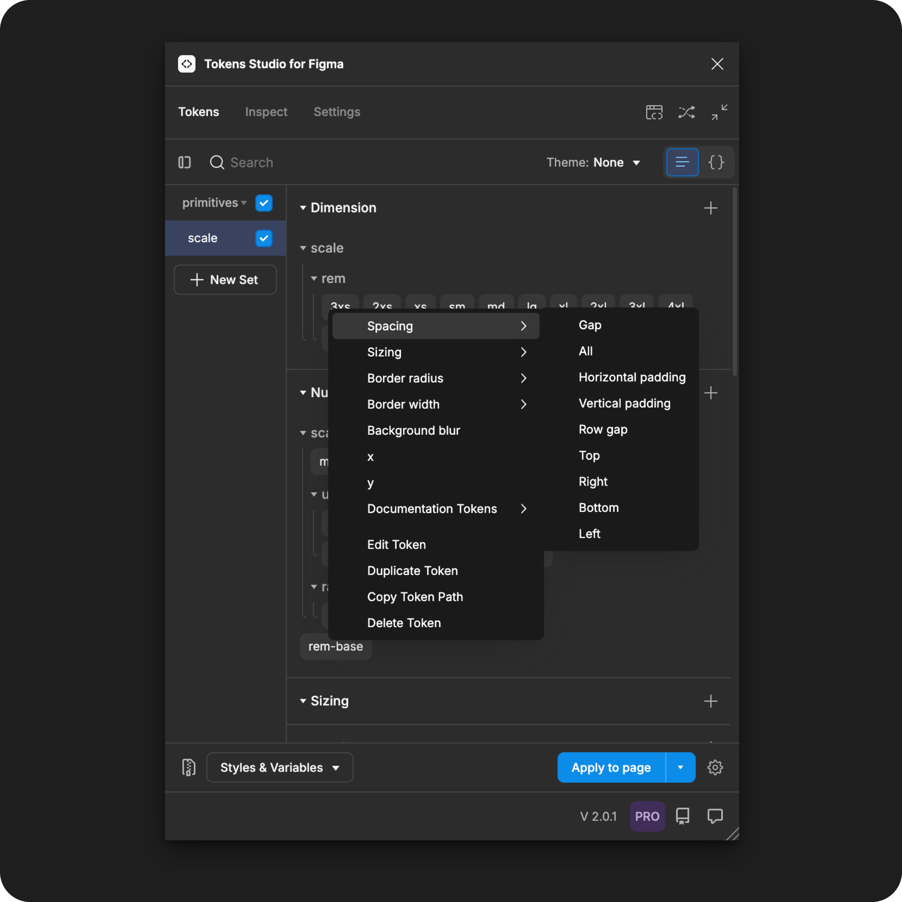



## Spacing

The spacing property defines the distance between layers of an auto-layout frame in Figma when the Dimension Token is applied. &#x20;

1. Gap - applies space between child elements within a parent container.
2. All - applies padding to all sides of the parent container, and the space between child elements within the parent container.&#x20;
3. Horizontal padding - applies space to the left and right sides of the parent container.
4. Vertical padding - applies space to the top and bottom sides of the parent container.
5. Row gap - applies vertical space between rows on **frames with auto-layout set to wrap**.
6. Top - applies space to the highest side of the parent element on the X-axis only.&#x20;
7. Right - applies space to the right side of the element on the Y-axis only.
8. Bottom - applies space to the lowest side of the parent element on the X-axis only.&#x20;
9. Left - applies space to the left side of the element on the Y-axis only.

For independent styling per side, you can repeat the steps above and apply different Dimension Tokens to each position of the same design element.


If you apply the Token to a frame _**before**_ auto-layout is applied in Figma, you may have to remove and re-apply the Token after auto-layout has been enabled for the Token Value to apply as expected.

→ [Read Figma's doc on Autolayout here](https://help.figma.com/hc/en-us/articles/360040451373-Explore-auto-layout-properties)





## Sizing

The Sizing property defines the width or height of polygonal shape, frames, groups or graphic elements in Figma when the Dimension Token is applied. &#x20;

1. All - applies the same size value to both the width and height of an element.
2. Width - defines the horizontal size of an element and does not change the vertical size.&#x20;
3. Height - defines the vertical size of an element and does not change the horizontal size.&#x20;

These properties only work on frames with Autolayout already active in Figma.

4. Min width - defines the smallest allowed horizontal size of an element but allows a larger size.&#x20;
5. Max width - defines the largest allowed horizontal size of an element but allows a smaller size.&#x20;
6. Min height - defines the smallest allowed vertical size of an element but allows a larger size.
7. Max height - defines the largest allowed vertical size of an element but allows a smaller size.

For independent styling per side, you can repeat the steps above and apply different Dimension Tokens to each position of the same design element.


If you apply the Token as Min/Max Width or Height to a frame _**before**_ auto-layout is applied in Figma, you may have to remove and re-apply the Token after auto-layout has been enabled for the Token Value to apply as expected.

→ [Read Figma's doc on Autolayout here](https://help.figma.com/hc/en-us/articles/360040451373-Explore-auto-layout-properties)





## Border Radius

The Border Radius property defines the corner roundness of polygonal shape, frames, groups or graphic elements in Figma when the Token is applied. &#x20;

1. All - rounds the corner of all sides of the element by the same value.
2. Top left - rounds the top left corner of the element only.
3. Top right - rounds the top right corner of the element only.
4. Bottom right - rounds the bottom right corner of the element only.
5. Bottom left - rounds the bottom left corner of the element only.&#x20;

For independent corner styling, you can repeat the steps above and apply different Dimension Tokens to each corner position of the same design element.




## Border Width

A Border Width property defines the thickness of the stroke applied to text layers, polygonal shapes, frames, groups or graphic elements in Figma when the Dimension Token is applied. &#x20;

1. All - applies the stroke width to all sides of the element with the same value.
2. Top - applies the stroke width to the highest side of the element on the X-axis only.
3. Right - applies the stroke width to the right side of the element on the Y-axis only.
4. Bottom - applies the stroke width to the stroke on the lowest side of the element on the X-axis only.
5. Left - applies the stroke width to the left side of the element on the Y-axis only.

For independent border styling, you can repeat the steps above and apply different Dimension Tokens to each side of the same design element.&#x20;


If you apply the Border Width property to an element **before a stroke is applied in Figma,** you may have to remove and re-apply the Dimension Token after the stroke has been enabled for the value to apply as expected.

The plugin supports a [Border Composite Token](../../manage-tokens/token-types/border.md) that allows you to reference a Border Width Token to avoid this issue.





## Background Blur

The Background Blur property of the Dimension Token defines the intensity of the Layer Blur Effect in Figma when the Token is applied in Figma.&#x20;

→ [Read Figma's doc on Layer blur here](https://help.figma.com/hc/en-us/articles/360041488473-Apply-shadow-or-blur-effects#blur)

The Background Blur property must be applied to container design elements, like frames, groups, and polygonal shapes with a **reduced opacity color fill** applied.

[_→ Jump to the guide on Color Tokens_ ](../../manage-tokens/token-types/color/)_to learn about reduced opacity colors using color spaces that support alpha by selecting the card below._


This property can't yet be Exported to Figma as a reusable **Effect Style** from the plugin in the same way that [Box Shadow Tokens](../../manage-tokens/token-types/box-shadow.md) can.





## X and Y Position

The x position and y position properties of the Dimension Token define the absolute position of the design element when the Token is applied in Figma.&#x20;

X Position

* The element is absolutely positioned on the horizontal axis in relationship to the parent container.
* If no parent container is present, it positions the element on the Figma canvas.

Y Postion

* The element is absolutely positioned on the vertical axis in relationship to the parent container.
* If no parent container is present, it positions the element on the Figma canvas.


If you apply the **x/y** property to an element before enabling Absolute Position and Auto-layout in Figma, you may have to remove and re-apply the Dimension Token after they are enabled before the value will be applied as expected.&#x20;

[→ Read Figma's docs on Absolute Position ](https://help.figma.com/hc/en-us/articles/360039956914-Adjust-alignment-rotation-and-position#h_01HNBH55654RRGKMTFTB9MT1KX)




