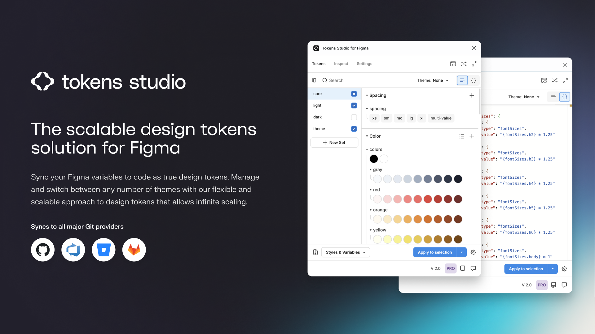

---
layout:
  title:
    visible: false
  description:
    visible: false
  tableOfContents:
    visible: true
  outline:
    visible: true
  pagination:
    visible: true
---

# Tokens Studio Plugin for Figma

## **Tokens Studio for Figma**

**Tokens Studio for Figma** is a [Figma Plugin](https://www.figma.com/community/plugin/843461159747178978/tokens-studio-for-figma) allowing you to integrate Tokens into your Figma designs.

It gives you reusable tokens that can be used for a whole range of design options, from border radius or spacer units to semantic color and typography styles. It allows you to change tokens and see these changes applied to the whole document or its styles.

<figure><figcaption></figcaption></figure>

### Slack Channel

We have a dedicated Slack server so the community can exchange ideas, best practices or simply ask a question. [Join the Slack channel](https://www.tokens.studio/slack).
