# Inspect Tokens&#x20;

## Inspect Tokens in the Plugin

The **Inspect page** of the Plugin is where you can see which Tokens have been applied to a selected design element in Figma and modify the Tokens as needed.&#x20;


The way this page appears changes based on the elements you have currently selected on the Figma canvas.&#x20;

→ [Read Figma's guide on selecting layers and objects for more details.](https://help.figma.com/hc/en-us/articles/360040449873-Select-layers-and-objects)


<figure>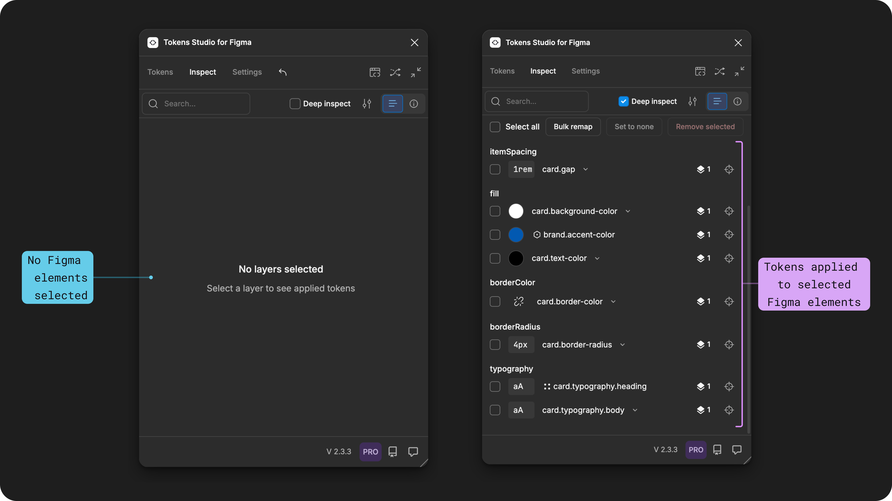<figcaption>
The left side example shows how the Inspect page looks before selecting a Figma design element compared with the right side example, showing many Tokens applied to a selected layer in Figma. 
</figcaption></figure>

There are three main sections on the Inspect Page visible when a design element is selected in Figma:

1. [Inspect Controls](inspect-tokens.md#id-1.-inspect-controls)
2. [Token Actions](inspect-tokens.md#id-2.-token-actions)
3. [Token List](inspect-tokens.md#id-3.-token-list)

<figure>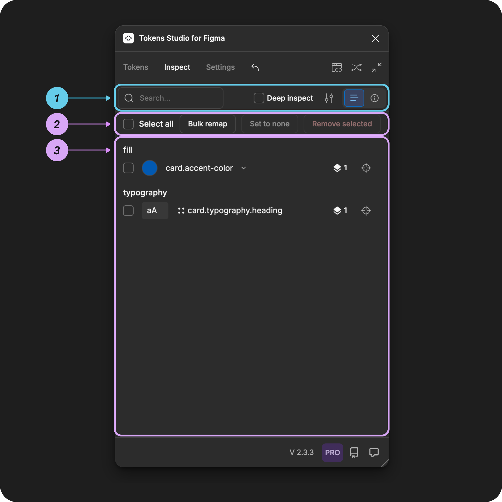<figcaption>
The Inspect page of the Plugin is shown with its controls annotated with numbers that match the sections mentioned above. 
</figcaption></figure>

### 1. Inspect Controls

The actions at the top of the Inspect Page control how the Plugin displays the Tokens being inspected below it:

A. [Token Name Search](inspect-tokens.md#a.-token-name-search)

B. [Deep Inspect](inspect-tokens.md#b.-deep-inspect)

C. [Inspect Options](inspect-tokens.md#c.-inspect-options)

D. [Token View Toggle](inspect-tokens.md#d.-token-view-toggle)

<figure>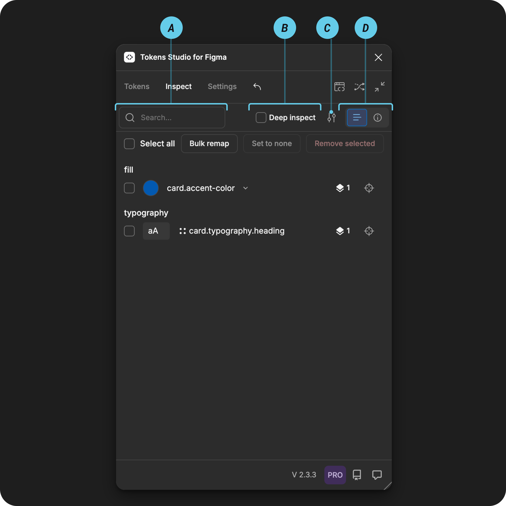<figcaption>
The Inspect page of the Plugin is shown with its controls annotated with letters that match their detailed descriptions below. 
</figcaption></figure>

#### A. Token Name Search&#x20;

When you type in the search input, only the Design Tokens with names that match will appear in the Token list below.&#x20;


Like the search feature on the Tokens Page, the results are limited to Token Name. The Token Type and names references in values are not included in the search.&#x20;


<figure>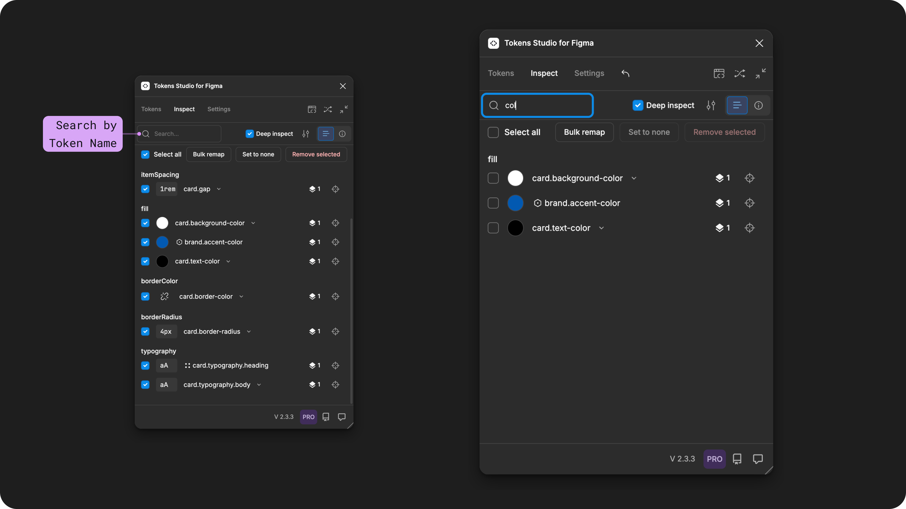<figcaption>
The left example of the Inspect page of the Plugin shows a list of Tokens. The example on the right shows how entering in the search term "col" filters the Tokens listed below it to only those with that exact string in the Token Name. 
</figcaption></figure>

If you select another design element in Figma before clearing the search input, the Plugin will only display Token names that match your search. This can help speed up workflows where you are looking for specific Tokens across designs in your Figma file.&#x20;

#### B. Deep Inspect

The Deep Inspect feature controls how many layers of your selected Figma element are being looked at by the Plugin.&#x20;

* Deep Inspect Off - empty checkbox&#x20;
  * Currently selected layer is being inspected.
  * Only Tokens applied directly to the current layer appear in the Token list below.&#x20;

Deep Inspect On- checkmark visible

* Current layer and all children layers below are being inspected.&#x20;
* All Tokens applied to the current layer and children layers appear in the Token list below.&#x20;

<figure>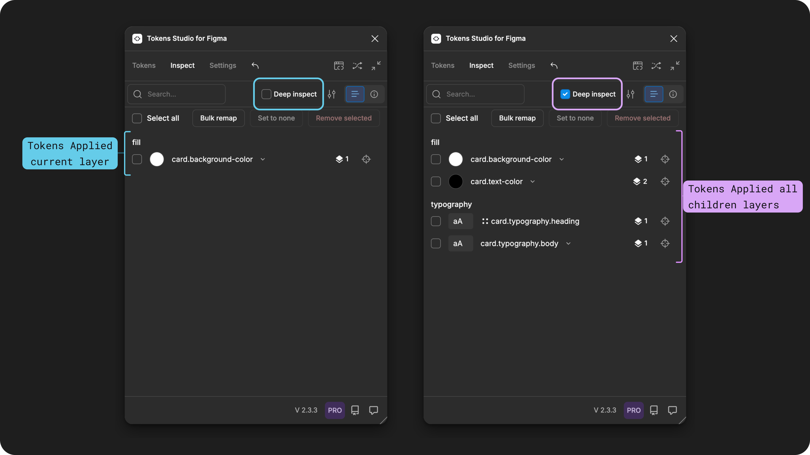<figcaption>
The example on the left shows the Inspect page of the plugin with the Deep Inspect feature disabled (no checkmark) and a single Token listed below. The example on the right shows the Deep Inspect feature enabled (checkmark visible) and 4 Tokens listed below. 
</figcaption></figure>

The Deep Inspect feature in the Plugin is the only way to see all Tokens applied to a design element at once. Figma's native features in Dev Mode or their Inspect views only shows the current selected layer and ignore all children layers.&#x20;


Icons tend to be tricky with layers!&#x20;

Color Tokens applied to style the vector path are always applied to the children layers, and when selecting the parent container without deep inspect enabled you might miss them! This is a common complaint in Dev Mode in Figma as well to be aware of!&#x20;


#### C. Inspect Options

The Inspect Options menu contains some handy filters if you are working with design elements in Figma with lots of Tokens applied to them:

1. Show broken references&#x20;
   * Controls visibility of Tokens applied that have an issue blocking the Plugin from resolving the value of the Token correctly.&#x20;
   * Most often there is an issue with the Token Name not being found in the plugin, or the value of the Token has an error.
2. Show resolved references
   * Controls visibility of Tokens applied with no issues detected by the Plugin. &#x20;

<figure>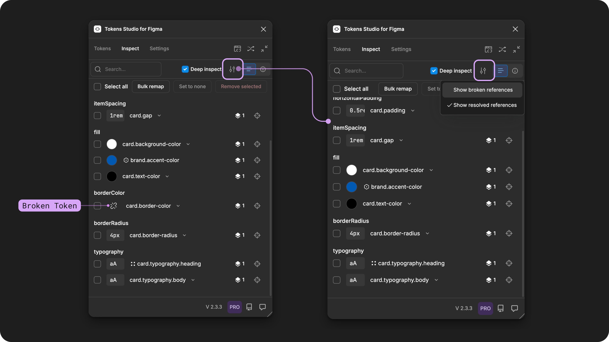<figcaption>
The example on the left shows the Inspect page of the plugin with a list of Tokens below, which includes a broken Token. The example on the right shows the Inspect Options menu open with the "show broken references" disabled (no checkmark), and the list of Tokens below does not include any broken Tokens. 
</figcaption></figure>

For example you are only checking for Broken Tokens, you could deselect the `show resolved references`option so the checkmark is not visible. That way any layers you are inspecting in the Plugin will only show Tokens with broken references in the list below so you can find what you are looking for faster.&#x20;

<figure>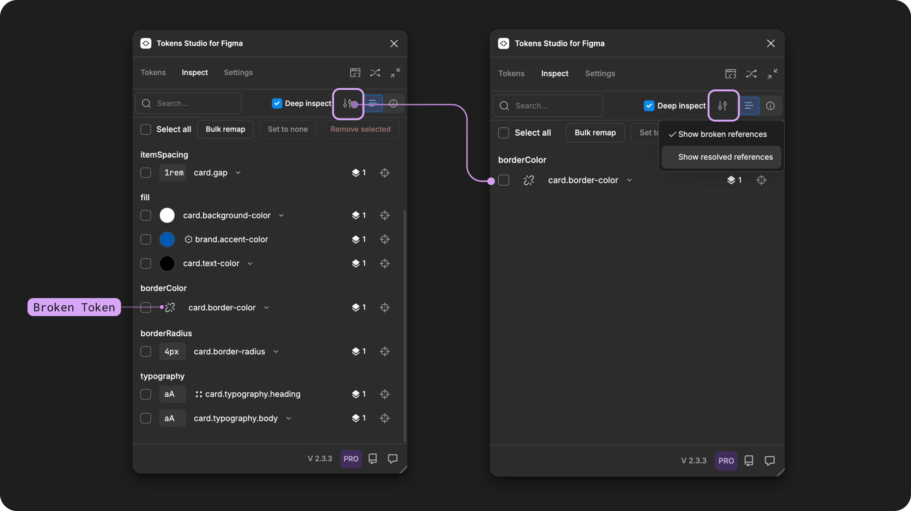<figcaption>
The example on the left shows the Inspect page of the plugin with a list of Tokens below, which includes a broken Token. The example on the right shows the Inspect Options menu open with the "show resolved references" disabled (no checkmark), and the list of Tokens below only shows the broken Token. 
</figcaption></figure>

#### D. Token View Toggle

Much like on the Tokens page of the Plugin, the Tokens View toggle allows you to switch between the no-code (list) and code (debug) views.&#x20;

By default, the Inspect page is on the List view. You can select the `i`icon button to toggle to the debug view.&#x20;

<figure>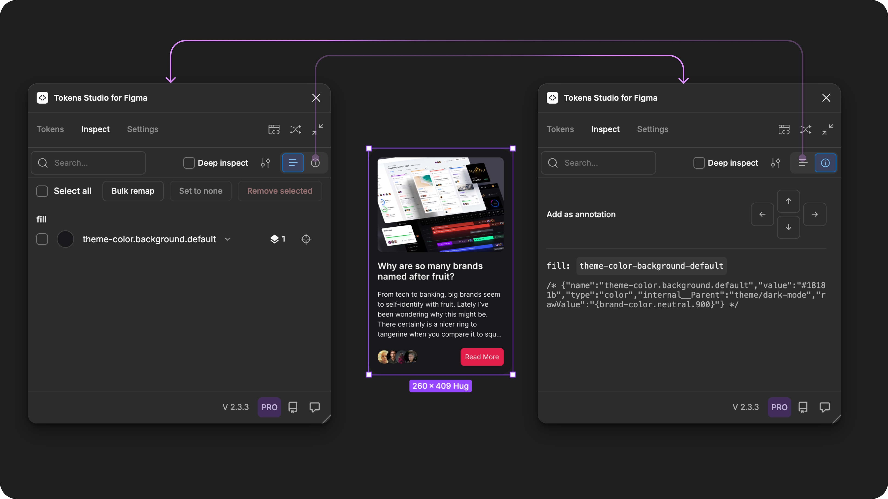<figcaption>
With a card element selected in the Figma canvas in the middle, the Plugin screenshot on the left shows the Inspect page as the List view. The screenshot on the right shows the Inspect page in debug view. The controls to toggle between views are annotated. 
</figcaption></figure>

#### Debug and Annotate

When you are inspecting a selected layer in the Plugin from the Debug View, you will see all Tokens applied to the layer written in code.&#x20;

You can also select one of the arrows to create a static annotation element next to the selected layer in the Figma file. The annotation element will include the names of all Tokens applied to the selected layer and an arrow indicating which layer the annotation belongs to.&#x20;

For example, selecting the arrow pointing down will place the annotation element underneath the design element on the Figma canvas.&#x20;

<figure>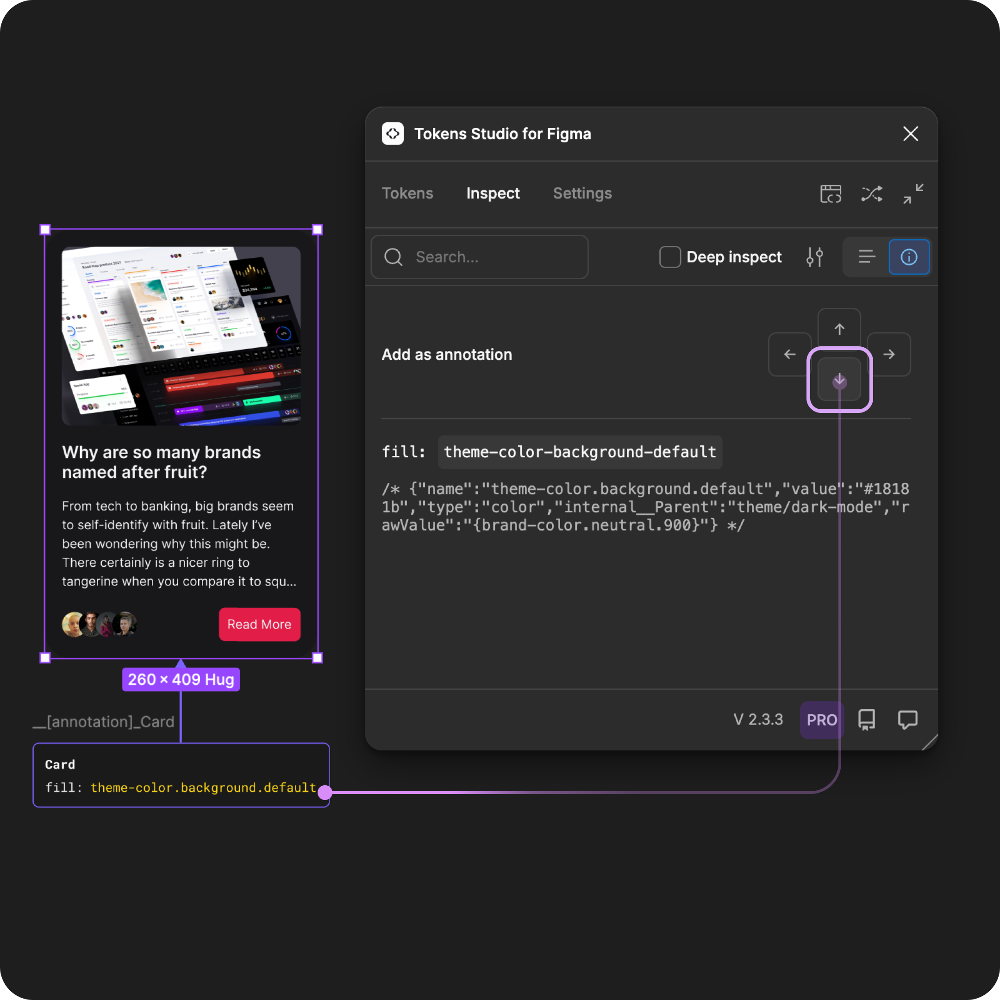<figcaption>
With a card element selected in the Figma canvas on the lift, the Plugin screenshot on the right shows the Inspect page in the debug view. The controls to Add as an annotation on the bottom are highlighted to show the output from the plugin for the selected card element. 
</figcaption></figure>


The annotations generated are static, acting like a snapshot in time. You can manually apply a Documentation Token if you want the annotations to change if the Token Names change in the future. \
\
→[ Jump to the guide on Documentation Tokens for more details. ](../manage-tokens/apply/documentation-tokens.md)


***

### 2. Token Actions

These actions allow you to interact with the Tokens listed below them:

A. [Select All ](inspect-tokens.md#a.-select-all)

B. [Bulk Remap](inspect-tokens.md#b.-bulk-remap)&#x20;

C. [Set to None](inspect-tokens.md#c.-set-to-none)

D. [Remove Selected ](inspect-tokens.md#d.-remove-selected)


You can perform bulk actions on more than on design element in Figma! Simply select everything in your design that you want the Plugin to inspect at the same time.&#x20;


<figure>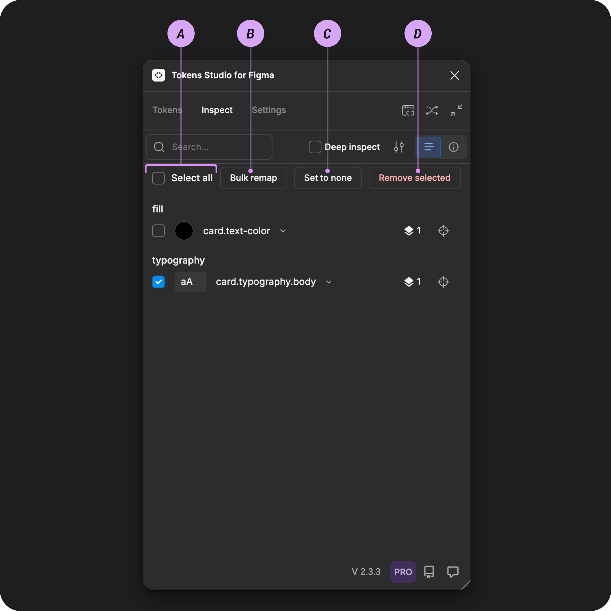<figcaption>
The Inspect page of the Plugin is shown with the Token Actions annotated with letters that match their detailed descriptions below. 
</figcaption></figure>

#### A. Select All&#x20;

The Select All feature controls the Tokens listed below it:

* Select All Off - empty checkbox&#x20;
  * Individual Tokens below it can be selected as required.&#x20;

Select All On- checkmark visible

* All Tokens below it will be selected with their checkmarks visible.&#x20;

<figure>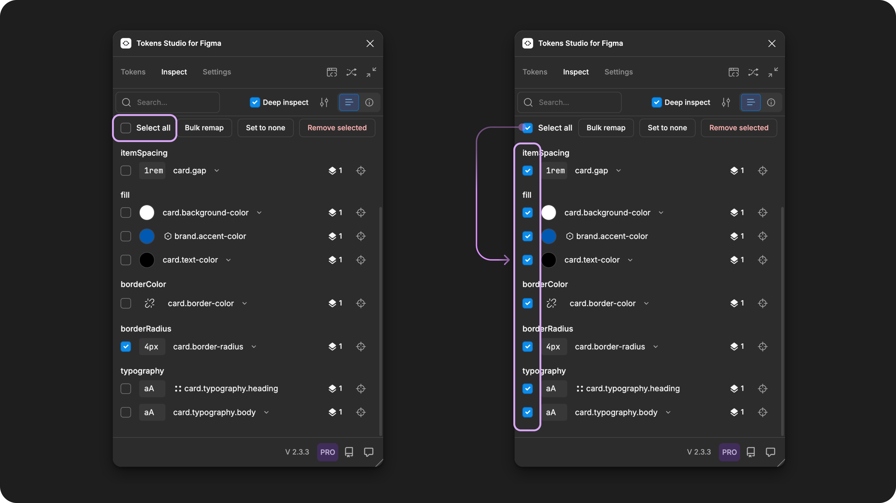<figcaption>
The left screenshot of the Inspect page of the plugin shows the Select all control as disabled (no checkmark), and one of the Tokens listed below has a checkmark visible. The example on the right shows how enabling the Select All control will change all Tokens listed below to have a checkmark visible next to their name. 
</figcaption></figure>

#### B. Bulk Remap

Selecting the Bulk Remap button allows you to use a match and replace feature to update the names of multiple Tokens applied to design elements in your Figma file. This is helpful in fixing broken Tokens that were not [remapped to after editing a Token's name](../manage-tokens/token-names/edit.md#id-2.-configure-your-remap-options).&#x20;

The Bulk Remap modal allows you to match and replace strings of Token Names using the inputs:

1. Match - the string you'd like the Plugin to find.&#x20;
2. Replace - the new string that will replace all instances the Plugin finds that match.&#x20;
3. Remap across document (slow) - tells the Plugin to expand the action across the entire Figma file instead of limiting it to the currently selected design elements.&#x20;

Once you've filled out the inputs with your desired strings, be sure to select the Remap button to save your changes.&#x20;

Once you are finished Remapping all desired Tokens, you'll need to navigate back to the Tokens Page and select the Apply Token Data button to push the new values to Figma to complete the process.&#x20;

→ [Jump to the Remap Tokens guide for more details. ](remap-tokens.md)

<figure>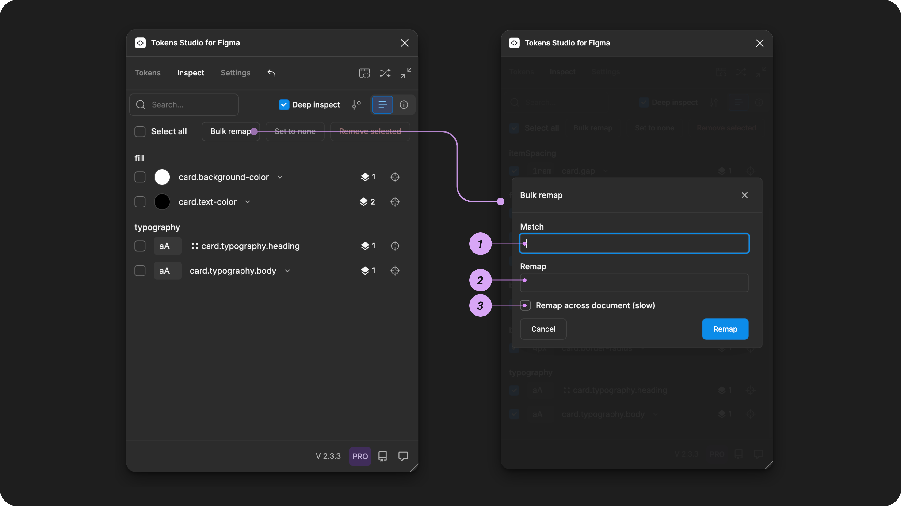<figcaption>
Selecting the Bulk Remap button on the Inspect page of the Plugin will open the Bulk Remap modal, pictured on the right, with numeric annotations to match the inputs described above. 
</figcaption></figure>

#### C. Set to None

Selecting the Set to None feature was developed for working with instances of components in Figma.&#x20;

You can not remove a Token from an instance of a component due to the way that components work in Figma. If you apply another Token, Style or Variable to the same property as an over-ride, when the Plugin runs the value of the Token applied to the main component will be applied, effectively erasing your styling over ride. \
\
So to get around this limitation, you can use the Set to None feature which tells the plugin to change the value of the Token to `none` without removing it. When the value is `none` , you can style that property with another Token, Style or Variable in Figma. When the Plugin runs in the future, your over-ride will persist.&#x20;

<figure>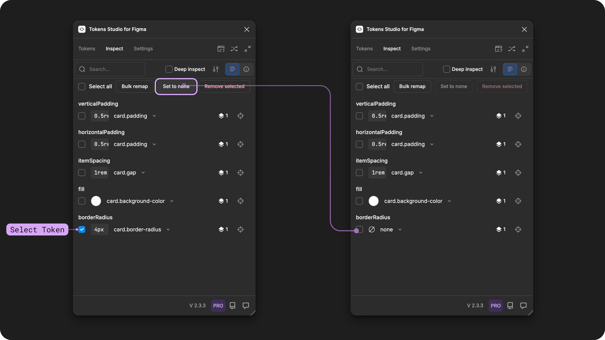<figcaption>
Selecting the Set to none button on the Inspect page of the Plugin will change the value of the selected Token to "none" as pictured on the right. 
</figcaption></figure>

#### D. Remove Selected

The Remove Selected button allows you to remove Tokens that are listed below with the checkmark visible from your chosen design elements on the Figma canvas.&#x20;

<figure>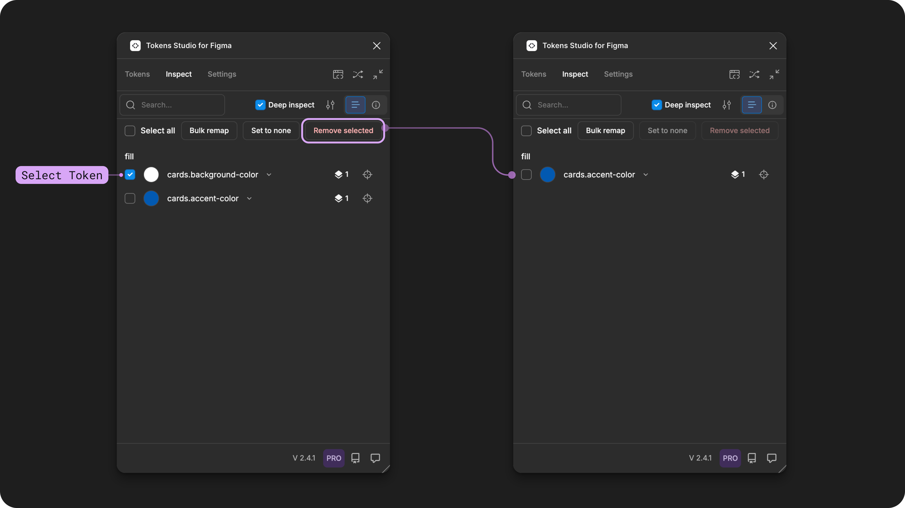<figcaption>
Selecting the Remove selected button on the Inspect page of the Plugin will remove the Tokens with a checkmark next to them. 
</figcaption></figure>

#### Limitations of removing Tokens

The Plugin can not remove Tokens from instances of components. You'll need to use the Set to None feature instead ([↑ described above](inspect-tokens.md#c.-set-to-none)).

The Plugin can not remove Variables or Styles applied to design elements with Figma's native features.&#x20;

There are also some nuances of removing Tokens from the Inspect or Tokens Page of the Plugin to be aware of, which are described in detail in the Remove Tokens guide.&#x20;


[remove-tokens.md](../figma/remove-tokens.md)


***

### 3. Token List

Once you've selected a design element in Figma, the Tokens applied are listed in the Plugin. Each Token Type will appear in the list with slight differences, but all Tokens in the list share the same anatomy:&#x20;

A. [Design Property](inspect-tokens.md#id-3.-token-list)

B. [Select Token Control](inspect-tokens.md#b.-select-token)

C. [Value Preview](inspect-tokens.md#c.-value-preview)

D. [Token Application Symbol ](inspect-tokens.md#d.-token-application-symbol)

E. [Token Name ](inspect-tokens.md#e.-token-name)

F. [Figma Layer Actions](inspect-tokens.md#f.-figma-layer-actions)


It's important to remember that the controls and actions above the Token List influence which Tokens you will see for the currently selected design element on the Figma canvas.&#x20;


<figure>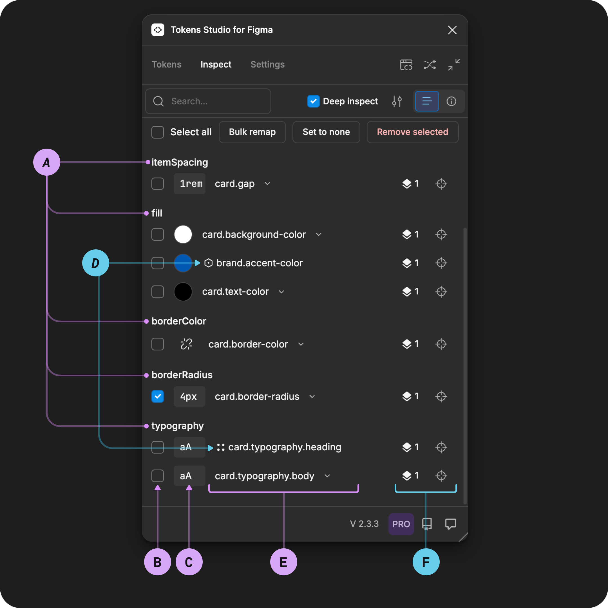<figcaption>
The Inspect page of the Plugin is shown with the Token List features annotated with letters that match their detailed descriptions below. 
</figcaption></figure>

#### A. Design Property&#x20;

The Tokens in the list are organized by the design property they have been applied to for the selected elements on the Figma canvas.

The design property appears as the heading of the Tokens listed below it.&#x20;

<figure>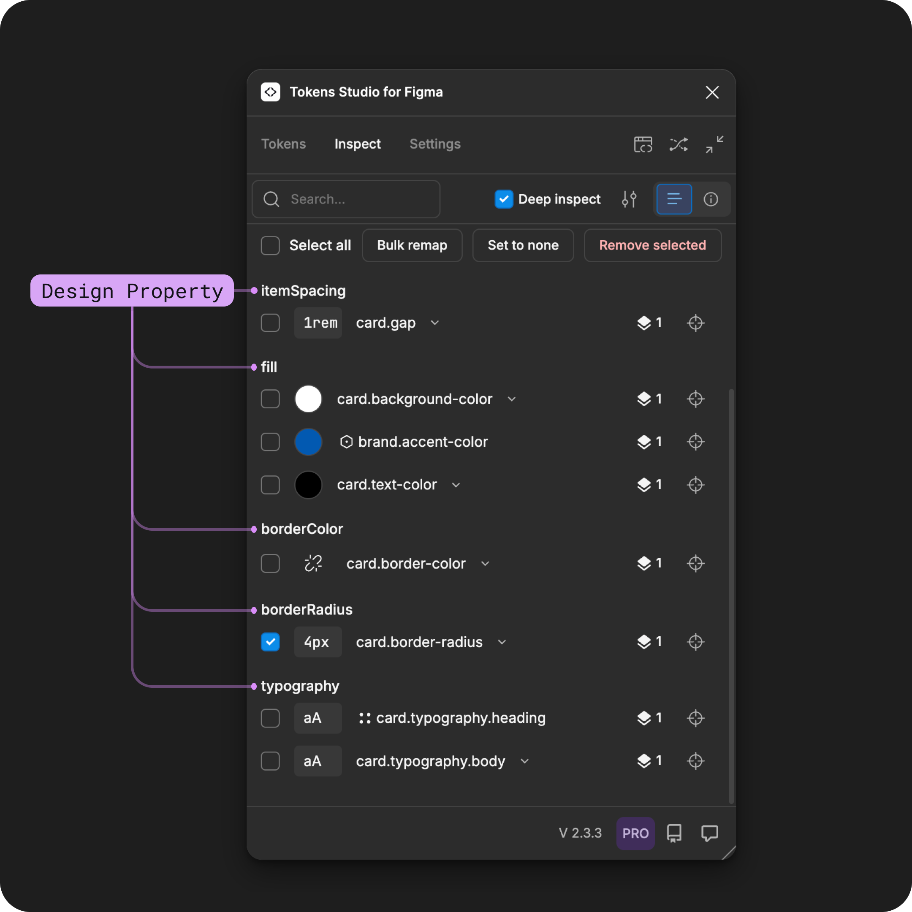<figcaption>
An example of the Inspect page of the Plugin shows a long list of Tokens with the design properties they were applied to highlighted. 
</figcaption></figure>

The names of the design properties displayed on the inspect page don't always match the design properties displayed when you right click on a Token to apply it to a design element. \
\
Here's a list of the design properties you'll see on inspect page and the corresponding Token Type. You can select the Token Type to jump to its guide.&#x20;

<table><thead><tr><th width="259.296875">Design Property</th><th>Common Name</th><th>Token Types</th></tr></thead><tbody><tr><td><code>asset</code></td><td>Assets/images</td><td><a href="../manage-tokens/token-types/asset.md">Asset</a></td></tr><tr><td><code>backgroundBlur</code></td><td>Background blur</td><td><a href="../manage-tokens/token-types/dimension/#id-5.-background-blur">Dimension</a></td></tr><tr><td><code>border</code></td><td>Border all sides</td><td><a href="../manage-tokens/token-types/border.md#apply-border-tokens">Border</a></td></tr><tr><td><code>borderBottom</code></td><td>Bottom border only</td><td><a href="../manage-tokens/token-types/border.md#apply-border-tokens">Border</a></td></tr><tr><td><code>borderColor</code></td><td>Border/stroke color</td><td><a href="../manage-tokens/token-types/color/#apply-color-tokens">Color</a></td></tr><tr><td><code>borderLeft</code></td><td>Left border properties</td><td><a href="../manage-tokens/token-types/border.md#apply-border-tokens">Border</a></td></tr><tr><td><code>borderRadius</code></td><td>Border radius (all corners)</td><td><a href="../manage-tokens/token-types/dimension/#id-3.-border-radius">Dimension</a>, <a href="../manage-tokens/token-types/dimension/border-radius.md#apply-border-radius-tokens">Border Radius</a></td></tr><tr><td><code>borderRadiusBottomLeft</code></td><td>Bottom-left border radius</td><td><a href="../manage-tokens/token-types/dimension/#id-3.-border-radius">Dimension</a>, <a href="../manage-tokens/token-types/dimension/border-radius.md#apply-border-radius-tokens">Border Radius</a></td></tr><tr><td><code>borderRadiusBottomRight</code></td><td>Bottom-right border radius</td><td><a href="../manage-tokens/token-types/dimension/#id-3.-border-radius">Dimension</a>, <a href="../manage-tokens/token-types/dimension/border-radius.md#apply-border-radius-tokens">Border Radius</a></td></tr><tr><td><code>borderRadiusTopLeft</code></td><td>Top-left border radius</td><td><a href="../manage-tokens/token-types/dimension/#id-3.-border-radius">Dimension</a>, <a href="../manage-tokens/token-types/dimension/border-radius.md#apply-border-radius-tokens">Border Radius</a></td></tr><tr><td><code>borderRadiusTopRight</code></td><td>Top-right border radius</td><td><a href="../manage-tokens/token-types/dimension/#id-3.-border-radius">Dimension</a>, <a href="../manage-tokens/token-types/dimension/border-radius.md#apply-border-radius-tokens">Border Radius</a></td></tr><tr><td><code>borderRight</code></td><td>Right border properties</td><td><a href="../manage-tokens/token-types/border.md#apply-border-tokens">Border</a></td></tr><tr><td><code>borderTop</code></td><td>Top border properties</td><td><a href="../manage-tokens/token-types/border.md#apply-border-tokens">Border</a></td></tr><tr><td><code>borderWidth</code></td><td>Border width</td><td><a href="../manage-tokens/token-types/dimension/#id-4.-border-width">Dimension</a>, <a href="../manage-tokens/token-types/dimension/border-width.md#apply-border-width-tokens">Border Width</a></td></tr><tr><td><code>borderWidthBottom</code></td><td>Bottom border width</td><td><a href="../manage-tokens/token-types/dimension/#id-4.-border-width">Dimension</a>, <a href="../manage-tokens/token-types/dimension/border-width.md#apply-border-width-tokens">Border Width</a></td></tr><tr><td><code>borderWidthLeft</code></td><td>Left border width</td><td><a href="../manage-tokens/token-types/dimension/#id-4.-border-width">Dimension</a>, <a href="../manage-tokens/token-types/dimension/border-width.md#apply-border-width-tokens">Border Width</a></td></tr><tr><td><code>borderWidthRight</code></td><td>Right border width</td><td><a href="../manage-tokens/token-types/dimension/#id-4.-border-width">Dimension</a>, <a href="../manage-tokens/token-types/dimension/border-width.md#apply-border-width-tokens">Border Width</a></td></tr><tr><td><code>borderWidthTop</code></td><td>Top border width</td><td><a href="../manage-tokens/token-types/dimension/#id-4.-border-width">Dimension</a>, <a href="../manage-tokens/token-types/dimension/border-width.md#apply-border-width-tokens">Border Width</a></td></tr><tr><td><code>boxShadow</code></td><td>Box shadow</td><td><a href="../manage-tokens/token-types/box-shadow.md">BoxShadow</a></td></tr><tr><td><code>composition</code></td><td>Composition (legacy)</td><td><a href="../manage-tokens/token-types/composition.md">Composition</a></td></tr><tr><td><code>counterAxisSpacing</code></td><td>Row gap</td><td><a href="../manage-tokens/token-types/dimension/#id-1.-spacing">Dimension</a>, <a href="../manage-tokens/token-types/dimension/spacing.md#apply-spacing-tokens">Spacing</a>, <a href="../manage-tokens/token-types/number.md#id-1.-spacing">Number</a></td></tr><tr><td><code>description</code></td><td>Token description</td><td><a href="../manage-tokens/apply/documentation-tokens.md#description">Documentation Tokens</a></td></tr><tr><td><code>dimension</code></td><td>Dimension without property specified</td><td><a href="../manage-tokens/token-types/dimension/#apply-dimension-tokens">Dimension</a></td></tr><tr><td><code>fill</code></td><td>Fill color</td><td><a href="../manage-tokens/token-types/color/#apply-color-tokens">Color</a></td></tr><tr><td><code>height</code></td><td>Height</td><td><a href="../manage-tokens/token-types/dimension/#id-2.-sizing">Dimension</a>, <a href="../manage-tokens/token-types/dimension/sizing.md#apply-sizing-tokens">Sizing</a>, <a href="../manage-tokens/token-types/number.md#id-2.-sizing">Number</a></td></tr><tr><td><code>horizontalPadding</code></td><td>Horizontal padding</td><td><a href="../manage-tokens/token-types/dimension/#id-2.-sizing">Dimension</a>, <a href="../manage-tokens/token-types/dimension/sizing.md#apply-sizing-tokens">Sizing</a>, <a href="../manage-tokens/token-types/number.md#id-2.-sizing">Number</a></td></tr><tr><td><code>itemSpacing</code></td><td>Spacing between items</td><td><a href="../manage-tokens/token-types/dimension/#id-2.-sizing">Dimension</a>, <a href="../manage-tokens/token-types/dimension/sizing.md#apply-sizing-tokens">Sizing</a>, <a href="../manage-tokens/token-types/number.md#id-2.-sizing">Number</a></td></tr><tr><td><code>maxHeight</code></td><td>Maximum height</td><td><a href="../manage-tokens/token-types/dimension/#id-2.-sizing">Dimension</a>, <a href="../manage-tokens/token-types/dimension/sizing.md#apply-sizing-tokens">Sizing</a>, <a href="../manage-tokens/token-types/number.md#id-2.-sizing">Number</a></td></tr><tr><td><code>maxWidth</code></td><td>Maximum width</td><td><a href="../manage-tokens/token-types/dimension/#id-2.-sizing">Dimension</a>, <a href="../manage-tokens/token-types/dimension/sizing.md#apply-sizing-tokens">Sizing</a>, <a href="../manage-tokens/token-types/number.md#id-2.-sizing">Number</a></td></tr><tr><td><code>minHeight</code></td><td>Minimum height</td><td><a href="../manage-tokens/token-types/dimension/#id-2.-sizing">Dimension</a>, <a href="../manage-tokens/token-types/dimension/sizing.md#apply-sizing-tokens">Sizing</a>, <a href="../manage-tokens/token-types/number.md#id-2.-sizing">Number</a></td></tr><tr><td><code>minWidth</code></td><td>Minimum width</td><td><a href="../manage-tokens/token-types/dimension/#id-2.-sizing">Dimension</a>, <a href="../manage-tokens/token-types/dimension/sizing.md#apply-sizing-tokens">Sizing</a>, <a href="../manage-tokens/token-types/number.md#id-2.-sizing">Number</a></td></tr><tr><td><code>number</code></td><td>Number without property specified</td><td><a href="../manage-tokens/token-types/number.md#apply-number-tokens">Number</a></td></tr><tr><td><code>opacity</code></td><td>Opacity/transparency</td><td><a href="../manage-tokens/token-types/opacity.md#apply-opacity-tokens">Opacity</a></td></tr><tr><td><code>paddingBottom</code></td><td>Bottom padding</td><td><a href="../manage-tokens/token-types/dimension/#id-1.-spacing">Dimension</a>, <a href="../manage-tokens/token-types/dimension/spacing.md#apply-spacing-tokens">Spacing</a>, <a href="../manage-tokens/token-types/number.md#id-1.-spacing">Number</a></td></tr><tr><td><code>paddingLeft</code></td><td>Left padding</td><td><a href="../manage-tokens/token-types/dimension/#id-1.-spacing">Dimension</a>, <a href="../manage-tokens/token-types/dimension/spacing.md#apply-spacing-tokens">Spacing</a>, <a href="../manage-tokens/token-types/number.md#id-1.-spacing">Number</a></td></tr><tr><td><code>paddingRight</code></td><td>Right padding</td><td><a href="../manage-tokens/token-types/dimension/#id-1.-spacing">Dimension</a>, <a href="../manage-tokens/token-types/dimension/spacing.md#apply-spacing-tokens">Spacing</a>, <a href="../manage-tokens/token-types/number.md#id-1.-spacing">Number</a></td></tr><tr><td><code>paddingTop</code></td><td>Top padding</td><td><a href="../manage-tokens/token-types/dimension/#id-1.-spacing">Dimension</a>, <a href="../manage-tokens/token-types/dimension/spacing.md#apply-spacing-tokens">Spacing</a>, <a href="../manage-tokens/token-types/number.md#id-1.-spacing">Number</a></td></tr><tr><td><code>rotation</code></td><td>Rotation</td><td><a href="../manage-tokens/token-types/number.md#id-7.-rotation">Number</a></td></tr><tr><td><code>sizing</code></td><td>Size (width and height)</td><td><a href="../manage-tokens/token-types/dimension/#id-2.-sizing">Dimension</a>, <a href="../manage-tokens/token-types/dimension/sizing.md#apply-sizing-tokens">Sizing</a>, <a href="../manage-tokens/token-types/number.md#id-2.-sizing">Number</a></td></tr><tr><td><code>spacing</code></td><td>General spacing</td><td><a href="../manage-tokens/token-types/dimension/#id-1.-spacing">Dimension</a>, <a href="../manage-tokens/token-types/dimension/spacing.md#apply-spacing-tokens">Spacing</a>, <a href="../manage-tokens/token-types/number.md#id-1.-spacing">Number</a></td></tr><tr><td><code>text</code></td><td>String text content</td><td><a href="../manage-tokens/token-types/text.md">Text</a></td></tr><tr><td><code>textDecoration</code></td><td>Text decoration</td><td><a href="../manage-tokens/token-types/typography/text-decoration.md">Text Decoration</a></td></tr><tr><td><code>tokenName</code></td><td>Token name</td><td><a href="../manage-tokens/apply/documentation-tokens.md#description">Documentation Token</a></td></tr><tr><td><code>tokenValue</code></td><td>Token raw value</td><td><a href="../manage-tokens/apply/documentation-tokens.md#token-value-raw">Documentation Token</a></td></tr><tr><td><code>typography</code></td><td>Typography Composite </td><td><a href="../manage-tokens/token-types/typography/">Typography</a></td></tr><tr><td><code>verticalPadding</code></td><td>Vertical padding</td><td><a href="../manage-tokens/token-types/dimension/#id-1.-spacing">Dimension</a>, <a href="../manage-tokens/token-types/dimension/spacing.md#apply-spacing-tokens">Spacing</a>, <a href="../manage-tokens/token-types/number.md#id-1.-spacing">Number</a></td></tr><tr><td><code>value</code></td><td>Token resolved value </td><td><a href="../manage-tokens/apply/documentation-tokens.md#value-resolved">Documentation Token</a></td></tr><tr><td><code>visibility</code></td><td>Visibility state</td><td><a href="../manage-tokens/token-types/boolean.md#apply-boolean-tokens">Boolean</a></td></tr><tr><td><code>width</code></td><td>Width</td><td><a href="../manage-tokens/token-types/dimension/#id-2.-sizing">Dimension</a>, <a href="../manage-tokens/token-types/dimension/sizing.md#apply-sizing-tokens">Sizing</a>, <a href="../manage-tokens/token-types/number.md#id-2.-sizing">Number</a></td></tr><tr><td><code>x</code></td><td>X position</td><td><a href="../manage-tokens/token-types/dimension/#id-6.-x-and-y-position">Dimension</a>, <a href="../manage-tokens/token-types/number.md#id-6.-x-and-y-position">Number</a></td></tr><tr><td><code>y</code></td><td>Y position</td><td><a href="../manage-tokens/token-types/dimension/#id-6.-x-and-y-position">Dimension</a>, <a href="../manage-tokens/token-types/number.md#id-6.-x-and-y-position">Number</a></td></tr></tbody></table>

#### B. Select Token&#x20;

The Select Token control allows the bulk actions above the list to be applied to the Token:

* Empty checkbox&#x20;
  * This Token will be skipped from bulk actions.
* Checkmark visible
  * Bulk actions will be applied to this Token.

<figure>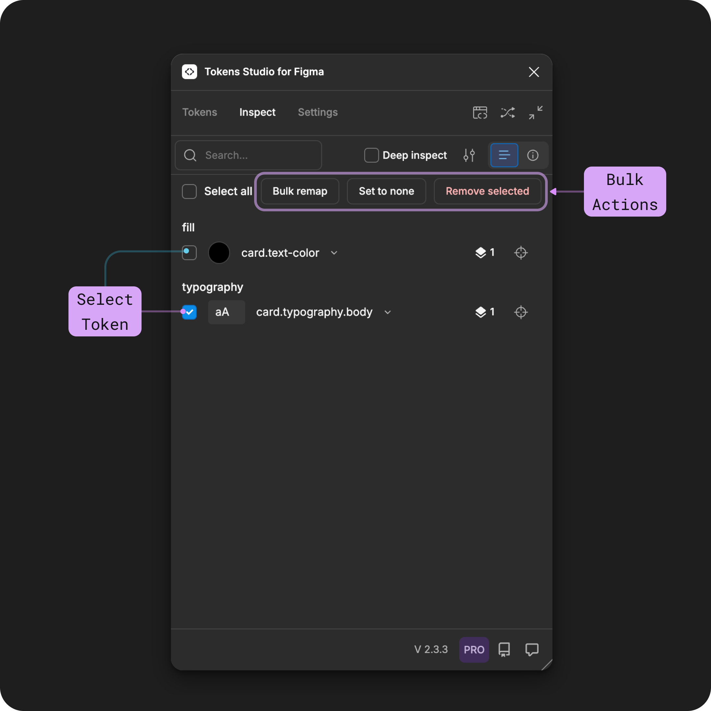<figcaption>
An example of the Inspect page of the Plugin highlights the Bulk Actions after a Token in the list below has been enabled (checkmark visible). 
</figcaption></figure>

#### C. Value Preview

Each Token Type will preview the [Resolved Value](../manage-tokens/token-values/#resolved-value) of the Token in a slightly different way. For example, Color Tokens display a swatch of the color, where as a Dimension Token shows the numeric value.&#x20;

* When a Token is "broken" and it's value can not be resolved, the value will be replaced with an icon of a broken link (↓ more details below).&#x20;
* When the Value has been Set to None using the bulk action, the value will be replaced with an icon of a circle with a line through it ([↑ more details above](inspect-tokens.md#c.-set-to-none)).&#x20;


Known Issue \
When values are long, sometimes the UI preview will appear visually broken or cut off.&#x20;


<figure>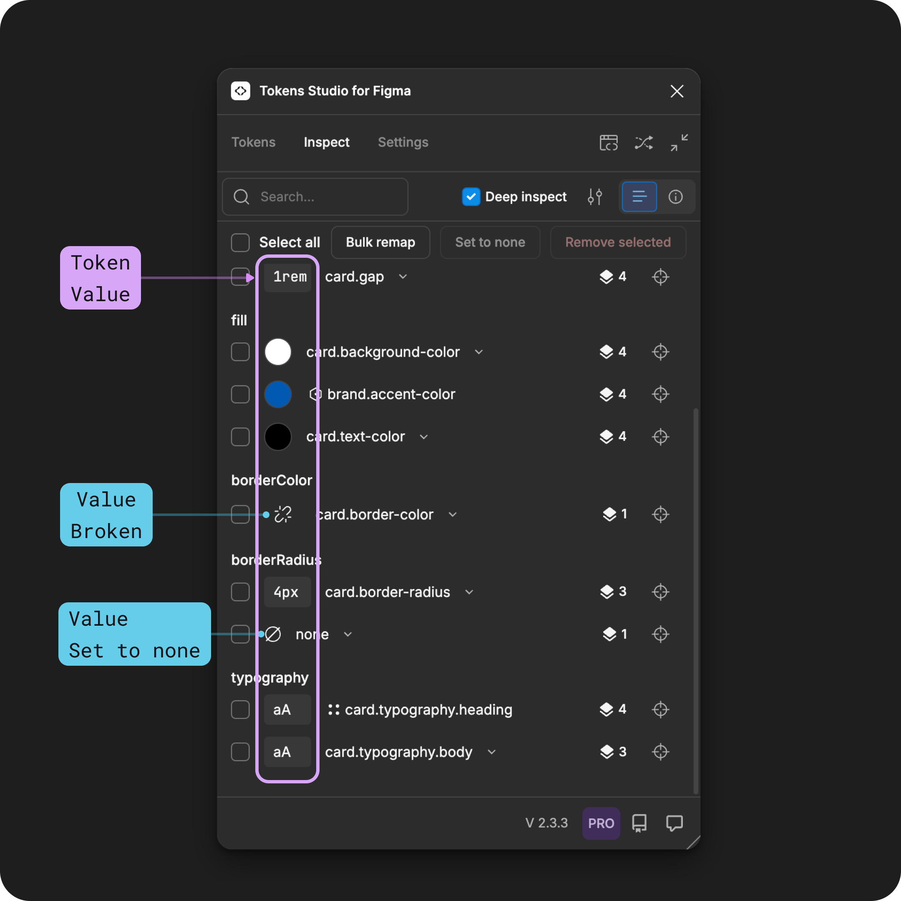<figcaption>
An example of the Inspect page of the Plugin highlights the Token Values for several different Token Types described above.
</figcaption></figure>

#### D. Token Application Symbol

The Plugin will display a symbol next to the Token Name to indicate how it was applied to the design element.&#x20;

1. Applied with Tokens Studio - no symbol
2. Applied as a Figma Style - 2 x 2 dots
3. Applied as a Figma Variable - Hexagon&#x20;
4. Broken Token - Chain link with line through it.&#x20;
5. Value Set to None - Circle with a line through it.&#x20;

<figure>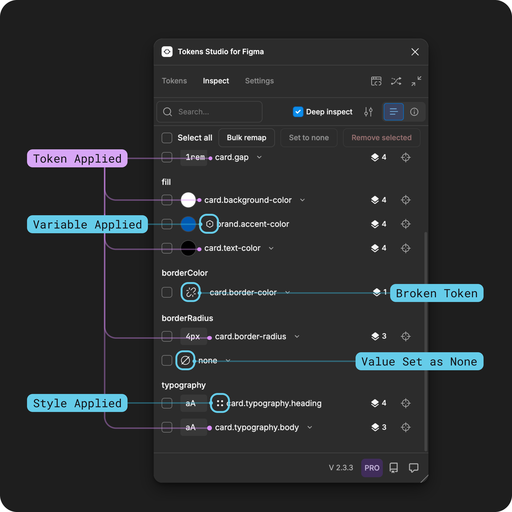<figcaption>
An example of the Inspect page of the Plugin highlights the symbols for how Tokens were applied to the selected design element as described above.
</figcaption></figure>

#### E. Token Name

The Token Name that Figma is using as the ID of the design decision will show in the list. If the Token was applied using the Plugin directly, you can select the chevron to the right of the name to access the Remap feature.&#x20;

If you use the remap feature it will only apply the changes to the design elements on the Figma Canvas that are currently selected. You can use the actions to the right of the Token Name to check which layers are selected ([described below ↓](inspect-tokens.md#f.-figma-layer-actions)).&#x20;

→ [Jump to the Remap Tokens guide for more details. ](remap-tokens.md)

<figure>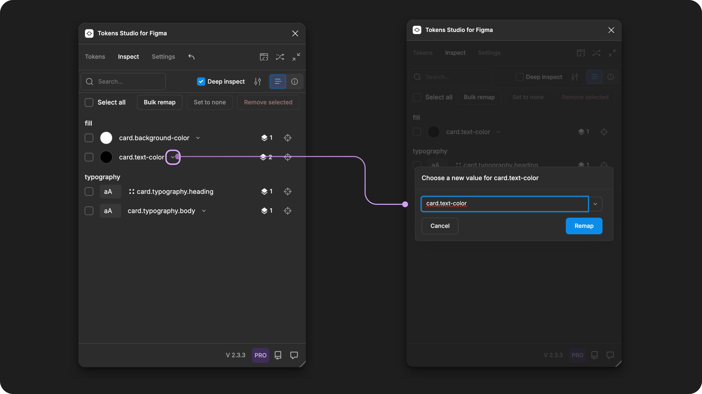<figcaption>
An example of the Inspect page of the Plugin shows how to open the remap feature by selecting the chevron next to the Name of a Token in the list. 
</figcaption></figure>

#### F.  Figma Layer Actions

The actions on the right side of the Token list interact with the layers within your selected design elements in Figma. These actions allow for fine-grained control of selecting the correct layers when debugging Tokens that are broken or require remapping:

1. Layer count - the number of layers the Token is applied to&#x20;
   1. Selecting the layer count will open a list of the layer names.&#x20;
2. Layer navigation - will change the Plugin's current selected layers to the layers listed in the count to the left.&#x20;

<figure>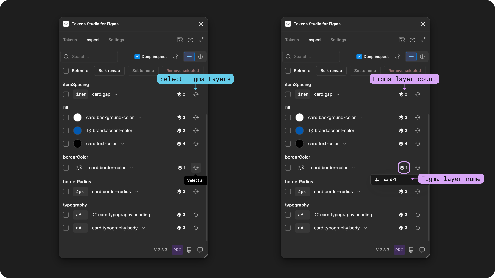<figcaption>
An example of the Inspect page of the Plugin shows the Figma Layer features. On the left, the layer selected feature is highlighted. On the right, the layer count is highlighted with an example showing a specific Figma layer name when the count is selected. 
</figcaption></figure>

***

### Resources

Mentioned in this doc:

* Figma Learn - [Select layers and objects](https://help.figma.com/hc/en-us/articles/360040449873-Select-layers-and-objects)

#### Community resources:

* None yet!



#### Known issues and bugs

Tokens Studio Plugin GitHub - [Open issues for Inspect](https://github.com/tokens-studio/figma-plugin/labels/Inspect%20tab)

Tokens Studio Plugin GitHub - [Open issues for Deep Inspect](https://github.com/tokens-studio/figma-plugin/labels/Inspect%20deep)



#### Requests, roadmap and changelog

* None yet.&#x20;



