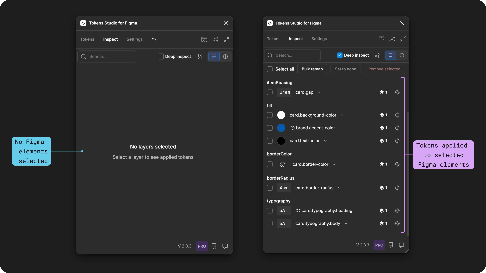
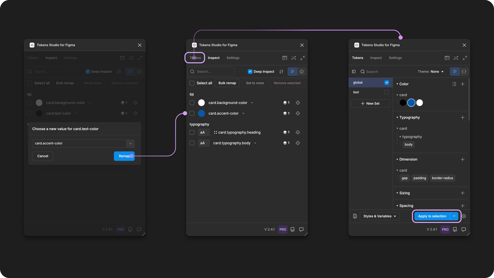
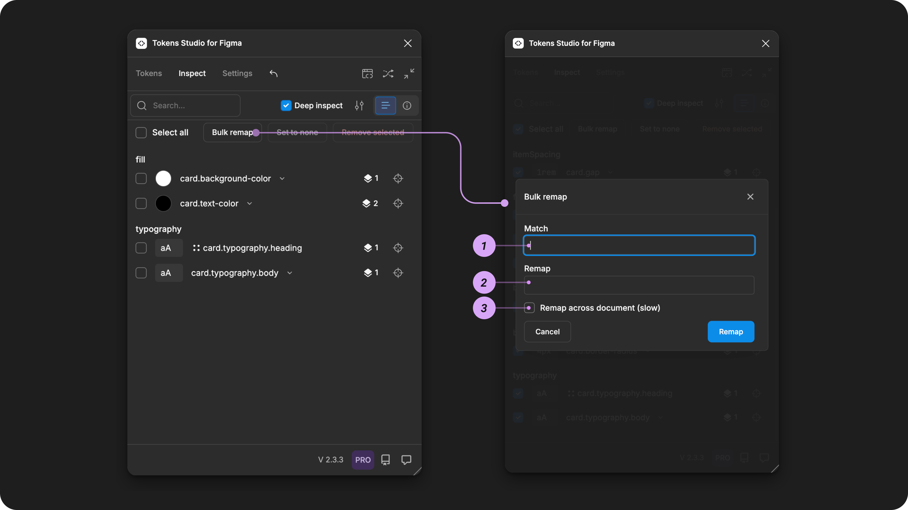

# Remap Tokens

## Remap Tokens&#x20;

When you apply a Design Token to a node in Figma using the Tokens Studio Plugin, there is an invisible connection created that _**maps**_ the Token data to the design element in Figma.&#x20;

The way Figma identifies an individual design decision mapped to a node is by the Name of the Token.&#x20;

_A_ [_node in Figma_](https://www.figma.com/plugin-docs/api/nodes/) _refers to a design element, layer, style or variable. Each node can have several different types of Tokens applied depending on the type of node._&#x20;

In Tokens Studio, to _**Remap a Token**_ is to tell Figma to change the ID of that connection to a different Token Name. Once the connection has been remapped to the new Token, the plugin can send updated data about your design decision to your Figma design elements.&#x20;

You'll find the Remap Tokens feature handy when you are:

* [Changing Token Names](../manage-tokens/token-names/edit.md)
* Updating [Token Groups ](../manage-tokens/token-names/groups.md)
* Troubleshooting broken Tokens

<figure><figcaption>
The rename options are shown on the left with an annotation highlighting the option which takes the longest time to execute. On the right side, the Tokens Page shows the progress of the renaming process at the top of the plugin. 
</figcaption></figure>

If you don't remap the connection between the Figma node and the Token to the new name, Figma won't be able to find the right Token because it's looking for the old name which no longer exists, and the Plugin won't know which nodes it is connected to.&#x20;

This broken connection is is sometimes referred to as a _breaking change_ or a _broken Token_.&#x20;

***

### In the Plugin

Remapping a Token is not an automatic process, you have to tell the Plugin which connections it should remap. There are several places where you can Remap Tokens depending on your current workflow:&#x20;

1. [Tokens Page](remap-tokens.md#id-1.-tokens-page)&#x20;
2. Inspect Page&#x20;
   1. [Single Token Remap ](remap-tokens.md#remap-a-single-token-for-a-selected-element)
   2. [Bulk Remap](remap-tokens.md#bulk-remap-tokens)&#x20;

### 1. Tokens Page&#x20;

When you change the Name of an individual Token or Token group from the List View of the Tokens Page, the Plugin will launch the Remap feature to update the ID of attached connections to Figma nodes at the same time. &#x20;

If you change the Name of a Token from the JSON View of the Token Page, you will need to use the Remap features on the Inspect page ([↓ described below](remap-tokens.md#id-2.-inspect-page)).&#x20;

<figure><figcaption>
In the Plugin, once you edit a Token name and save your changes, you have the option to Remap all layers, styles or variables to the new name. 
</figcaption></figure>

The Remap options you can configure vary based on:

* If you are changing an individual Token Name or part of a group.&#x20;
* If you have more than one Token Set with the same Token Names (common with theming).&#x20;
* If you are using Themes in your Token project.&#x20;

<figure><figcaption>
Two versions of the Rename Token options are shown, which are visible if your project uses the Themes (pro) feature. The version on the right shows an example of the options that should be selected if the Token you renamed is attached to a Variable in Figma with more than one mode. 
</figcaption></figure>

Each of these workflows are described in detail in the Edit Token Names guide.&#x20;


[edit.md](../manage-tokens/token-names/edit.md)


***

### 2. Inspect Page&#x20;

From the Inspect Page of the Tokens Studio Plugin, select some design elements in your Figma file to display the list of Tokens applied to the layer.&#x20;


Use the `Deep Inspect` control to see Tokens applied to all children layers if desired.&#x20;



Tokens that have been applied using the Plugin can be Remapped. They appear with a chevron after their name.



Variables or Styles applied using the Figma UI can not be remapped using the Plugin. They appear with the hexagon or 2x2 dot icons before their name.&#x20;


[→ Jump to the Inspect Page guide if you'd like a detailed explanation on the Token List.](inspect-tokens.md)

<figure><figcaption>
The left side example shows how the Inspect page looks before selecting a Figma design element compared with the right side example, showing many Tokens applied to a selected layer in Figma. The brand.accent-color and card.typography.heading Tokens can not be remapped as they have been applied using the Figma UI as Variables and Styles, indicated by the icons before their name. 
</figcaption></figure>

### Remap a single Token for a selected element

On the Inspect Page of the Plugin, once you have design elements in Figma selected with Tokens applied, you can remap a single token by selecting the chevron that appears after its name.&#x20;

<figure><figcaption>
An example of the Inspect page of the Plugin shows how to open the remap feature by selecting the chevron next to the Name of a Token in the list. 
</figcaption></figure>

Once the Remap Modal is open, you can:

* Type the new Token Name in the input, or
* Select the chevron to the right of the name to choose from the list of compatible Tokens.&#x20;
  * You can use the input above the Token List to search for a text string.&#x20;

Be sure to select the Remap button to save your changes.&#x20;

<figure><figcaption>
An example of the Remap a single Token workflow. When the chevron next to the Token name is selected a select menu with search opens. 
</figcaption></figure>

Once you are finished Remapping all desired Tokens, you'll need to navigate back to the Tokens Page and select the Apply Token Data button to push the new values to Figma to complete the process.&#x20;

<figure><figcaption>
The workflow to Apply Token data to selected Tokens in Figma shows the navigation from the Remap modal on the Inspect page to the Tokens page.
</figcaption></figure>

It's important to note that the Remapping using this workflow will only change the connections IDs for the currently selected Figma elements. This means you may have to repeat this process on additional components or pages of your design file. \
\
If you want to Remap a Token across more of your Figma file at the same time, you'll want to use the Bulk Remap feature described below.&#x20;

### Bulk Remap Tokens

The Bulk Remap feature allows you to change the connection IDs of multiple design elements in your Figma file using a match and replace workflow.&#x20;

If you are familiar with a "find and replace" feature in a text/code editor, it works very much the same way.&#x20;

To access the Bulk Remap feature from the Inspect page of the Plugin:&#x20;

* Select a design element in your Figma file with Tokens applied.&#x20;
* Select the Bulk Remap button to open the modal.&#x20;

<figure><figcaption>
The navigation to open the Bulk Remap modal from the Inspect page of the Plugin is shown on the left. On the right, the Bulk Remap modal is annotated with numbers to match their detailed descriptions below. 
</figcaption></figure>

#### Bulk Remap Modal&#x20;

The Bulk Remap modal allows you to match and replace strings of Token Names using the inputs:

1. Match - the string you'd like the Plugin to find.&#x20;
2. Replace - the new string that will replace all instances the Plugin finds that match.&#x20;
3. Remap across document (slow) - tells the Plugin to expand the action across the entire Figma file instead of limiting it to the currently selected design elements.&#x20;

Once you've filled out the inputs with your desired strings, be sure to select the Remap button to save your changes.&#x20;


If you have a large file and have selected to Remap across document, it's important to let the Plugin complete this task before doing any other work in the Plugin or your Figma file.&#x20;


<figure><figcaption>
An example of the Bulk Remap feature shows two broken Tokens listed on the Inspect page of the Plugin on the left. Selecting the Bulk Remap action opens the modal in the middle. Matching "card" to remap to "cards" shows the newly mapped Tokens on the right which are no longer broken. 
</figcaption></figure>

Once you are finished Remapping all desired Tokens, you'll need to navigate back to the Tokens Page and select the Apply Token Data button to push the new values to Figma to complete the process.&#x20;

You may want to configure the Apply Token Data button to  `Apply to document` to ensure all Remapped Tokens are up to date.&#x20;

→ [Jump to the Apply Token Actions and Settings guide for more details.](../manage-tokens/apply-token-data/)

<figure><figcaption>
The workflow to Apply Token data to all Tokens in Figma document shows the navigation from the Bulk Remap modal on the Inspect page to the Tokens page.
</figcaption></figure>

#### Power User Feature - Regular Expressions (RegEx)&#x20;

The Bulk Remap feature in the Plugin supports [Regular Expressions](https://learn.microsoft.com/en-us/dotnet/standard/base-types/regular-expression-language-quick-reference), also known as RegEx, which is the technical name for pattern matching when searching.&#x20;

Searching for a pattern instead of a specific string of text is a powerful way to speed up your workflow when you need to remap more complex Token Names.&#x20;

For example, if you want to target the beginning of a specific Token Name, you might want to use RegEx to say “only replace `this` if its the beginning of the string" by writing `^colors.fg` where `^` tells the Plugin to look at the beginning of the Token Name.&#x20;

RegEx learning resources:

* Microsoft - [Regular Expression Language Quick Reference](https://learn.microsoft.com/en-us/dotnet/standard/base-types/regular-expression-language-quick-reference)
* Medium Article by [Markus Kottländer](https://medium.com/@markus-kottlaender?source=post_page---byline--ed2047d2181f---------------------------------------) - [Regular Expressions for Non-Programmers](https://medium.com/geekculture/regular-expressions-for-non-programmers-ed2047d2181f)
* Test your RegEx - [https://regex101.com/](https://regex101.com/)

***

### Resources

Mentioned in this doc:

* Figma Learn - [Select layers and objects](https://help.figma.com/hc/en-us/articles/360040449873-Select-layers-and-objects)

#### Community resources:

* None yet!



#### Known issues and bugs

Tokens Studio Plugin GitHub - [Open issues for Token Remap](https://github.com/tokens-studio/figma-plugin/labels/token%20remap)

Tokens Studio Plugin Github - [Open issued for Token Name Change Remap](https://github.com/tokens-studio/figma-plugin/labels/rename%20token%20remap)



#### Requests, roadmap and changelog

* None yet.&#x20;



