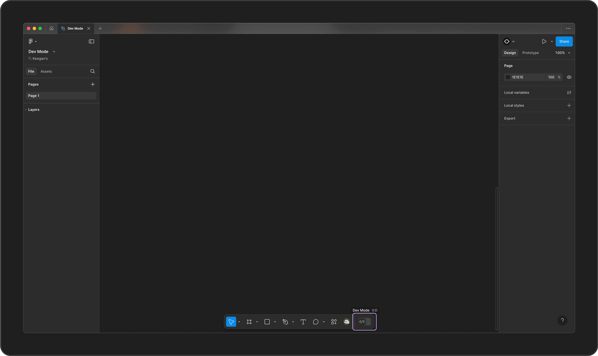
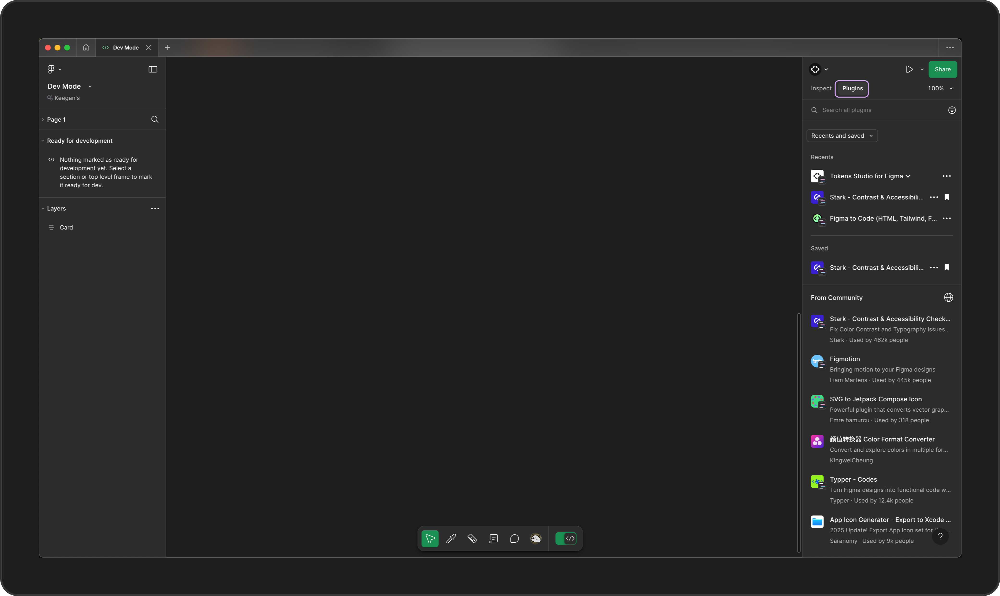
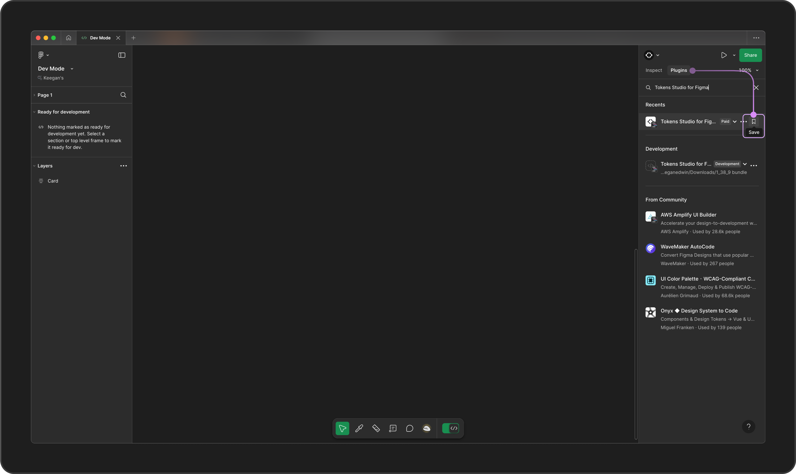
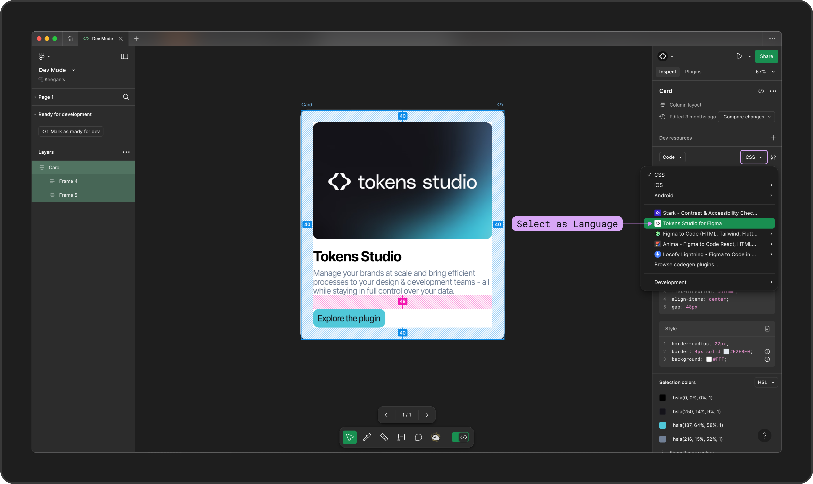
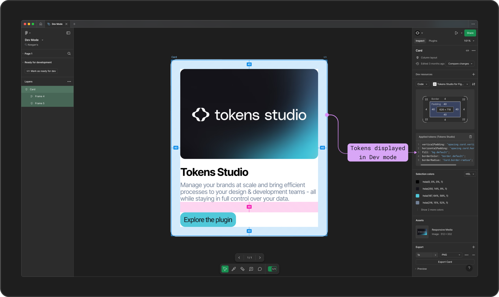
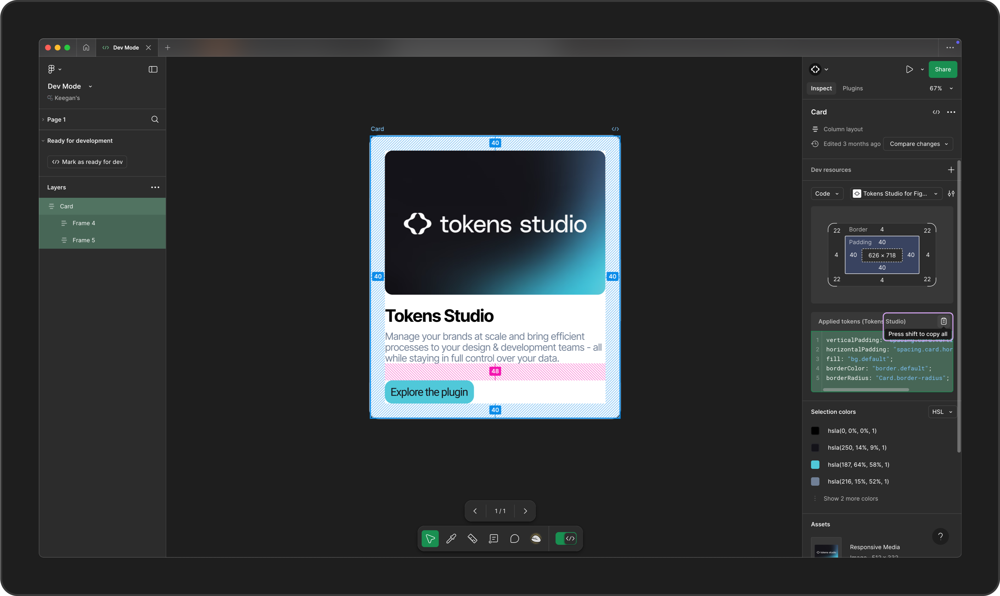

# Dev Mode in Figma

## Dev Mode in Figma

Tokens Studio for Figma is integrated with Figma's [Dev Mode](https://www.figma.com/dev-mode/), allowing developers to view and copy the names of Design Tokens applied with the Tokens Studio Plugin.&#x20;

[→ Read Figma's guide on Dev Mode for more details on this feature and their licence requirements.](https://help.figma.com/hc/en-us/articles/15023124644247-Guide-to-Dev-Mode)

Once the Plugin is connected to your Dev Mode account, you can select `Tokens Studio` as a programming language option to view the data from the Plugin attached to the layers you are currently inspecting in Dev Mode.&#x20;


This setting is saved to your Figma user account.&#x20;

This means each person on your team using Dev Mode will need to enable the Plugin from their individual Figma account.&#x20;


### Add Tokens Studio to Dev Mode

From any Figma file, toggle to Dev Mode using the action at the bottom toolbar or use the keyboard shortcut shift + D.

<figure><figcaption>
A Figma file shows the Dev Mode button annotated at the bottom center of the screenshot. 
</figcaption></figure>

From the Dev Mode panel, select the plugin tab on the top right of the Figma UI.&#x20;

<figure><figcaption>
A Figma file in Dev Mode is shown with the Plugin Tab annotated at the top right of the screenshot. 
</figcaption></figure>

Use the search feature (underneath the Plugin tab) to look for `Tokens Studio for Figma`.

Select the icon button with the ribbon symbol on the right side of the Plugin name to save it to your Figma account.&#x20;

<figure><figcaption>
A Figma file in Dev Mode is shown with the Plugin Tab annotated at the top right of the screenshot. The words "tokens studio for figma" are entered in the search input, and the ribbon symbol icon button with the label "save" is annotated.  
</figcaption></figure>

### Viewing Tokens Studio Data in Dev Mode

Once the Plugin has been saved to your Dev Mode account, you can view Design Tokens applied to design elements by the Tokens Studio Plugin.&#x20;

\
From any Figma file, toggle to Dev Mode using the action at the bottom toolbar or use the keyboard shortcut shift + D.

* Navigate to the Inspect Tab in Dev Mode.&#x20;
* Find the Programming Language selector and choose `Tokens Studio`.

<figure><figcaption>
A Figma file in Dev Mode is shown with on the Inspect Tab, located at the top right of the screenshot. The programming language select input is open, with Tokens Studio for Figma as the new option is highlighted. 
</figcaption></figure>

On the Figma canvas, select the specific layer you'd like to view.&#x20;

The names of any Tokens applied to that layer with the plugin will appear in the Dev Mode panel where code is displayed.&#x20;


Figma can only show Tokens applied to one layer at a time. \
To view any Tokens applied to children layers, you need to select those layers individually.&#x20;


<figure><figcaption>
A Figma file in Dev Mode is shown with on the Inspect Tab, located at the top right of the screenshot. The programming language is set to Tokens Studio for Figma. A card component has been selected on the Figma canvas, and several design token names appear next to the properties in the code display pannel on the right of the interface. 
</figcaption></figure>

If desired, you can use Figma's copy button to capture all Token Names appearing in Dev Mode to your clipboard to you can paste them elsewhere.

<figure><figcaption>
A Figma file in Dev Mode is shown with on the Inspect Tab, located at the top right of the screenshot. The programming language is set to Tokens Studio for Figma. A card component has been selected on the Figma canvas, and several design token names appear next to the properties in the code display pannel on the right of the interface. The copy code action is annotated. 
</figcaption></figure>

***

### Resources

Mentioned in this guide:

* Figma Learn - [Guide to Dev Mode](https://help.figma.com/hc/en-us/articles/15023124644247-Guide-to-Dev-Mode)

#### Community resources:

* None yet!



#### Known issues and bugs

Tokens Studio Plugin GitHub - [Open issues for Figma Dev Mode](https://github.com/tokens-studio/figma-plugin/labels/Figma%20dev%20mode)



#### Requests, roadmap and changelog

* Enhance data in Dev Mode - [Feature Request](https://feedback.tokens.studio/p/enhance-data-in-dev-mode)


