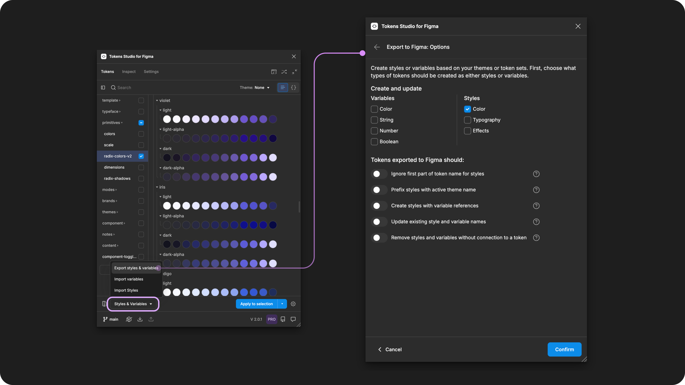

# Export to Figma Guide

## Export to Figma guide

As of the plugin's V2 launch, we are happy to support 21 unique Token Types that can be exported to Figma as Styles or Variables.

The **Export** feature creates and updates Styles or Variables attached to the Tokens with the same name in the plugin. This allows Tokens Studio to be the single place to manage design Tokens, Styles, and Variables in Figma.

Each time you Export to Figma, you choose:

* The type of Style or Variables to export.
* Which Themes or Token Sets are included in the export.

### Supported Token Types

You may select the name of the **Token Type** below to learn more about that token type or keep reading to learn more about Exporting to Figma.&#x20;

<table><thead><tr><th>Token Type</th><th width="152">Variable Type</th><th width="129">Style Type</th><th>Notes</th></tr></thead><tbody><tr><td><a href="../../manage-tokens/token-types/boolean.md">Boolean</a></td><td>Boolean</td><td>none</td><td>Controls layer visibility, not component properties.</td></tr><tr><td><a href="../../manage-tokens/token-types/text.md">Text</a></td><td>String</td><td>none</td><td>Replaces placeholder text when applied to text layers.</td></tr><tr><td><a href="../../manage-tokens/token-types/color/">Color</a></td><td>Color</td><td>Color</td><td>Variables referenced in the style value is possible.</td></tr><tr><td><a href="../../manage-tokens/token-types/color/gradient.md">Color - Gradient</a></td><td>none</td><td>Color</td><td>Variables referenced in the style value is possible.</td></tr><tr><td><a href="../../manage-tokens/token-types/color/modified.md">Color - Modified (pro)</a></td><td>Color</td><td>Color</td><td>Modified colors won't show their references in variables.</td></tr><tr><td><a href="../../manage-tokens/token-types/opacity.md">Opacity</a></td><td>Number</td><td>none</td><td>Controls layer visibility applied as a number variable.</td></tr><tr><td><a href="../../manage-tokens/token-types/dimension/">Dimension</a></td><td>Number</td><td>none</td><td>Converted to a unitless number. Rem units are converted to pixel equivalent.</td></tr><tr><td><a href="../../manage-tokens/token-types/number.md">Number</a> </td><td>Number</td><td>none</td><td>If units are added to the token there are unexpected results (known issue).</td></tr><tr><td><a href="../../manage-tokens/token-types/dimension/spacing.md">Spacing</a></td><td>Number</td><td>none</td><td>If units are added to the token, the unit will be dropped.</td></tr><tr><td><a href="../../manage-tokens/token-types/dimension/sizing.md">Sizing</a></td><td>Number</td><td>none</td><td>If units are added to the token, the unit will be dropped.</td></tr><tr><td><a href="../../manage-tokens/token-types/dimension/border-width.md">Border Width</a></td><td>Number</td><td>none</td><td>If units are added to the token, the unit will be dropped.</td></tr><tr><td><a href="../../manage-tokens/token-types/dimension/border-radius.md">Border Radius</a></td><td>Number</td><td>none</td><td>If units are added to the token, the unit will be dropped.</td></tr><tr><td><a href="../../manage-tokens/token-types/border.md">Border (composite)</a></td><td>none</td><td>none</td><td>Variables referenced in the token value will appear for color and border-width properties.</td></tr><tr><td><a href="../../manage-tokens/token-types/box-shadow.md">Box Shadow (composite)</a></td><td>none</td><td>effect</td><td>Variables referenced in the token value will appear for color and dimension properties.</td></tr><tr><td><a href="../../manage-tokens/token-types/typography/">Typography (composite)</a></td><td>none</td><td>text</td><td>Variables referenced in the token value will appear in the text style for available properties.  The 'particle' Tokens will be exported as variables according to their token type.</td></tr><tr><td><a href="../../manage-tokens/token-types/typography/font-family.md">Font Family</a></td><td>String</td><td>none</td><td>Exported as a part of the Text style created by the Typography Token (composite).</td></tr><tr><td><a href="../../manage-tokens/token-types/typography/font-weight.md">Font Weight</a></td><td>String / Number</td><td>none</td><td>Exported as a part of the Text style created by the Typography Token (composite).</td></tr><tr><td><a href="../../manage-tokens/token-types/typography/font-size.md">Font Size</a></td><td>Number</td><td>none </td><td>Exported as a part of the Text style created by the Typography Token (composite).</td></tr><tr><td><a href="../../manage-tokens/token-types/typography/line-height.md">Line Height</a></td><td>Number</td><td>none </td><td>Exported as a part of the Text style created by the Typography Token (composite).</td></tr><tr><td><a href="../../manage-tokens/token-types/typography/letter-spacing.md">Letter Spacing</a></td><td>Number</td><td>none </td><td>Exported as a part of the Text style created by the Typography Token (composite).</td></tr><tr><td><a href="../../manage-tokens/token-types/typography/paragraph-spacing.md">Paragraph Spacing</a></td><td>Number</td><td>none </td><td>Exported as a part of the Text style created by the Typography Token (composite).</td></tr><tr><td><a href="../../manage-tokens/token-types/typography/text-case.md">Text Case</a></td><td>none</td><td>none</td><td>Exported as a part of the Text style created by the Typography Token (composite).</td></tr><tr><td><a href="../../manage-tokens/token-types/typography/text-decoration.md">Text Decoration</a></td><td>none</td><td>none</td><td>Exported as a part of the Text style created by the Typography Token (composite).</td></tr></tbody></table>

### How it works

Once you have created your Tokens in the plugin, select the **Styles & Variables Button** from the Tokens page to open the menu.

* Select **Export styles & variables**.
* Review the **Export to Figma Options** and select your configuration based on your desired task.
* Choose to Export as **Themes** or **Token Sets**
  * Select which Theme or Sets to export
* Confirm and complete the export.

<figure><figcaption>
Select the Export Styles and Variables from the Tokens page to configure the Options. 
</figcaption></figure>

### Export to Figma options

<figure><figcaption>
The Export to Figma Options menu is annotated to match the descriptions below.
</figcaption></figure>

The **Export to Figma options** allow you to make some key configurations:

1. Export your Tokens as Variables, Styles or both.
   * Define which types of variables you want to export.
2. Choose any Style specific settings.
   * Style name modifications.
   * Style values with variable references.
3. Choose any update-specific settings.
   * Token name changes.
   * Remove styles and variables no longer connected to a token.

→[ Read the Export to Figma Options guide for details and troubleshooting tips](options.md)

### Choose to export from Themes or Token Sets

Depending on your Tokens Studio licence and your Token Structure, you can choose to export to Figma connected to Themes or Token Sets.

<figure><figcaption>
Once you've confirmed your Export Options, the Plugin brings you the place where you select which Tokens to export.
</figcaption></figure>

**Themes (pro)**

* Exports your selected Themes to Variables with multiple modes within a collection.
* Maintains a connection with exported Styles and Variables for seamless updates.
  * Across multiple Figma files if desired.
* Requires a pro licence for Tokens Studio

→ [Read the Export to Figma from Themes guide for detailed instructions. ](themes.md)

**Token Sets**

* Exports your selected Token Set to Variables as a separate collections
  * Multiple modes are not supported.
* Tokens aren't always connected to the Styles and Variables created from Token Sets.
  * When you update your Tokens, you may have to replace existing Styles and Variables.

→ [Read the Export to Figma from Token Sets guide for detailed instructions.](token-sets.md)

Once you've confirmed your selection, the Styles or Variables you selected will be **Exported to Figma**.

***

### Skipped Tokens

There are some exceptions where the plugin has to 'skip' exporting some of your Tokens to variables.

→ [Read the Skipped Variables guide for more details. ](variables-skipped.md)

### Styles with Variable references

The plugin supports **Styles with Variable references**. This allows you to create Color, Text, and Effect Styles with values connected to Variables, all powered by your Design Tokens.

This workflow requires a few steps to get started.

→ [Read the Styles with Variable References guide for detailed instructions.](styles-variable-references.md)

***

### Resources

Figma resources:

* Design in Figma - [Overview of Variable Collections and Modes](https://help.figma.com/hc/en-us/articles/14506821864087-Overview-of-variables-collections-and-modes)

#### Community resources:

* The Tokens Studio collection of Variable videos - [YouTube Playlist](https://youtube.com/playlist?list=PL-QzDOr0R7mOv7xV9NO2Z15n6uwWHfFul\&si=um4MybodvHCfBUbo)
* Our friends at [UI Collective](https://uicollective.co/designer-tools-and-resources) have free learning resources on Variables - [YouTube Playlist](https://www.youtube.com/playlist?list=PLkmvmF0zhgT_-dXmw8DWMV85MK5rkv135)



#### Known issues and bugs

* Tokens Studio Plugin GitHub - \[Open issues for Figma export]\(Tokens Studio Plugin GitHub - [Open issues for Figma export](https://github.com/tokens-studio/figma-plugin/labels/Figma%20export))



#### Requests, roadmap and changelog

* Add support for scoping and publishing variables and styles - [Feature Request](https://feedback.tokens.studio/p/add-support-for-scoping-and-publishing-variables-and-styles)
* Ignore parts of the token name for variables and styles - [Feature Request](https://feedback.tokens.studio/p/ignore-parts-of-the-token-name-for-variables)
* Theme Switcher for non-DS designers so I don't need variables anymore - [Feature Request](https://feedback.tokens.studio/p/theme-switcher-for-non-ds-designers)
* Tokens applied with Figma UI as Styles or Variables are Fragile - [Feature Request](https://feedback.tokens.studio/p/tokens-applied-as-variables-or-styles-are-fragile)
* Create Variable Collections With The Plugin's Order of Themes - [Feature Request (blocked by Figma)](https://feedback.tokens.studio/p/create-variable-collections-with-the-plugins-order)
* Show updated number of Variables (or styles) when exporting to Figma with updated values - [Feature Request](https://feedback.tokens.studio/p/twistedrightwardsarrows-show-updated-number-when-exporting-variables-with-updated-values)


