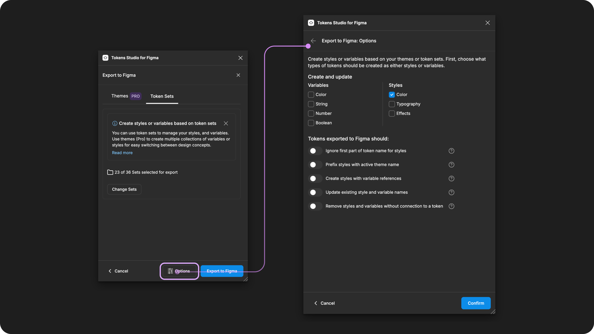
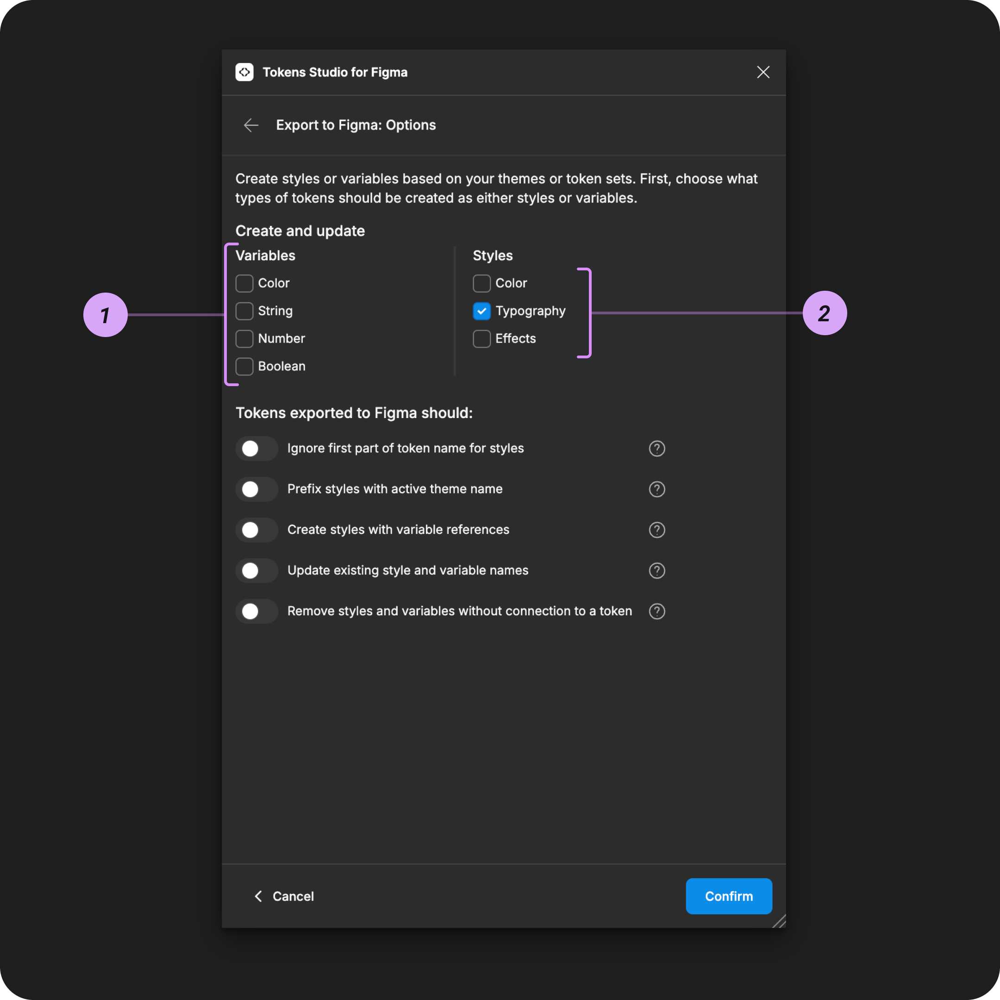
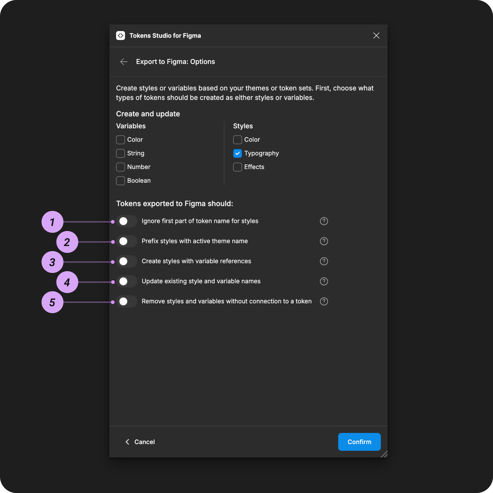

# Export Options

## Export to Figma Options

The Export to Figma Options menu has important settings for creating or updating Styles and Variables connected to your Tokens.

### In the plugin

Select the Styles & Variables Button from the Tokens page and choose Export Styles & Variables.

The Export to Figma Options menu is the first screen in the flow.

<figure><figcaption>
Select the Export Styles and Variables from the Tokens page to configure the Options. 
</figcaption></figure>


You can open the menu at anytime using the Options button at the bottom of the Export to Figma modal.


<figure><figcaption>
The Options button at the bottom of the Export to Figma screen is highlighted. Press it anytime to view or edit your Options. 
</figcaption></figure>

***

### Variable and Style type options

You select which type of Variables and/or Styles you want to export each time you use this feature.

This granular control allows you export a selection of your Tokens as Variables (for example, brand colors) in one step, then repeat the process to export a different selection of Tokens as styles (for example, brand Typography)

Or perhaps you are working on a new project, and your Color design decisions are ready to export, but your Typography is not.

<figure><figcaption>
The Export to Figma Options menu is annotated to match the descriptions below.
</figcaption></figure>


For the export to be successful, the Variable and Style types you select must be compatible with your Token Types.

[→ Read the Export to Figma overview for a list of Token Types and their compatible Variable types. ](./)


#### 1. Variable type options

Color - Creates [Color Tokens](../../manage-tokens/token-types/color/) as Color Variables&#x20;

String - Creates [Text](../../manage-tokens/token-types/text.md), [Font Family](../../manage-tokens/token-types/typography/font-family.md) and [Font Weight](../../manage-tokens/token-types/typography/font-weight.md) Tokens as String Variables

Number - Creates [Dimension](../../manage-tokens/token-types/dimension/), [Number](../../manage-tokens/token-types/number.md), [Spacing](../../manage-tokens/token-types/dimension/spacing.md), [Sizing](../../manage-tokens/token-types/dimension/sizing.md), [Border Radius](../../manage-tokens/token-types/dimension/border-radius.md), [Border Width](../../manage-tokens/token-types/dimension/border-width.md), and [Opacity ](../../manage-tokens/token-types/opacity.md)Tokens as number Variables&#x20;

Boolean - Creates [Boolean Tokens](../../manage-tokens/token-types/boolean.md) as Boolean Variables

#### 2. Style type options

Color - Creates [Color Tokens](../../manage-tokens/token-types/color/) as Color Styles&#x20;

Typography - Creates [Typography Tokens ](../../manage-tokens/token-types/typography/)as Text Styles&#x20;

Effect - Creates [Box Shadow Tokens](../../manage-tokens/token-types/box-shadow.md) as Effect Styles


You can export different types of Tokens to Variables and Styles at the same time.&#x20;

`color`can not be exported to Variables and Styles at the same time as the Plugin won't know which property in Figma to attach the Tokens To.&#x20;


***

### Tokens exported to Figma should

The options under the `Tokens exported to Figma should` label perform additional functions while creating or updating the Variables and Styles types you've selected.

<figure><figcaption>
The Export to Figma Options menu is annotated to match the descriptions below.
</figcaption></figure>

#### 1. Ignore first part of Token Name for Styles

For Token Names that include groups, the `Ignore first part of Token name for Styles` option will export the Tokens as Styles with modified names.

This is helpful when your Token Names include prefixes intended for the Design System Team which are not helpful to see in Figma.

For example, a Token named `mode-colors.brand.primary.default`

With this option enabled will be created as a Style named: `brand.primary.default`


If your Token Names don't include any groups and you have this option enabled, the Token can't be exported, and you will see an error message from the plugin.\
\
"Some Styles were ignored due to Ignore first part of Token name setting"


For example, a Token named `mode-colors-brand-primary-default` will have the whole name ignored by the plugin, and the Style can't be created without a name.

[_→ Read the guide on Token Names with Groups for more detials._](../../manage-tokens/token-names/technical-specs.md#tokens-can-be-grouped-by-name)

#### 2. Prefix Styles with active Theme name (pro)

Recall that Tokens must have unique names, and a Token Name is the ID to the decision decision. That unique ID can be attached to a Style or a Variable in Figma.&#x20;

If you are using Themes (pro), you have multiple Tokens with the same name located in different Token Sets which are grouped into Themes.&#x20;

Multiple Tokens with the same name cannot be exported to the same Figma file as Styles as they will not have a unique ID,&#x20;

To solve this problem, this option creates a unique ID in Figma by adding the theme-name before the Token Name.&#x20;

For example, we may have a Theme Group called `color-modes` with a few themes called:

* `light`
* `dark`
* `high-contrast`

Each theme has a Token called `mode-colors.brand.primary.default` but a unique value. We can't export the same Token to Figma more than once.

So, if you want the color Styles for each theme exported to the same Figma file, you can enable the `Prefix Styles with the active theme name` setting.

In this example, you would need to **run the Export to Figma three times,** as each export will only prefix the active theme name.

* Export 1 - `Light theme` active
  * Return to the themes dropdown, turn this theme off, then repeat with the next theme.
* Export 2 - `Dark theme` active
  * Return to the themes dropdown, turn this theme off, then repeat with the next theme.
* Export 3 - `High-contrast theme` active

After the three exports, you would see Styles in Figma named (the plugin coverts your grouped named from periods to forward slash):

* `light/mode-colors/brand/primary/default`
* `dark/mode-colors/brand/primary/default`
* `high-contrast/mode-colors/brand/primary/default`

[→ Read the guide on Themes for more details](../../manage-themes/themes-overview.md)

#### 3. Create Styles with Variable references

This setting tells the plugin to connect newly exported Styles with previously created Variables.&#x20;

This is a multi-step process, detailed in it its own guide.&#x20;


[styles-variable-references.md](styles-variable-references.md)


#### 3. Update existing Style and Variable names

When you update the names of Tokens in the plugin that are currently attached to Styles and Variables in Figma, the `Update existing Style and Variable names` option ensures Figma will be updated with the new names.

_This option moved from the Plugin Settings Page with Version 2.0_

#### 5. Remove Styles and Variables without connection to a Token

When you remove Tokens in the plugin that are currently attached to Styles and Variables the `Remove Styles and Variables without connection to a Token` setting will delete those Styles and Variables from Figma.

_This option moved from the Plugin Settings Page with Version 2.0_


This option is destructive and can lead to unexpected results!&#x20;

It should only be used when you are certain you have Variables or Styles that need to be deleted from Figma.&#x20;


***

### Up Next - Export as Themes or Token Sets

Once you've configured and saved your Export Options, the plugin will bring you to the Export from Themes or Token Sets page.

<figure><figcaption>
Once you've confirmed your Export Options, the Plugin brings you the place where you select which Tokens to export.
</figcaption></figure>

_Select a card below to jump to the next Guide you are interested in._

<table data-view="cards"><thead><tr><th></th><th></th><th data-hidden data-card-cover data-type="files"></th><th data-hidden data-card-target data-type="content-ref"></th></tr></thead><tbody><tr><td>Export as Themes</td><td>If you have a Pro licence for Tokens Studio</td><td><a href="../../.gitbook/assets/card-header-figma-export-themes.png">card-header-figma-export-themes.png</a></td><td><a href="themes.md">themes.md</a></td></tr><tr><td>Export as Token Sets</td><td>If you have a Free licence for Tokens Studio</td><td><a href="../../.gitbook/assets/card-header-figma-export-sets.png">card-header-figma-export-sets.png</a></td><td><a href="token-sets.md">token-sets.md</a></td></tr><tr><td>Skipped Variables</td><td>Sometimes, the plugin skips exporting your Tokens to Figma even when you have the desired options configured correctly.</td><td><a href="../../.gitbook/assets/card-header-figma-variables-skipped.png">card-header-figma-variables-skipped.png</a></td><td></td></tr><tr><td>Styles with Variable References</td><td>Details the steps to use this option with Color, Typography or Box Shadow Tokens.</td><td><a href="../../.gitbook/assets/card-header-figma-styles-var-references.png">card-header-figma-styles-var-references.png</a></td><td><a href="styles-variable-references.md">styles-variable-references.md</a></td></tr></tbody></table>

***

### Resources

Figma resources:

* Design in Figma - [Overview of Variable Collections and Modes](https://help.figma.com/hc/en-us/articles/14506821864087-Overview-of-variables-collections-and-modes)

#### Community resources:

* The Tokens Studio collection of Variable videos - [YouTube Playlist](https://youtube.com/playlist?list=PL-QzDOr0R7mOv7xV9NO2Z15n6uwWHfFul\&si=um4MybodvHCfBUbo)
* Our friends at [UI Collective](https://uicollective.co/designer-tools-and-resources) have free learning resources on Variables - [YouTube Playlist](https://www.youtube.com/playlist?list=PLkmvmF0zhgT_-dXmw8DWMV85MK5rkv135)



#### Known issues and bugs

* Tokens Studio Plugin GitHub - [Open issues for Figma export options menu](https://github.com/tokens-studio/figma-plugin/labels/Figma%20export%20options%20menu)
* Tokens Studio Plugin GitHub - [Open issues for setting ignore first part of name](https://github.com/tokens-studio/figma-plugin/labels/setting%20-%20ignore%20first%20part%20of%20name)
* Tokens Studio Plugin GitHub - [Open issues for setting prefix theme name](https://github.com/tokens-studio/figma-plugin/labels/setting%20export%20-%20prefix%20theme%20name)
* Tokens Studio Plugin GitHub - [Open issues for update existing name styles variables](https://github.com/tokens-studio/figma-plugin/labels/setting%20export%20update%20existing%20name)
* Tokens Studio Plugin GitHub - [Open issues for remove styles and variables without connection](https://github.com/tokens-studio/figma-plugin/labels/setting%20export%20-%20remove%20styles%20var%20wo%20connection)
* Tokens Studio Plugin GitHub - [Open issues for Figma Variables](https://github.com/tokens-studio/figma-plugin/labels/Figma%20variables)
* Tokens Studio Plugin GitHub - [Open issues for Figma Styles](https://github.com/tokens-studio/figma-plugin/labels/Figma%20styles)



#### Requests, roadmap and changelog

* Add support for scoping and publishing variables and styles - [Feature Request](https://feedback.tokens.studio/p/add-support-for-scoping-and-publishing-variables-and-styles)
* Ignore parts of the token name for variables and styles - [Feature Request](https://feedback.tokens.studio/p/ignore-parts-of-the-token-name-for-variables)
* Theme Switcher for non-DS designers so I don't need variables anymore - [Feature Request](https://feedback.tokens.studio/p/theme-switcher-for-non-ds-designers)
* Tokens applied with Figma UI as Styles or Variables are Fragile - [Feature Request](https://feedback.tokens.studio/p/tokens-applied-as-variables-or-styles-are-fragile)
* Create Variable Collections With The Plugin's Order of Themes - [Feature Request (blocked by Figma)](https://feedback.tokens.studio/p/create-variable-collections-with-the-plugins-order)
* Show updated number of Variables (or styles) when exporting to Figma with updated values - [Feature Request](https://feedback.tokens.studio/p/twistedrightwardsarrows-show-updated-number-when-exporting-variables-with-updated-values)


