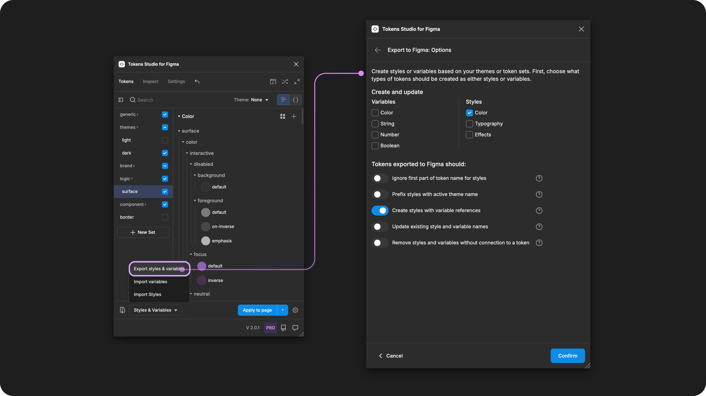

# Styles with Variable References

## Styles with Variable References

For the Figma Styles which support Variable values, you can create and manage Styles with Variables references attached to your Design Tokens using the Tokens Studio Plugin for Figma.&#x20;

This allows you to take advantage of the workflow benefits of working with Tokens Studio in Figma while sharing Styles and Variables with consumers of your Figma libraries.

_If this is your first time Exporting to Figma, you'll want to get familiar with the basics of the process, then come back to this guide._


[.](./)


***

### How it works&#x20;

This is a multi-step process that involves a bit of prep work to allow the Plugin to attach your Tokens to the right features in Figma.&#x20;

1. [Token setup in the Plugin.](styles-variable-references.md#id-1.-token-setup)
2. [Create the Variables connected to the Tokens being referenced in the Styles. ](styles-variable-references.md#id-2.-create-the-variables-being-referenced)
3. [Create the Styles. ](styles-variable-references.md#id-3.-export-your-tokens)
4. [Troubleshooting](styles-variable-references.md#id-4.-troubleshooting)

Each Token Type that supports Styles with Variable References, specific steps are included in its guide. However, the steps below outline the basics of how tis feature works.&#x20;

<table data-view="cards"><thead><tr><th></th><th></th><th data-hidden data-card-cover data-type="files"></th><th data-hidden data-card-target data-type="content-ref"></th></tr></thead><tbody><tr><td>Color Tokens</td><td>Can be exported as Color Styles.</td><td><a href="../../.gitbook/assets/card-header-token-type-color.png">card-header-token-type-color.png</a></td><td><a href="../../manage-tokens/token-types/color/#color-styles-in-figma">#color-styles-in-figma</a></td></tr><tr><td>Typography Tokens</td><td>Can be exported as Text Styles</td><td><a href="../../.gitbook/assets/card-header-token-type-typography.png">card-header-token-type-typography.png</a></td><td><a href="../../manage-tokens/token-types/typography/#text-styles-in-figma">#text-styles-in-figma</a></td></tr><tr><td>Box Shadow Tokens</td><td>Can be exported as Effect Styles</td><td><a href="../../.gitbook/assets/card-header-token-type-box-shadow.png">card-header-token-type-box-shadow.png</a></td><td><a href="../../manage-tokens/token-types/box-shadow.md#effect-styles-in-figma">#effect-styles-in-figma</a></td></tr></tbody></table>

### 1. Token setup

Before you export your desired Tokens to Figma as Styles, ensure your Tokens have been created with Values that reference another token.

It's important that the Tokens being referenced as the value have a unique name from the Token being exported as Styles.&#x20;

[→ Read the Token Values with References guide for more details](../../manage-tokens/token-values/references.md)


For Color Styles, you may need to split the Tokens being exported as Styles in a separate Token Set from the Tokens referenced in the value which are to be exported as Variables as the Plugin only supports exporting entire Sets or Themes to Figma.&#x20;


### 2. Create the Variables being referenced.

If you haven't already, complete the Export to Figma as Variables process for the Tokens being referenced as the values of the Tokens you want to export as Styles.


[.](./)


Pay close attention to your [Export Options](options.md) and ensure the Tokens you want to export as Styles are NOT exported as Variables.

<figure><figcaption>
Select the Export Styles and Variables from the Tokens page to configure the Options. Be sure the Variable types are selected and no Styles are selected. 
</figcaption></figure>


The plugin can only attach a Token by name to a Style or Variable, not both.

If needed, delete and detach any Variables you want to be created as styles.

[→ Jump to the Detach Styles and Variables guide for more details](../../manage-themes/detach-styles-variables.md)


[→ If your Variables live in a different Figma file, you may want to check out the Non-Local Variables guide for those specific steps. ](../non-local-files.md)

### 3. Create the Styles

In order for the plugin to attach your Styles to the Variables you created, you may have to configure the  status of Token Sets included in the export.&#x20;

The process is slightly different if you are Exporting from Themes or Token Sets.

<figure><figcaption>
Once you've confirmed your Export Options, the Plugin brings you the place where you select which Tokens to export.
</figcaption></figure>

### Export from Themes (pro)

If you are [Exporting your Tokens from Themes](themes.md), navigate to the **Themes feature** in the plugin.

* Open the Theme you want to Export as Styles
* Ensure your Theme configuration has:
  * Token Sets being Exported as Styles are `Enabled`.
  * Token Sets being referenced in their values may need to be set as `Reference only`
* Confirm and save the Theme configuration and close the Theme modal.

Open the **Export to Styles and Variables** modal and select your **Export Options**:

* The **Style Types** you want to create are selected (checkmark visible).
* The **Create Styles with Variable references** is selected (switch is on).
* Select **Confirm** to save your configuration and close this menu.
  * You can open this menu anytime using the **Options button** at the bottom of the **Export to Figma** modal.

<figure><figcaption>
Select the Export Styles and Variables from the Tokens page to configure the Options. Be sure the Toggle for <code>Create styles with variable references</code>is enabled. 
</figcaption></figure>

Select the **Themes** you want to Export as Styles.&#x20;

Ensure the themes you have exported as Variables are not selected.

<figure><figcaption>
After the Export Options are confirmed, all previously created Themes are displayed. In this example, only the  <code>mode/dark</code>Theme is selected (checkmark visible) for export. The Options button is highlighted to show how to open the menu. 
</figcaption></figure>

Check the newly created Styles.

* If the values are showing hard-coded values instead of your variables, don't worry!
  * There's a known issue with the plugin where occasionally it needs to create the styles before it can attach the Variable references.
* Repeat the Export to Styles flow again, and the plugin will be able to map your variables to your styles.

When you see the name of your Variables in the values of the Styles, the process is complete!

[↓ If you have unexpected results, read the Troubleshooting section below.](styles-variable-references.md#id-4.-troubleshooting)

### Export from Token Sets

If you are Exporting your Tokens from Token Sets, open the **Export to Styles and Variables** modal and select your **Export Options** to ensure:

* The **Style Types** you want to create are selected (checkmark visible).
* The **Create Styles with Variable references** is selected (switch is on).
* Select **Confirm** to save your configuration and close this menu.
  * You can open this menu anytime using the **Options button** at the bottom of the **Export to Figma** modal.

<figure><figcaption>
Select the Export Styles and Variables from the Tokens page to configure the Options. Be sure the Toggle for <code>Create styles with variable references</code>is enabled. 
</figcaption></figure>

From the **Token Sets** page, select the **Change Sets Button** to review your Token Set configuration.

Review your **Token Set** configuration:

* Token Sets being Exported as Styles are `Enabled`.
* Token Sets being referenced in their values may need to be set as `Reference only`.
* Save and confirm.
* Select the **Export to Figma** button

<figure><figcaption>
Pressing the Change Sets modal opens the list of all Sets. Adjusting the Set Status tells the plugin how to export the Tokens living within each set.
</figcaption></figure>

Check the newly created Styles.

* If the values are showing hard-coded values instead of your variables, don't worry!
  * There's a known issue with the plugin where, occasionally, it needs to create the styles before it can attach the Variable references.
* Repeat the Export to Styles flow again, and the plugin will be able to map your variables to your styles.

When you see the name of your Variables in the values of the Styles, the process is complete!

If you have unexpected results, read the Troubleshooting section below.

***

### 4. Troubleshooting

Here are the common issues you might run into the first couple of times you try this process.

#### Styles created with the correct values but not attached to Variables

If the Tokens you exported are created as styles with the correct value, but they are missing the connection to the attached Variable, the plugin is missing the information it needs to attach it to a variable.

Check your Token Values - [Step 1 Above ↑](styles-variable-references.md#id-1.-token-setup)

* Ensure the Tokens you Exported have values that are referencing existing Tokens.
  * Values are the name of a token inside curly brackets: `{token-name}`
* Ensure the Tokens being referenced have been created as Variables
  * If not:
    * Export to Figma as Variables for the Referenced Tokens so they are created
    * Then repeat the Export to Figma as Styles step above

Check your Export Options - [Step 3 Above ↑](styles-variable-references.md#id-3.-create-the-styles)

Ensure the **Create Styles with Variable references** option is enabled

#### Styles created with empty values

If the Tokens you exported were created as Styles, but the values are "empty", the plugin is missing the information it needs to populate the values.

Check your Theme and Token Set configuration outlined in [Step 3 Above ↑](styles-variable-references.md#id-3.-create-the-styles)

* Ensure the Token Sets containing the Tokens being referenced in the Values have a status of **enabled** or **reference only**.
* Ensure the Token Sets containing the Tokens being Exported as Styles have a status of **Enabled**

#### Styles created with partial values attached to Variables

If the Tokens you exported were created as Styles, but some of the values are hard-coded and others are referencing Variables, the plugin is missing a connection to some the Variables.

Check your Token Values and Token Types for compatibility as not all Token Values and Token Types are compatible with Variables.

→ [Read the Export to Figma Overview for a list of compatible Token Types](./)

→ [Read the Export to Figma Skipped Variables guide for reasons why certain Values may not be referenced properly. ](variables-skipped.md)

A common example is Typography Composite Tokens with `Percentage (%)` in their values for Line Height or Letter Spacing.

* The plugin will create the Text Style and show attached Variable references for most properties.
* The values with percentages will remain as hard-coded values because Figma does not support numeric values with units.

<figure><figcaption>
A Text Style created with Variable References from the Plugin will leave properties with percentage values attached to the Token value and not a Variable. The remaining text properties will be attached to Variables. 
</figcaption></figure>

Select a Token Type guide below for more details that are helpful in troubleshooting.

<table data-view="cards"><thead><tr><th></th><th></th><th data-hidden data-card-cover data-type="files"></th><th data-hidden data-card-target data-type="content-ref"></th></tr></thead><tbody><tr><td>Color Tokens</td><td>Specifics on exporting as Color Styles with Variable References.</td><td><a href="../../.gitbook/assets/card-header-token-type-color.png">card-header-token-type-color.png</a></td><td><a href="../../manage-tokens/token-types/color/#color-styles-in-figma">#color-styles-in-figma</a></td></tr><tr><td>Typography Tokens</td><td>Specifics on exporting as Text Styles with Variable References.</td><td><a href="../../.gitbook/assets/card-header-token-type-typography.png">card-header-token-type-typography.png</a></td><td><a href="../../manage-tokens/token-types/typography/#text-styles-in-figma">#text-styles-in-figma</a></td></tr><tr><td>Box Shadow Tokens</td><td>Specifics on exporting as Effects Styles with Variable References.</td><td><a href="../../.gitbook/assets/card-header-token-type-box-shadow.png">card-header-token-type-box-shadow.png</a></td><td><a href="../../manage-tokens/token-types/box-shadow.md#effect-styles-in-figma">#effect-styles-in-figma</a></td></tr><tr><td>Export to Figma Guide</td><td>A comprehensive list of Token Types and their compatible Variable Types.</td><td><a href="../../.gitbook/assets/page-header-figma-export-overview.png">page-header-figma-export-overview.png</a></td><td><a href="./">.</a></td></tr><tr><td>Skipped Variables</td><td>Detailed reasons why not all Tokens can be Exported as Variables.</td><td><a href="../../.gitbook/assets/card-header-figma-variables-skipped.png">card-header-figma-variables-skipped.png</a></td><td><a href="variables-skipped.md">variables-skipped.md</a></td></tr><tr><td>Export from Themes (pro)</td><td>Review the steps of Exporting to Figma from Themes.</td><td><a href="../../.gitbook/assets/card-header-figma-export-themes.png">card-header-figma-export-themes.png</a></td><td><a href="themes.md">themes.md</a></td></tr><tr><td>Export from Token Sets</td><td>Review the steps of Exporting to Figma from Token Sets.</td><td><a href="../../.gitbook/assets/card-header-figma-export-sets.png">card-header-figma-export-sets.png</a></td><td><a href="token-sets.md">token-sets.md</a></td></tr><tr><td>Export Options</td><td>Review what each Export Option does in detail. </td><td><a href="../../.gitbook/assets/page-header-figma-export-options.png">page-header-figma-export-options.png</a></td><td><a href="options.md">options.md</a></td></tr><tr><td>Non-local Variables and Styles.</td><td>Steps for when your Variables live in a different Figma file.</td><td><a href="../../.gitbook/assets/card-header-figma-files.png">card-header-figma-files.png</a></td><td></td></tr></tbody></table>

***

### Resources

Figma resources:

* Design in Figma - [Overview of Variable Collections and Modes](https://help.figma.com/hc/en-us/articles/14506821864087-Overview-of-variables-collections-and-modes)

#### Community resources:

* The Tokens Studio collection of Variable videos - [YouTube Playlist](https://youtube.com/playlist?list=PL-QzDOr0R7mOv7xV9NO2Z15n6uwWHfFul\&si=um4MybodvHCfBUbo)
* Our friends at [UI Collective](https://uicollective.co/designer-tools-and-resources) have free learning resources on Variables - [YouTube Playlist](https://www.youtube.com/playlist?list=PLkmvmF0zhgT_-dXmw8DWMV85MK5rkv135)



#### Known issues and bugs

* Tokens Studio Plugin GitHub - [Open issues Styles with Variable reference](https://github.com/tokens-studio/figma-plugin/labels/setting%20-%20create%20styles%20with%20variable%20references)
* Tokens Studio Plugin GitHub - [Open issues for Figma Variables](https://github.com/tokens-studio/figma-plugin/labels/Figma%20variables)
* Tokens Studio Plugin GitHub - [Open issues for Figma Styles](https://github.com/tokens-studio/figma-plugin/labels/Figma%20styles)



#### Requests, roadmap and changelog

* Add support for scoping and publishing variables and styles - [Feature Request](https://feedback.tokens.studio/p/add-support-for-scoping-and-publishing-variables-and-styles)
* Ignore parts of the token name for variables and styles - [Feature Request](https://feedback.tokens.studio/p/ignore-parts-of-the-token-name-for-variables)
* Theme Switcher for non-DS designers so I don't need variables anymore - [Feature Request](https://feedback.tokens.studio/p/theme-switcher-for-non-ds-designers)
* Tokens applied with Figma UI as Styles or Variables are Fragile - [Feature Request](https://feedback.tokens.studio/p/tokens-applied-as-variables-or-styles-are-fragile)
* Create Variable Collections With The Plugin's Order of Themes - [Feature Request (blocked by Figma)](https://feedback.tokens.studio/p/create-variable-collections-with-the-plugins-order)
* Show updated number of Variables (or styles) when exporting to Figma with updated values - [Feature Request](https://feedback.tokens.studio/p/twistedrightwardsarrows-show-updated-number-when-exporting-variables-with-updated-values)


