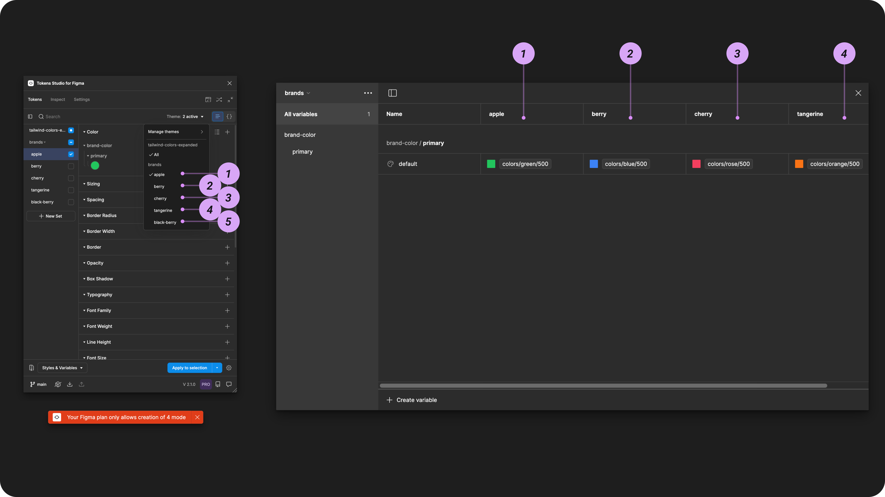

# Export Using Themes (pro)



Don't have a Pro Licence? You can still Export to Figma using Token Sets


[token-sets.md](token-sets.md)


## Export Using Themes (pro)

The [Themes (pro) feature](../../manage-themes/themes-overview.md) allows groups of Token Sets to work together to perform various tasks. When you attach your Tokens to Styles and Variables by Exporting to Figma from Themes, there are some powerful workflow advantages:

* Choose which Themes are attached to Styles and Variables.
  * Styles can have Variable references.
  * Variable collections with mode switching is supported.
* Separate Figma Files can have Styles and Variables attached to different Themes.
  * Also known as Non-local Variable references

### How it works

Once you have created your Themes (pro) in the plugin, select the Styles & Variables Button from the Tokens page.&#x20;

Choose the Export Styles & Variables option.

<figure><figcaption>
Select the Export Styles and Variables from the Tokens page to configure the Options. 
</figcaption></figure>

The **Export Options** menu will open and allow you to choose which actions the plugin should perform on the Tokens included in your export:

* Export your Tokens as Variables, Styles or both.
* Choose any Style export specific settings.
* Choose any update specific settings.

[_→ Jump to the Export to Figma Options guide for more details._ ](options.md)

Once you confirm your Options, you'll see the Export as Themes or Token Sets page.  If you have a Pro licence for Tokens Studio, you'll be brought directly to the Themes page.

The Themes page is is where you choose which Themes are included in your export.

<figure><figcaption>
After the Export Options are confirmed, all previously created Themes are displayed. In this example, only the <code>primitives-all</code>Theme is selected (checkmark visible) for export. The Options button is highlighted to show how to open the menu. 
</figcaption></figure>

If needed, you can review or modify your Options before you Export by selecting the Options button at the bottom of the plugin to open the menu.&#x20;

Once you select the Export to Figma button, the Plugin will apply your Export Options to all compatible Tokens included in the Export.&#x20;

#### Each Theme Group will be mapped to a Variable Collection

If you've selected to Export your Themes as Variables, each Theme Group is mapped to a Variable Collection with the same name.&#x20;

Each Theme within the Group is mapped to a Variable Mode with the same name.&#x20;

<figure><figcaption>
Figma Variable Collection beside the Themes Manager in the Plugin.  The numbered annotations show the Theme Group to Collection names. The lettered annotations show the Theme to Mode names. 
</figcaption></figure>

[_→ Jump to the Variables and Tokens Studio guide for more details on mapping._](../variables-overview.md)

***

### Select Themes to Export

The Export from Themes page will display a list of all Themes you've already created.&#x20;

If you don't see any Themes listed, (the example in the image below on the left) you'll need to create a Theme to complete the export.

<figure><figcaption>
The Export to Figma from Themes page in the plugin is shown with no Themes on the left, many themes on the right.
</figcaption></figure>

To select which Themes to include in the Export, select the checkmark to the left of the Theme name. By default, all checkmarks are selected to be included for export.

* Checkmark visible will be exported
* Empty checkbox will not be exported.&#x20;


Exporting as Styles?&#x20;

Try exporting one Theme at a time.

This reduces the complexity of the export and reduces unexpected results.


<figure><figcaption>
The Export to Figma from Themes page in the plugin is shown with all Themes selected for Export on the left and only the <code>primitives/all</code>Theme selected on the right.
</figcaption></figure>

If needed, you can review or modify your Options before you Export by selecting the Options button at the bottom of the plugin to open the menu.&#x20;

Once you select the Export to Figma button, the Plugin will apply your Export Options to all compatible Tokens included in the Export.&#x20;

***

### **Export as Variables feedback messages**

When exporting Variables, you'll see a feedback message at the bottom of your Figma file depending on your configuration.

* If you are creating new Collections of Variables or adding Variables within an existing collection, the message will show a count of what was created (right side of the image below).
* If you are updating existing Variables, the message will tell you that no Variables were created, but will not tell you that Variables were changed (left side of the image below).

<figure><figcaption>
Different status messages from the Plugin are shown when exporting as Variables. 
</figcaption></figure>

### Error messages

It's also common to see a red message at the bottom of your file, indicating an error in the export.

#### Your Figma plan only allows for the creation of 1 mode

`Your Figma plan only allows for the creation of 1 mode` message will appear if:

* You have a Free Figma plan.
* The Figma file is in your Drafts instead of a Project.&#x20;

The image below shows how to tell if your file is in your Drafts.

Move the file to a Figma project then Export to Figma as Variables again to create your other modes.

<figure><figcaption>
A common error message from the Plugin is shown in Figma, caused by where the Figma file is located.
</figcaption></figure>

#### Your Figma plan only allows the creation of 4 modes

`Your Figma plan only allows the creation of 4 modes` message will appear if you have 5 or more Themes within your Theme Group.&#x20;

The Plugin will export the first 4 Themes to your Variable collection (starting at the top of the Themes list) and skip the rest.

In the image below on the left, there are 5 Themes within the `brands` Theme Group, and on the right, the first 4 Themes have been created as modes within a Variable collection in Figma called `brands`.&#x20;

The 5th Theme in our list at the bottom called `black-berry` was not exported.

<figure><figcaption>
A common error message from the plugin is shown in Figma and is caused by mode limits on the Figma plan.
</figcaption></figure>

***

### Check your exported Styles and Variables

Once your Export has finished, check to ensure you have the output to Figma you expected. This depends on the combination of the Export Options and the Themes you selected to export.


Recall that each Export is limited to the Tokens in the Themes selected.&#x20;

This means you may have to repeat the Export to Figma process with different configurations to update all of your Styles and Variables.


If you have unexpected results, you can select a guide below for more details that are helpful in troubleshooting.

<table data-view="cards"><thead><tr><th></th><th></th><th data-hidden data-card-cover data-type="files"></th><th data-hidden data-card-target data-type="content-ref"></th></tr></thead><tbody><tr><td>Export to Figma Overview</td><td>Lists the compatible Token Types with Styles and Variables.</td><td><a href="../../.gitbook/assets/card-header-figma-export-overview.png">card-header-figma-export-overview.png</a></td><td><a href="./">.</a></td></tr><tr><td>Export to Figma Options</td><td>A detailed guide on each Export Option.</td><td><a href="../../.gitbook/assets/card-header-figma-export-options.png">card-header-figma-export-options.png</a></td><td><a href="options.md">options.md</a></td></tr><tr><td>Skipped Variables when Exporting to Figma</td><td>Reasons why some Tokens can't be exported.</td><td><a href="../../.gitbook/assets/card-header-figma-variables-skipped.png">card-header-figma-variables-skipped.png</a></td><td><a href="variables-skipped.md">variables-skipped.md</a></td></tr><tr><td>Themes (pro) </td><td>Provides tips on setting up Themes to help ensure references and resolved <strong>values are accurate</strong> on export.</td><td><a href="../../.gitbook/assets/card-header-themes-tsOnly.png">card-header-themes-tsOnly.png</a></td><td><a href="../../manage-themes/themes-overview.md">themes-overview.md</a></td></tr><tr><td>Export to Figma Styles with Variable references</td><td>Detailed guide on this multi-step process and the Token Types supported. </td><td><a href="../../.gitbook/assets/card-header-figma-styles-var-references.png">card-header-figma-styles-var-references.png</a></td><td><a href="styles-variable-references.md">styles-variable-references.md</a></td></tr><tr><td>Non-local Variables and Styles</td><td>Themes enables you to export Styles and Variables across multiple Figma files and retain their connected references.</td><td><a href="../../.gitbook/assets/card-header-figma-files.png">card-header-figma-files.png</a></td><td><a href="../non-local-files.md">non-local-files.md</a></td></tr><tr><td>Variables FAQs</td><td>Deep dive into how Variables and Tokens Studio work together in Figma. </td><td><a href="../../.gitbook/assets/card-header-figma-variables.png">card-header-figma-variables.png</a></td><td><a href="../variables-overview.md">variables-overview.md</a></td></tr><tr><td>Styles FAQs</td><td>Deep dive into how Styles and Tokens Studio work together in Figma. </td><td><a href="../../.gitbook/assets/card-header-figma-styles.png">card-header-figma-styles.png</a></td><td><a href="../styles-overview.md">styles-overview.md</a></td></tr></tbody></table>

***

### Resources

Figma resources:

* Design in Figma - [Overview of Variable Collections and Modes](https://help.figma.com/hc/en-us/articles/14506821864087-Overview-of-variables-collections-and-modes)

#### Community resources:

* The Tokens Studio collection of Variable videos - [YouTube Playlist](https://youtube.com/playlist?list=PL-QzDOr0R7mOv7xV9NO2Z15n6uwWHfFul\&si=um4MybodvHCfBUbo)
* Our friends at [UI Collective](https://uicollective.co/designer-tools-and-resources) have free learning resources on Variables - [YouTube Playlist](https://www.youtube.com/playlist?list=PLkmvmF0zhgT_-dXmw8DWMV85MK5rkv135)



#### Known issues and bugs

* Tokens Studio Plugin GitHub - [Open issues for Figma export - themes](https://github.com/tokens-studio/figma-plugin/labels/Figma%20export%20-%20themes)
* Tokens Studio Plugin GitHub - [Open issues for Figma Variables](https://github.com/tokens-studio/figma-plugin/labels/Figma%20variables)
* Tokens Studio Plugin GitHub - [Open issues for Figma Styles](https://github.com/tokens-studio/figma-plugin/labels/Figma%20styles)



#### Requests, roadmap and changelog

* Add support for scoping and publishing variables and styles - [Feature Request](https://feedback.tokens.studio/p/add-support-for-scoping-and-publishing-variables-and-styles)
* Ignore parts of the token name for variables and styles - [Feature Request](https://feedback.tokens.studio/p/ignore-parts-of-the-token-name-for-variables)
* Theme Switcher for non-DS designers so I don't need variables anymore - [Feature Request](https://feedback.tokens.studio/p/theme-switcher-for-non-ds-designers)
* Tokens applied with Figma UI as Styles or Variables are Fragile - [Feature Request](https://feedback.tokens.studio/p/tokens-applied-as-variables-or-styles-are-fragile)
* Create Variable Collections With The Plugin's Order of Themes - [Feature Request (blocked by Figma)](https://feedback.tokens.studio/p/create-variable-collections-with-the-plugins-order)
* Show updated number of Variables (or styles) when exporting to Figma with updated values - [Feature Request](https://feedback.tokens.studio/p/twistedrightwardsarrows-show-updated-number-when-exporting-variables-with-updated-values)


