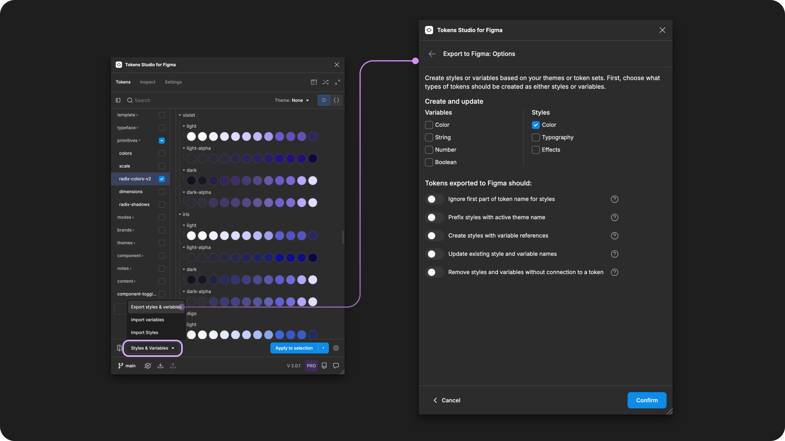
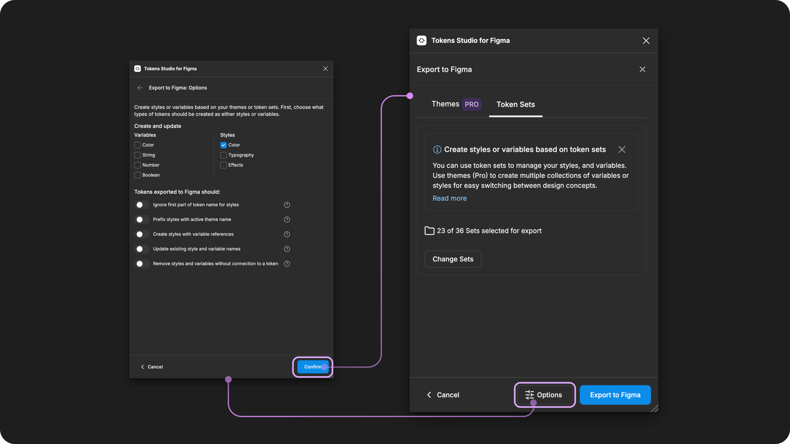
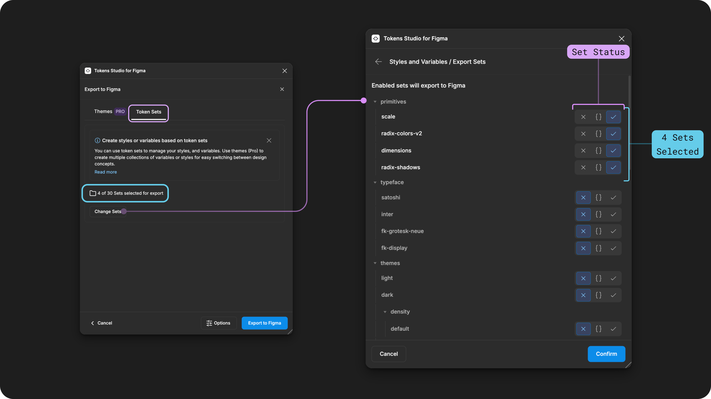
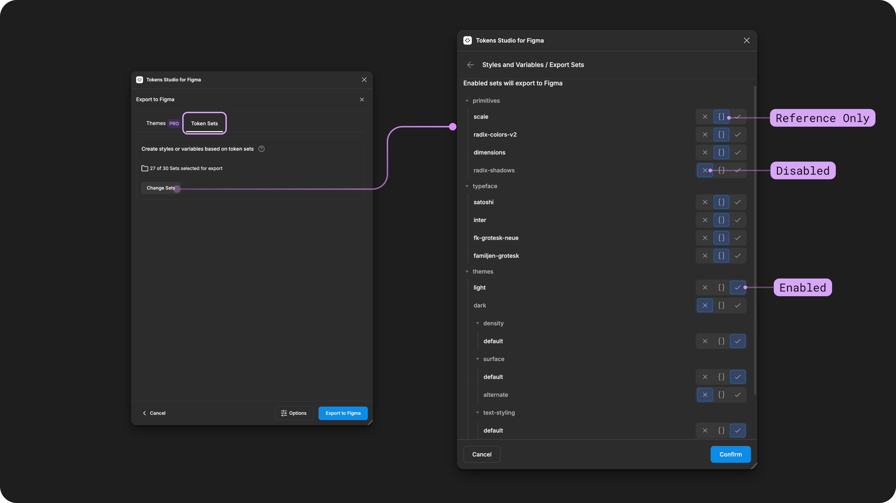
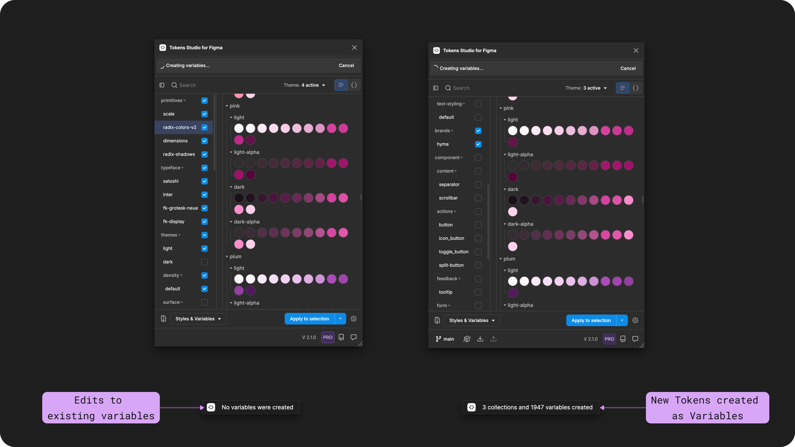

# Export Using Token Sets

## Export Using Token Sets

Free licence holders for Tokens Studio can attach their Tokens to Styles and Variables in Figma by Exporting to Figma from Token Sets.

This has some limited capabilities compared to when you Export to Figma from Themes (Pro).

* Create and maintain Styles and Variables in Figma powered by Token Sets in the plugin.
  * A Variable collection is created for each Token Set exported.
  * Creating modes within a Variable Collection is not possible when exporting from Token Sets.
* Choose which Token Sets are attached to Styles and Variables.
  * Styles can have Variable references.
* Local Styles and Variables supported (within the same Figma File).
  * `Non-local Variable references` are not possible when exporting from Token Sets.

[_→ Read the Export to Figma from Themes guide for more details on these features._ ](themes.md)

### How it works

Once you have created Tokens in the plugin, select the Styles & Variables Button from the Tokens page.&#x20;

Choose the Export Styles & Variables option.

<figure><figcaption>
Select the Export Styles and Variables from the Tokens page to configure the Options. 
</figcaption></figure>

The **Export Options** menu will open and allow you to choose which actions the plugin should perform on the Tokens included in your export:

* Export your Tokens as Variables, Styles or both.
* Choose any Style export specific settings.
* Choose any update specific settings.

[_→ Jump to the Export to Figma Options guide for more details._ ](options.md)

Once you confirm your Options, you'll see the Export as Themes or Token Sets page.  If you have a Free licence for Tokens Studio, you'll be brought directly to the TokenSets page.

The Token Sets page is is where you choose which Tokens are included in your export.

<figure><figcaption>
After the Export Options are confirmed, the number of Token Sets are displayed for Export. In this example, 23 of 36 Token Sets are selected for export. The Options button is highlighted to show how to open the menu as needed.
</figcaption></figure>

If needed, you can review or modify your Options before you Export by selecting the Options button at the bottom of the plugin to open the menu.&#x20;

Once you select the Export to Figma button, the Plugin will apply your Export Options to all compatible Tokens included in the Export.&#x20;

#### Each Token Set will be mapped to a Variable Collection

If you've selected to Export your Token Sets as Variables, each Token Set is mapped to a Variable Collection of the same name.&#x20;




The creation of Variable Modes within a Collection is only possible by [Exporting using Themes.](themes.md)&#x20;


[_→ Jump to the Variables and Tokens Studio guide for more details on mapping._](../variables-overview.md)

***

### Select Token Sets to Export

The Export from Token Sets page will display the Number of Token Sets selected for export.

By default, the number of Token Sets selected will match the configuration from the plugin's Tokens Page before you start the Export process.

* For example, if only the "Primitive" Token Set was `Enabled` with the checkmark visible next to the Token Set Name on the left side of the Tokens Page, the Export from Token Sets would say `1 of X Sets selected for export`.

Token Sets with a status of **Reference/Set as Source** are not included in the count.

Select the `change sets`button to adjust which Sets are selected for Export

#### Change Sets&#x20;

Select the Change Sets button to review and adjust your Token Set configuration. You will see a list of all Token Set Names you have already created and their Export status.

Adjust the status by changing the Toggle next to the Set Name.

<figure><figcaption>
When Exporting to Figma the Tokens Sets page on the left shows 4 of 30 Sets are selected to export. After pressing the Change Sets button, the screen on the right will open to allow changes to the Set Status to be made.
</figcaption></figure>

By changing the status of your Token Sets, you are telling the plugin which Tokens Sets should be included in the Export.

<figure><figcaption>
Pressing the Change Sets modal opens the list of all Sets. Adjusting the Set Status tells the plugin how to export the Tokens living within each set.
</figcaption></figure>



**Enabled Token Sets are exported**

Token Sets with the toggle active on the checkmark icon are `Enabled` and will be included in the Export.

These Tokens are created or updated as Styles and Variables, depending on your **Export Options**.



**Reference Token Sets are included in the export**

Token Sets with the toggle active on the curly bracket icon have the `Reference Only` status.

They are not directly exported, but this status reminds the Plugin that these token sets work together with the **Enabled Token Sets** and should be included in the export in a limited capacity.

* Changes to the values of Tokens in **Reference Only** sets are not updated during the export.
* Tokens added or removed in **Reference Only** sets are not updated during the export.

You can run a second **Export** with only these Token Sets as **Enabled** if you want to fully update Figma with changes you've made in the plugin.



**Disabled Token Sets are ignored**

Token Sets with the toggle active on the x icon have the `Disabled` status and will be ignored during the export status.

If Tokens were updated or new Tokens were added to these Tokens Sets, this information will not be passed on to Figma during the Export.



Once you have confirmed the Token Sets to be included in the Export, you'll return to the Export from Token Sets page.&#x20;

The count of how many Token Sets to be Exported should reflect the choices you made in the previous steps.

If needed, you can review or modify your Options before you Export by selecting the Options button at the bottom of the plugin to open the menu.&#x20;

Once you select the Export to Figma button, the Plugin will apply your Export Options to all compatible Tokens included in the Export.&#x20;

***

### **Export as Variables feedback messages**

When exporting Variables, you'll see a feedback message at the bottom of your Figma file depending on your configuration.

* If you are creating new Collections of Variables or adding Variables within an existing collection, the message will show a count of what was created (right side of the image below).
* If you are updating existing Variables, the message will tell you that no Variables were created, but will not tell you that Variables were changed (left side of the image below).

<figure><figcaption>
Different status messages from the Plugin are shown when exporting as Variables. 
</figcaption></figure>

### Error messages

It's also common to see a red message at the bottom of your file, indicating an error in the export.

#### Your Figma plan only allows for the creation of 1 mode

`Your Figma plan only allows for the creation of 1 mode` message will appear if:

* You have a Free Figma plan.
* The Figma file is in your Drafts instead of a Project.&#x20;

The image below shows how to tell if your file is in your Drafts.

Move the file to a Figma project then Export to Figma as Variables again to create your other modes.

<figure><figcaption>
A common error message from the Plugin is shown in Figma, caused by where the Figma file is located.
</figcaption></figure>

***

### Check your exported Styles and Variables

Once your Export has finished, check to ensure you have the output to Figma you expected. This depends on the combination of the Export Options and the Token Sets selected to export.


Recall that each export is limited to the Tokens included in the Sets selected for this Export.

This means you may have to repeat the Export to Figma process with different configurations to update your Styles and Variables completely.


If you have unexpected results, you can select a guide below for more details that are helpful in troubleshooting.

<table data-view="cards"><thead><tr><th></th><th></th><th data-hidden data-card-cover data-type="files"></th><th data-hidden data-card-target data-type="content-ref"></th></tr></thead><tbody><tr><td>Export to Figma Overview</td><td>Lists the compatible Token Types with Styles and Variables.</td><td><a href="../../.gitbook/assets/card-header-figma-export-overview.png">card-header-figma-export-overview.png</a></td><td><a href="./">.</a></td></tr><tr><td>Export to Figma Options</td><td>A detailed guide on each Export Option.</td><td><a href="../../.gitbook/assets/card-header-figma-export-options.png">card-header-figma-export-options.png</a></td><td><a href="options.md">options.md</a></td></tr><tr><td>Skipped Variables when Exporting to Figma</td><td>Reasons why some Tokens can't be exported.</td><td><a href="../../.gitbook/assets/card-header-figma-variables-skipped.png">card-header-figma-variables-skipped.png</a></td><td><a href="variables-skipped.md">variables-skipped.md</a></td></tr><tr><td>Export to Figma Styles with Variable references</td><td>Detailed guide on this multi-step process and the Token Types supported. </td><td><a href="../../.gitbook/assets/card-header-figma-styles-var-references.png">card-header-figma-styles-var-references.png</a></td><td><a href="styles-variable-references.md">styles-variable-references.md</a></td></tr><tr><td>Variables FAQs</td><td>Deep dive into how Variables and Tokens Studio work together in Figma. </td><td><a href="../../.gitbook/assets/card-header-figma-variables.png">card-header-figma-variables.png</a></td><td><a href="../variables-overview.md">variables-overview.md</a></td></tr><tr><td>Styles FAQs</td><td>Deep dive into how Styles and Tokens Studio work together in Figma. </td><td><a href="../../.gitbook/assets/page-header-figma-styles.png">page-header-figma-styles.png</a></td><td><a href="../styles-overview.md">styles-overview.md</a></td></tr></tbody></table>

***

### Resources

Figma resources:

* Design in Figma - [Overview of Variable Collections and Modes](https://help.figma.com/hc/en-us/articles/14506821864087-Overview-of-variables-collections-and-modes)

#### Community resources:

* The Tokens Studio collection of Variable videos - [YouTube Playlist](https://youtube.com/playlist?list=PL-QzDOr0R7mOv7xV9NO2Z15n6uwWHfFul\&si=um4MybodvHCfBUbo)
* Our friends at [UI Collective](https://uicollective.co/designer-tools-and-resources) have free learning resources on Variables - [YouTube Playlist](https://www.youtube.com/playlist?list=PLkmvmF0zhgT_-dXmw8DWMV85MK5rkv135)



#### Known issues and bugs

* Tokens Studio Plugin GitHub - [Open issues for Export as Token Sets](https://github.com/tokens-studio/figma-plugin/labels/Figma%20export%20-%20sets)
* Tokens Studio Plugin GitHub - [Open issues for Figma Variables](https://github.com/tokens-studio/figma-plugin/labels/Figma%20variables)
* Tokens Studio Plugin GitHub - [Open issues for Figma Styles](https://github.com/tokens-studio/figma-plugin/labels/Figma%20styles)



#### Requests, roadmap and changelog

* Add support for scoping and publishing variables and styles - [Feature Request](https://feedback.tokens.studio/p/add-support-for-scoping-and-publishing-variables-and-styles)
* Ignore parts of the token name for variables and styles - [Feature Request](https://feedback.tokens.studio/p/ignore-parts-of-the-token-name-for-variables)
* Theme Switcher for non-DS designers so I don't need variables anymore - [Feature Request](https://feedback.tokens.studio/p/theme-switcher-for-non-ds-designers)
* Tokens applied with Figma UI as Styles or Variables are Fragile - [Feature Request](https://feedback.tokens.studio/p/tokens-applied-as-variables-or-styles-are-fragile)
* Show updated number of Variables (or styles) when exporting to Figma with updated values - [Feature Request](https://feedback.tokens.studio/p/twistedrightwardsarrows-show-updated-number-when-exporting-variables-with-updated-values)



