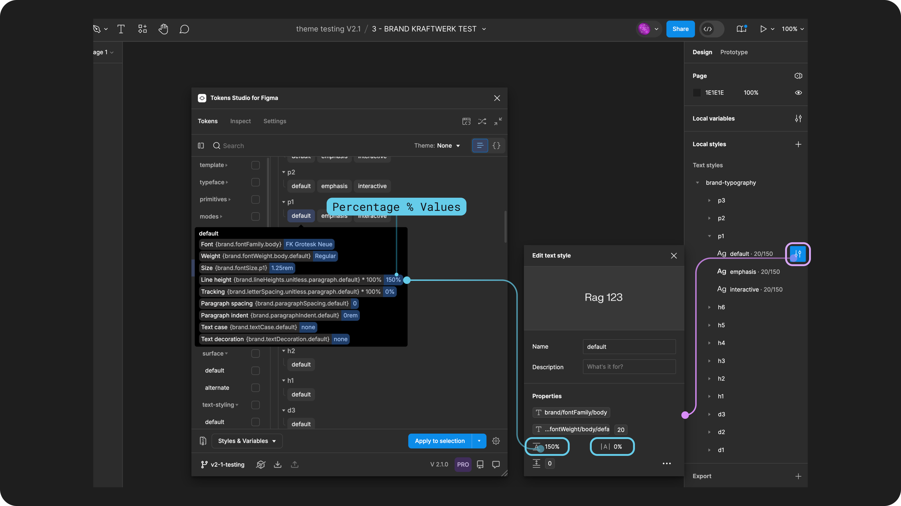
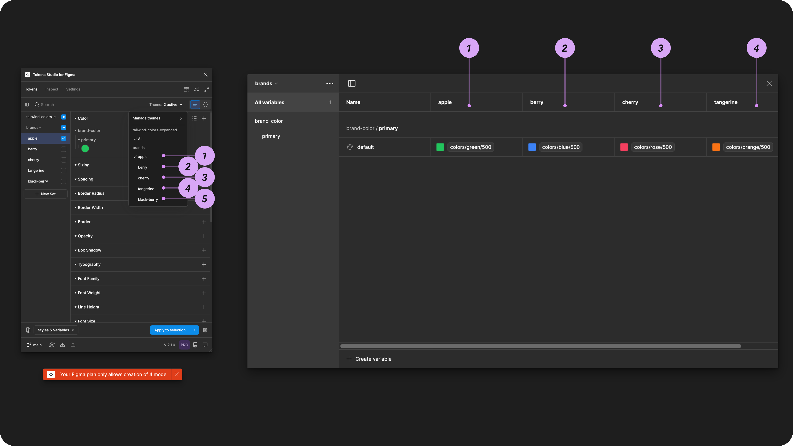
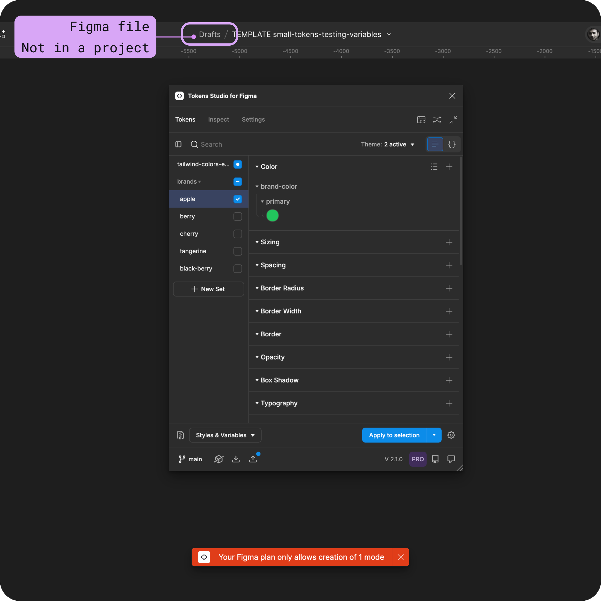

# Variables Skipped on Export

## Variables Skipped on Export

Tokens skipped when exporting as Variables When Exporting to Figma, the plugin sometimes can't create or update your Variables as expected.

Your Export to Figma Options configuration allows you to skip certain types of Variables if needed.

[→ Jump to the Export to Figma Options guide for more details](options.md)

However, there are three main reasons why the plugin will skip creating individual Variables when Exporting to Figma:

1. The Token Type isn't compatible with any Variable type.
2. The Token Value isn't supported in Variables.
3. You have exceeded the number of allowed variables.

***

### Token type isn't compatible

Figma only supports [4 types of Variables](https://help.figma.com/hc/en-us/articles/14506821864087-Overview-of-variables-collections-and-modes#h_01H9V3QSVH6TY6982N7YG6QS22), and Tokens Studio supports 24 unique Token Types in the plugin.

While we have figured out how to support most Tokens to Figma as Variables, these are the Token Types that will be skipped when you Export to Figma as Variables as there is no compatible Variable Type.&#x20;

* Asset Token
* Composition Token
* Other Token

[→ Read the Export to Figma Overview guide for a full list of Token Types and their compatible Variable Types ](./)

Composite Token Types will also be skipped as Figma only supports single value Tokens as Variables. However, they can be exported as Styles with Variable references where possible.&#x20;


[styles-variable-references.md](styles-variable-references.md)


Select the Token Type to jump to its guide and read the specific pro-tips on exporting as Styles with Variable references:

* [Box Shadow Token](../../manage-tokens/token-types/box-shadow.md#effect-styles-in-figma)
* [Color Tokens as Gradients](../../manage-tokens/token-types/color/gradient.md#color-styles-with-variable-references)
* [Border Token](../../manage-tokens/token-types/border.md#border-composite-token-type)
* [Typography Composite Tokens](../../manage-tokens/token-types/typography/#text-styles-in-figma)

### Multiple value Tokens

Figma only supports a single value for a variable.

This means if you have a Token with multiple values, like a **Color Token** with its value defined as a linear gradient, that Token can not be exported to Figma as a variable.

Tokens Studio supports multiple values for:

* **Color Tokens** as gradients ([which can be exported as color Styles with Variable References](../../manage-tokens/token-types/color/gradient.md#color-styles-with-variable-references))
* [Border Radius Tokens ](../../manage-tokens/token-types/dimension/border-radius.md#multiple-values)
* [Spacing Tokens ](../../manage-tokens/token-types/dimension/spacing.md#multiple-values)

### Value is "AUTO"

The `AUTO` value is used for Line Height Tokens and Typography Composite Tokens to match Figma's required string value.

The plugin isn't able to resolve the `AUTO` value but relies on Figma to apply the correct value based on the Font Size.

Figma only accepts numeric values for this property, and therefore, it is skipped when exporting as Variables.

* When you export as Text Styles, the `AUTO` value will be applied in Figma as expected.

→ [Read the Typography Line Heights guide for more details.](../../manage-tokens/token-types/typography/line-height.md#possible-values)

### Value contains a percentage (%)

Figma's Number Variables must be unitless.

The plugin will skip Tokens with `%` values that should be exported as Number Variables as it can't resolve the value and pass it over to Figma is a numeric value.

If the Token Type is `text` or `opacity`, those will be exported as those Variables support the percentage value.

<figure><figcaption>
A Text Style created with Variable References from the Plugin will leave properties with percentage values attached to the Token value and not a Variable. The remaining text properties will be attached to Variables. 
</figcaption></figure>

### More than 5000 variables in one collection

[Figma has a limit of 5000 variables per collection.](https://help.figma.com/hc/en-us/articles/14506821864087-Overview-of-variables-collections-and-modes)

If you export more than 5000 tokens as variables, we will create the first 5000 and skip the remaining Tokens.

* This size of the Variable library is bound to lead to memory issues, so you might want to split up your Tokens into multiple collections.

***

### Modes skipped

Each Figma plan allows for a different number of modes per Variable collection. → [Read their pricing plan for more details](https://www.figma.com/pricing/#features)

If you are exporting more **Themes** than you are allowed to have as modes in Figma, we will create as many as possible and then skip the remaining.

* In the plugin, under the **Themes dropdown**, you will see the list of **Themes** in each **Theme group**.
  * We will create as many as possible, starting at the top.

In the image below on the left, there are 5 **Themes** within the `brands` Theme Group, and on the right, the first 4 Themes have been created as modes within a Variable collection in Figma called `brands`. The 5th Theme in our list at the bottom called `black-berry` was not exported.

<figure><figcaption>
The plugin error appears after exporting to Variables with more Themes in a Group than Figma will allow.
</figcaption></figure>


Note that Figma doesn't allow Variable modes when a file isn't in a project


If you are on any paid plan and we aren't exporting your themes as expected, check to see if your **Figma file is in your drafts folder.**

The image below shows how to tell if your file is in your Drafts.

* Move the file to a Figma project then **Export to Figma as Variables** again to create your other modes.

<figure><figcaption>
The Figma UI shows the file location is in draft, which causes the Plugin to show an error message after exporting to Figma Variables.
</figcaption></figure>

***

### Resources

Figma resources:

* Design in Figma - [Overview of Variable Collections and Modes](https://help.figma.com/hc/en-us/articles/14506821864087-Overview-of-variables-collections-and-modes)

#### Community resources:

* The Tokens Studio collection of Variable videos - [YouTube Playlist](https://youtube.com/playlist?list=PL-QzDOr0R7mOv7xV9NO2Z15n6uwWHfFul\&si=um4MybodvHCfBUbo)
* Our friends at [UI Collective](https://uicollective.co/designer-tools-and-resources) have free learning resources on Variables - [YouTube Playlist](https://www.youtube.com/playlist?list=PLkmvmF0zhgT_-dXmw8DWMV85MK5rkv135)



#### Known issues and bugs

* Tokens Studio Plugin GitHub - [Open issues for Figma export](https://github.com/tokens-studio/figma-plugin/labels/Figma%20export)
* Tokens Studio Plugin GitHub - [Open issues for Figma Variables](https://github.com/tokens-studio/figma-plugin/labels/Figma%20variables)



#### Requests, roadmap and changelog

* Add support for scoping and publishing variables and styles - [Feature Request](https://feedback.tokens.studio/p/add-support-for-scoping-and-publishing-variables-and-styles)
* Ignore parts of the token name for variables and styles - [Feature Request](https://feedback.tokens.studio/p/ignore-parts-of-the-token-name-for-variables)
* Theme Switcher for non-DS designers so I don't need variables anymore - [Feature Request](https://feedback.tokens.studio/p/theme-switcher-for-non-ds-designers)
* Tokens applied with Figma UI as Styles or Variables are Fragile - [Feature Request](https://feedback.tokens.studio/p/tokens-applied-as-variables-or-styles-are-fragile)
* Create Variable Collections With The Plugin's Order of Themes - [Feature Request (blocked by Figma)](https://feedback.tokens.studio/p/create-variable-collections-with-the-plugins-order)
* Show updated number of Variables (or styles) when exporting to Figma with updated values - [Feature Request](https://feedback.tokens.studio/p/twistedrightwardsarrows-show-updated-number-when-exporting-variables-with-updated-values)


