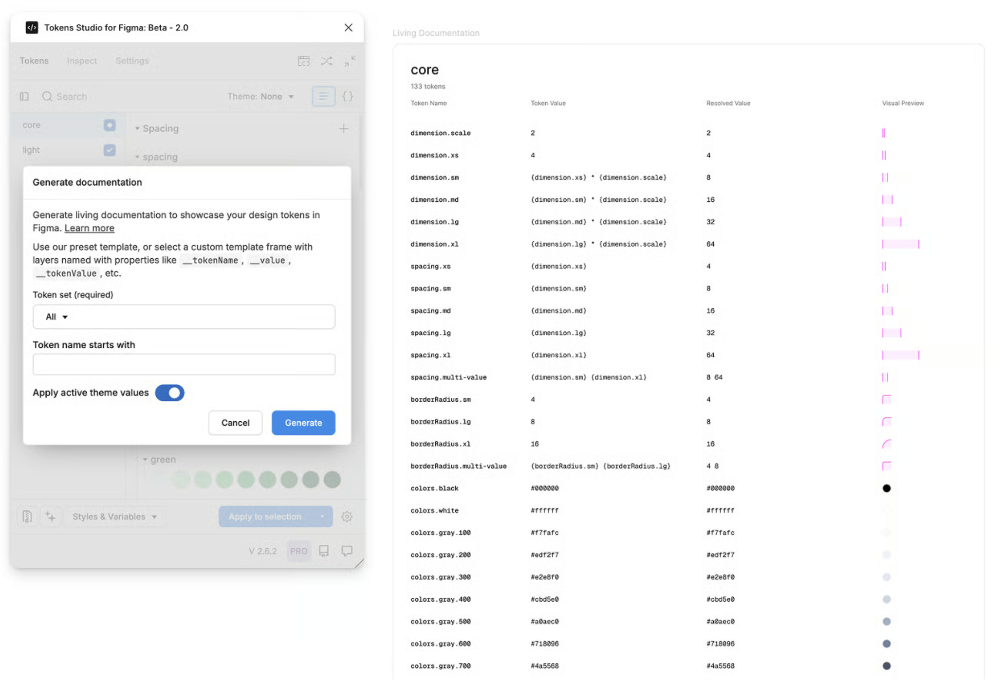

# Generate documentation

## Generate documentation

Generating a documentation is a feature that requires a Pro licenseDocumenting tokens for your consumers can be a time-consuming task. We've added the ability to generate a living documentation sheet, with tokens applied so the applied values change whenever the token value itself changes.

To get started, navigate to the "Tools" menu in the plugin's footer when on the Tokens tab. Select "Generate documentation", which opens the dialog that lets you configure how it should work.

**Token set (required)**: Either "All" or an individual token set. You can typeahead your set name so it will select it. Note: "All" might take a while, depending on the amount of tokens you have.

**Token name starts with**: An optional string. If given, the plugin only generates tokens that begin with this name - useful if you want to generate all tokens that start with "color." for example.

**Apply active theme values**: On by default, a setting that configures if the plugin should - after generating the documentation frames - automatically apply the currently selected theme values. If on, it means that tokens already have the right values applied. You might want to turn this off if you intend to apply a different theme config.


Make sure you do not have a layer selected, as otherwise we will attempt to use this layer as a template (see below)


<figure><figcaption></figcaption></figure>

### Different modes of operation 

There's two ways how you can use this, one is by not having a layer selected, and the other mode is by having a layer selected.

### No layer selected: Use our pre-defined template 

If you do not have any layer selected, we will use our pre-defined template to generate documentation. Use this if you just want to get started or are happy with what's generated.

### With a layer selected: Use this layer as a template 

If you select a Figma layer, we will use this to generate documentation with, as a template. Make sure that you have some layers named with documentation naming - e.g. \_\_tokenName, \_\_tokenValue or \_\_value, or also \_\_fill on a rectangle to apply the fill. This matches what we apply to a token name if you right click any token and select "Documentation tokens", or what you see on the Inspect tab. With this you can create your very own style of documentation.
