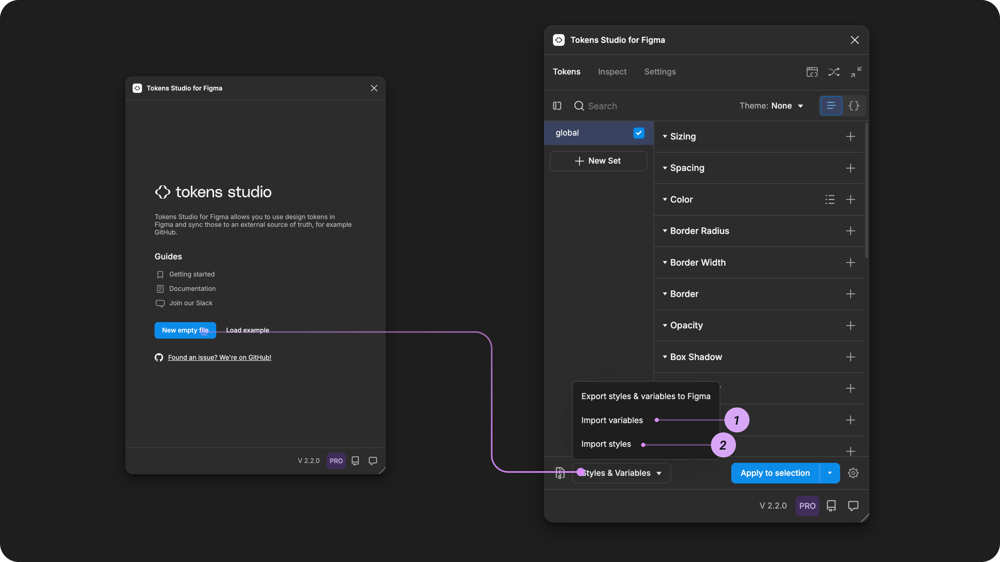
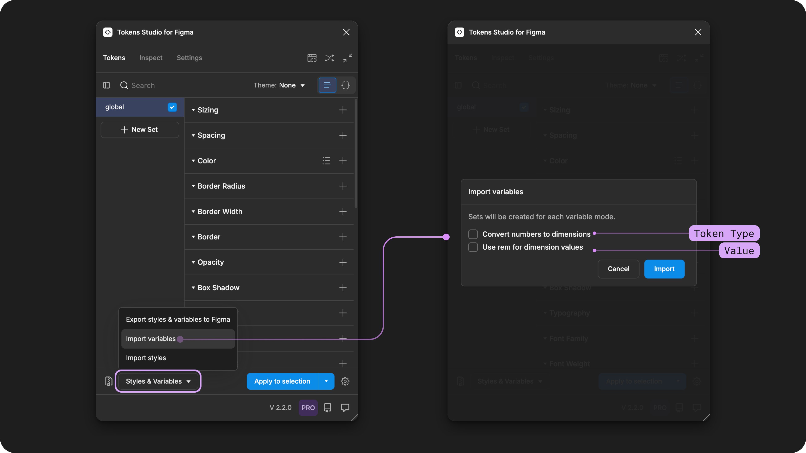
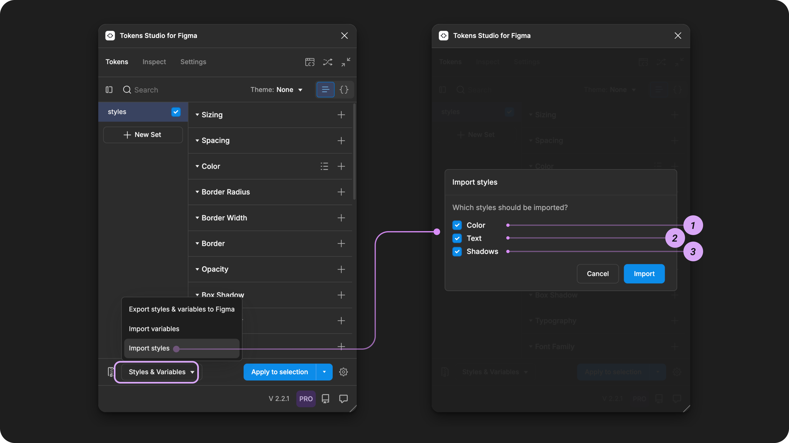

# Import from Figma Guide

## Import from Figma guide&#x20;

You can create Design Tokens in Tokens Studio by importing your Styles or Variables from Figma into the Plugin. This allows Tokens Studio to be the single place to manage Tokens, Styles, and Variables in Figma.

Each time you Import from Figma, you choose:

* To import Variables or Variables.&#x20;
* Which Types of Variables or Styles to import at that time.&#x20;

<figure><figcaption>
A new Tokens Studio project screen is next to the Plugin's empty state, with the Styles and Variables menu open. Annotations highlight the user flow to start the Import process. 
</figcaption></figure>

### Variable Types as Token Types

When importing variables:

* Color Variables -  creates [Color Tokens](../../manage-tokens/token-types/color/).
* Boolean Variables - creates [Boolean Tokens](../../manage-tokens/token-types/boolean.md).&#x20;
* String/Text Variables - creates [Text Tokens](../../manage-tokens/token-types/text.md).
* Number Variables - created [Number](../../manage-tokens/token-types/number.md) or [Dimension Tokens](../../manage-tokens/token-types/dimension/).&#x20;

<figure><figcaption>
The Tokens page of the Plugin is shown on the left, and the Styles &#x26; Variables menu is opened. The annotations show that the Import Variables were selected to open the Import Variable Options shown on the right. 
</figcaption></figure>

When you import variables from Figma, you may wish to manually adjust the Token Type.

→ [Jump to the guide on Variable Types and Token Types](variables/token-types.md)

### Style Types as Token Types

When importing styles:

* Color Styles - creates [Color Tokens](../../manage-tokens/token-types/color/).
* Text Styles - creates [Typography Composite Tokens](../../manage-tokens/token-types/typography/) and optional Text Property Tokens.
* Shadows - creates [Box Shadow Tokens](../../manage-tokens/token-types/box-shadow.md) from Effects Styles.

<figure><figcaption>
The user flow from the Tokens page of the Plugin is annotated to show the Styles &#x26; Variables menu open and Import Styles as being selected on the left. The Import Styles options are shown on the right, annotated with the numbers 1, 2, and 3 to match their description above.
</figcaption></figure>

While the process for importing Styles or Variables is similar, there are some differences to be aware of, described in detail in their guides:&#x20;

<table data-view="cards"><thead><tr><th></th><th data-hidden data-card-cover data-type="files"></th><th data-hidden data-card-target data-type="content-ref"></th></tr></thead><tbody><tr><td>Import Styles from Figma</td><td><a href="../../.gitbook/assets/card-header-figma-import-styles.png">card-header-figma-import-styles.png</a></td><td><a href="styles.md">styles.md</a></td></tr><tr><td>Import Variables from Figma</td><td><a href="../../.gitbook/assets/card-header-figma-import-variables.png">card-header-figma-import-variables.png</a></td><td><a href="variables/">variables</a></td></tr></tbody></table>


