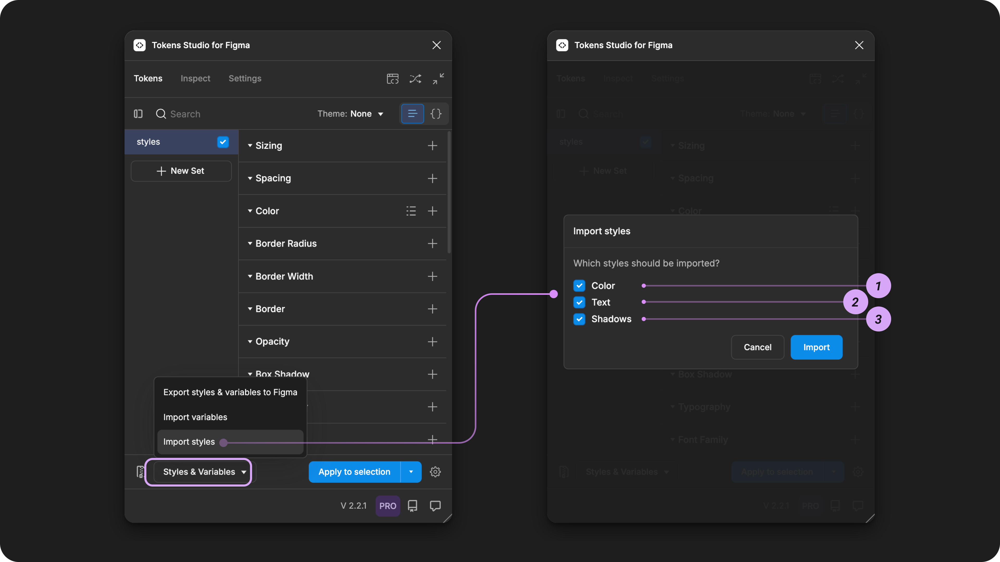

# Import Styles from Figma

## Import Styles from Figma&#x20;

You can import all your Styles from Figma into Tokens Studio with just a few clicks.

The Import Styles feature creates a Design Token for each Style in a Token Set of your choice.&#x20;


Known limitation - Styles with Variable References

You can still import them, but any connection to Variables will need to be manually created.


This guide will walk you through how to get your Color, Text and Effects Styles into Tokens Studio.&#x20;

Then, you can decide whether to use the Plugin to control your Styles, export them to code in properly formatted JSON files as Design Tokens or move your Styles to another Figma file.

<figure><figcaption>
This image shows a Typography Token named <code>headline.100.light</code>  which was created by importing a text style from Figma with the same name. On the left, the Token name is being hovered on in the Tokens Studio Plugin, which shows all of its properties. 
</figcaption></figure>

***

### In the Plugin

In the Figma file where your Styles live, open the Tokens Studio Plugin.

* If you don't already have Tokens in this file, select the **New empty file** option when the plugin loads.
* Select the Token Set where you'd like the Tokens created from your Styles to live.
  * In the example below, we have selected the global Token Set.
* Select the **Styles & Variables Button** from the Tokens page to reveal the Import and Export to Figma menu.

<figure><figcaption>
A new Tokens Studio project screen is next to the Plugin's empty state, with the Styles and Variables menu open. Annotations highlight the user flow to start the Import Styles process. 
</figcaption></figure>

If you have multiple Token Sets in the Plugin, be sure you have selected the Token Set where you'd like the Imported Styles to be created as Tokens.

* The selected set has a darkened accent color around the Token Set name.
* The status of the checkbox next to the Token Set does not matter.

<figure><figcaption>
The Tokens page of the Plugin is annotated to show the currently selected Token Set, as indicated by the container's styling. The checkbox next to the selected Token Set is not selected, as it has a different purpose. 
</figcaption></figure>

From the Styles and Variables menu

* Choose the **Import Styles** action.
* The **Import Styles Modal** appears with three options.

<figure><figcaption>
The user flow from the Tokens page of the Plugin is annotated to show the Styles &#x26; Variables menu open and Import Styles as being selected on the left. The Import Styles options are shown on the left, annotated with the numbers 1, 2, and 3 to match their description below. 
</figcaption></figure>

### Import Styles options

The **Import Styles Modal** appears with three options which tell the plugin which type of style to import. You can select as many options as you like:

1. Color Styles - creates [Color Tokens](../../manage-tokens/token-types/color/).
2. Text Styles - creates [Typography Composite Tokens](../../manage-tokens/token-types/typography/) and optional Text Property Tokens.
3. Shadows - creates [Box Shadow Tokens](../../manage-tokens/token-types/box-shadow.md) from Effects Styles.

<figure><figcaption>
The Import Styles options in the Plugin are shown on the left, annotated with the numbers 1, 2, and 3 to match their Figma properties shown on the right. 
</figcaption></figure>

### 1. Color Styles

When you import Color Styles, the Plugin will create a new Token with the Token Type of `color` for these values:

* Single-value colors with full or reduced opacity.
* Gradient colors.

The plugin is not able to import Color Styles with these values:

* Images.
* Multiple fill colors.

<figure><figcaption>
The Tokens page of the plugin is shown with annotations connecting the grouped names of Color Tokens on the left with their matching color style names in the Figma UI on the right. 
</figcaption></figure>

### 2. Text Styles

When you import Text Styles, the Plugin takes a couple of extra steps to help define all the design decisions that are combined to create a Typography Token.

First, it creates an individual Token for each Text property within the Style and assigns the appropriate Token Type.

* Font Family
* Font Weight
* Font Size
* Line Height
* Letter Spacing
* Paragraph Spacing
* Paragraph Indent
* Text Decoration
* Text Case

Then, a new Typography composite Token is created with a name that matches the Text Style Name. The value of the Token will reference the individual text property Tokens.

<figure><figcaption>
The Tokens page of the plugin is shown with annotations connecting the individual Typography property Tokens on the left, which are referenced in a composite Typography Token in the middle. The line pointing to the Typography Token name is connected with its matching text style name in the Figma UI on the right. 
</figcaption></figure>

### 3. Shadow (Effect) Styles

When you import Effect Styles, the plugin will create a new `boxShadow` Token for each Style. If your styles are composed of multiple shadow layers, the Plugin will create the Shadow Tokens to match.

<figure><figcaption>
The Tokens page of the plugin is shown with annotations connecting the grouped names of Color Tokens on the left with their matching color style names in the Figma UI on the right. 
</figcaption></figure>

### Confirm the Styles to Import

Once you've confirmed your Import Styles options, select the **Import** button at the bottom of the modal.

* The plugin will display a list of Style names and values to import.
* Review the "diff" list and confirm the import.
  * Style names in the section called `New Tokens` are not connected to a Token in your file, and a new Token will be created with the same name.
  * The Style names in the section called `Existing Tokens` are already connected to Tokens in your file, and the plugin has detected a change in their value. The import action will update the existing Tokens.
  * Green items are new or being added.
  * Red (right side) items are being removed.

There are a few ways to select what to Import from this list.

1. Select the **Import all** button at the bottom of the modal to import all Styles in the list, this would create all new Tokens and update all exisiting Tokens in the list.
2. Select the **Create all** button on the right side of the `New Tokens` section to create new Tokens in that section of this list, and ignore the Styles in the Existing Tokens list.
3. Select the **Update all** button on the right side of the `Existing Tokens` section to update the Tokens attached to the Styles in that section of this list without creating any new Tokens.
4. Select the **plus icon** button on the right side of any Style name to create a single Token.
5. Select the **trash can icon** button on the right side of any Style name to remove it from this list, or exclude it from the import process.

Once you confirm which Styles to Import, the Tokens will be created in the active Token Set, with names that match the attached Styles.

### Maintaining Tokens attached to Styles

Once your Styles have been imported, there is a connection between the Style and the Token in the plugin that shares the same name. In our docs, we use the term "attached" to describe this relationship.

There are a couple of ways to keep the values of your Tokens and Styles up to date, depending on how you like to work and if you are a Pro Licence holder for the Plugin.

#### Updating Styles in Figma

If you prefer to work in Figma natively, you can repeat the **Import Styles** process anytime. This will update the values of attached Tokens in the plugin as long as the name of your Styles or Design Tokens has not changed.


Names are the ID's connecting Styles and Tokens!

The name is the ID of the decision, and it's part of how the Plugin knows which Token is attached to which Style. When the name changes in Figma, the plugin struggles to identify where it is attached because the ID it is looking for no longer exists.


#### Updating Tokens in the Plugin

If you make changes to Tokens in the Plugin that are attached to Styles in Figma, you can use the Export to Figma features to update the connected styles.


[export](../export/)


***

### Known Limitations

We know there is lots of room for improvement with the Import Styles feature, and we are working on it!

#### Importing Styles backed by Variables is not yet supported

Today, if you import your Variables first and then your Styles second, the Plugin can't read those connections and complete the references for you _yet_.

The only way to complete this task today is to manually change the Values of the Tokens created when you imported your Styles to reference a Token that is attached to your Variables.


[styles-variable-references.md](../export/styles-variable-references.md)


***

### Resources

Figma resources:

* Design in Figma - [Overview of Variable Collections and Modes](https://help.figma.com/hc/en-us/articles/14506821864087-Overview-of-variables-collections-and-modes)

#### Community resources:

* None yet!



#### Known issues and bugs

Tokens Studio Plugin GitHub - Open issues for Token Type Border

* None yet



#### Requests, roadmap and changelog

* None


