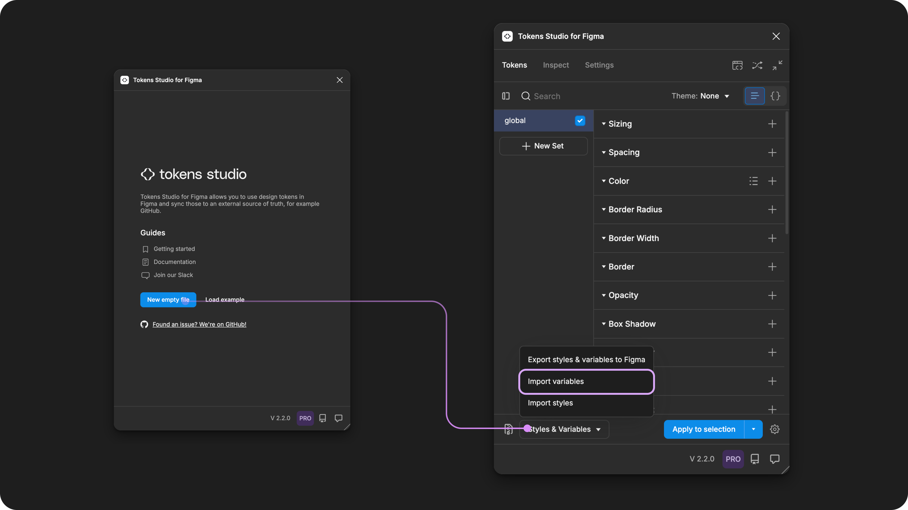
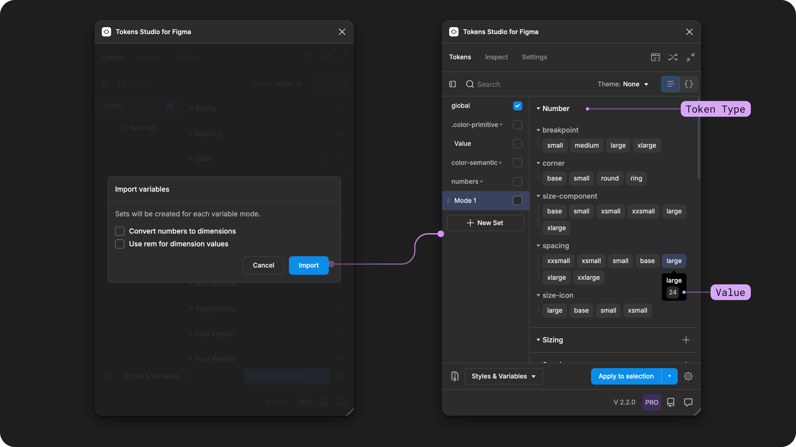
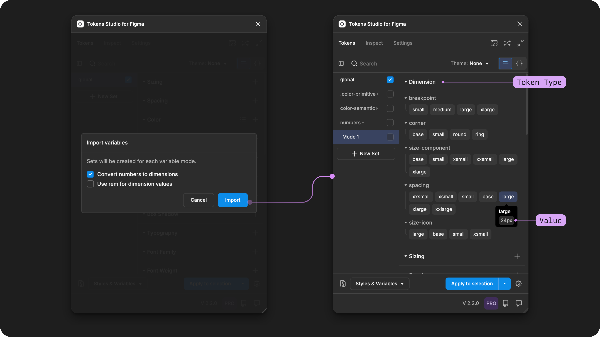
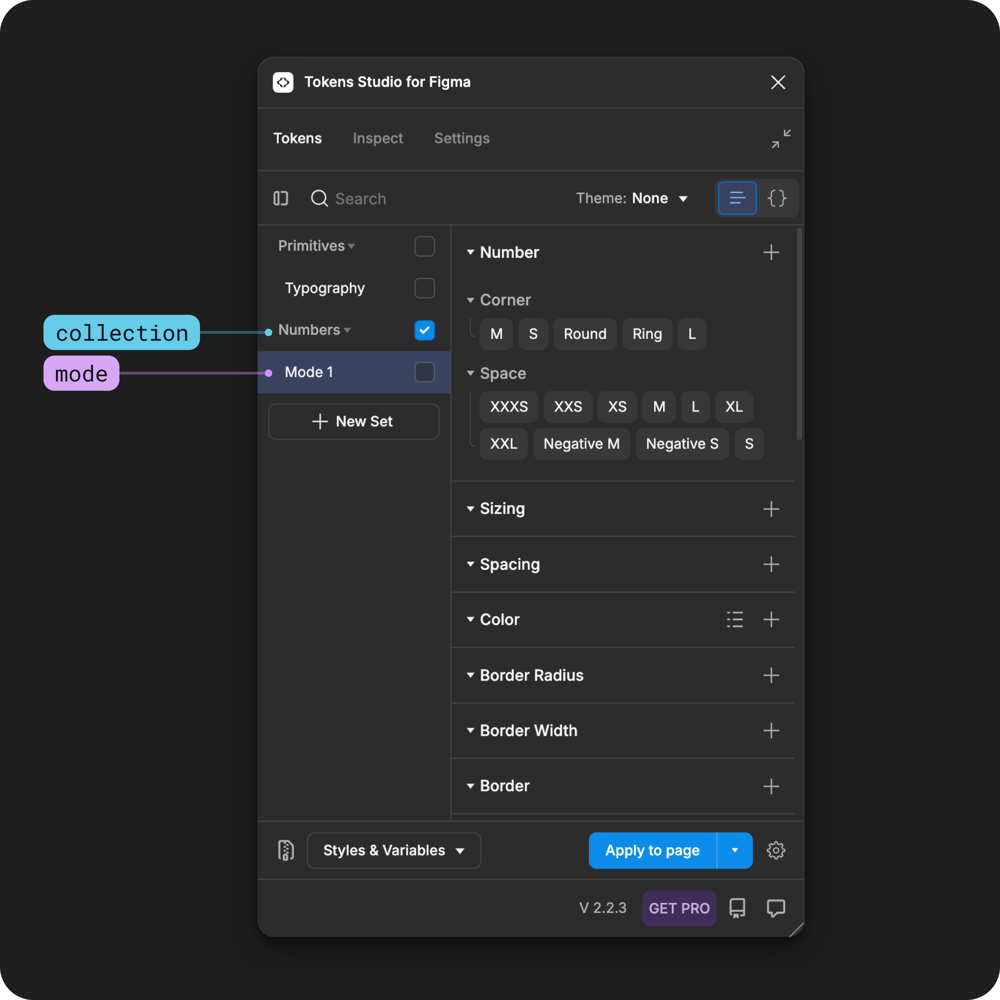
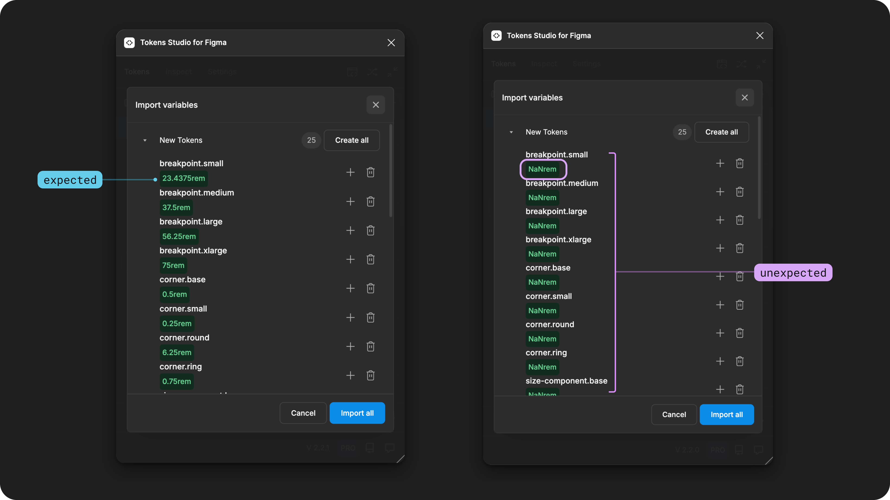

# Import Variables from Figma

## Import Variables

You can import all your Variables from Figma into Tokens Studio in just a few clicks.

The Import Variables feature creates a Design Token for each Variable and a Token Set for each Mode in your Collection.&#x20;

<figure><figcaption>
The Tokens Studio Plugin beside Figma Variables with annotations visualizing how the two are connected. More details below. 
</figcaption></figure>

While the Import Variables feature is due for an update, this guide will walk you through how to get your Variables into Tokens Studio and point out the limitation that exist today and how to work around them.&#x20;

Then, you can decide whether to use the Plugin to manage your Variables, export them to code in properly formatted JSON files as Design Tokens or move your Variables to another Figma file.

***

### In the Plugin

In the Figma file where your Variable Collections live, open the Tokens Studio Plugin.

* If you don't already have Tokens in this file, select the **New empty file** option when the plugin loads.
* Select the **Styles & Variables Button** from the Tokens page to reveal the Import and Export to Figma menu.

<figure><figcaption>
A new Tokens Studio project screen is next to the Plugin's empty state, with the Styles and Variables menu open. Annotations highlight the user flow to start the Import Variables process. 
</figcaption></figure>

From the Styles and Variables menu

* Choose the **Import Variables** action.
* The **Import Variables Modal** appears with two options.

### Import Variables options

The **Import Variables Modal** appears with two options which tell the plugin how to import Number Variables.

1. Convert numbers to dimensions.
2. Use rem for dimension values.

<figure><figcaption>
The Tokens page of the Plugin is shown on the left, and the Styles &#x26; Variables menu is opened. The annotations show that the Import Variables were selected to open the Import Variable Options shown on the right. The Import Variables options are annotated with numbers that match the descriptions below. 
</figcaption></figure>

### **1. Convert numbers to dimensions**

When the **Convert numbers to dimensions** option is disabled (empty checkbox) the plugin will create all Number Variables with a Token Type of Number.

<figure><figcaption>
With no Import Variable Options selected, the Tokens created in the Plugin are displayed on the right side. Hovering on the <code>spacing.large</code>Token shows a value of <code>24</code>and a Token Type of <code>Number</code>.
</figcaption></figure>

When the **Convert numbers to dimensions** option is enabled (checkmark is visible) the plugin will create all Number Variables with a Token Type of Dimension.

<figure><figcaption>
With the first Option selected, the Tokens created in the Plugin are displayed on the right side. Hovering on the <code>spacing.large</code>Token shows a value of <code>24px</code>and a Token Type of <code>Dimension</code>.
</figcaption></figure>

How can you decide which option is for you?

* Number Tokens are intended to be unitless.
* Dimension Tokens are required to have a unit of measure.
  * By default, the plugin will add the `px` unit to your Dimension Tokens when you import, unless you specify otherwise using the second option.

[→ Read the Number Token guide for more details ](../../../manage-tokens/token-types/number.md)

### **2. Use rem for dimension values.**

When the **Use rem for dimension values** option is enabled (checkmark is visible) the plugin will convert the value from pixel to rem units, assuming `16` as the value of `1rem`.

As a note, this setting only works when the previous checkbox is also enabled.

<figure><figcaption>
With both Import Variable Options selected, the Tokens created in the Plugin are displayed on the right side. Hovering on the <code>spacing.large</code>Token shows a value of <code>1.5rem</code> a Token Type of <code>Dimension</code>.
</figcaption></figure>

**Base font size setting**


The value of `1rem` must be configured on the plugin's **Settings** page for this setting to work as expected.


If you haven't configured the **Base Font SIze Setting** before you'll need to close the Import Modal and head to the Settings Page.

* Select **Change** on the right side of the **Base Font Size** setting.
* A form will open where you can enter in a unitless number (for example `16`)
  * Or use the dropdown to select a Number Token.
* Once you have set the value, save your changes, and you can go back to the Import Variables flow.

<figure><figcaption>
From the Settings page of the Plugin, select the Change button next to the Base Font Size setting to define a value.
</figcaption></figure>

Reminder that the **Base Font Size Setting** is saved to your Plugin account.

* So when you open a new Figma file, the configuration you had for this setting in the last file "follows" you into the new file.
* If you frequently adjust this setting, you'll want to check your configuration **before** importing your Variables as Dimensions with the Use rem value option enabled.

[→ Read the Base Font Size guide for more details](../../../manage-settings/base-font-size.md)

### Confirm the Variables to Import

Once you've confirmed your Import Variable options, select the **Import** button at the bottom of the modal.

* The plugin will display a list of Variable names and values to import.
* Review the "diff" list and confirm the import.
  * Variable names in the section called `New Tokens` are not connected to a Token in your file, and a new Token will be created with the same name.
  * The variable names in the section called `Existing Tokens` are already connected to Tokens in your file, and the plugin has detected a change in their value. The import action will update the existing Tokens.
  * Green items are new or being added.
  * Red items are being removed.

<figure><figcaption>
Once the Import Variables Options are confirmed, the Plugin shows the Tokens that will be created or edited based on the settings. The example on the left side shows new Tokens to be created, the example on the right side shows existing Tokens with different values.
</figcaption></figure>

There are a few ways to select what to Import from this list.

1. Select the **Import all** button at the bottom of the modal to import all Variables in the list, this would create all new Tokens and update all exisiting Tokens in the list.
2. Select the **Create all** button on the right side of the `New Tokens` section to create new Tokens in that section of this list, and ignore the Variables in the Existing Tokens list.
3. Select the **Update all** button on the right side of the `Existing Tokens` section to update the Tokens attached to the Variables in that section of this list without creating any new Tokens.
4. Select the **plus icon** button on the right side of any Variable name to create or update a single Token.
5. Select the **trash can icon** button on the right side of any Variable name to remove it from the list, or exclude it from the import process.

***

### Token structure of imported Variables

1. Collection = Token Set folder name.
2. Mode = Token Set&#x20;
3. Variable = Design Token&#x20;

When you import Variable collections into the plugin, you will see each Variable collection becomes a folder of Token Sets, with the folder name matching the collection name.

<figure><figcaption>
Figma Variable Collection beside the Tokens Page in the Plugin.  The numbered annotations show the relationship between Variable Collection names and Token Set names. 
</figcaption></figure>

Each Mode within the Variable Collection becomes an individual Token Set, with the Set name matching the Mode name.

These Token Sets are nested within the same folder as the Variable Collection they came from.

<figure><figcaption>
Figma Variable Collection beside the Tokens Page in the Plugin.  The numbered annotations show the relationship between Variable Mode names and Token Set names. 
</figcaption></figure>

Each Variable is created as a Design Token with the same name and value.&#x20;

* Any groups in the Variables (with the forward slash `/`) are created as grouped Token Names (with a period `.`).&#x20;
* The Tokens live in a Token Set with the same name as the Variable Collection and Mode.&#x20;

<figure><figcaption>
Figma Variable Collection beside the Tokens Page in the Plugin.  The annotations show the relationship between Variable names and Token names. 
</figcaption></figure>

If you only have 1 mode in your Variable Collections when you Import them, you'll still see the folder structure of Token Set names.&#x20;

If you have not renamed the Mode in Figma, it will appear as `collection-name/Mode 1` .

<figure><figcaption>
The plugin with Token Sets created after importing a Variable collection with a single mode.
</figcaption></figure>

***

### **Troubleshooting**

If you are using the **Rem for Dimension Value** Setting and you see values of `NaNrem` in the confirm view, this is unexpected behaviour caused by a known issue in the plugin.

To solve, you need to configure the Base font size setting in the Plugin ([step 2 above ↑](./#id-2.-use-rem-for-dimension-values))

<figure><figcaption>
Once the Import Variables Options are confirmed, the Plugin shows the Tokens that will be created or edited based on the settings. The example on the left side shows new Tokens to be created with the expected values. The example on the right side shows unexpected values that are not being calculated. 
</figcaption></figure>

***

### Maintaining Tokens attached to Variables

Once your Variables have been imported, there is a connection between the Variable and the Token in the plugin that shares the same name. In our docs, we use the term "attached" to describe this relationship.

There are a couple of ways to keep the values of your Tokens and Variables up to date, depending on how you like to work and if you are a Pro Licence holder for the Plugin.

#### Updating Variables in Figma

If you prefer to work in Figma natively, you can repeat the **Import Variables** process anytime. This will update the values of attached Tokens in the plugin as long as the name of your Variables, modes, or collection has not changed.


Names are the ID's connecting Variables and Tokens! \
\
The name is the ID of the decision, and it's part of how the Plugin knows which Token is attached to which Variable.&#x20;

When the name changes in Figma, the plugin struggles to identify where it is attached.


#### Updating Tokens in the Plugin

If you were hoping to import your Variables and use Tokens Studio as your source of truth for maintaining your design decisions, our Themes feature (pro) makes this possible.

The Themes feature has a concept of **Themes Groups**, which allows the plugin to connect to a Variable collection with multiple modes.

→ [Learn more about Themes (pro)](../../../manage-themes/themes-overview.md)

The process has a few steps to be aware of, outlined in its own guide.&#x20;


[connect-themes-to-imported-variables.md](connect-themes-to-imported-variables.md)


***

### Known Limitations

There are some known limitations of importing Variables to be aware of.&#x20;

#### All Variables imported share the same configuration

Today, when you import a lot of Variables into the Plugin, they all share the same configuration for converting Number variables into Dimension Tokens and if you want those values in rem or pixel units.

You may want your text-related Variables imported in rem units and other Variables in pixels or even unitless numbers.

A way to work around this after you've completed the import and the Tokens have been created:

1. Locate the Tokens or Token Sets you want to have the unique configuration and delete them from the plugin
   * Delete an entire Token set by right-clicking on the name of the Token Set and selecting delete.
   * Delete a specific Token by right-clicking on its name and selecting delete.
2. Repeat the Import Variables process with your new desired options and only the Variables without a matching Token Name in the Plugin will be imported with the new options.

#### Importing Styles backed by Variables is not yet supported

Today, if you import your Variables first and then your Styles second, the Plugin can't read those connections and complete the references for you _yet_.

The only way to complete this task today is to manually change the Values of the Tokens created when you imported your Styles to reference a Token that is attached to your Variables.


[styles-variable-references.md](../../export/styles-variable-references.md)


**Token Types don't match Variable Types**

Figma has 4 types of Variables, and Tokens Studio supports 24 unique Token Types.&#x20;

When you import Variables into the Plugin, it does not know the correct Token Type to assign to the new Token outside of those 4 Token Types.&#x20;

This means you might have to manually change the `type` of the Token created when you import your Variables. The fastest way to do this is to edit the code files.


[imported-variable-types-and-token-types.md](imported-variable-types-and-token-types.md)




***

### Up next

If this is your first time working with Tokens Studio to manage your Variables, you might want to check out these guides:

<table data-view="cards"><thead><tr><th></th><th></th><th data-hidden data-card-cover data-type="files"></th><th data-hidden data-card-target data-type="content-ref"></th></tr></thead><tbody><tr><td>Variables in Tokens Studio</td><td>Nuances of managing Tokens connected to Variables in the Plugin.</td><td><a href="../../../.gitbook/assets/page-header-figma-variables.png">page-header-figma-variables.png</a></td><td><a href="../../variables-overview.md">variables-overview.md</a></td></tr><tr><td>Non-local Variables and Styles</td><td>Keep Variables connected across multiple Figma files.</td><td><a href="../../../.gitbook/assets/card-header-figma-files.png">card-header-figma-files.png</a></td><td><a href="../../non-local-files.md">non-local-files.md</a></td></tr><tr><td>Export to Figma</td><td>Push updates to Tokens connected to Variables in Figma.</td><td><a href="../../../.gitbook/assets/card-header-figma-export-overview (1).png">card-header-figma-export-overview (1).png</a></td><td><a href="../../export/">export</a></td></tr><tr><td>Connect Themes to Variables</td><td>Steps to use Tokens Studio to manage Variables. </td><td><a href="../../../.gitbook/assets/card-header-figma-import-connect-theme.png">card-header-figma-import-connect-theme.png</a></td><td><a href="connect-themes-to-imported-variables.md">connect-themes-to-imported-variables.md</a></td></tr></tbody></table>

***

### Resources

Figma resources:

* Design in Figma - [Overview of Variable Collections and Modes](https://help.figma.com/hc/en-us/articles/14506821864087-Overview-of-variables-collections-and-modes)

#### Community resources:

* None yet!



#### Known issues and bugs

Tokens Studio Plugin GitHub - Open issues for Token Type Border

* None yet



#### Requests, roadmap and changelog

* None


