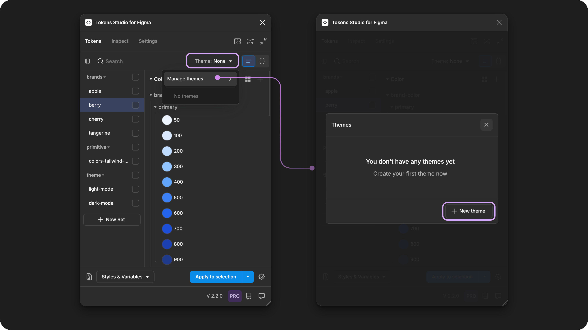

# Connect Themes to Imported Variables

## Connect Themes to Imported Variables

If you were hoping to import your Variables and use Tokens Studio as your source of truth for maintaining your design decisions, our Themes feature (pro) makes this possible.

The **Themes** feature has a concept of **Groups of Themes**, which allows the plugin to connect to a Variable collection with multiple modes.


[themes-overview.md](../../../manage-themes/themes-overview.md)


If you have a Pro Licence for Tokens Studio, here are the steps to attach the Imported Variables to Themes, allowing you to use the plugin to update your Variables.


The most important thing to pay attention to is the names, so the ID of our Themes can correctly attach to a Variable collection.

Theme Group = Collection \
Theme = Mode


The image below shows how **Theme Groups** and **Themes** map to Figma's Variable collections and modes.

<figure><figcaption>
The Tokens Page in the Plugin with the Themes Menu Open next to a Variable Collection in Figma.  The annotations show the relationship between Variable Collection and Theme Group Names as well as Variable Modes and Theme Names. 
</figcaption></figure>

***

### How it Works

Once you Import your Variables Into Tokens Studio, you've taken a "snapshot" of the Variables and their values as Tokens in the Plugin. You need to establish a relationship between the Tokens and the Variables, and Themes are how the Plugin is able to attach the Tokens to Variables across multiple modes and collections.&#x20;

This is the same example used in the Import Variables Guide.&#x20;


[.](./)


After the Import is complete, in the Plugin you will see:&#x20;

* Each Variable collection becomes a folder of Token Sets, with the folder name matching the collection name.
* Each Mode within the Variable Collection becomes an individual Token Set, with the Set name matching the Mode name, nested within the folder name matching the collection name.&#x20;
* Each Variable is created as a Design Token with the same name and value.&#x20;

<figure><figcaption>
Figma Variable Collection beside the Tokens Page in the Plugin.  The numbered annotations show the relationship between Variable Collection and Mode names to Token Set names. 
</figcaption></figure>

To attach the Design Tokens in the Plugin to the Variables in Figma, you'll:

1. Create Theme Groups and Themes with names that match the Variable Collections and Modes.&#x20;
2. Attach the Themes with Variables using the Export to Figma feature.
3. Check the connection between your Themes and Variables.&#x20;

<figure><figcaption>
Figma Variable Collection beside the Themes Manager in the Plugin.  The numbered annotations show the Theme Group to Collection names. The lettered annotations show the Theme to Mode names. 
</figcaption></figure>

***

### **1. Create Theme Groups and Themes**

When the Plugin completed the import, each Token Set name contains the `collection/mode`, so you will use this to create the `theme-group/theme` names to match.

The easiest way to do this so there is an exact match is to copy the Token Set name.

#### Copy the Token Set Name

1. Right-click on the Token Set Name (left side navigation panel on the Tokens page).
2. Select **Rename**.
   1. The Rename Token Set modal appears with the current name inside the text input.
3. **Select the current name** from the input and copy it using a keyboard shortcut.
   * command + C on a Mac
   * control + C on a PC
4. **Paste the name** in a text editor of your choice.
   * For example `brands/apple` is the full set name in the image below.

<figure><figcaption>
Right-click on any Token Set name to open its action menu. Selecting Rename will open a form. You can select the name in the input and copy it for use in the following steps. 
</figcaption></figure>

#### Open the Themes Manager

From the Tokens Page of the Plugin, open the **Themes** dropdown (it doesn't matter what Token Set is showing on the page):

* Select **Manage Themes**
* Select **New Theme**

<figure><figcaption>
Select the Theme dropdown to open the menu. Select <code>Manage themes</code>to view the Themes Manager. The example on the right shows the Themes Manager before any Themes are created. 
</figcaption></figure>

#### Create a new Theme

From the Themes manager, select the New Theme button.&#x20;

Once the Create Themes form is open:

1. Select **+ add group** from the top left.
   * Paste in the part of the Token Set name that appears before the `/`
   * For example `brands`
2. Select the **Theme name** input and paste the part of the Token Set name that appears after the `/`.
   * For example `apple`
3. Under the inputs is a complete list of all Token Sets.
   * Ensure only Token Set with the name matching the Theme you are creating has the **Status** of **Enabled** (checkmark icon button is highlighted).
   * Ensure **all other Token Sets** have a **Status** of **Disabled** (X icon button is highlighted).
4. Select **Save Theme** to finish.
   * You'll return to the Themes Manager where your new Theme is now listed.

<figure><figcaption>
After creating the first Theme, it appears in the Themes Manager. The Theme Group, Theme, and number of Sets are shown in the Theme Manger.
</figcaption></figure>

#### Create additional themes

Now you can repeat this process for the rest of the Token Sets created from your Imported Variables.

In this example, 3 Variable collections were imported with a total of 7 Token Sets.

* `brand` Variable collection has 3 more Token Sets to add.
* `primitive` Variable collection to be created as a Theme Group with 2 Token Sets.
* `theme` Variable collection to be created as a Theme Group with 2 Token Sets.

<figure><figcaption>
Figma Variable Collection beside the Tokens Page in the Plugin.  The numbered annotations show the relationship between Variable Collection names and Token Set names. 
</figcaption></figure>

The good news is, if you are creating an additional Theme inside an existing Theme Group, you can select the Theme Group from the form instead of typing it each time.

In this example, the `brands` Theme Group created previously appears in the dropdown while adding the new Theme called `berry.`

<figure><figcaption>
From the Theme form, the Add Group dropdown shows all Theme Groups previously created. Selecting a Theme Group from the dropdown makes it quick and easy to create additional Themes in the same Group. 
</figcaption></figure>

When all Token Sets have been added into Theme Groups, you are ready to create the connection to the Variables.

In this example, the Themes Manager shows 3 Theme Groups with names that match the imported Variable Collections and Modes.

<figure><figcaption>
Figma Variable Collection beside the Themes Manager in the Plugin.  The numbered annotations show the Theme Group to Collection names.
</figcaption></figure>

### **2. Attach Themes with Variables**

You'll use the **Export to Figma feature** to attach your newly created Themes to your Variables in Figma. Once the connection is made, you can use The Plugin to manage your Variables.

This is a quick overview of the steps using this example.

→ [If you'd like a more detailed walkthrough of this process, read the Export to Figma from Themes guide.](../../export/themes.md)

Select the **Styles & Variables Button** from the Tokens page.

* Choose the **Export Styles & Variables** option.
* The **Export Options** menu will open, ensure you have:
  * All Variable types selected
  * None of the Style types selected
  * None of the toggles selected under the **Tokens Exported to Figma should** option.
* Select confirm to close the Options menu.&#x20;

<figure><figcaption>
Select the Export Styles and Variables from the Tokens page to configure the Options. 
</figcaption></figure>

You should be looking at the full list of Theme Groups and Themes in your Token Structure.

* Select all Themes within the Theme Groups you just created (checkmark is visible).
* Select **Export to Figma** to complete the action.


In this example, there were no Themes previously in our Token Project so all Themes are selected for export. Your project may be different!


<figure><figcaption>
After the Export Options are confirmed, all previously created Themes are displayed. In this example, all Themes are selected for Export. 
</figcaption></figure>

### 3. Check connected Themes to Variables

Your Variable collections should now be connected to Tokens Studio!&#x20;

If you navigate back to the Themes manager, you'll see a count of attached Variables for each Theme.

<figure><figcaption>
Select the Themes dropdown from the Plugin page to see all Themes created. They are organized by Theme Group. Select Manage Themes to see the count of Sets and Variables attached to each Theme. 
</figcaption></figure>

You can test this by making a change to to a Token from the plugin, and running the **Export to Figma** action again, you should see the matching Variable change in the Figma UI.

If you have unexpected results, here are some additional guides that might be helpful in troubleshooting:

<table data-view="cards"><thead><tr><th></th><th data-hidden data-card-cover data-type="files"></th><th data-hidden data-card-target data-type="content-ref"></th></tr></thead><tbody><tr><td>Export to Figma from Themes</td><td><a href="../../../.gitbook/assets/card-header-figma-export-themes.png">card-header-figma-export-themes.png</a></td><td><a href="../../export/themes.md">themes.md</a></td></tr><tr><td>Export Options</td><td><a href="../../../.gitbook/assets/card-header-figma-export-options.png">card-header-figma-export-options.png</a></td><td><a href="../../export/options.md">options.md</a></td></tr><tr><td>Import Variables from Figma</td><td><a href="../../../.gitbook/assets/card-header-figma-import-variables.png">card-header-figma-import-variables.png</a></td><td><a href="./">.</a></td></tr><tr><td>Non-local Variables</td><td><a href="../../../.gitbook/assets/card-header-figma-files.png">card-header-figma-files.png</a></td><td><a href="../../non-local-files.md">non-local-files.md</a></td></tr><tr><td>Working with Variables in Tokens Studio. </td><td><a href="../../../.gitbook/assets/card-header-figma-variables.png">card-header-figma-variables.png</a></td><td><a href="../../variables-overview.md">variables-overview.md</a></td></tr></tbody></table>

