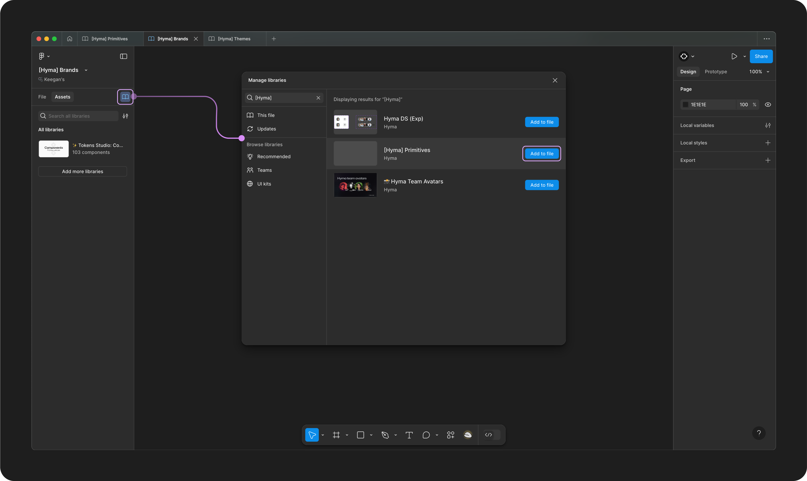
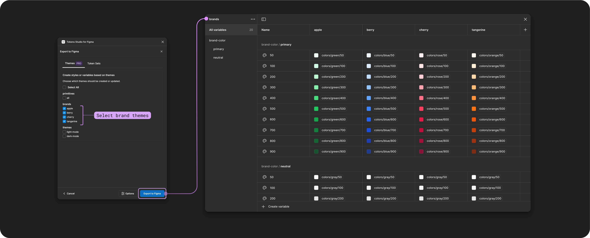

# Non-local Variables and Styles (pro)

Non-local Variables and Styles

You can now split up your Tokens across several Figma files connected to styles and variables and maintain the connected references!

For example, you can have your primitive Tokens published as variables or styles in a separate file from other Tokens which reference them.

This enables you to use Figma's native library publishing features to manage permissions of who has access to your Tokens without loosing any of the connected references.

***

### Requirements

To set up non-local variables, you will need:

* A Tokens Studio Pro licence.
* A Paid Figma account to support the use of Variable collections and modes.
* A Git Sync Provider account used to access the same Tokens Studio files across multiple Figma files.
  * Ensure your storage provider is setup in folder pathway for multi-file sync option (pro)

→[ Jump to the Sync Provider guide for more details.](../token-storage/remote/)

#### Figma Community Files

<figure><figcaption></figcaption></figure>

To follow along this guide, you can duplicate a copy of the Figma playground file used in the images and videos below.

🔗 [Non-local Variables Playground File by Tokens Studio - Figma Community](https://www.figma.com/community/file/1419923719697946403)

### Common terms

Here are some terms you'll see in our docs about this feature.

#### Local styles/variables

Local styles and variables are attached to Tokens in the current Figma file in which you are working.

#### Non-local styles/variables

Non-local styles and variables are attached to Tokens in a different Figma file than the one you are currently working in.

If you edit Tokens connected to non-local styles/variables in this file, the updates will not impact the styles and variables. You need to navigate to the Local File where the styles/variables are published and **Export to Figma**.

→ [Read the Export to Figma guide for more details](export/)

#### Primitive Tokens

We refer to Tokens with [hard-coded values](../manage-tokens/token-values/#hard-coded-value) as **Primitive Tokens**

#### Decision Tokens

We refer to Tokens with [values that reference another Token](../manage-tokens/token-values/references.md) as a **Decision Token** as the new name, or alias, describes how the design decision is intended to be used in the system.

_The image below shows an example of both Primitive (left)  and Decision Tokens (right) in the Plugin._

<figure><figcaption></figcaption></figure>

#### Theme

A **Theme** is one or more Token Sets (containing design Tokens) grouped to apply a styling effect to design elements.

<figure><figcaption></figcaption></figure>

The Theme Name is Exported to Figma Variables as a Mode with the same name.

Each Token living in the Token Sets within the Theme is exported to Figma as an individual variable with the same name.

#### Theme group

A **Theme Group** is a collection of 1+ related themes identified by a unique name using the Tokens Studio Themes feature.

The Theme Group Name is exported to Figma Variables as a Collection with the same name.

The image below shows how **Theme Groups** and **Themes** map to Figma's Variable collections and modes.

<figure><figcaption>
The Tokens Page in the Plugin with the Themes Menu Open next to a Variable Collection in Figma.  The annotations show the relationship between Variable Collection and Theme Group Names as well as Variable Modes and Theme Names. 
</figcaption></figure>

***

### 1. Theme setup

**Before you Export** your Tokens to your first Figma File as Variables, you'll want to ensure your Themes are set up properly. As a reminder:

* Each **Theme Group** will create a Variable Collection
* Each **Theme** in the Theme Group will be created as a mode within Variable Collection
* Each **Theme Group** can only be synced to a single Figma File.
  * If you want a separate Figma File for `brandA` and `brandB`, they would need to be in separate Theme Groups.


Pro Tip - Diagram your Token structure and Figma file structure

You may want to map out the flow of information between the themes in your Token Structure and which Figma file you want each to live in so you have a high level visual to reference as you set things up.&#x20;


In this guide, we will assume Primitive Tokens are referenced inside Decision Tokens for a single brand, with a light and dark color mode.&#x20;

<figure><figcaption></figcaption></figure>

#### Theme Group 1 - Primitives

* Create a Theme Group for your Decision Tokens, for example `primitives`
* Create at least one Theme within the Theme Group, for example `all`
  * Ensure all primitive Token Sets required for the theme have the **enabled** status (checkmark visible).

#### Theme Group 2 - Brand

* Create a Theme Group for your Decision Tokens, for example `brands`
* Create at least one Theme within the Theme Group, for example `Apple` and `Berry`
  * Ensure all Token Sets within the Theme are configured as **enabled** (checkmark visible)

#### Theme Group 3 - Themes

* Create a Theme Group for your Decision Tokens, for example `themes`
* Create at least one Theme within the Theme Group, for example `light` and `dark`
  * Ensure all Token Sets within the Theme are configured as **enabled** (checkmark visible)

Once your Themes are setup, push your Themes configuration to your Sync Provider.

→ [Read the Sync Changes to Remote Storage guide for more details](../token-storage/remote-push-pull-changes.md)

### 2. Figma File Setup

Now that Themes are ready, we will start Exporting them to our Figma Files. Each file you setup requires the same basic steps:

1. Pull Tokens into the Figma file from your remote Token storage provider.
2. Export the desired Theme Group to Figma as Variables.
3. Sync your updates to your remote Token storage provider.
4. Publish the Figma library.
5. Navigate to the next Figma file and enable all related published Figma libraries in the new file and repeat the process.

→ [If you get stuck at any point in this step, check out the Export to Figma from Themes guide for more details and troubleshooting. ](export/themes.md)

### **File 1 - Primitives**&#x20;

In Figma file 1, the Primitive Theme Tokens where all the hard-coded values in your system are located will be exported as their own variable collection.&#x20;

First, you have to set up your Figma file:

* Ensure your file is located in a Figma project (drafts have limited variables support).
* Ensure you are syncing your Token project to an external storage provider.&#x20;

#### Export to Figma from Themes

Open the Tokens Studio plugin and navigate to the **Styles and Variables Menu** and select **Export Styles and Variables**

* Option menu configuration
  * Select the Variable types to export based on what is in your Tokens.
  * Ensure "Create styles from variables" is **not** selected.
  * Configure other options as desired
  * Confirm your changes.

<figure><figcaption>
The screenshot on the left shows the Tokens page of the Plugin with the Styles and Variables menu open. The Export to Styles and Variables option is annotated. The Export Options that open next in the flow are pictured on the right with all variable options selected (checkmark visible). 
</figcaption></figure>

Once you've confirmed your options, you'll be brought to the Export to Figma from Themes part of the Plugin.&#x20;

* Ensure only the `all` theme under the `primitives` group is selected (checkmark visible).
* Select Export to Figma to confirm your changes.&#x20;
* Open up the Variables featue in Figma to check your your work.&#x20;

<figure><figcaption>
The screenshot on the left shows the Export to Figma from Themes in the Plugin with only a theme called primitives selected. The Export to Figma button is annotated. A screenshot of the newly created Variables collection in Figma is pictured on the right. 
</figcaption></figure>

#### Sync Tokens to Remote Storage

Sync your changes to your Token storage provider before closing the Plugin.&#x20;

This ensures when you work in a new Figma file to publish additional themes, the Plugin can share the data with the new Figma file and keep your references connected.&#x20;

→ [Read the guide for Syncing Changes to Remote Storage for more details on this process. ](../token-storage/remote-push-pull-changes.md)

<figure><figcaption>
On the left, the plugin's Tokens page has the Push Changes to Remote Storage icon button annotated. On the right, the Push to Sync Provider modal is shown with a commit message that says "export primitive themes," and the push changes button is highlighted. 
</figcaption></figure>

#### Publish your Figma File as a Shared Library

Use Figma's native library publishing feature to **publish** your library.&#x20;

* Navigate to the Assets tab in your  Figma file and&#x20;
* Select the book icon to manage your libraries.
* Select the Publish button.&#x20;

<figure><figcaption>
The Figma UI is pictured with the book icon button on the left side of the interface annotated to open the Manage Libraries feature, shown in the middle. The current Figma file, Primitives, has the Publish button next to it highlighted. 
</figcaption></figure>

Figma will show you the new variables collection (primitives in the this example) created as something to publish.&#x20;

* Ensure you've selected the Variable collection (checkmark visible)&#x20;
* Select the Publish button to finish.

<figure><figcaption>
The Figma library publishing confirmation screen is pictured with a Variables collection called Primitives is selected (checkmark visible) and the publish button is annotated. 
</figcaption></figure>

You are now finished the work in File 1, where in this example, the primitive theme has been published as a variable collection. &#x20;

Next is File 2. In this example, a theme of brand decisions has Tokens with values that reference Tokens included in the Primitives theme which have been published as a variable collection in File 1.&#x20;

### **File 2 - Brands**&#x20;

In Figma file 2, the Brand Theme Tokens will be exported as their own variable collection.&#x20;

First, you have to set up your Figma file:

* Ensure your file is located in a Figma project (drafts have limited variables support).
* Use Figma's native library feature to enable the previously published `Primitives` library (File 1).
* Reload the Figma file, this updates the plugin API with the newly connected library information.
  * Figma desktop app - right click on the file fab and select **reload tab**
  * Web browser - refresh the page.

<figure><figcaption>
In your Brands file and in the same way you published the primitive library, you can search the file and add the Primitive library to your Brands file
</figcaption></figure>

#### Export to Figma from Themes

Open the Tokens Studio plugin and navigate to the **Styles and Variables Menu** and select **Export Styles and Variables**

* Option menu configuration
  * Select the Variable types to export based on what is in your Tokens.
  * Configure other options as desired
  * Confirm your changes.

<figure><figcaption>
The screenshot on the left shows the Tokens page of the Plugin with the Styles and Variables menu open. The Export to Styles and Variables option is annotated. The Export Options that open next in the flow are pictured on the right with all variable options selected (checkmark visible). 
</figcaption></figure>

Once you've confirmed your options, you'll be brought to the Export to Figma from Themes part of the Plugin.&#x20;

* Ensure only the `apple` `berry` `cherry` and `tangerine` themes under the `brands` group are selected (checkmark visible).
* Select Export to Figma to confirm your changes.&#x20;
* Open up the Variables feature in Figma to check your your work.&#x20;
  * You should see the values of the variables created in this file referencing the Tokens that were published in a different file.&#x20;
  * In this example, its `primitive` decisions living in Figma file 1.&#x20;

<figure><figcaption>
The screenshot on the left shows the Export to Figma from Themes in the Plugin with all brand themes selected. The Export to Figma button is annotated. On the right, a screenshot of the newly created Variables collection in Figma is pictured with mode names that match the theme names.
</figcaption></figure>

#### Sync Tokens to Remote Storage

Sync your changes to your Token storage provider before closing the Plugin.&#x20;

This ensures when you work in a new Figma file to publish additional themes, the Plugin can share the data with the new Figma file and keep your references connected.&#x20;

→ [Read the guide for Syncing Changes to Remote Storage for more details on this process. ](../token-storage/remote-push-pull-changes.md)

<figure><figcaption>
On the left, the plugin's Tokens page has the Push Changes to Remote Storage icon button annotated. On the right, the Push to Sync Provider modal is shown with a commit message that says "export brand variables," and the push changes button is highlighted. 
</figcaption></figure>

#### Publish your Figma File as a Shared Library

Use Figma's native library publishing feature to **publish** the new Variables Collection (brand) as a shared library.

* Navigate to the Assets tab in your  Figma file and&#x20;
* Select the book icon to manage your libraries.
* Select the Publish button.&#x20;

<figure><figcaption>
The Figma UI is pictured with the book icon button on the left side of the interface annotated to open the Manage Libraries feature, shown in the middle. The current Figma file, Brands, has the Publish button next to it highlighted. 
</figcaption></figure>

Figma will show you the new variables collection (brands in the this example) created as something to publish.&#x20;

* Ensure you've selected the Variable collection (checkmark visible)&#x20;
* Select the Publish button to finish.

<figure><figcaption>
The Figma library publishing confirmation screen is pictured with a Variables collection called Brands is selected (checkmark visible) and the publish button is annotated. 
</figcaption></figure>

You are now finished the work in File 2, where in this example, the brand theme has been published as a variable collection. &#x20;

Next is File 3. In this example, a theme of color-mode decisions has Tokens with values that reference Tokens included in the brand theme which have been published as a variable collection in File 2.&#x20;

### **File 3 - Themes (color modes)**&#x20;

In Figma file 3, the Color Mode Theme Tokens will be exported as their own variable collection.&#x20;

First, you have to set up your Figma file:

* Ensure your file is located in a Figma project (drafts have limited variables support).
* Use Figma's native library feature to enable the previously published `Primitives` library (File 1) and `Brands` library (File 2)
* Reload the Figma file, to update the plugin API with the newly connected library information.
  * Figma desktop app - right click on the file fab and select **reload tab**
  * Web browser - refresh the page.

<figure><figcaption>
In your Themes file and in the same way you published the primitive library, you can search the files and add the Primitive &#x26; Brands libraries to your Themes file
</figcaption></figure>

#### Export to Figma from Themes

Open the Tokens Studio plugin and navigate to the **Styles and Variables Menu** and select **Export Styles and Variables**

* Option menu configuration
  * Select the Variable types to export based on what is in your Tokens.
  * Configure other options as desired
  * Confirm your changes.

<figure><figcaption>
The screenshot on the left shows the Tokens page of the Plugin with the Styles and Variables menu open. The Export to Styles and Variables option is annotated. The Export Options that open next in the flow are pictured on the right with all variable options selected (checkmark visible). 
</figcaption></figure>

Once you've confirmed your options, you'll be brought to the Export to Figma from Themes part of the Plugin.&#x20;

* Ensure only the `light-mode` and `dark-mode` themes are selected (checkmark visible).
* Select Export to Figma to confirm your changes.&#x20;
* Open up the Variables featue in Figma to check your your work.&#x20;
  * You should see the values of the variables created in this file referencing the Tokens that were published in a different file.&#x20;
  * In this example, its `brand` decisions living in Figma file 2.&#x20;

Once you've confirmed your options, you'll be brought to the Export to Figma from Themes part of the Plugin.&#x20;

<figure><figcaption>
The screenshot on the left shows the Export to Figma from Themes in the Plugin with both color-mode themes selected. The Export to Figma button is annotated. On the right, a screenshot of the newly created Variables collection in Figma is pictured with mode names that match the theme names.
</figcaption></figure>

#### Sync Tokens to Remote Storage

Sync your changes to your Token storage provider before closing the Plugin.&#x20;

This ensures when you work in a new Figma file to publish additional themes, the Plugin can share the data with the new Figma file and keep your references connected.&#x20;

→ [Read the guide for Syncing Changes to Remote Storage for more details on this process. ](../token-storage/remote-push-pull-changes.md)

<figure><figcaption>
On the left, the plugin's Tokens page has the Push Changes to Remote Storage icon button annotated. On the right, the Push to Sync Provider modal is shown with a commit message that says "export primitive themes," and the push changes button is highlighted. 
</figcaption></figure>

#### Publish your Figma File as a Shared Library

Use Figma's native library publishing feature to **publish** the new Variables Collection (theme) as a shared library.

* Navigate to the Assets tab in your  Figma file and&#x20;
* Select the book icon to manage your libraries.
* Select the Publish button.&#x20;

<figure><figcaption>
The Figma UI is pictured with the book icon button on the left side of the interface annotated to open the Manage Libraries feature, shown in the middle. The current Figma file, Themes, has the Publish button next to it highlighted. 
</figcaption></figure>

Figma will show you the new variables collection (themes in the this example) created as something to publish.&#x20;

* Ensure you've selected the Variable collection (checkmark visible)&#x20;
* Select the Publish button to finish.

<figure><figcaption>
The Figma library publishing confirmation screen is pictured with a Variables collection called Themes is selected (checkmark visible) and the publish button is annotated. 
</figcaption></figure>

You are now finished the work in all 3 files in this example.&#x20;


You can continue on this chain as often as necessary depending on your desired Figma file and Token Structure.


***

### Limitations of non-local variables and styles

There are some known limitations when working with non-local variables in Figma using Tokens Studio.

#### Figma files need to be reloaded to receive new information

When working in a Figma file, the information in the file is passed through their plugin API to Tokens Studio.

Unfortunately, when you enable a new library in your Figma file, this addition of the library data isn't automatically added to the plugin API data shared with Tokens Studio. The fastest way to 'refresh' the data Tokens Studio has available from Figma, is to reload the Figma file.

Reload the file using Figma desktop app

* Right click on the file tab and select **reload tab**.
* Close and reopen the file.

Reload the file using a Web browser

* Refresh the page.
* Close and reopen the file.

#### Updates to be performed in their local file

When you need to update your Tokens, you need to navigate to the local Figma file where they are published to update the styles and variables.

1. Once changes are made in the Plugin, repeat the Export to Figma steps with the same configurations to update the attached Variables.
2. Sync your changes (updating a connect variable is a change) to your remote Token Storage provider.
3. Use Figma's native library publishing feature to **publish** your library changes.
4. Navigate to any consuming Library files and perform updates to Tokens, Libraries, and Components as needed.

In our example, a change to our `brand` Tokens would need to be Exported, synced, and published in File 2, then we would head to File 3 and:

* Accept Figma's library updates from File 2.
* Open the plugin and pull in changes from our sync provider.
* Export to Figma with the same configuration as above to update any Variables/Styles which reference the new `brand` Tokens we updated in File 2
* Sync the changes (updated variables/styles) to our remote storage provider.
* Use Figma's native library publishing feature to **publish** the library changes.

#### Theme configuration with variables

If your Token structure is more complex, including multi-dimensional theming, color modifiers, or values calculated by math equations, your theme configuration may need to be adjusted to export correctly to Figma.

Recall that Token Sets within Themes have a status of **Enabled**, **Reference only** or **Disabled.**

When splitting your Variable collections across multiple Figma files, you may have to remind the plugin to 'look at' Token Sets, which pass their value to the Tokens in the current theme, by using the **Reference only** status.

In the example above, our `brand` themes have Tokens that inherit values from our `primitive` Token Sets. Let's say our primitive **Color Tokens** are created using color modifiers, and our **Dimension Tokens** are created using math equations to produce size and spacing scales.

In our `apple` theme configuration, we would want to ensure that all the Token Sets containing our `primitive` Tokens have the status of **Reference only**.

This tells the plugin to 'look' at the Variable collection we published from Figma file 1 (Primitive library), pass any calculated values from our primitive colors and dimensions to Figma file 2 (Brand library) and attach referenced Tokens between the two files.

Without the status of **Reference only** on the `primitive` Token Sets, the plugin might miss the calculated values needed to populate the `brand` Token Sets.

With a simple Token structure, this doesn't appear to be as much of a challenge.


[Broken link](broken-reference)


***

### Resources

Figma resources:

* Design in Figma - [Overview of Variable Collections and Modes](https://help.figma.com/hc/en-us/articles/14506821864087-Overview-of-variables-collections-and-modes)

#### Community resources:

* Playground file for non-local variables by Tokens Studio - [Figma Community](https://www.figma.com/community/file/1419923719697946403)
* The Tokens Studio collection of Variable videos - [YouTube Playlist](https://youtube.com/playlist?list=PL-QzDOr0R7mOv7xV9NO2Z15n6uwWHfFul\&si=um4MybodvHCfBUbo)
* Our friends at [UI Collective](https://uicollective.co/designer-tools-and-resources) have free learning resources on Variables - [YouTube Playlist](https://www.youtube.com/playlist?list=PLkmvmF0zhgT_-dXmw8DWMV85MK5rkv135)



#### Known issues and bugs

* Tokens Studio Plugin GitHub - Open issues for [Figma non-local styles variables](https://github.com/tokens-studio/figma-plugin/labels/Figma%20non-local%20styles%20variables)
* Tokens Studio Plugin GitHub - [Open issues for Figma export - themes](https://github.com/tokens-studio/figma-plugin/labels/Figma%20export%20-%20themes)
* Tokens Studio Plugin GitHub - [Open issues for Figma Variables](https://github.com/tokens-studio/figma-plugin/labels/Figma%20variables)
* Tokens Studio Plugin GitHub - [Open issues for Figma Styles](https://github.com/tokens-studio/figma-plugin/labels/Figma%20styles)



#### Requests, roadmap and changelog

* Add support for scoping and publishing variables and styles - [Feature Request](https://feedback.tokens.studio/p/add-support-for-scoping-and-publishing-variables-and-styles)
* Ignore parts of the token name for variables and styles - [Feature Request](https://feedback.tokens.studio/p/ignore-parts-of-the-token-name-for-variables)
* Theme Switcher for non-DS designers so I don't need variables anymore - [Feature Request](https://feedback.tokens.studio/p/theme-switcher-for-non-ds-designers)
* Tokens applied with Figma UI as Styles or Variables are Fragile - [Feature Request](https://feedback.tokens.studio/p/tokens-applied-as-variables-or-styles-are-fragile)
* Create Variable Collections With The Plugin's Order of Themes - [Feature Request (blocked by Figma)](https://feedback.tokens.studio/p/create-variable-collections-with-the-plugins-order)
* Show updated number of Variables (or styles) when exporting to Figma with updated values - [Feature Request](https://feedback.tokens.studio/p/twistedrightwardsarrows-show-updated-number-when-exporting-variables-with-updated-values)


