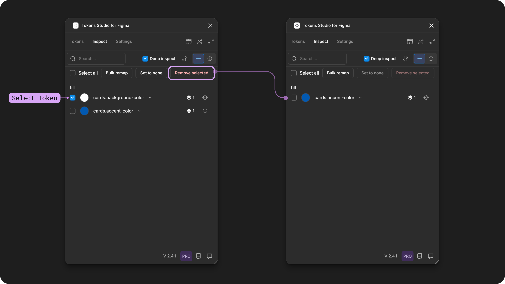

# Remove Tokens from Figma elements

## Remove Tokens from Figma Elements

You can remove a Design Token that has been applied to a design element in Figma from the Tokens page or Inspect page of the Plugin.

* This does not delete the Token from your project, it simply severs the connection that Tokens Studio has mapped to Figma based on your configuration.&#x20;
* If you delete a Token from your project, it does not automatically remove Token from your Design elements in Figma.&#x20;

→ [Jump to the guide on Deleting a Token for more details.](../manage-tokens/create.md#delete-a-token-from-your-project)&#x20;

<figure><figcaption>
In this example, a frame called card-container is selected on the Figma canvas.The Tokens page (on the left) and the Inspect page (on the right) in the Plugin are annotated to show where to remove a Color Token called cards.background-color that is currently applied to the frame deign element in Figma. 
</figcaption></figure>

It's important to note that not all Tokens can be removed using the Tokens Studio Plugin for Figma.&#x20;


Tokens that were applied with the Tokens Studio for Figma Plugin can be removed in the Plugin.&#x20;



Component instances with Tokens applied can not be removed by the Plugin. \
You either need to remove them from the main component or use the Set to None feature.&#x20;

→ [Jump to the Inspect Page guide for details on how the Set to None feature works.](../debug/inspect-tokens.md#c.-set-to-none)



Tokens applied using Figma native features must be removed using the Figma UI as the Plugin can not remove a Style or a Variable. The Inspect page of the plugin will show how the Token was applied.&#x20;

→ [Learn more about the Token Application symbols on the Inspect page of the Plugin](../debug/inspect-tokens.md#d.-token-application-symbol)


If you have a Token applied to a design element in Figma and you want to change it to a different Token, you can apply the new Token to the same property without needing to remove the original Token.&#x20;

***

### In the Plugin

There are two places in the Plugin you can remove Tokens:

1. Tokens Page - remove an individual Token to selected Figma elements.
2. Inspect Page - remove one of more Tokens to selected Figma elements.&#x20;

### 1. Tokens Page&#x20;

From the Tokens Page of the Plugin, you'll need to navigate to the Token Set where the Tokens applied to your selected Figma design elements live.&#x20;


You can identify Tokens that have been applied to the parent layer of your Figma design element by the ring around the Token preview.&#x20;


Selecting a Token with a ring on it will remove the Token from the Figma design elements (if they are not an instance of a component).&#x20;


When you remove certain Token Types, Figma may remove its styling!&#x20;

For example, when you remove a Color Token, Figma removes the color from the design element which may not be desired behaviour. However if you remove a Typography Token, the text properties will remain on the text element.&#x20;


<figure><figcaption>
In this example, a frame design element called card-container is selected on the Figma canvas. On the left screenshot of the Tokens Studio Plugin, the arrow points to a Color Token with a ring around it. Selecting that same Token by click/press/tab+enter removes the Token, shown in the example on the right which does not have a ring around the Token and the color of the selected frame has been removed. 
</figcaption></figure>

### 2. Inspect Page&#x20;

Select one or more design elements on the Figma canvas then navigate to the Inspect page of the Plugin. Tokens, Styles and Variables that have been applied will be listed.&#x20;


You can use the Deep Inspect feature to see Tokens applied to the current selected parent layer and all children layers.&#x20;

→ [Jump to the guide on Deep Inspect for more details.](../debug/inspect-tokens.md#b.-deep-inspect)


Select the Tokens you want to remove by ensuring the checkmark to the left of the Token name is visible, then select the Remove Tokens button. \
\
If the selected design element is not an instance of a component and the Token was applied using the Plugin (Figma style or variable symbols not present) the plugin will remove the Tokens.&#x20;

<figure><figcaption>
In this example, the Remove selected button on the Inspect page of the Plugin is used to remove a Token called cards.background-color. 
</figcaption></figure>

***

### Resources

Mentioned in this doc:

* Figma Learn - [Select layers and objects](https://help.figma.com/hc/en-us/articles/360040449873-Select-layers-and-objects)
* Figma Learn - [Apply changes to component instances](https://help.figma.com/hc/en-us/articles/360039150733-Apply-changes-to-instances)

#### Community resources:

* None yet!



#### Known issues and bugs

Tokens Studio Plugin GitHub - [Open issue for Remove Tokens](https://github.com/tokens-studio/figma-plugin/labels/token%20remove)



#### Requests, roadmap and changelog

* None yet.&#x20;



