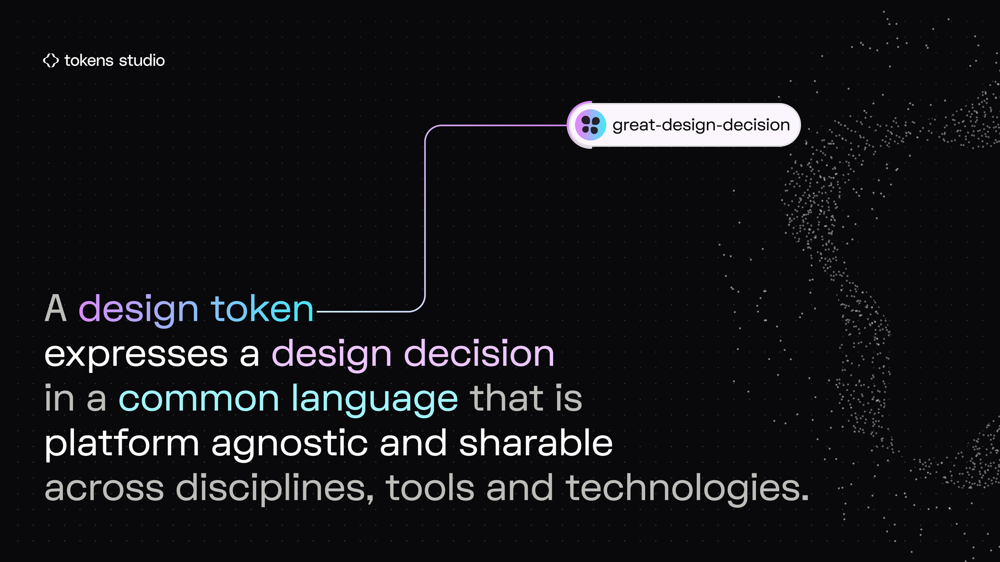
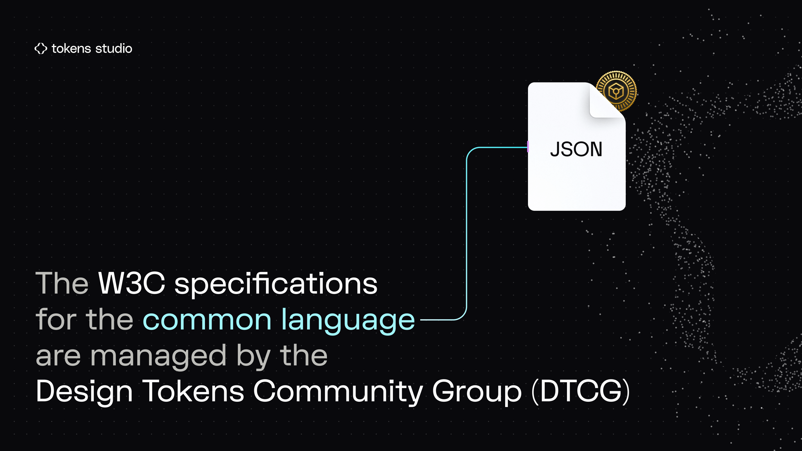
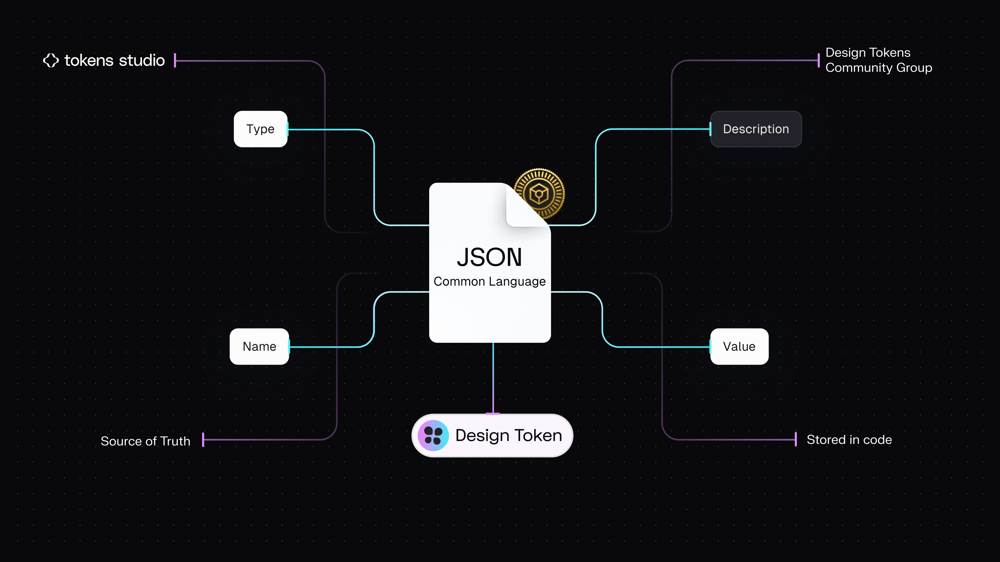
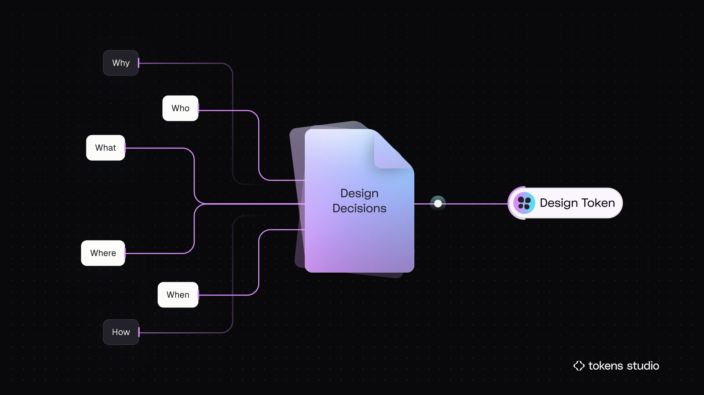
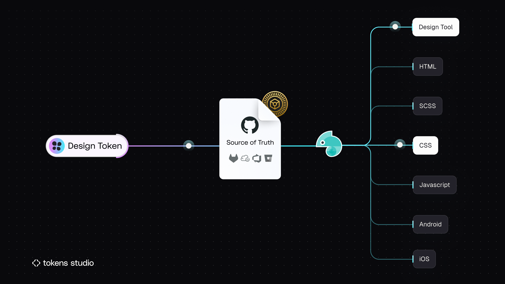
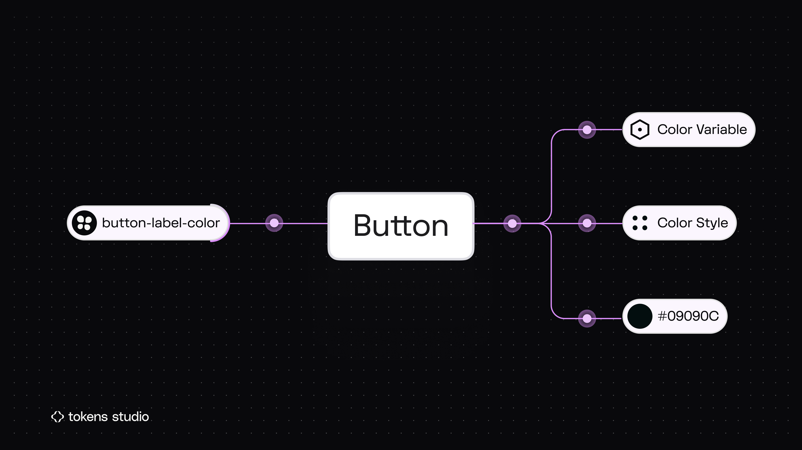
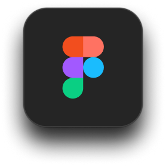
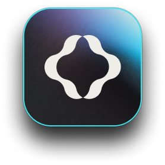
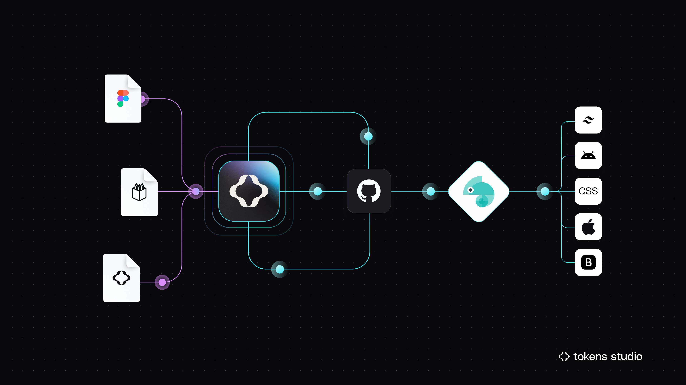

# Intro to Design Tokens

## What is a Design Token?

You might be wondering: _"What is a Design Token?"_

The answer depends on who you ask.

_Watch this 1min video clip of Sam from the Tokens Studio team explains what a Design Token is "like I'm 5" during an interview with Sil from the Into Design Systems conference._&#x20;



#### The original definition

The concept of Design Tokens originated at Salesforce, where [Jina](https://bsky.app/profile/jina.social) and [Jon](https://www.linkedin.com/in/jonnylevine) coined the term. A good explanation can be found on [Jina Anne's Youtube](https://www.youtube.com/watch?v=q5qIowMyVt8)

> "Design tokens are the visual design atoms of the design system — specifically, they are named entities that store visual design attributes. We use them in place of hard-coded values (such as hex values for color or pixel values for spacing) in order to maintain a scalable and consistent visual system for UI development." -  [Salesforce, Lightning Design System](https://www.lightningdesignsystem.com/design-tokens/)

#### Tokens Studio definition

The Tokens Studio team broadly agrees with the below definition:

<figure><figcaption></figcaption></figure>

The specifications for this common language can be found on the [**W3C community**](https://www.w3.org/community/design-tokens/) and business groups pages, which are managed by the [**Design Tokens Community Group**](https://www.designtokens.org/) (also referred to as DTCG throughout our docs).

### Design Tokens Community Group

<figure><figcaption></figcaption></figure>

A Design Token, according to the [DTCG W3C specifications](https://tr.designtokens.org/format/#introduction), is:

* a method to express design decisions
* platform-agnostic
* shareable across disciplines, tools, and technologies
* composed from a common vocabulary

Tokens Studio is working with the DTCG as they shape Design Token specifications. Our docs will highlight where and why our tools deviate from these specifications.

***

### Anatomy of a Design Token

A Design Token holds all the key pieces of information needed to communicate a design decision.

According to the Design Tokens Community Group (DTCG), a Design Token is made up of:

* **Name**: acts as the unique identifier of the design decision
* **Value**: the data for what was decided
* **Type**: the design property the decision applies to
* **Description** _(optional)_: additional context about the decision

Design Tokens live in JSON files. The DTCG specifications define this common language or how to format Tokens within their JSON files so they can be a shared source of truth across different tools and technologies.

<figure><figcaption>
Each anatomic part of a Design Token and how they connect the Common Language as defined by the Design Tokens Community Group. 
</figcaption></figure>

### Design Tokens are design decisions

This means that if you are thoughtful with how you structure your Design Tokens, you should understand the who, what, where, when, why, and how of every design decision at a glance.

These Design Decisions should be easily understood by everyone on your team - including engineers, other designers, stakeholders, and your future self!

This is what we mean when we say Design Tokens are a _shared source of truth_ for design decisions shared across cross-functional teams.

<figure><figcaption>
An illustrated analogy of the information captured by a Design Token. 
</figcaption></figure>

### Shared source of truth

When you sync Design Tokens to an external code repository, engineers can see your design decisions in code as platform-agnostic Tokens. Using a tool like [Style Dictionary](https://styledictionary.com/), they can transform the Design Tokens into any programming language or tool-specific code they need.

<figure><figcaption>
The gecko represents Style Dictionary in this infographic. 
</figcaption></figure>

When Design Tokens are applied to design elements in our design tool of choice, engineers can easily see the Token representing the designer's decision and then pull the details of the Token directly from the code.

<figure><figcaption>
Design Tokens can be applied to components or attached to reusable styles or variables in design tools.
</figcaption></figure>

This reduces the time it takes to communicate and understand design decisions, as Designers and Developers are essentially "speaking the same language" and working with a shared source of truth that lives in code.

When digital products are built with Design Tokens, it creates the foundation for a CICD pipeline between design and development, dramatically reducing the engineering effort to implement design changes.

***

### Tools to work with Design Tokens

Tokens Studio provides a suite of tools that allow designers to produce engineer-ready code so they can easily share design decisions with engineers and cross-functional team members.

<figure><figcaption>
In Tokens Studio, a Token Set is the no-code version of a JSON file.
</figcaption></figure>

### Tokens Studio Plugin for Figma

In Figma, the Tokens Studio Plugin provides a no-code interface to create and manage Design Tokens, connect Tokens to styles and variables, and easily sync to external code repositories for version control and a shared source of truth with engineers.&#x20;

→ [Learn more about the Plugin for Figma](https://tokens.studio/plugin)

### Tokens Studio Platform

For large organizations, agencies and freelancers, the Tokens Studio standalone platform provides powerful workflows that support integrations with other tools commonly used by cross-functional team members, including Framer, In Design, Blender, and PowerPoint, to name a few.

→ [Learn more about the Studio Platform, currently in Beta!](https://tokens.studio/studio)

### Native Design Tokens in Penpot

The Tokens Studio Team is collaborating with [Penpot](https://penpot.app/), an open-source alternative to Figma, to build a native solution to work with Design Tokens in a design tool.&#x20;

→ [Learn more about the Penpot and Tokens Studio collaboration.](https://tokens.studio/blog/bringing-design-tokens-to-penpot-an-open-source-collaboration-for-the-design-systems-community)

### **Style Dictionary**

Style Dictionary is most popular tool for transforming Design Tokens into development-ready code. While Style Dictionary was created by Danny Banks at Amazon, in August 2023 the Tokens Studio team, lead by Joren Broekema, officially joined the effort to grow the functionality of Style Dictionary. \
\
→ [Read the Tokens Studio x Style Dictionary collaboration announcement here.](https://styledictionary.com/version-4/statement/)

***

### Summary

Design Tokens capture design decisions used to scale a design system, and they include all the important information engineers need to bring big ideas to life quickly.&#x20;

You can use Tokens Studio in design tools or a standalone platform to work with Design Tokens in a no-code interface, then sync your Token JSON files to an external code repository to create a shared source of truth with Engineers.&#x20;

Those JSON files can be transformed by Engineers using Style Dictionary into whatever programming needs are required for the project.&#x20;

<figure><figcaption>
Tokens Studio can share code files of Design Tokens between Designers and Developers in their tool of choice. Style Dictionary is represented by the Geko, and it is used to transform the tech-agnostic JSON files into usable code. 
</figcaption></figure>

***

### Up next - Token Anatomy

Now that you've got the basics of what a Design Token is and what Tokens Studio does, let's take a closer look at each anatomic part of a Token, starting with the Types of Tokens available to work with.

Then you'll learn about Token Values as they are dependent on the Token Type, and how you can use the Description to add additional context about your design decision.&#x20;

We've saved the "best" for last, as Token Names are the most customizable part of working with Design Tokens.&#x20;

<figure><figcaption>
The four anatomic parts of a Design Token are next to code examples. Each part will be reviewed next. 
</figcaption></figure>

