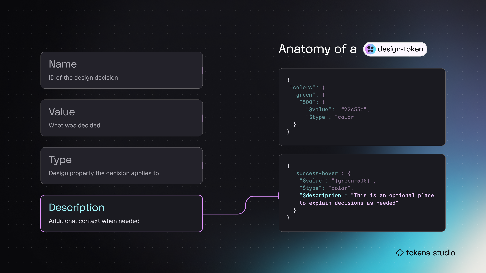
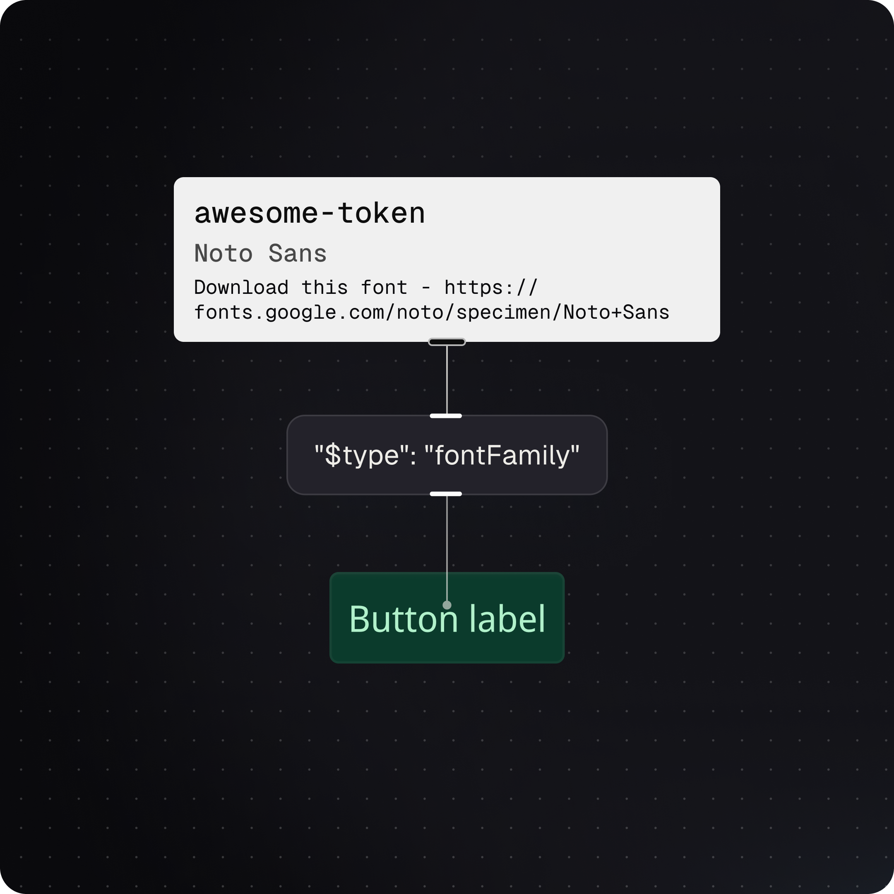

# Token Anatomy - Description

## Token Anatomy - Description

The `description` of a Design Token can be used to define additional details, like _**why**_ or _**how**_ we made this decision. The `description` is optional.&#x20;

<figure><figcaption>
In this infographic, the Token examples on the right side highlight the Description. Only the bottom example has a description. 
</figcaption></figure>

### Description = Additional context when needed

You can think of a Token's **description** as a place to add a note or reminder about this design decision for your engineers or future self.

For example, a Font Family Token may have a description with a link to download the files.

<figure><figcaption>
An infographic example of documenting a Font Family Token with a Description that includes a note and URL to download the Font.
</figcaption></figure>

### Descriptions are meta-data shared across tools and technologies.

Descriptions are technically meta-data, so the `description` is available anywhere a Token is utilized. Engineers can view the description in code and design tools often add the `description` to token properties.&#x20;

For example, if a brand color is bright and vibrant it may have limited use cases. Any constraints can be added to the `description` in the Token as below.&#x20;

> _Only use for brand logo and branded illustrations as this lime green is not accessible for interactive elements._

When that Token is attached to a color style in Figma, the `description` is visible to designers using Figma's native UI.&#x20;

The additional context you can add to the `description` of a Token helps cross-functional team members understand _**why**_ or _**how**_ they might use these design decisions in their own work.&#x20;

***

### Up next - Name

Next, let's explore the `name` of a Design Token as this anatomic property often provides an indication of design decisions that are detailed in the `description` .&#x20;

<figure><figcaption>
In this infographic, the Token examples on the right side highlight the Name. The top code block shows a Token Name with groups. The bottom code block shows a flat Token Name.
</figcaption></figure>
