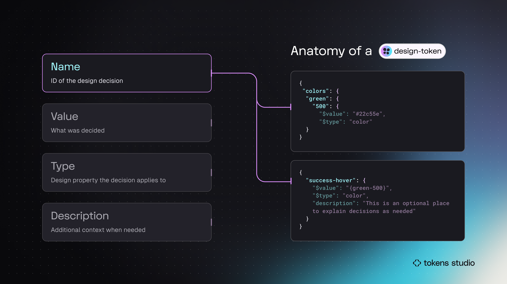
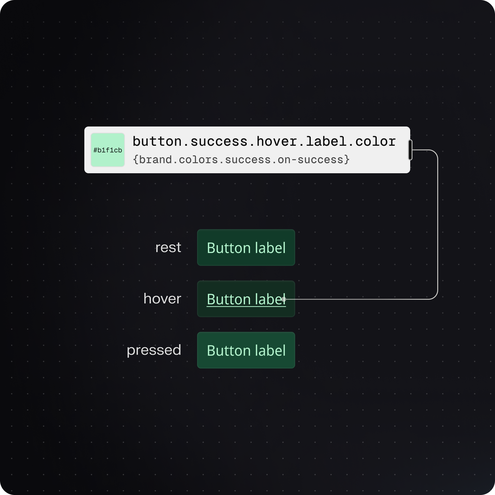

# Token Anatomy - Name

### Token Anatomy - Name&#x20;

The `name` of a Design Token tells us _**who**_, or which parts of our system, this design decision is intended for.&#x20;

<figure><figcaption>
In this infographic, the Token examples on the right side highlight the Name. The top code block shows a Token Name with groups. The bottom code block shows a flat Token Name.
</figcaption></figure>

### Name = the ID of the design decision

The `name` acts as the unique identifier for each design decision in the system and are the most customizable part of a Token's anatomy.

For example, a Token with a Name of `button.success.hover.label.color` _almost_ tells a story about the design decision without knowing anything else about the Token.&#x20;

`success` = This design decision applies to elements communicating a successful interaction, in this case, a `button` .

`label` = The Token belongs to a label, most likely a text element.&#x20;

`color` = Changes the color of the glyphs in the text layer.

`hover` = This decision only applies under the condition of a hover interaction.&#x20;

<figure><figcaption>
An infographic example of documenting a ColorToken with a Name specific to the component. 
</figcaption></figure>

### Great Token Names

**How** you write your Token Names is highly flexible, and there are many factors that go into creating the ideal Token Name templates (also called Token taxonomies), that will work for you, your project, and your team.&#x20;

So instead of suggesting "_the_ right way" to name your Design Tokens, we will share some of the qualities of a great Token Name, and link you to the technical specs so you can figure out "_your_ right way".&#x20;

A great name for a design token is:

* unique
* simple for humans and machines to read and remember
* specific to the type of decision being captured in the Token
* supportive of a well-organized Token structure
* foundational to automation between design and development processes
* scalable as the system matures.&#x20;

Check out this video clip from the Into Design Systems Conference 2024 where Sam from the Tokens Studio team talks about what makes a great Token Name.&#x20;



We have compiled the technical requirements of naming Tokens to help you get started. There are links to further learning resources from the community included in this guide.&#x20;


[technical-specs.md](../../manage-tokens/token-names/technical-specs.md)


***

### That's a wrap!

Now that you've learned the basics of what a Design Token is and each of its parts, you are ready to explore some of the broader concepts to deepen your Token knowledge, or jump into Tokens Studio to put what you've learned so far into practice!&#x20;


