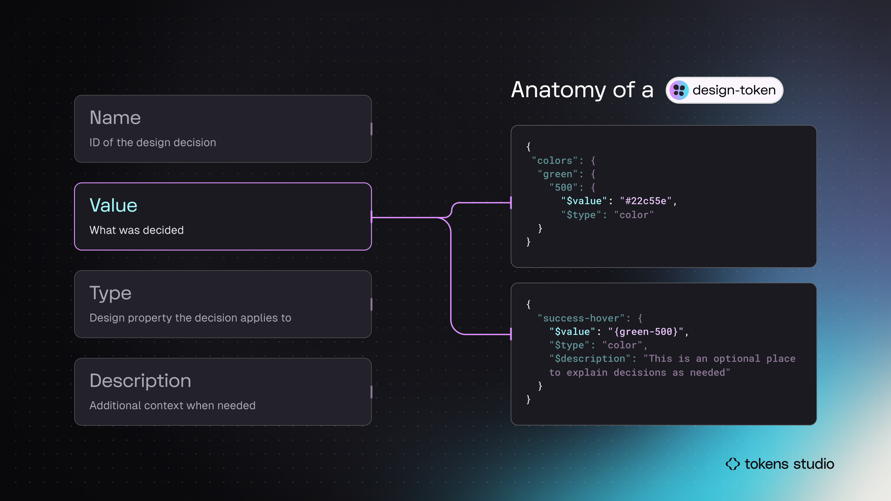

# Token Anatomy - Type

## Token Anatomy - Type

The `type` of Design Token defines which category of design property this decision belongs to, or _**when**_ it can be applied.

<figure><figcaption>
In this infographic, the Token examples on the right side highlight the Type. Both code blocks have <code>color</code>as the Token Type.
</figcaption></figure>

### Type = Design property

For example, the system could interpret a Token with a Value of `#22c55e` applied to a text layer as a string property to create a text element or a color hex code.

When we define a Token Type of `color` alongside the Value, it's much easier to communicate that this design decision is to be applied _when_ the **color** of a text element should be green.

<figure><figcaption>
An infographic example of documenting a Token with a value of <code>#b1f1cb</code> with a different application depending on the Token Type that is defined. 
</figcaption></figure>

### Token Types for design properties

There are many 'Official' Token Types are listed in the [W3C Design Tokens Community Group (DTCG) Specifications for Design Tokens](https://tr.designtokens.org/format/#types).

Most often, `type`matches a design property. For example, the `type` of Color can be applied to any design element requiring color.

The DTCG Specifications define how the Token is written depending on its `type`. For example, a Typography Token requires several design decisions to be composed into a single token, whereas a Color Token does not.

Tokens Studio supports 24 unique Token Types, and the DTCG is constantly adding new Token Types to the specification. &#x20;

<figure><figcaption>
The Tokens page of the Tokens Studio Plugin shows all Token Types supported. The list is quite long, so the page is scrolled and shown side-by-side to capture them all. 
</figcaption></figure>

_If you are ready to jump into Tokens Studio, this guide will walk you through the nuances of each Token Type._&#x20;


[token-types](../../manage-tokens/token-types/)


***

### Up next - Value

Next, let's explore the `value` of a Design Token as this anatomic property depends on the Token's Type.

<figure><figcaption>
In this infographic, the Token examples on the right side highlight the Value. The top code block shows a hard-coded value. The bottom code block has a value that references another Token. 
</figcaption></figure>


