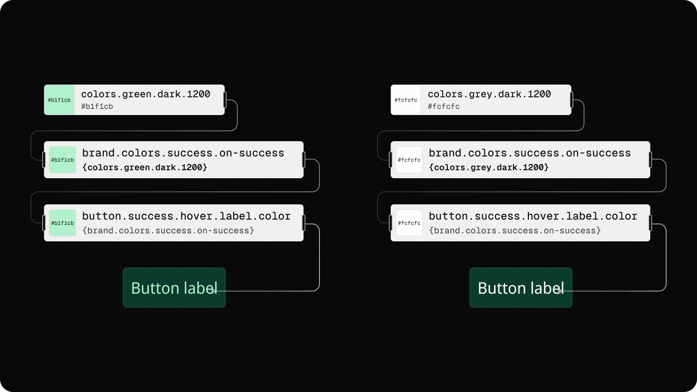

# Token Anatomy - Value

## Token Anatomy - Value

The `value` of a Design Token defines _**what**_ the design decision is and, in some cases, _**where**_ the decision came from.&#x20;

<figure><figcaption>
In this infographic, the Token examples on the right side highlight the Value. The top code block shows a hard-coded value. The bottom code block has a value that references another Token. 
</figcaption></figure>

### Value = What was decided

The **Values** that are possible for a Token are determined by its`type`.

For example, a hard-coded Value of `#22c55e` is possible when the **Token Type** is `color`, but not when it is `fontFamily`.

<figure><figcaption>
An infographic example of documenting a Token applied to the text layer of a button label with different values depending on the defined Token Type. 
</figcaption></figure>

The hard-coded values define _**what**_ the design decision is, and the specifications for what values are accepted for each Token Type is defined by the [Design Tokens Community Group](https://tr.designtokens.org/format/#types).&#x20;

### Values that reference another Token

While it's helpful to give a human-readable name to a hard-coded value, the real power of Design Tokens comes from referencing another Token.&#x20;

If you write the Value of a Token as the name of an existing Token in the system wrapped in curly brackets, it will inherit its value from the referenced Token.&#x20;

For example, looking at the value of a Color Token applied to the label of a button component, you can see it has a value of `{brand.colors.success.on-success}`and same value of `#b1f1cb.`

<figure><figcaption>
An infographic example of documenting a Color Token applied to the text layer of a button label. The Value of the Token directly applied is referencing another Token. Following the pathway of referenced Tokens as Values shows where the Color comes from in the system. 
</figcaption></figure>

So if you were to ask yourself, "where did the label color decision for the button come from?" the answer is, "it's coming from my band decisions for success colors".

Values that reference another Token define _**where**_ the design decision came from.

### Scaling systems with thoughtful references

The ability to reference another Token as a value creates a flexible and dynamic system which scales very quickly.

For example, if you decide that the text for success elements should be white instead of a light green, you only need to change the value of one Token (the `{brand.colors.success.on-success}` Token), and all components referencing it will change.&#x20;

<figure><figcaption>
An infographic example of documenting a Color Token applied to the text layer of a button label. The difference between the two buttons is the color of the label text which is controlled by the value of the middle Token. On the left side, it is referencing a Token from a <code>green</code>scale. On the right right, it is referencing a Token from a <code>grey</code>scale. 
</figcaption></figure>

### Scaling systems with math

In addition to hard-coded and references to other Tokens, Tokens Studio also supports math equations as the Value in compatible Token Types.

For example, you can create a Typography scale which is customized for different view-port sizes using a math equation.

### Summary

To sum it all up, the power of a Design Token lies in the flexibility of its Value.&#x20;

For design systems that support multiple themes, products, brands, or clients, using Token Values effectively means managing more design assets with the same components and minimal effort.

If you are ready to jump into Tokens Studio, this guide will through the more technical nuances of each Token Value you can work with in the Plugin for Figma.


[token-values](../../manage-tokens/token-values/)


***

### Up next - Description

Next, let's explore the `description` of a Design Token as this anatomic property can help provide additional context about your design decisions.&#x20;

<figure><figcaption>
In this infographic, the Token examples on the right side highlight the Description. 
</figcaption></figure>

