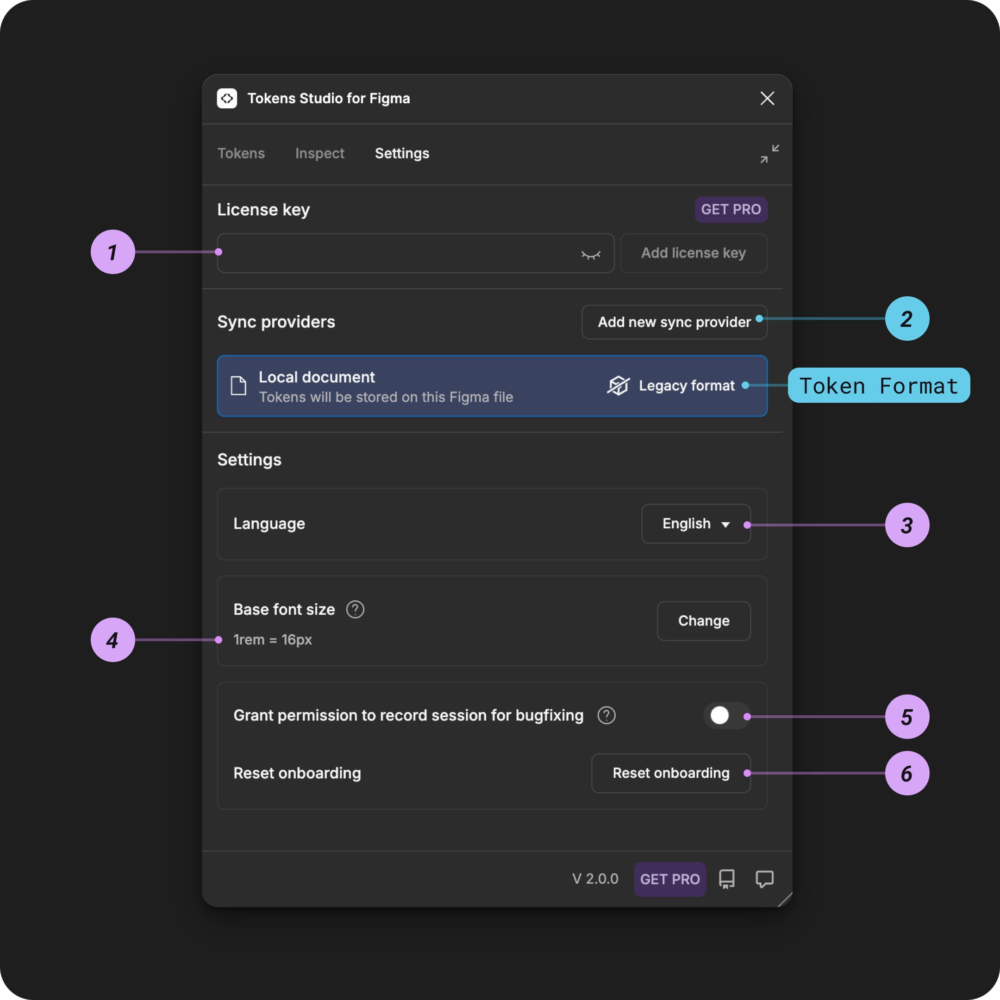

# Settings Page - Figma Plugin Tour

## Settings Page - Figma Plugin Tour

The Settings Page is where you configure the Plugin based on your personal preferences.&#x20;

There are 6 main sections on the Settings page:

1. Licence Key
2. Sync to Remote Storage Providers
3. Plugin Language&#x20;
4. Base Font Size
5. Debug ID for our support team
6. Reset Onboarding

<figure><figcaption></figcaption></figure>

### 1. License key

When you upgrade to a pro licence for Tokens Studio, you add the key here.

[_→ Jump to the pricing page for more details on the Pro licence_](https://tokens.studio/pricing)

### 2. Sync providers

By default, Tokens Studio will store your design tokens locally in the Figma file you are working in, but their true power is unleashed when they can be synced with code.

You can manage your sync providers from the **Settings Page**.


[remote](../../token-storage/remote/)


<figure><figcaption></figcaption></figure>

### 3. Plugin Language

The plugin supports multiple languages thanks to the generous contributions of our open-source community members! ✨

Use the **Language Selector** to choose from:

* English
* French
* Dutch
* Chinese
* Hindi
* Spanish

Want to contribute to add a new language? Reach out to us on our [community slack!](https://tokens.studio/slack)

### 4. Base font size setting

The plugin sets the Base Font Size to 16px by default. To change this value, use the Change button and follow the prompts.


[base-font-size.md](../../manage-settings/base-font-size.md)


### 5. Permission for session recording

Enabling this setting creates a unique ID that can be shared with the Tokens Studio support team to help troubleshoot issues you might be having.

The recorded telemetry data collected is anonymized and is not shared with any third parties.

You can leave this setting disabled until a support team asks you to turn it on.

### 6. Reset onboarding

If it's been a while since you used the plugin, this setting will open the onboarding content we show new users to the plugin.

