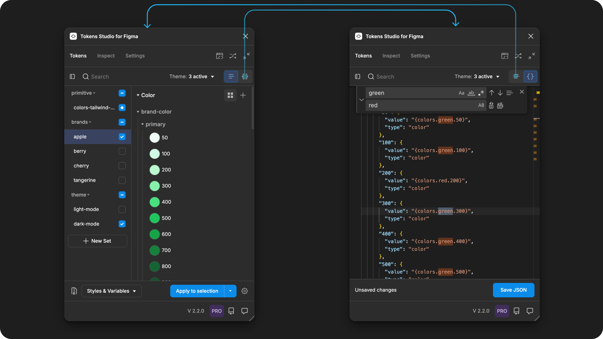

# Tokens Page - Figma Plugin Tour

## Tokens Page - Figma Plugin Tour

The Tokens Page is where most of the magic happens within the Tokens Studio Plugin for Figma.

There are four main sections on the Tokens Page:

1. Plugin Controls
2. Token Sets
3. Design Tokens
4. Figma Project Actions&#x20;

<figure><figcaption></figcaption></figure>

### 1. Plugin controls for the Tokens Page

The actions at the top of the Tokens Page control how the Plugin displays the Tokens Sets and Design Tokens below.

A. Token Set Visibility

B. Token Name Search

C. Theme Selector

D. Token View Toggle

<figure><figcaption></figcaption></figure>

#### A. Token Set visibility

This action will toggle the left sidebar section below it to hide or show the Token Sets within it.

It's super handy for when you need more space to work with your Design Tokens!

<figure><figcaption>
A side-by-side view of the Tokens Page with the left sidebar of Token Sets collapsed on the right side and expanded on the left side. The control to toggle this view is highlighted. 
</figcaption></figure>

#### B. Search for a Design Token by name

When you type in the search input, the Design Tokens with names that match will appear below.

<figure><figcaption></figcaption></figure>

It's important to note that the search is limited to the current Token Set being viewed, as indicated by the highlighted container around the Token Set Name.&#x20;

If you select a new Token Set, the same search query will apply to the new set.

You can backspace to clear the search, or use the `X` icon on the right side of the input.

<figure><figcaption></figcaption></figure>

#### C. Themes selector

Themes (Pro) are groups of Token Sets you can define to unlock some powerful workflows.

The current number of active Themes is always visible. Select this control to open the Themes menu to manage your Themes or change which Themes are active.

If you don't have a Pro licence and you are working in a file with Themes, you can select Themes to be active but you can not edit, remove, or create Themes.

<figure><figcaption></figcaption></figure>

→ Read the guide on Themes and the powerful workflows that come with it.

#### D. Token View - JSON editor

The Tokens Studio Plugin is a no-code way for Designers to write Design Tokens to be used in code without needing to write actual code.

Each Token Set in Tokens Studio represents a JSON file under the hood. To work with your Tokens in code files, use the Token View toggle between the JSON and List view of your Design Tokens.&#x20;

<figure><figcaption></figcaption></figure>


If you are familiar with [VS Code](https://code.visualstudio.com/), you'll feel right at home, as the keyboard shortcuts and actions are the same.


### 2. Token Sets

Tokens Studio provides a suite of tools that allow designers to produce engineer-ready code so they can easily share design decisions with engineers and cross-functional team members.

<figure><figcaption></figcaption></figure>

Token Sets in the Plugin are the no-code home for your Design Tokens. Each Token Set represents a JSON file under the hood.

<figure><figcaption></figcaption></figure>

Controlling the status and order of your Token Sets allows you to quickly change how the Plugin interacts with design elements, styles and variables in Figma.

→ Read the comprehensive guide to Token Set management.

### 3. Design Tokens

Once you select a Token Set from the left-side menu, the Design Tokens living in that JSON file are displayed on the right.

The plugin organizes Design Tokens by their Type, then Name.&#x20;

Tokens Studio supports 24 unique [Token Types which you can explore when you are ready.](../../manage-tokens/token-types/)

<figure><figcaption></figcaption></figure>

ADD IMAGE POPULATED

### 4. Token Data Actions

The actions at the bottom of the Tokens Page configure how the data within the Plugin interacts with Figma.

#### A. Tools for data management

Each Figma file is a Token project full of code files the Plugin is interacting with. If you want to download your plugin project from this file so you can move it or replicate it elsewhere, the export option enables this.

Then in a new Figma file, you can use the import option to bring in what you exported from the previous file. It's important to note that the files will be independent of each other.

ADD IMAGE

Alternatively, you can sync your Tokens to a remote storage provider using the plugin if you'd rather work in the cloud or want to keep your Token projects connected across multiple Figma files.

→ Read the Sync and Token Storage Guide for more details.

#### B. Styles and Variables

Selecting the Styles and Variables action opens up the menu options to connect your Design Tokens with Figma's Styles and Variables.

→ Read the Styles and Variables Guide for a complete walkthrough.

#### C. Apply Token Data

Selecting the Apply Tokens action starts to scan your Figma file, looking for nodes connected to the Design Tokens in the Plugin based on how you've configured the options in the menu.

These options tell the plugin how much of your Figma file it should scan, and how it should apply your Token data.

→ To learn about the Apply Token options and when to use them, check out the GUIDE NAME HERE.

#### D. Settings

WIP
