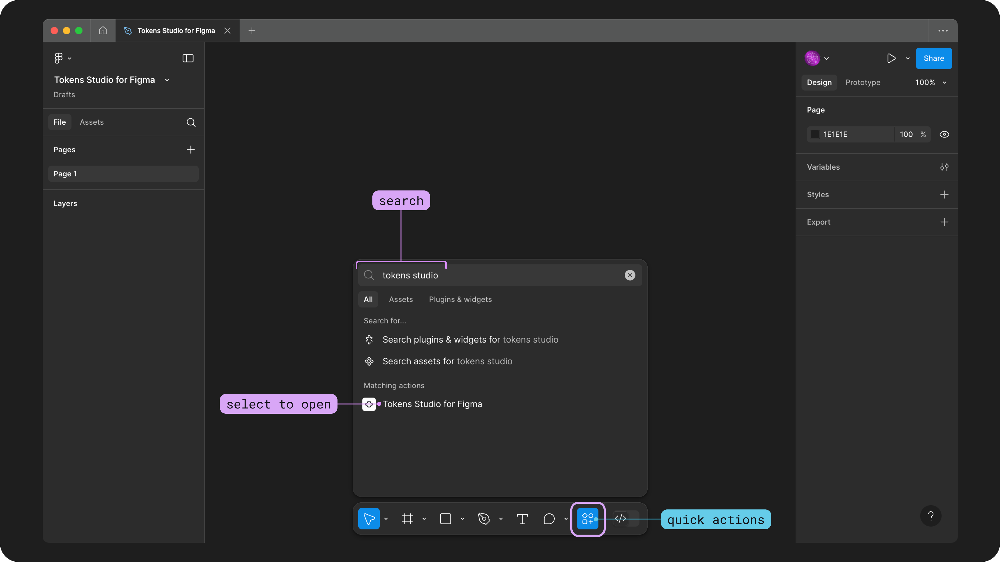

# Install the Figma Plugin

## Install the Tokens Studio Plugin for Figma

It's quick and easy to get the Tokens Studio Plugin for Figma ready for use in your Figma files.&#x20;

1. Navigate to the [Tokens Studio Plugin page](https://www.figma.com/community/plugin/843461159747178978/tokens-studio-for-figma) in the Figma Community.&#x20;
2. Select the ribbon icon button to Save the Plugin to your Figma account.&#x20;

That's it! You can now open the Tokens Studio Plugin in any of your Figma files.&#x20;

<figure><figcaption>
The Tokens Studio Plugin page on the Figma Community is pictured with an icon button featuring a ribbon symbol is annotated with a label that says "save plugin". 
</figcaption></figure>

→ [Head to the Tokens Studio Plugin page on the Figma Community. ](https://www.figma.com/community/plugin/843461159747178978/tokens-studio-for-figma)

The Plugin is free to use! There are some advanced features that require a Pro licence but you don't need one to get started exploring the Plugin.&#x20;

→ [Learn more about what a Pro licence unlocks here.](pro-licence.md)

### Open the Plugin&#x20;

Once you've saved the Plugin to your Figma account, you can open it in any Figma file.&#x20;

There are several ways to open a Plugin in Figma and their UI is always changing.&#x20;


If the steps below aren't working for you, check out Figma's official docs on working with plugins for the most up to date instructions. \
\
→ [Figma Learn - Use plugins in files](https://help.figma.com/hc/en-us/articles/360042532714-Use-plugins-in-files)


#### Quick actions menu for plugins

You can use Figma's quick actions menu to search for Tokens Studio.&#x20;

Open the quick actions menu by keyboard shortcut:

* On a mac computer : command + p&#x20;
* On a windows/linux computer : control + p&#x20;

Or, you can press the icon button at the bottom of the interface with four geometric shapes tp open the menu.&#x20;

Once you search for "Tokens Studio", select it to open the Plugin.&#x20;

<figure><figcaption>
The Figma UI is shown with the quick actions button annotated. The search input has "tokens studio" entered and the results show the Tokens Studio for Figma plugin listed as a matching action. An annotation is pointing at the matching action labelled "select to open". 
</figcaption></figure>

Once the Plugin is open, you are ready to start a new Token Project to explore the Plugin.&#x20;
