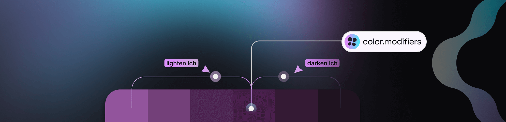

# Pro Licence for the Figma Plugin

## Pro Licence - Tokens Studio Plugin for Figma

While we'd love for everyone to have a pro licence to unlock the full power of the Plugin for Figma, the reality is that not every person working on a Tokens Studio powered project needs one. \
\
Generally speaking:

* Designers maintaining Design Systems powered by Design Tokens would benefit from a pro licence.&#x20;
* Designers wanting to sync Variable Collections (with multiple modes) to a code repository would benefit from a pro licence.
* Designers who require view only/read access to your Token projects do not need a pro licence.&#x20;
* Engineers inspecting Figma files requiring access to the Plugin do not need a pro licence.&#x20;
* Design systems teams who are scaling quickly may benefit from our more powerful tool, the Tokens Studio Platform, a dedicated Token management application.&#x20;

→ [Learn more about the Studio Platform ](https://tokens.studio/studio)

Below you'll find each of the features exclusive to pro licence holders and a breif description of what you can and can't do without a pro licence.&#x20;

1. [Themes management](pro-licence.md#themes-management)
2. [Color modifiers](pro-licence.md#color-modifiers)
3. [Branch management when syncing Tokens to external storage providers](pro-licence.md#syncing-tokens-to-external-storage)
4. [Visual flow and table views of your Token projects](pro-licence.md#visual-flow-and-table-view-of-tokens)

### Frequently Asked Questions

Select a question to reveal the answer.

Where can I find pricing details on the Pro licence?

The pricing page has the most up to date details based on your geographic region.

[https://tokens.studio/pricing](https://tokens.studio/pricing)

Where can I add a licence key in the Plugin to turn on pro?

The Settings page of the plugin is where you can enter your licence key.&#x20;

[#id-1.-license-key](../manage-settings/plugin.md#id-1.-license-key "mention")

How can I change my email address on my Tokens Studio account for my pro licence access?

You can change the e-mail of your Tokens Studio account at [account.tokens.studio](https://account.tokens.studio/)\
Once logged in, you can choose 'Edit billing' in the left panel. \
You can update the billing information, including the e-mail.\
\
**Note:** this e-mail is **not** linked to the actual access to the Pro features in the plugin, but only for the account page and billing related communication.&#x20;

***

<figure><figcaption></figcaption></figure>

### Themes Management

The Themes feature in Tokens Studio allows you to define combinations of Token Sets that are intended to be applied together to style design elements. Under the hood, the Plugin creates a themes configuration file that can be shared with developers and used in code.&#x20;

Multiple Themes can be applied at the same time to create a matrix of possible concepts that a single design element can be styled with. This is also known as _multi-dimensional theming_.&#x20;

Here's the breakdown of what you can do with Themes depending on your licence:

| Pro Licence                              | Free Licence                                                      |
| ---------------------------------------- | ----------------------------------------------------------------- |
| Create a new Theme                       | Apply Tokens included in Themes to design elements in Figma       |
| Update existing Theme                    | Toggle Themes on/off to apply styling to design elements in Figma |
| Delete a Theme                           |                                                                   |
| + Everything free licence holders can do |                                                                   |

The Themes feature creates additional data that can be shared with Figma, which unlocks several powerful workflows:&#x20;

* Connecting design tokens to Variable Collections with multiple Modes.&#x20;
* Styles attached to your Tokens can be managed in the Plugin or Figma.
* Non-local Variable Collections and Styles that retain their references to a published libraries in a different Figma files by syncing your Themes to your external Tokens Storage provider.&#x20;

→ [Jump to the guide on Themes for more details.](../manage-themes/themes-overview.md)

***

<figure><figcaption></figcaption></figure>

### Color modifiers

**Color Modifiers** allow you to easily create consistent, scalable color systems by adjusting and blending colors with fine-grained control within Tokens Studio.&#x20;

Modifying your Color Tokens is a powerful way to create dynamic color schemes.&#x20;

For example:

* Generate a color ramp from a single 'base color'.
* Introduce subtle variations between interactive states.

| Pro Licence                                | Free Licence                                |
| ------------------------------------------ | ------------------------------------------- |
| Create new modified Color Tokens           | Apply modified Color Tokens                 |
| Advanced color spaces - LCH, SRGB, P3, HSL | Create colors in Hex, RGB, RGBA, ARGB, HSLA |
| Edit existing modified Color Token         |                                             |
| + Everything free licence holders can do   |                                             |

***

<figure><figcaption></figcaption></figure>

### Syncing Tokens to External Storage

If you are working with one of the supported Git sync providers, you can take advantage of version control workflows and advanced token storage options.&#x20;

Here's the breakdown of what you can do with syncing to External Storage depending on your licence:

| Pro Licence                                            | Free Licence                                      |
| ------------------------------------------------------ | ------------------------------------------------- |
| Sync Tokens as a folder with multiple files.           | Sync Tokens to all Git providers.                 |
| Create a new branch in a connected Git repository.     | Sync Tokens as a single file to any Git provider. |
| Switch between branches in a connected Git repository. |                                                   |
| + Everything free licence holders can do               |                                                   |

→ [Read the guide on Branch Switching (pro) for more details.](../token-storage/remote-branch-switch.md)

***

### Visual Flow and Table View of Tokens&#x20;

Pro licence holders will notice additional navigation actions on the Tokens Page of the plugin. Selecting either the Token Flow or Second Screen icon buttons will open these features in a web browser to unlock additional ways of viewing the relationships between Tokens.&#x20;

Free licence holders will not see these icon buttons.&#x20;

&#x20;
