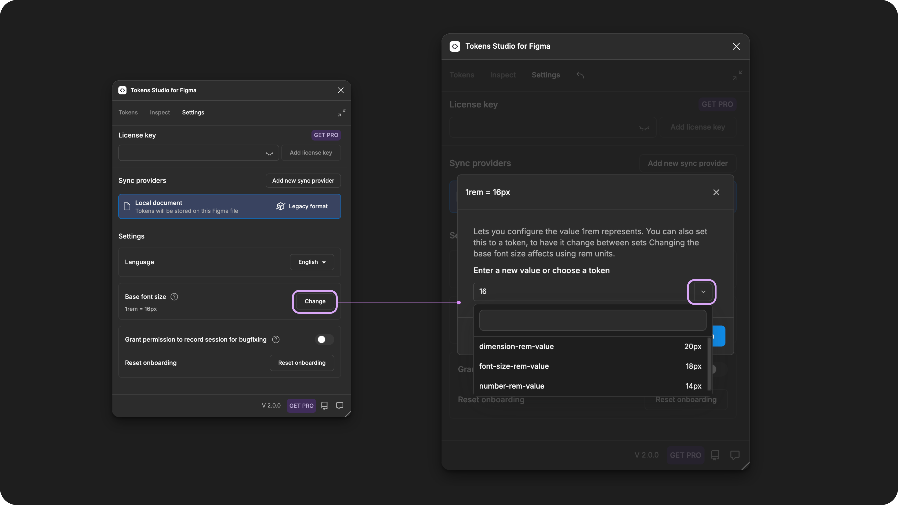
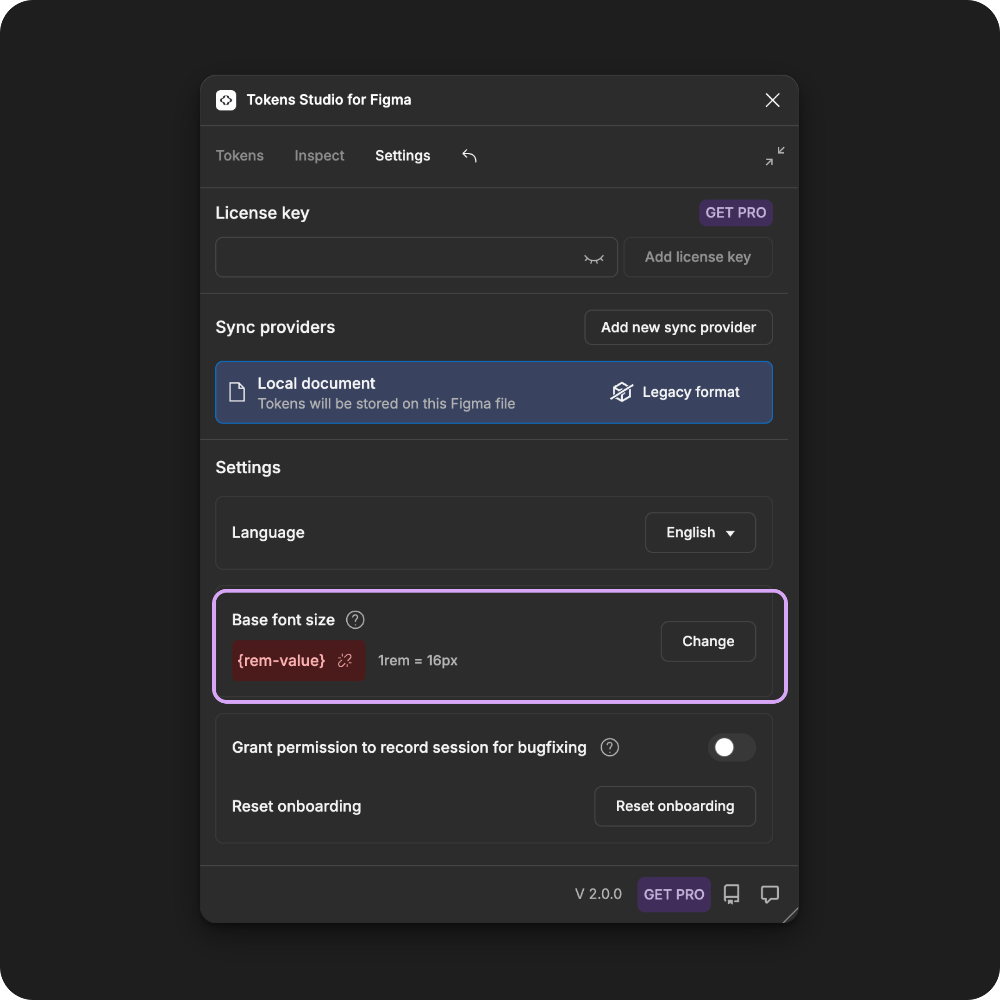

# Base Font Size Setting

## Base font size setting

The **Base Font Size** provides the value for `1rem` in the plugin.

<figure><figcaption></figcaption></figure>

This feature not only supports responsive design decisions but also ensures the adaptability of the design, similar to how engineers work in code.

When you assign a Token's value in rem units, the property is related to the Base Font Size, which the user of your product or website can adjust.

* For example, if the user increases the font size or uses a zoom feature, all design properties defined in `rem units` will respond accordingly.

In contrast, design elements defined in `pixels` will remain the same regardless of the user settings.

Figma does not support `rem units` in Design Mode, but it will show a loose conversion of rem units in Dev Mode, always assuming 1rem = 16px.

### In the plugin

When working with the Tokens Studio plugin for Figma, it automatically converts `rem units` to `pixels` for you.

The value of the **Base Font Size** is `16px` by default, but it can be changed.

* The plugin supports the value of the **Base Font Size** token to reference another token if desired.
* This could be helpful for sophisticated token structures, where a different Base Font Size is defined for each brand or theme.



#### View the current base font size setting

Navigate to the **Settings Page** in the plugin.

* Scroll down to the **Base Font Size** section.

You will see:

* The current value of `1rem` unit

### Change the base font size setting

Navigate to the **Settings Page** in the plugin.

* Scroll down to the **Base Font Size** section.
* Select the **Change Button** to the left of the current value being displayed.
* The **Change Base Font Size Modal** will open
* Enter a new value in the form field:
  * **Hard-coded value** in `pixels`
    * For example: `18px`
  * **Reference a token** by typing it's name in curly brackets or selecting the dropdown button
    * For example: `{rem-base}`
    * The compatible token types you will see are `number`, `dimension` and `fontSize`
* Select the **Confirm Button** to save your changes.
* The new value for `1rem` will appear in the **Base Font Size** settings.

<figure><figcaption></figcaption></figure>

### Importing Variables

ADD A BLURB HERE OF HOW IT WORKS


[import](../figma/import/)


***

### Limitations and known issues

When working with the plugin's Base Font Size setting, there are a couple of things to be aware of.

#### The setting follows you across Figma files

The **Base Font Size** setting in the plugin is related to your Tokens Studio user account.

* This means the setting is **not** specific to your Figma file or sync provider.
* Changes made to this setting will apply to every Figma file.

If you work on many projects with different values for this setting, it is a good practice to check the **Base Font Size** value each time you open a new Figma file.

> THERE IS AN ISSUE OPEN TO FIX THIS WITH THE MIGRATION ASSISTANT PROJECT

If the plugin can not find the token referenced in the setting, you will see a **Broken Token icon** next to the value as a reminder to change it.

<figure><figcaption></figcaption></figure>

#### Values to watch for

There is a known issue with the form field, where it accepts some values that it should not. Until the issue is fixed, you'll want to avoid:

* Values with rem units
  * The plugin will drop the unit and assume the number is the value in pixels.
  * For example, `1rem` will be `1px` as the value
* Empty value
  * The plugin will assume `16px` when the input is empty.
* Typos in the value
  * Incomplete references can be saved but will appear as broken on the settings page.
  * For example, `{base-token` is missing the closing curly bracket `}`

***

### Resources

CSS resources:

* MDN Web Docs - [CSS Values and Units](https://developer.mozilla.org/en-US/docs/Learn/CSS/Building_blocks/Values_and_units)

Community resources:

* None yet!



#### Known issues and bugs

Tokens Studio Plugin GitHub - [Open issues for Settings Base Rem Value](https://github.com/tokens-studio/figma-plugin/labels/setting%20base%20rem%20value)



Requests, roadmap and changelog

* None yet!


