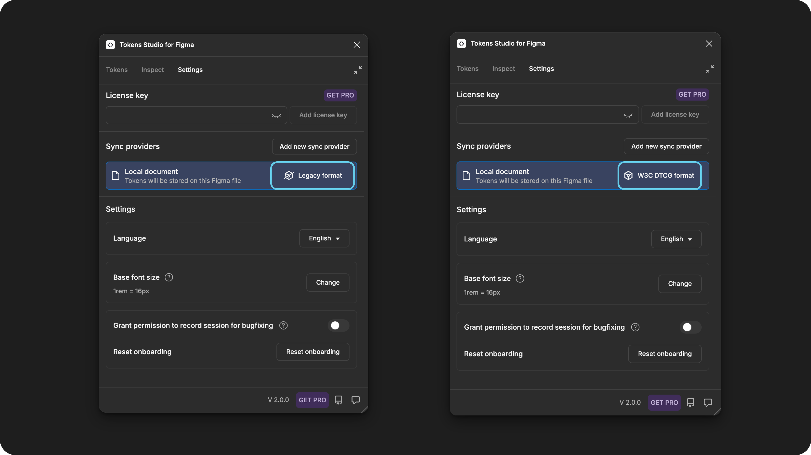

# Plugin Settings

## Plugin settings

The **Settings page** is where you can make personalized configurations to the plugin.



<figure><figcaption>
The Plugin Setting Page with annotations to match the features below.  The configuration shown here is "default" before any changes are made. 
</figcaption></figure>

### 1. License key

When you upgrade to a pro licence for Tokens Studio, you add the key here.

* Be sure to press the **Add licence key** button when you are finished.

It's a good idea to keep a copy of your licence key handy wherever you safely store your passwords.

You can always grab it again by [logging into your Tokens Studio account](https://account.tokens.studio/email-login)

If you haven't upgraded to pro yet, select the **GET PRO** button by the licence key input to open a browser page with more details.

### 2. Sync providers

By default, Tokens Studio will store your design tokens locally in the Figma file you are working in, but their true power is unleashed when they can be synced with code.

You can manage your sync providers from the **Settings Page**.


[remote](../token-storage/remote/)


<figure><figcaption></figcaption></figure>

#### Token format

To support moving towards the W3C Specifications for Design Tokens, as managed by the Design Tokens Community Group (DTCG), you can choose a Design Token Format that defines how tokens are written in their JSON files.


[token-format.md](token-format.md)


<figure><figcaption></figcaption></figure>

### 3. Language settings

The plugin supports multiple languages thanks to the generous contributions of our open-source community members! ✨

Use the **Language Selector** to choose from:

* English
* French
* Dutch
* Chinese
* Hindi
* Spanish

Want to contribute to add a new language? Reach out to us on our [community slack!](https://tokens.studio/slack)

### 4. Base font size setting

The plugin sets the Base Font Size to 16px by default. To change this value, use the Change button and follow the prompts.


[base-font-size.md](base-font-size.md)


### 5. Permission for session recording

Enabling this setting creates a unique ID that can be shared with the Tokens Studio support team to help troubleshoot issues you might be having.

The recorded telemetry data collected is anonymized and is not shared with any third parties.

You can leave this setting disabled until a support team asks you to turn it on.

### 6. Reset onboarding

If it's been a while since you used the plugin, this setting will open the onboarding content we show new users to the plugin.

***

### These settings have moved

The plugin's V2 release made some major changes to the way we work with Styles and Variables in Figma.

As a result, we moved the related settings to the new **Export to Figma** workflow, in the **Options menu**.

* Ignore first part of token name for styles.
* Prefix styles with active theme name


[options.md](../figma/export/options.md)


***

### Resources

Community resources:

* None yet!



#### Known issues and bugs

Tokens Studio Plugin GitHub - [Open issues for Settings - Plugin Page](https://github.com/tokens-studio/figma-plugin/labels/settings%20-%20plugin%20page)

Tokens Studio Plugin GitHub - [Open issues for Licence Key](https://github.com/tokens-studio/figma-plugin/labels/Licence%20Key)



#### Requests, roadmap and changelog

* None yet


