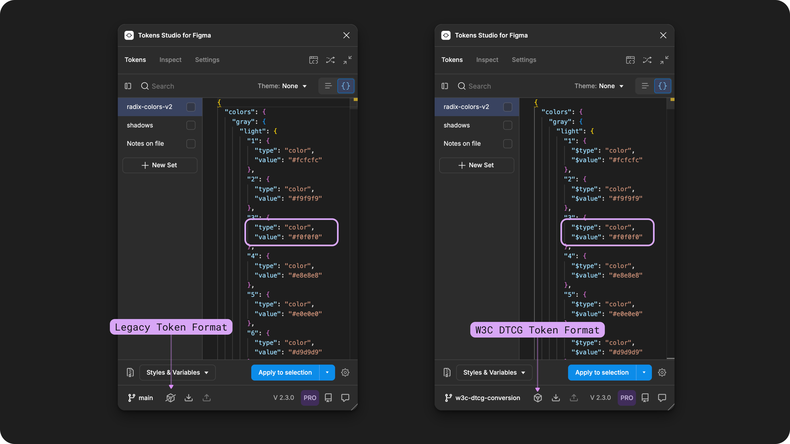
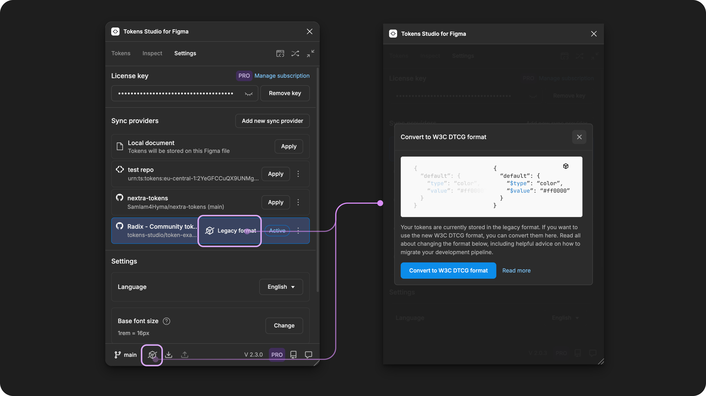
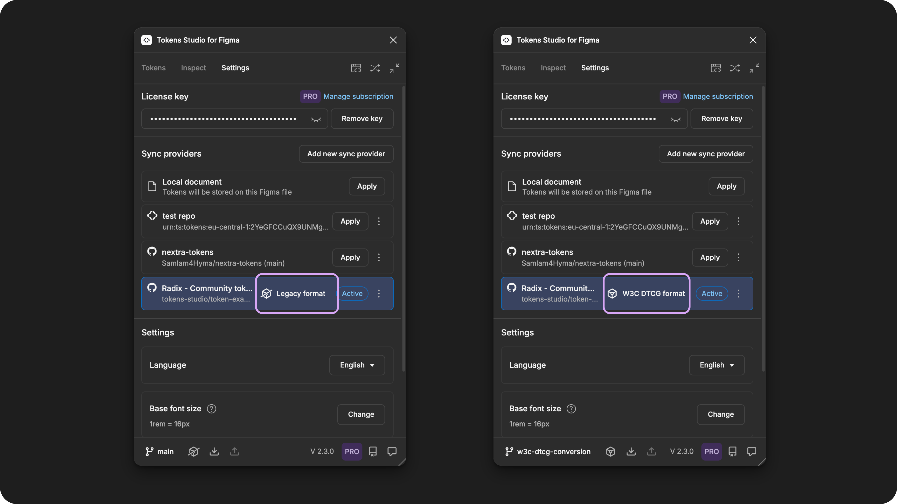
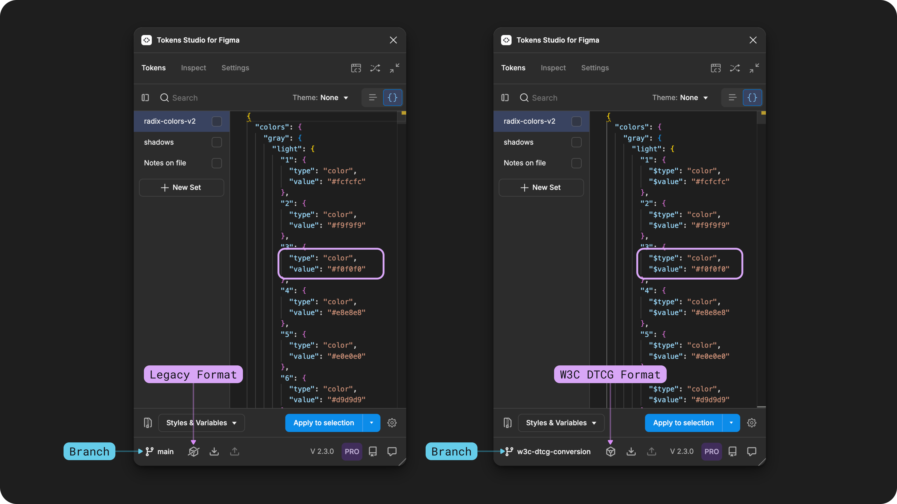
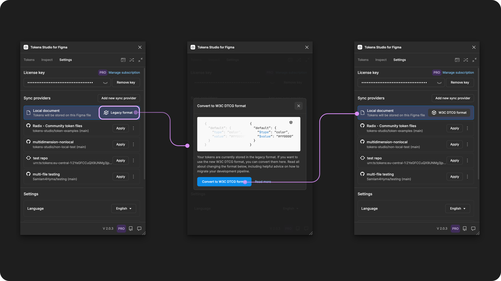
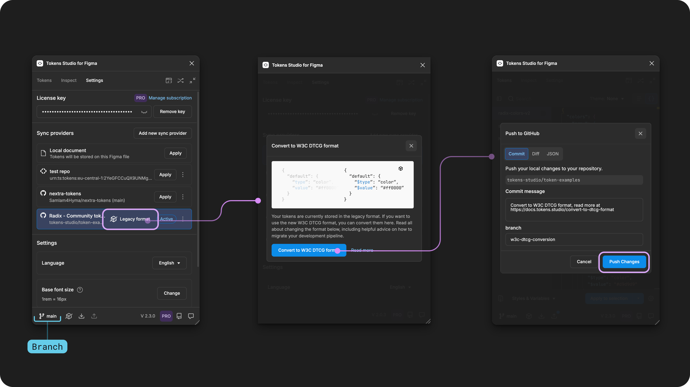
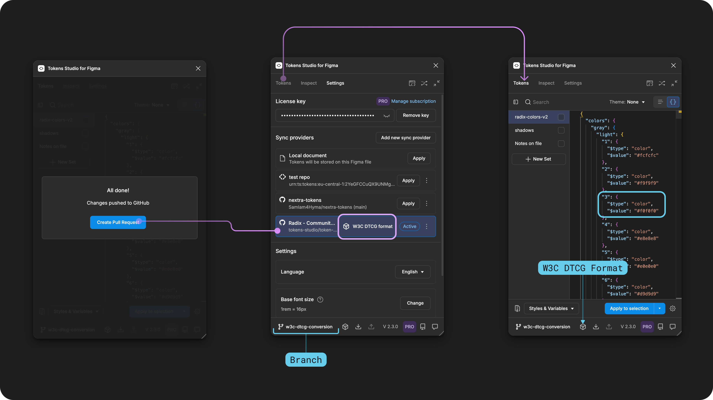

# Token Format - W3C DTCG vs Legacy

## Token formats W3C DTCG vs Legacy

In support of moving towards the [W3C Specifications for Design Tokens](https://tr.designtokens.org/format/), as managed by the Design Tokens Community Group (DTCG), you can choose a Design Token Format (how tokens are written in their JSON files) from within the Tokens Studio Plugin.

* Current Tokens Studio "legacy" format
* W3C DTCG spec format

<figure><figcaption>
From the Tokens Page of the plugin, the JSON view is selected and annotated to show the difference between Token Formatting. The image on the left shows "legacy" Token Format. The image on the right shows "W3C DTCG" Token Formatting.  
</figcaption></figure>

### What's the difference?

The DTCG format prefixes the properties of a design token in the JSON file with the dollar sign (`$`)

* `$value`
* `$type`
* `$description`

Restrictions of special characters in token names are introduced to support this:

* `{`
* `}`
* `$`

When creating Token names with these characters, an error message appears, and the action is blocked.

→ [Learn more about Token Names based on their Technical Specifications.](../manage-tokens/token-names/technical-specs.md)


The DTCG [specifies additional token types](https://tr.designtokens.org/format/#types) and their accepted values, which we will support in future releases.


***

### In the plugin

The choice of Token Format can be defined for Tokens stored in the local file or remote via a sync provider. For Git sync providers, different branches can have different Token Formats.

You can select a token format in two locations:

1. Plugin settings > sync/storage providers.
2. Sync actions at the bottom of the plugin when a remote storage provider is active.&#x20;

<figure><figcaption>
In the Plugin, you can initiate the Token Format conversion process from the Settings Page by selecting the Format for the current Token Project or the Sync Provider Actions at the bottom of the Plugin. 
</figcaption></figure>


You can change between the W3C DTCG and Legacy token formats at any time by following the steps below.


### 1. Settings page

On the plugin's settings page, you can see the **Token Format** being used in your file next to your token storage provider.

* The default is `legacy format`
* When you make the switch, you'll see `W3C DTCG format`

**Tokens stored on the local document**

If your tokens are stored locally in the Figma file (no external storage or sync providers), the **Token format action** is to the right of the **local document** option.

<figure><figcaption>
The Settings page of the Plugin is shown with the Token project data stored locally. The image on the left shows the Token Format as "legacy". The image on the right shows the Token Format as "W3C DTCG". 
</figcaption></figure>

**Tokens stored externally**

When your tokens are stored externally via **Sync providers** the **token format** for the active sync provider will show.

The **token format** for other sync providers will be hidden.

<figure><figcaption>
The Settings page of the Plugin is shown with the Token project data synced to Github. The image on the left shows the Token Format as "legacy". The image on the right shows the Token Format as "W3C
</figcaption></figure>

### 2. Sync actions

When synced to external storage, the current **token format** also appears at the bottom of the plugin alongside the other **Sync provider actions**.

It's possible for different branches of a sync provider to have different token formats, so you can **select** the **Token format icon button** to switch formats if needed.

→ [Learn more about the Branch Switching (pro) feature ](../token-storage/remote-branch-switch.md)

<figure><figcaption>
The Tokens page of the Plugin displays several Color Tokens in the JSON view. The image on the left shows the Token Format as "legacy" indicated by the icon next to the branch called "main.  The image on the right shows the Token Format as "W3C DTCG" indicated by the icon next to the branch called "w3c-dtcg-conversion".  
</figcaption></figure>

### **Convert between Token Formats**

Select the **Token format indicator** to start the process of changing formats (from the settings page or sync actions):

* A **Token format modal** appears to explain the process.
* **Confirm** your decision to switch formats.
* The plugin will convert your token JSON files to the format of your choice.

<figure><figcaption>
From the Settings page of the Plugin, select the current Token Format next to the active sync provider to start the conversion process. The images above show the flow of local document storage of Token data. 
</figcaption></figure>

The plugin will convert your token JSON files to the format of your choice without any further action from you.&#x20;

#### Push changes to remote storage&#x20;

If you have unsaved changes that need to be synced to a remote storage provider that requires it, the plugin will prompt you to **push changes** so you don't lose your work.

* A **new branch** is automatically created for you with updated JSON files.
* The **push changes** modal will open.
* A pre-filled **commit message** is added to help your engineers know what to do when they receive your changes.
* Follow the prompts in the plugin to **push changes** to your sync provider.

<figure><figcaption>
From the Settings page of the Plugin, select the current Token Format next to the active sync provider to start the conversion process. The images above show the flow of remote storage of Token data using Github as the sync provider. 
</figcaption></figure>

Once you've synced your changes, the plugin will automatically have you working in the newly created branch. You'll see the W3C DTCG Token Format indicators next to the branch name at the bottom of the plugin.&#x20;

<figure><figcaption>
After completing the sync to remote Token storage provider process, the sync provider actions at the bottom of the plugin show a newly created branch called "w3c-dtcg-conversion" next to the icon for W3C DTCG Token Format. Select the JSON View from the Tokens page to see the newly formatted JSON files. 
</figcaption></figure>

***

### Transforming Tokens



When your design token format is set to `W3C DTCG Format` using the steps above, you'll need to configure Style Dictionary to support this.

→ [Style Dictionary V4 Utils - convertToDTCG](https://v4.styledictionary.com/reference/utils/dtcg/)

For each Token Type the SD-Transforms package will automatically convert the Tokens Studio specific Token Type to align with the DTCG Format Token Type where necessary.

→ [SD-Transforms Read-Me Doc, Using the preprocessor](https://github.com/Tokens-studio/sd-transforms/?tab=readme-ov-file#using-the-preprocessor)


[token-types](../manage-tokens/token-types/)


***

### Resources

Mentioned in this doc:

* SD-Transforms - [Read Me](https://github.com/tokens-studio/sd-transforms#readme)
* Style Dictionary - [convertToDTCG](https://v4.styledictionary.com/reference/utils/dtcg/)
* Style Dictionary - [https://styledictionary.com/](https://styledictionary.com/)
* Design Tokens Community Group - [W3C Draft](https://tr.designtokens.org/format/)

Community resources:

* None yet!



#### Known Issues and Bugs

Tokens Studio Plugin GitHub - [Open issues for Token Format](https://github.com/tokens-studio/figma-plugin/labels/Token%20Format)

* Add empty line when writing to files (sync providers + local export) [#2970](https://github.com/tokens-studio/figma-plugin/issues/2970)

Tokens Studio Plugin Github - [Open issues for W3C DTCG](https://github.com/tokens-studio/figma-plugin/labels/W3C%20DTCG)

* Remove composition tokens \[#2800]\(# Remove composition tokens #2800)
* Change boxShadow values from x and y to offsetX and offsetY [#2052](https://github.com/tokens-studio/figma-plugin/issues/2052)
* Allow description in token groups [#1811](https://github.com/tokens-studio/figma-plugin/issues/1811)



#### Requests, roadmap and changelog

* None


