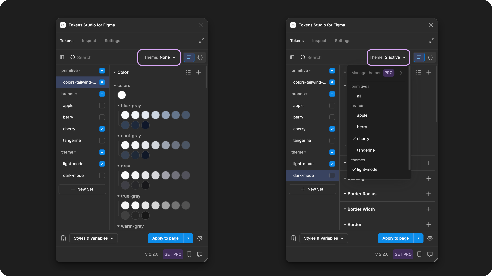
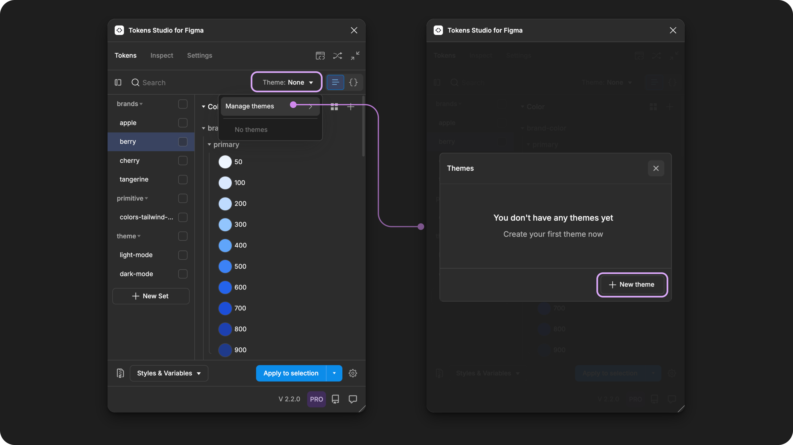
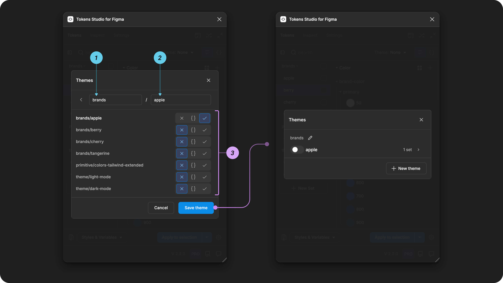
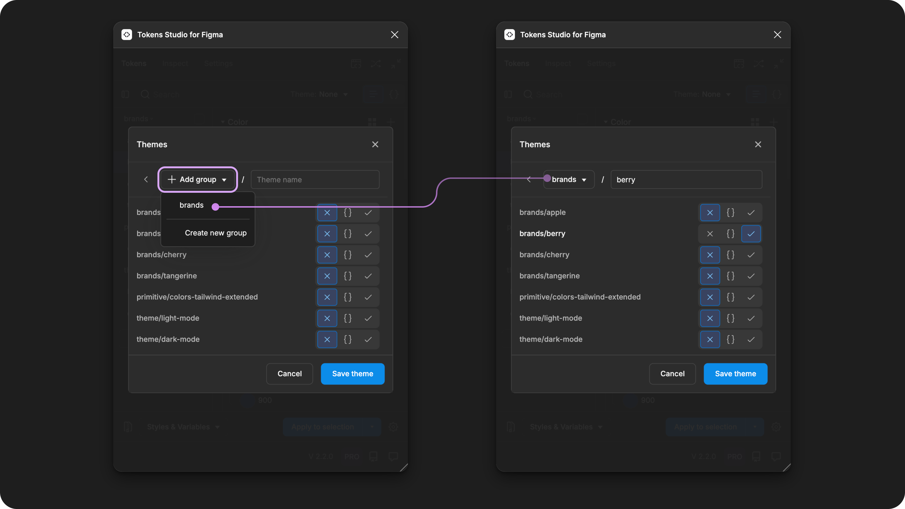

# Copy of Themes (pro) - working

## Themes (pro)

In software and web development, a Theme defines the styling choices applied to the graphic elements of an interface, influencing the appearance and atmosphere of websites and software applications within a specific context, such as a brand, platform, or user preference.&#x20;

When you are working with Design Tokens, the concept of theming enables you to style the same components in different ways so you can do more without needing to manage more components.

For example, instead of having 2 button components, light-mode button and dark-mode button, you have a single button component that takes on the styling properties of the color mode theme that is currently active.&#x20;

ADD INFOGRAPHIC

The Themes feature in Tokens Studio allow you to define combinations of Token Sets that are intended to be applied together to style design elements. Under the hood, the Plugin creates a themes configuration file that can be shared with developers and used in code.&#x20;

Multiple Themes can be applied at the same time to create a matrix of possible concepts that a single design element can be styled with. This is also known as _multi-dimensional theming_.&#x20;

ADD INFOGRAPHIC&#x20;

* Systems map - multi dimensional theming.&#x20;

The additional data captured in the Themes feature also unlocks several powerful workflows in Figma:&#x20;

* Variable Collections with multiple Modes managed by the Plugin.
* Styles attached to your Tokens can be managed in the Plugin or Figma.
* Non-local Variable Collections and Styles that retain their references to a published libraries in a different Figma files by syncing your Themes to your external Tokens Storage provider.&#x20;

→ Read the [Export to Figma ](../figma/export/themes.md)or [Non-local Variables and Styles](../figma/non-local-files.md) guides for more details.&#x20;

### How it works&#x20;

Recall that Design Tokens capture the essential information about a design decision, written in a common language defined by the W3C DTCG specifications in JSON files.&#x20;

The Tokens Studio Plugin for Figma is a no-code tool that allows designers to create and maintain Design Tokens. Token Sets are the no-code version of the JSON code files the Plugin generates as the place where Design Tokens live.&#x20;

ADD INFOGRAPHIC

* Tokens live in Token Sets (JSON FILES)&#x20;

Token Sets can be grouped together into Themes, which bundles a combination of design decisions so they can be applied to design elements in Figma with just one click.

ADD INFOGRAPHIC&#x20;

* Token sets grouped into themes&#x20;

### HOW TO CREATE  A THEME IN GENERAL

* Pro licence
* Themes manager
* Do the thing

### Categories of Themes

There are two categories of Themes you can work with in the context of Design Tokens:

1. Either this or that - themes that switch
2. All or none - themes that don't switch

The way you configure Themes in the Plugin is different depending on which category of Theme you are creating.&#x20;

### 1. Themes that switch

When thinking about Themes, most people focus on the parts of a Token Structure that support switching between options controlled by the users of an interface, such as a light or dark mode preference.&#x20;

Themes that switch are intended to have one of the themes in this group be active at all times.&#x20;

For example, a theme group for `color-modes` system would always have either the `light` or `dark` theme active depending on the user preference.&#x20;

Themes that switch unlock multi-dimensional theming, which is one of the superpowers of working with Design Tokens.&#x20;

#### Create Themes that switch in the Plugin

In the Tokens Studio Plugin, having multiple themes in the same theme group unlocks the ability to switch between them, as no more than 1 theme within a group can be active at a time.&#x20;

Ensuring that the Tokens within each theme have identical Names and Token Types tells the Plugin to look at which theme is active, and pass on that value to the rest of the system.&#x20;

ADD IMAGE - LIGHT VS DARK THEME

Token Sets with Identical Tokens

* Ensure you have more than one Token Set which contains identical Tokens
  * Same Token Type
  * Token Names that match exactly (including and groups in the token path)

For example, a Token Set named `color-modes/light` has identical Tokens as the `color-modes/dark` Token Set. In each set, the Tokens have unique values.&#x20;

#### 2. Themes that don't switch

However, Themes are combinations of design decisions that expand past user settings and they don't always switch.&#x20;

For example, your Token Structure may have several Token Sets to split up your design decisions into categories that make them easier for the design systems team to manage:&#x20;

* colors
* dimensions
* shadows
* text styling&#x20;

However, they are intended to work together, so you can group them into the same Theme. This tells the Plugin to enable all 4 Token Sets anytime this Theme is active. You can think about this as an _'all or none'_ category of themes.&#x20;

Compared to a Theme that is created to tell the system to&#x20;

### In the Plugin&#x20;

***

Once a theme is defined, you can style your design elements in Figma with these combinations of styling decisions in a single click.&#x20;

&#x20;organize, manage, and apply groups of Token Sets to your design elements in Figma.&#x20;

You can think of a Theme as a group of conditions you save in the Plugin that can be applied to your Figma design elements in a single click. The Plugin automagically saves this information in a way that can be shared with Engineers and used in code.&#x20;

With Themes, you can quickly switch between different design variations and save this configuration to share with your cross-functional team members.&#x20;

### How it works

To use the Themes feature in the Tokens Studio Plugin for Figma, you'll need a Pro licence to:

* Create new Themes
* Modify existing Themes

If you do not have a Pro licence and you are working in a Tokens Studio project that has Themes already set up, you can:

* Switch between Themes&#x20;
* Apply Tokens connected to Themes&#x20;
* Keep [Themes in sync when connected to an external Token storage provider](../token-storage/remote-push-pull-changes.md) (like Github or Gitbook).&#x20;

What is a theme&#x20;

* A set of conditions you configure in the Plugin that are saved&#x20;
* A single click to apply those conditions.&#x20;

Select the Themes dropdown from the Plugin page to see all Themes created. They are organized by Theme Group. Select Manage Themes to see the count of Sets and Variables attached to each Theme.&#x20;

<figure><figcaption>
Select the Themes dropdown from the Plugin page to see all Themes created. They are organized by Theme Group. Select Manage Themes to see the count of Sets and Variables attached to each Theme. 
</figcaption></figure>

<figure><figcaption>
THEMES ON FREE CAPTION HERE READ ONLY
</figcaption></figure>

#### Open the Themes Manager

From the Tokens Page of the Plugin, open the **Themes** dropdown (it doesn't matter what Token Set is showing on the page):

* Select **Manage Themes**
* Select **New Theme**

<figure><figcaption>
Select the Theme dropdown to open the menu. Select <code>Manage themes</code>to view the Themes Manager. The example on the right shows the Themes Manager before any Themes are created. 
</figcaption></figure>

#### Create a new Theme

From the Themes manager, select the New Theme button.&#x20;

Once the Create Themes form is open:

1. Select **+ add group** from the top left.
   * Paste in the part of the Token Set name that appears before the `/`
   * For example `brands`
2. Select the **Theme name** input and paste the part of the Token Set name that appears after the `/`.
   * For example `apple`
3. Under the inputs is a complete list of all Token Sets.
   * Ensure only Token Set with the name matching the Theme you are creating has the **Status** of **Enabled** (checkmark icon button is highlighted).
   * Ensure **all other Token Sets** have a **Status** of **Disabled** (X icon button is highlighted).
4. Select **Save Theme** to finish.
   * You'll return to the Themes Manager where your new Theme is now listed.

<figure><figcaption>
After creating the first theme, it appears in the Themes Manager. The Theme Group, Theme, and number of Sets are shown in the Theme Manger.
</figcaption></figure>

The good news is, if you are creating an additional Theme inside an existing Theme Group, you can select the Theme Group from the form instead of typing it each time.

In this example, the `brands` Theme Group created previously appears in the dropdown while adding the new Theme called `berry.`

<figure><figcaption>
From the Theme form, the Add Group dropdown shows all Theme Groups previously created. Selecting a Theme Group from the dropdown makes it quick and easy to create additional Themes in the same Group. 
</figcaption></figure>



