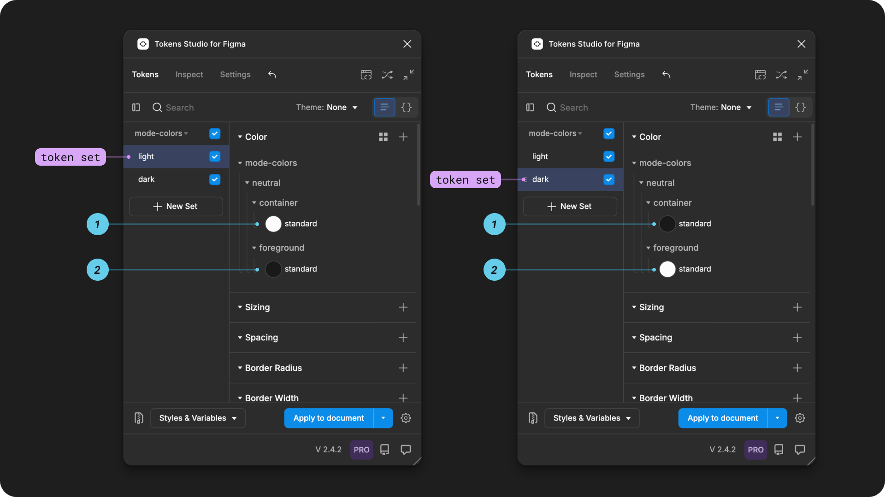

# Themes that switch

## Themes that switch

When thinking about Themes, most people focus on the parts of a Token Structure that support switching between options controlled by the users of an interface, such as a light or dark mode preference.&#x20;

However, not all themes switch.&#x20;

For example, this documentation website has a switch for light and dark color preferences, but regardless of what option you have active, the typography and dimension design decisions remain the same.&#x20;

Themes that switch are intended to always have one of the themes active, you can think of this as an _'either this or that'_ logic in the system.&#x20;

For example, this documentation website always has either light or dark theme active.&#x20;


Keep in mind, there is no limit to how many themes in a group that can switch.&#x20;

For example, a multi-brand design system may have four or fourty brands to switch between.&#x20;


<figure><figcaption>
The Tokens page of the Plugin is shown with the Themes dropdown open. The first theme group, named primitives, has a single theme below it called all. There is an annotation pointing to it labelled with "theme does not switch". The second theme group, called brands, has four theme groups below it: apple, berry, cherry, and tangerine. There is an annotation with a bracket pointing to all four themes labelled with "themes that switch".
</figcaption></figure>

This guide covers how to create Themes that switch using the Tokens Studio Plugin for Figma using a very simple example.&#x20;


You'll need a Pro licence for the Tokens Studio Plugin to use the Themes feature to follow along with the guide.&#x20;


Once you've got the basics down, you can start to think strategically about your Token Structure to take advantage of multi-dimensional theming.&#x20;

***

### How it works

You might recall from the Token Name Techincal Specs guide that when the system has more than one Token with the same name located in different Token Sets, we have to tell the system which Token Value it should pay attention to.&#x20;

Without the use of the Themes feature, the Plugin looks for any Token Set which is currently active (checkmark visible). If there is more than one Token Set with an active status, the Plugin favors the Token Set at the bottom of the list. You can think about this as the _'last set wins'_ logic of the plugin.&#x20;

However, this can get confusing to manage as your system scales.&#x20;

### In the Plugin

With the Themes feature, we set up a logic that allows you to toggle which Tokens Sets are active in the 'either this or that' logic with a single click.&#x20;

1. Ensure Token Sets to be included in either theme have identical Tokens (names and types)
2. Using the Themes Manager, create a Theme Group with a unique name.&#x20;
3. Create a Theme within that group with a unique name.&#x20;
   1. Select the Tokens Sets included in the Theme.&#x20;
4. Create at least 1 additional Theme within that group with a unique name.&#x20;
   1. Select the Token Sets indluded in the Theme.&#x20;
5. The themes manager will show all themes created within the group with a toggle switch next to them. Turning on a toggle for a theme will switch off all other themes within the group.&#x20;

### 1. Token Sets with identical Tokens

In two or more Token Sets, ensure you have at least one Token with the same `name` and `type`. The `value` can be different.&#x20;

In this very simple example, both Token Sets `mode-colors/light` and `mode-colors/dark` have two Color Tokens named:&#x20;

* `mode-colors.neutral.container.standard`
* `mode-colors.neutral.foreground.standard`

<figure><figcaption>
On the Tokens Page of the Plugin the mode-colors/light token set is pictured on the left, the mode-colors/dark token set on the right. Both are annotated to highlight the current Token Set, and the two tokens mentioned above. In the color preview next to each Token Name, the values are different between the two images. 
</figcaption></figure>

### 2. Create a Theme Group&#x20;

From the Tokens Page of the Plugin, open the **Themes** dropdown (it doesn't matter what Token Set is showing on the page):

* Select **Manage Themes**
* Select **New Theme**

<figure><figcaption>
On the left, the Tokens page of the Plugin has the Themes dropdown open. It shows no themes exist in the Token Project. The Manage Themes action is annotated with a line connecting to the right side image, a screenshot of the themes manager showing that no themes have been created. The new theme button is highlighted. 
</figcaption></figure>

From the create new theme modal, select the left input for Theme Group and enter a unique name.&#x20;

<figure><figcaption>
On the left, the Themes Manager is shown without any Themes created. The new theme button is annotated with a line pointing to the Create New Theme modal on the right.
</figcaption></figure>

In this example, the Theme Group name is `mode-colors`

<figure><figcaption>
On the left, the create new theme modal is open with the add group button highlighted with a line pointing to the screenshot on the right. The image on the right shows the add group button has been converted to a text input that has mode-colors entered into it. 
</figcaption></figure>

### 3. Create First Theme

Once you've added the Theme Group name:

* Enter a unique name for the Theme in the input on the right.&#x20;
* Adjust the Token Set status below to ensure the checkmark is toggled on only for Sets to be included.&#x20;
  * At least one Token Set must be enabled. There is no limit to how mant Token Sets can be included in a Theme.&#x20;
  * Token Sets that belong to any additional Themes should be disabled (X icon toggled on, checkmark icon toggled off.&#x20;
  * If you have a sophisticated Token Structure and you know the status of some Tokens Sets need to be reference only, ensure those are configured as needed.&#x20;
* Press the Save theme button when you are finished. You'll return to the Themes Manager where your new Theme will be visible.&#x20;

→ [Jump to the guide on Token Sets - Status for more details on reference only aka set-as-source.](../manage-tokens/token-sets/#id-2.-status)

In our simple example, the Theme name is `light` , and the Token Set named `mode-colors/light` is enabled (checkmark toggled on). The other Token Set in this project named `mode-colors/dark` is disabled.&#x20;

<figure><figcaption>
On the left, the Create New Theme modal is open with labelled annotations pointing to the theme group input on the top left, the theme name input beside it to the right, and the token set status below. The save theme button is highlighted with a line pointing to the screenshot on the right. The image on the right shows the themes manager is shown with a mode-colors theme group containing a theme called light. 
</figcaption></figure>

### 4. Create Additional Themes

The steps to create additional Themes within the same Theme Group are similar to above.&#x20;

* From the Themes Manager, select the New Theme button
* From the New Theme modal, select the Add Group dropdown to open it.&#x20;
  * You'll see a list of any Theme Groups that already exist in your project.&#x20;
  * Select the Theme Group you created in the previous step.&#x20;

In this example, the previous Theme Group called `mode-colors` appears in the dropdown.&#x20;

<figure><figcaption>
On the left, the Themes Manager is shown with a mode-colors theme group containing a theme called light. The new theme button is annotated with a line pointing to the Create New Theme modal on the right. The add group dropdown is open and the previously created theme group named mode-colors is highlighted. 
</figcaption></figure>

Enter a unique name for the Theme in the input on the right.&#x20;

* Adjust the Token Set status below to ensure the checkmark is toggled on only for Sets to be included.&#x20;
  * At least one Token Set must be enabled. There is no limit to how mant Token Sets can be included in a Theme.&#x20;
  * Token Sets that belong to any additional Themes should be disabled (X icon toggled on, checkmark icon toggled off.&#x20;
  * If you have a sophisticated Token Structure and you know the status of some Tokens Sets need to be reference only, ensure those are configured as needed.&#x20;
* Press the Save theme button when you are finished. You'll return to the Themes Manager where your new Theme will be visible.&#x20;

In our simple example, the Theme name is `dark` , and the Token Set named `mode-colors/dark` is enabled (checkmark toggled on). The other Token Set in this project named `mode-colors/light` is disabled.&#x20;

<figure><figcaption>
On the left, the Create New Theme modal is open with labelled annotations pointing to the theme group input on the top left, the theme name input beside it to the right, and the token set status below. The save theme button is highlighted with a line pointing to the screenshot on the right. The image on the right shows the themes manager is shown with a mode-colors theme group containing a theme named light and a second theme named dark.
</figcaption></figure>

You can repeat this process as many times as needed to support all the themes you'd like to switch between in the same Theme Group.&#x20;

### 5. Theme Switching&#x20;

Now that you've created a Theme Group with more than one Theme, it will appear in the Themes dropdown from the Tokens Page of the Plugin.&#x20;

* Selecting any Theme from the group will enable the Token Sets in the Theme and disable the status of Sets in the other Themes in the group.&#x20;

In this example, selecting the `light` Theme changes the status of the `color-modes/light` Token Set and disables the `color-modes/dark` Token Set.  Selecting the `dark` Theme does the inverse.&#x20;

<figure><figcaption>
The Tokens page of the Plugin is shown with the Themes dropdown open. The example on the left has a theme named light with a checkmark next to it, and a Token Set on the far left named light with a checkmark next to it. The example on the right has a theme named dark with a checkmark next to it, and a Token Set on the far left named dark with a checkmark next to it.
</figcaption></figure>

***

### Theme Switching and Variables&#x20;

Once you export your Themes that switch as a Variable Collection in Figma

* The Theme Group is mapped to a Variable Collection with the same name.&#x20;
* Each Theme within the Group is mapped to a Variable Mode with the same name.&#x20;
* If you have more Themes in a Theme Group than you Figma plan will allow, the Plugin will prioritize them in order from top to bottom.&#x20;

<figure><figcaption>
Figma Variable Collection beside the Themes Manager in the Plugin.  The numbered annotations show the Theme Group to Collection names. The lettered annotations show the Theme to Mode names for the current Variable collection named brands.  
</figcaption></figure>


Theme switching in the Plugin does not work once Variables are attached to the Themes that Switch.&#x20;

You must use Figma's native mode switching.&#x20;


→ [Jump to the Guide on Exporting to Figma from Themes for more details. ](../figma/export/themes.md)

***

### Transforming Themes for use in Code

As soon as your Token project includes Themes, there are JSON files created by the plugin to save your configuration data so it can be shared with developers. Once developers have the new Themes files in your external storage provider, they can use that data in their transformation process to turn the themes file into usable code.&#x20;



SD-Transforms generic package includes a specific transforms to convert Tokens Studio themes into individual theme files for all possible permutations

→ [SD-Transforms Read-Me Doc, Theming](https://github.com/tokens-studio/sd-transforms?tab=readme-ov-file#theming)

#### Plugin Sync Settings

If this is the first time you are working with Themes in your project, theres a couple things you'll want to do in the Plugin Settings make the transformation process as simple as possible:&#x20;

<table data-view="cards"><thead><tr><th></th><th data-hidden data-card-cover data-type="files"></th><th data-hidden data-card-target data-type="content-ref"></th></tr></thead><tbody><tr><td>Sync to a remote storage provider, like GitHub, GitLab, Bitbucket or Azure DevOps.</td><td><a href="../.gitbook/assets/cardHeader-sync-remote-overview.png">cardHeader-sync-remote-overview.png</a></td><td><a href="../token-storage/remote/">remote</a></td></tr><tr><td>Configure your sync settings to save to a folder in your repository with multiple files. </td><td><a href="../.gitbook/assets/cardHeader-sync-remote-multi-file.png">cardHeader-sync-remote-multi-file.png</a></td><td><a href="../token-storage/remote-multi-file-sync.md">remote-multi-file-sync.md</a></td></tr></tbody></table>

***

### Resources

Mentioned in this Guide

* SD-Transforms Read-Me - [Theming](https://github.com/tokens-studio/sd-transforms?tab=readme-ov-file#theming)

Community resources:

* None yet!



#### Known issues and bugs

Tokens Studio Plugin GitHub - [Open issues for Themes](https://github.com/tokens-studio/figma-plugin/labels/themes)



#### Requests, roadmap and changelog

* None



