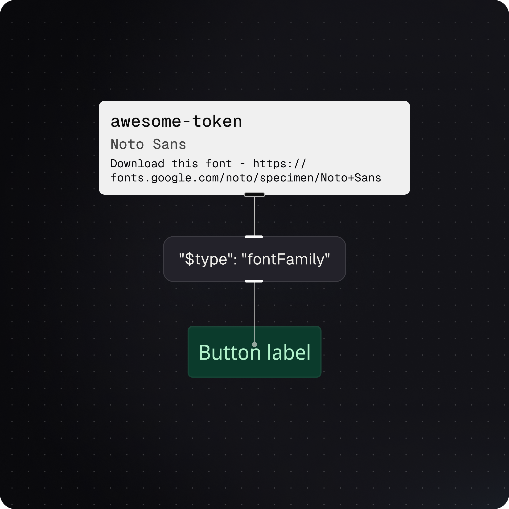

# Token Description

## Token Descriptions in Tokens Studio

The `description` is the anatomic part of a Design Token that can be used to define additional details, like _**why**_ or _**how**_ we made this decision.&#x20;

You might recall from our [Intro to Design Tokens Guide](../fundamentals/design-tokens/) that the `description` is optional but very helpful to provide additional context about the Token.

<figure><figcaption>
In this infographic, the Token examples on the right side highlight the Description. Only the bottom example has a description. 
</figcaption></figure>

You can think of a Token's **description** as a place to add a note or reminder about this design decision for your engineers, designers, or future self.

For example, a Font Family Token may have a **description** with a link to download the files.

<figure><figcaption>
An infographic example of documenting a Font Family Token with a Description that includes a note and URL to download the Font.
</figcaption></figure>

***

### Working with Token Descriptions

From the Tokens Page of the Tokens Studio Plugin for Figma, there are three places to see the Description of a Token.&#x20;

1. Token data on hover
2. Token form
3. JSON file

#### 1. Token Data on Hover

Hover on an existing Token to view its data. If a Description was added to the Token, it appears as the last piece of data you can view about a Token on hover.&#x20;



<figure><figcaption>
In the Plugin on the Tokens Page, hovering on a Font Family Token shows a Description as the last piece of data displayed. In this example, the Description includes a note and link to download the Font Family. 
</figcaption></figure>

#### 2. Token Form

Right click on a Token Name and select Edit to view its properties as a form.&#x20;


The Token Form for each Token Type is unique, but the Description always appears as the last input.&#x20;


The Description input will be empty if no Description was entered.

If you have edit permissions, you can make changes to the Description by typing in the input. Be sure to save your changes using the bottom button when you are finished.&#x20;

<figure><figcaption>
In the Plugin on the Tokens Page, right-click on a Token Name to see its action menu and select Edit to see its Token Form.  The Description input is at the bottom of the form. 
</figcaption></figure>

If you reference a Token with a Description as the Value in another Token, the Description does **not** get passed along.  This allows you to write a unique description for each Token.&#x20;

<figure><figcaption>
The Token on the Right has a value which References the Token on the left. 
</figcaption></figure>

#### 3. JSON File

Use the Token View Toggle see your Tokens written in JSON code files.  If a Token has a Description it will appear as the last part of the code for that Token. If no Descriptions was entered, the code files will not include a description for that Token.&#x20;

<figure><figcaption>
Select the JSON view toggle from the Tokens Page to see the current Token Set as an editable code file. As descriptions are optional, if they are empty, it is not added to the code file. 
</figcaption></figure>

If you are comfortable working in code (and have edit permissions), you can edit Token Descriptions in the JSON view.&#x20;


However, if there is no description entered for the Token, you will have to manually type the the full syntax.&#x20;


There are some nuances about editing Tokens in the JSON view to be aware of, documented in its guide.&#x20;


[json-view.md](token-sets/json-view.md)


***

### In Figma&#x20;

Using the Plugin, when you [Export a Token](../figma/export/) with a Description to Figma as a Style, the Description will be available for Designers to see in the Figma UI.&#x20;

If you [Import a Style from Figma into Tokens Studio](../figma/import/styles.md), its Description will be automatically added to the Token that is created by the plugin.&#x20;

The plugin does not yet support Descriptions for Variables.&#x20;

→ [Read Figma's guide on Descriptions for Styles for more details. ](https://help.figma.com/hc/en-us/articles/7938814091287-Add-descriptions-to-styles-components-and-variables)

***

### Transforming Tokens&#x20;



While the `description`of a Token is included in the [DTCG Design Tokens Specifications](https://tr.designtokens.org/format/#description) as a plain text addition to a Design Token, we've included a specific transform in the generic sd-transforms package to convert the `description` to a `code comment` based on popular workflows of engineers in the community.&#x20;

The SD-Transforms package's preprocessor will transform the **TS Token Type** to the **Style Dictionary Type**, as described in the table below.

[→ SD-Transforms Read Me - ts/descriptionToComment](https://github.com/tokens-studio/sd-transforms/blob/main/README.md#tsdescriptiontocomment)

***

### Resources

Mentioned in this doc:

* SD-Transforms - [Read Me](https://github.com/tokens-studio/sd-transforms#readme)
* Style Dictionary - [https://styledictionary.com/](https://styledictionary.com/)
* Design Tokens Community Group - [W3C Draft](https://tr.designtokens.org/format/)
* Design Tokens Community Group - [5.2.1 Description](https://tr.designtokens.org/format/#description)

#### Figma Resources

* Figma Learn - [Add descriptions to styles, components, and variables](https://help.figma.com/hc/en-us/articles/7938814091287-Add-descriptions-to-styles-components-and-variables)

#### Community resources:

* None yet!



#### Known issues and bugs

Tokens Studio Plugin GitHub - [Open issues for Token Descriptions](https://github.com/tokens-studio/figma-plugin/labels/token%20description)



#### Requests, roadmap and changelog

* None Yet!


