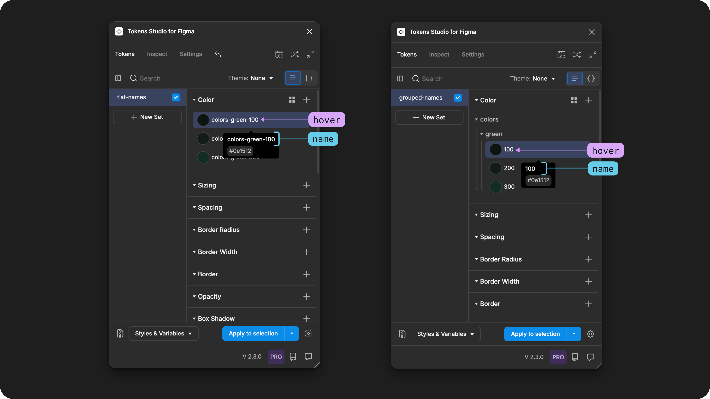
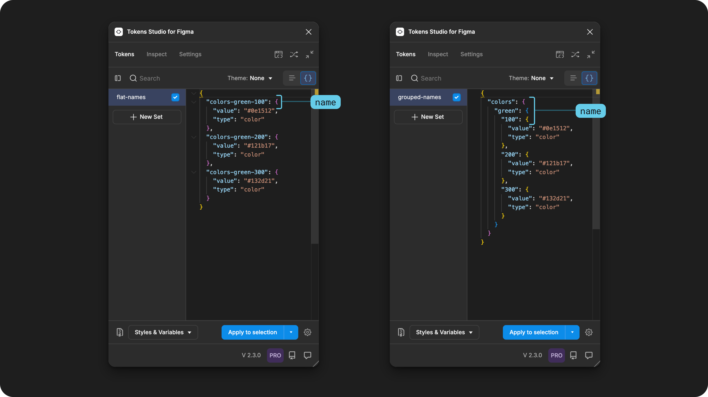

# Token Names

## Token Names in Tokens Studio

The `name` of a Design Token tells us _**who**_, or which parts of our system, this design decision is intended for.&#x20;

You might recall from our [Intro to Design Tokens Guide](../../fundamentals/design-tokens/anatomy-name.md) that the Token Name acts as the unique identifier for each design decision in the system and are the most customizable part of a Token's anatomy.

<figure><figcaption>
In this infographic, the Token examples on the right side highlight the Name. The top code block shows a Token Name with groups. The bottom code block shows a flat Token Name.
</figcaption></figure>

Each Design Token has a location of where it lives in our system files. In code, Design Tokens live in JSON files. In Tokens Studio, they live in [Token Sets](../token-sets/) which are the no-code representation of a JSON file.&#x20;

Each Design Token has to have a unique Name per location. However, Design Tokens in different locations may have identical names, and this provides the basis of Theming!&#x20;

→ J[ump to the guide on Theming.](../../manage-themes/themes-overview.md)

<figure><figcaption>
Two Token Sets in the same project are shown side by side. Both examples contain Tokens with identical names which is allowed because they are located in different Token Sets. The example on the left shows a Token set named <code>theme/light-mode</code>which has the Token called <code>theme-color.background.default</code>with a light color as its value, compared to the example on the right in the <code>theme/dark-mode</code> Token Set which has the value as a dark color. 
</figcaption></figure>


Before you get started [Naming your Tokens](technical-specs.md), you'll want to get familiar with the Common Terms related to Naming and how to work with them in the Plugin for Figma.&#x20;


***

### Common Terms

We have seen many different ways to talk about Naming Tokens over the years and it can be really hard to keep them straight! So here's the common terms we will use across our technical docs that you should be aware of.&#x20;

These terms are not the only way to describe Token Names; they are the labels the Tokens Studio team uses for simplicity across our documentation.&#x20;

If your team uses different descriptive terms, that's totally okay!&#x20;

#### Token Name

The Token Name is the ID of the design decision captured in the Design Token. Each Token within a Token Set must have a unique name.  Token Names are used in code by engineers, so there are some specific nuances to be aware of [covered in its own guide. ](technical-specs.md) The Name is also how the Plugin attaches a Token to a design element, style or variable in Figma. &#x20;

<figure><figcaption>
The infographic shows the name of a Token called <code>button-label-color,</code> which could be applied directly to the button design element and represented as a hex code, color style, or variable in Figma. 
</figcaption></figure>

#### Token Groups

The period (.) character is used in a Token Name to create relationships between Tokens that should be grouped together.

Token Groups helps to organize your Tokens into a tree structure in the Tokens Studio plugin and their code files. [In the guide for Token Groups](./#token-groups), you'll learn about the powerful workflow features we've added to the Plugin which allows you to take bulk actions on Tokens in the same Group!&#x20;

<figure><figcaption>
Two examples of Token names are shown. On the left, the Token names are considered "flat" because they do not contain any groups. On the right, the Token names have groups which create a tree structure which can be collapsed and expanded as needed. 
</figcaption></figure>

Here are some additional terms related to Token Names with Groups that might be helpful:

Flat Name

A Token `name` which is flat does not contain any groups.&#x20;

For example:\
`colors-green-500`

Folder Name or Tree Name

A Token `name` which contains groups are sometimes referred to as a folder or tree name because the groups organize the Tokens in a tree structure that behaves like a series of sub-folders.&#x20;

Token Path

The Token Path is the full `name`of the Token including any Groups. \
\
For example:\
`colors-green-500 or` `colors.green.500`

#### Alias Tokens&#x20;

When a new Token is create, its [Value can reference another Token](../token-values/references.md). The new Token created is sometimes referred to as an Alias Token, because it's purpose is to provide an alias, or a new name, or an existing design decision with some context about how the design decision is intended to be used in the system.&#x20;

This new name, or alias, is also referred to as its semantic name in the community.&#x20;

For example, a new Token named `success-default`with a value referencing `{colors.green.500}` could be referred to as an Alias Token.&#x20;

The name `success-default` may also be referred to as a semantic Token, as it provides some meaningful context about how the `colors.green.500` Token is intended to be used in the system.&#x20;

<figure><figcaption>
An example of a button is shown with a label annotated to show a series of Tokens with values referencing each other to arrive at the final color of the label text. 
</figcaption></figure>

Here are some additional terms related to Alias Tokens that might be helpful:

Component Tokens or Component Specific Tokens

Although Component Token may sound like a type of Token, its industry jargon to describe the name of a Token that is specific to a component.

They are also referred to as Component Specific Tokens for this reason.&#x20;

For example, a Color Token named `action.button.success.hover.background-color`has a Grouped Name specific to a Button component. The different groups within the name help communicate that the Token is intended to be used for success actions when they are interacted with on hover and applied to the background container.&#x20;

You can see by this example that a component specific name can also be considered an alias or semantic name which can be confusing!

Semantic Tokens

A Semantic Token is another way to say "Alias Token".  While this term might sound like a type of Token, its really just industry jargon to describe the name of a Token with a new name (or alias) for an existing Token in our system that has meaninful context about how it is intended to be used.&#x20;

For example, a new Token named `success-default`with a value referencing `{colors.green.500}` could be referred to as a semantic Token, as it provides some meaningful context about how the `colors.green.500` Token is intended to be used in the system.&#x20;

Primitive Tokens

Although a Primitive Token sounds like a type of Token, its industry jargon to describe the name of a Token that does not contain any context about how it is intended to be used.&#x20;

For example `colors.green.500` could be referred to as a Primitive Token.&#x20;

Token Taxonomy

Token Taxonomy is a technical way to describe how a Token is named based on some agreed upon logic. Or in other words, a really fancy way to say "Token Name Template".&#x20;

For example, for the Tokens in your system that have hard-coded values representing the options you have to choose from, you may decide on a Token Taxonomy that is `attribute.category.identifier` which looks like `colors.green.500`when naming a Color Token belonging to a green scale located at the 5th position on the scale.&#x20;

Your team may decide to have different Token Naming templates for different parts of your Token Structure. A good example of this is the component specific Token Name above `action.button.success.hover.background-color` which follows a template that more closely resembles CSS.&#x20;

***

### Working with Token Names

The Token Name appears anywhere in the Plugin you are creating, viewing or editing a Token.&#x20;

From the Tokens Page of the Tokens Studio Plugin for Figma, there are three places to see the Name of a Token.&#x20;

1. Token data on hover
2. Token form
3. JSON file

When [Inspecting Design Elements](../../debug/inspect-tokens.md) or using [Dev Mode in Figma](../../figma/dev-mode.md), the Token Name will also appear to identify which Tokens are mapped to the specific layer you have selected.&#x20;

#### 1. Token Data on Hover

Hover on an existing Token to view its data. The `name` appears as the first piece of data in the list.&#x20;



If the Token has a flat name, you will see the full name on hover. If the Token has a name with Groups, you will only see the final part of the Token Path in the preview on hover.&#x20;

<figure><figcaption>
Two examples of Token Sets being viewed from the Tokens page of the Plugin. The left example shows flat Token Names, the right shows Token Names with groups. When the Token Name is hovered on, it appears differently if the Name is flat or grouped. 
</figcaption></figure>

#### 2. Token Form

Right click on a Token Name and select Edit to view its properties as a form. The first input displays the  Name.&#x20;


The Token Form for each Token Type is unique, but the Name always appears as the first input.&#x20;


<figure><figcaption>
Two Token forms are pictured with its <code>name</code>input annotated. On the left side, the form is for a <code>color</code>Token Type. On the right, the form is for a <code>typography Token Type.</code> 
</figcaption></figure>

The Token Name also appears when it is being [Referenced in the Value of another Token](../token-values/references.md) in the Value input.&#x20;

<figure><figcaption>
The image on the right shows a <code>color</code>Token form with its <code>value</code> input open, showing available Token Names that can be referenced as the value. Once a Token Name is selected from the list, it appears wrapped in curly brackets as the <code>value</code>in the Token Form. 
</figcaption></figure>

#### 3. JSON File

Use the Token View Toggle see your Tokens written in JSON code files.  The Name will appear as the first part of data about the Token.&#x20;

If the Token has a flat name, you will see the full name before the rest of the properties. If the Token has a name with Groups, the JSON file will organize the data by groups.

<figure><figcaption>
Two examples of Token Sets being viewed as their JSON file from within the Plugin. The left example shows flat Token Names, the right shows Token Names with groups. 
</figcaption></figure>

If you are comfortable working in code (and have edit permissions), you can edit Token Names in the JSON view.  However, making changes to Token Names in the JSON files which have already been applied to design elements in Figma require a few extra steps to be aware of.&#x20;

→ [Jump to the guide on Editing Token Names for more details. ](edit.md)


The JSON view functions similar to Visual Studio Code thanks to an amazing open-source contribution from a Tokens Studio community member. 🫶



[json-view.md](../token-sets/json-view.md)


***

### In Figma

When you apply a Token to a design element in Figma, the `name` of the Token can appear in a few placed in the Figma UI, depending on your project:

* Styles and Variables - if the Token applied is attached to Style or Variable the matching name will appear in the design panel for the appropriate property when possible.&#x20;
  * Unless you've set the Plugin to Apply all Tokens as Resolved Values.
* Dev Mode - if you've configured Tokens Studio as a plugin in Dev Mode and selected it as your language.&#x20;

If you want to learn more about how your Token names appear in Figma, check out these detailed guides:

<table data-view="cards"><thead><tr><th></th><th data-hidden data-card-cover data-type="files"></th></tr></thead><tbody><tr><td>Export to Figma as Styles or Variables</td><td><a href="../../.gitbook/assets/card-header-figma-export-overview (1).png">card-header-figma-export-overview (1).png</a></td></tr><tr><td>Apply Token Actions + Settings</td><td><a href="../../.gitbook/assets/card-header-figma-apply-token.png">card-header-figma-apply-token.png</a></td></tr><tr><td>Dev Mode + Tokens Studio</td><td><a href="../../.gitbook/assets/card-header-figma-ts-devMode.png">card-header-figma-ts-devMode.png</a></td></tr></tbody></table>

***

### Transforming Tokens



During the transformation process, they often modify the Token names to match their preferred workflow.

Most common Token name modifications:

* Change casing and punctuation.
* Flatten them to remove groups.
* Add or remove front matter/prefixes.
* Remove designer-specific words.

It's important to consider how a Token Name may be modified during the transformation process to avoid unintentional naming collisions.&#x20;

→ [Jump to the Token Name Technical Specs for more details on naming transformations and collisions](technical-specs.md).

***

### Naming Token Guides&#x20;

Now that you've got the basics covered, check out these guides related to Naming Tokens in the Plugin:

<table data-view="cards"><thead><tr><th></th><th></th><th data-hidden data-card-target data-type="content-ref"></th><th data-hidden data-card-cover data-type="files"></th></tr></thead><tbody><tr><td>Technical Specs for Token Names</td><td>The do's and don'ts of writing great Token Names. </td><td><a href="technical-specs.md">technical-specs.md</a></td><td><a href="../../.gitbook/assets/card-header-anatomy-tokenName-technicalSpec.png">card-header-anatomy-tokenName-technicalSpec.png</a></td></tr><tr><td>Token Groups</td><td>A deep dive into how to take advantage of powerful workflows using Token Groups in the plugin.</td><td><a href="groups.md">groups.md</a></td><td><a href="../../.gitbook/assets/card-header-anatomy-tokenName-group.png">card-header-anatomy-tokenName-group.png</a></td></tr><tr><td>Edit Token Names</td><td>Changing Token Names can be tricky! Here's what you need to know to be successful.</td><td><a href="edit.md">edit.md</a></td><td><a href="../../.gitbook/assets/card-header-anatomy-tokenName-remap.png">card-header-anatomy-tokenName-remap.png</a></td></tr></tbody></table>

***

### Resources

Mentioned in this doc:

* SD-Transforms - [Read Me](https://github.com/tokens-studio/sd-transforms#readme)
* Style Dictionary -[ https://styledictionary.com/](https://styledictionary.com/)
* Design Tokens Community Group - [W3C Draft](https://tr.designtokens.org/format/)
* Design Tokens Community Group - [W3C Draft, 5.1 Name and Value](https://tr.designtokens.org/format/#name-and-value)

#### Community resources:

* None yet!



#### Known issues and bugs

Tokens Studio Plugin GitHub - [Open issues for Token Names](https://github.com/tokens-studio/figma-plugin/labels/token%20name)



#### Requests, roadmap and changelog

* None yet.&#x20;



