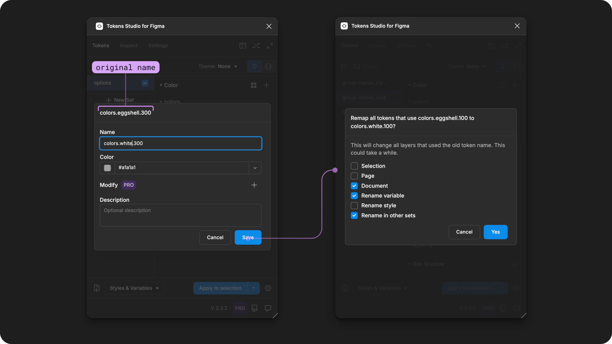

# Edit Token Names

## Edit Token Names

By now you know the Name of a Token acts as the ID for a design decision. This means when you change the Name of a Token, you are also changing the ID being used throughout your system to find that particular design decision.&#x20;

The Plugin has some optional features to make renaming an existing Token a quick and easy task. However, its important to understand how it works so you can avoid breaking changes when possible and know how to handle them when they do come up.&#x20;

<figure><figcaption>
In the Plugin, once you edit a Token name and save your changes, you have the option to Remap all layers, styles or variables to the new name. 
</figcaption></figure>

### How it works&#x20;

When you attach a Design Token to a node in Figma using the Tokens Studio Plugin, there is an invisible connection created. &#x20;

_A_ [_node in Figma_](https://www.figma.com/plugin-docs/api/nodes/) _refers to a design element, layer, style or variable. Each node can have several different types of Tokens applied depending on the type of node._&#x20;

This connection allows the Plugin to send data to Figma so it can apply the design decisions captured in the Token to the node the Token has been applied to.&#x20;

The way Figma identifies the individual connections mapped to a nodes is by the Name of the Token.&#x20;

When you change the Name of a Token, the Plugin has a built in Remap feature to update the ID of attached connections to Figma nodes at the same time. &#x20;

If you don't remap the connection between the Figma node and the Token to the new name, Figma won't be able to find the right Token because it's looking for the old name which no longer exists, and the Plugin won't know which nodes it is connected to.&#x20;

This broken connection is is sometimes referred to as a breaking change or a broken Token.&#x20;

***

### In the Plugin

There are three steps to renaming a Token in the Plugin:

1. Enter the new Name of a Design Token
2. Configure your Remap options to tell the Plugin where to apply the new name in your Figma file.
   1. The Plugin applies the new name to design elements, components, styles or variables based on your Remap options.
3. Sync the changes to your Remote Storage provider and publish any Figma library updates.&#x20;


If you are syncing your Tokens to a remote storage provider, here's a friendly reminder to create a new branch to capture your new Token names as these can introduce breaking changes requiring attention from your engineers.&#x20;

→ [Jump to the Branch Switching (pro) guide for more details. ](../../token-storage/remote-branch-switch.md)


### 1. Enter the new Token Name&#x20;

There are a few ways to change the Name of a Token, each with a slightly different workflow:

* Token Form
* Token Group&#x20;
* JSON view&#x20;

Be sure to follow the best practices for Token Names based on your project requirements and the technical specifications!

→ [Jump to the guide on Token Name Technical Specs if you need a refresh. ](technical-specs.md)

#### Token Form&#x20;

From the Tokens page of the plugin, navigate to the Token you want to update. Right click on its name and select Edit to view its properties as a form.&#x20;

The Token Form for each Token Type is unique, but the Name always appears as the first input.&#x20;

<figure><figcaption>
On the Tokens page in the Plugin, the Token named <code>colors.eggshell.300</code>has been right-clicked to reveal its action menu. When the <code>edit</code>action is selected, its information appears as a form, pictured on the right. The annotations show the original name on the top of the Token form and a new name entered in the 1st input. 
</figcaption></figure>

Once you've entered the new `name` in the first input, select the Save button at the bottom of the Token Form. The plugin will:

* Update the JSON file for the current Token Set to the new name.&#x20;
* Update any Tokens values that reference it with the new name.&#x20;
* Open the Remap options modal so you can configure how the Plugin implements the new name in Figma, [described below ↓](edit.md#id-2.-configure-your-remap-options).

If you've changed a grouped Token Name from its form, the change will only apply to that individual Token. If you want to apply the changes to all Tokens within that group, consider renaming the group from the Tokens Page directly ([described below ↓](edit.md#token-group)).&#x20;


Making the name change in the [JSON view](edit.md#json-view) can be a helpful way to bypass the automatic renaming of Token values with references if its not desired.&#x20;


#### Token Group&#x20;

If your Token Names are written with periods in them to create groups, you can make bulk name changes to **all** Tokens with the same group.&#x20;

If you only want to change the name of an individual Token with the group, consider renaming the Token from its Token Form ([described above ↑](edit.md#token-form)).

→ [Jump to the guide on Token Groups for more details ](edit.md#token-group)

From the Tokens page of the plugin, navigate to the Token Group you want to update. Right click on a Token Group name to open its action menu:

* Select Rename
* Enter the new name in the input
* Select the Change button to save your new name.&#x20;


If you want to add or remove a group within a Token Name, select any group following where you want the name change to take place. \
\
This shows the full Token path before the group you selected so you can choose where you want to change the group name. \
\
This also works for renaming more than one group at a time!


<figure><figcaption>
On the Tokens page in the Plugin, the group named <code>eggshell</code> has been right-clicked to reveal its action menu. When the <code>edit</code>action is selected, its information appears as a form, pictured on the right. The annotations show the original name on the top of the Token form and a new name entered in the input. 
</figcaption></figure>

The plugin will:

* Update the JSON file for the current Token Set to the new group name.&#x20;
* Update any Tokens values that reference these Tokens with the new group name.&#x20;
* Open the Remap options modal so you can configure how the Plugin implements the new name in Figma, [described below ↓](edit.md#id-2.-configure-your-remap-options).


Making the name change in the [JSON view](edit.md#json-view) can be a helpful way to bypass the automatic renaming of Token values with references if its not desired.&#x20;


#### JSON View&#x20;

Use the Token View Toggle to see your Tokens written in JSON code files.  The Name will appear as the first part of data about the Token.&#x20;

If the Token has a flat name, you will see the full name before the rest of the properties. If the Token has a name with Groups, the JSON file will organize the data by groups.

You can edit the Token `name`or group directly in the JSON view,  just be sure to save your changes using the action at the bottom of the plugin.&#x20;

[→ Jump to the JSON view docs to learn more about editing code files in the Plugin.](../token-sets/json-view.md)

<figure><figcaption>
On the Tokens page in the Plugin pictured on the left, the JSON view toggle is annotated. On the right, the JSON view of the same Tokens is shown with an annotation showing where a name change was typed. 
</figcaption></figure>


Editing the JSON files does not have the same workflow as changing names in the Token View of the Plugin!


Once you've saved the changes to your JSON file, the Plugin **does not** perform any additional steps. This means you may have to manully update:

* Any Token values referencing these Tokens with the new name. If you updated a group name, that impacts more than one Token.&#x20;
  * Find those Tokens and[ update their Values from their Token Form. ](../token-values/references.md)
* Any Styles or Variables attached to that Token (the previous name will continue to be the ID that Figma is looking for).&#x20;
  * Use the [Export to Figma feature](../../figma/export/options.md) and select the Option to `Update existing style and variable names`
* Any design elements or components that have the Token applied to them in your Figma file.&#x20;
  * Use the[ Remap feature](../../debug/remap-tokens.md) from the Inspect page of the plugin.

### 2. Configure your remap options&#x20;

After you've saved the new Token name from its [Token Form](edit.md#token-form) or [Group Name](edit.md#token-group), the remap modal will open so you can configure where the Plugin should implement the name changes in the current Figma file.

Selecting one of these options changes the name of Tokens attached to layers of design elements:

1. Selection - Only elements actively selected on the Figma canvas.
2. Page - All elements on the current page within the Figma file.
3. Document - All elements on every page within the Figma file.&#x20;
4. Rename in other sets - Select this to remap the Name across all sets.
   * Only visible when the name change happens from the Token form and there is a Token with the same name in another Token Set&#x20;

<figure><figcaption>
Two versions of the Rename Token options are shown. The version on the right shows an option called <code>rename in other sets,</code> which is only visible when certain conditions are met.
</figcaption></figure>

If you are working with [Themes (pro)](../../manage-themes/themes-overview.md), selecting these options will automatically change the name of Styles of Variables attached to the Token with the name change. &#x20;

* Rename variable&#x20;
  * If you are using mode switching, be sure to enable the **Rename in other sets option** at the same time.&#x20;
* Rename style


Known Limitation - These option appear as soon as Themes are present in the Token Project. Even when the Token you are renaming is not included in a theme, or not attached to a style or variable.&#x20;


<figure><figcaption>
Two versions of the Rename Token options are shown, which are visible if your project uses the Themes (pro) feature. The version on the right shows an example of the options that should be selected if the Token you renamed is attached to a Variable in Figma with more than one mode. 
</figcaption></figure>

#### Confirm and wait&#x20;

Once you've selected your Remap options, use the actions to confirm:

* Select the **Cancel button** to save your Token name change in the Plugin and bypass the remapping feature.&#x20;
* Select the **Yes button** to confirm your selection, and start the remapping process.&#x20;
  * The Plugin starts to scan your Figma file based on your configuration to remap to the new name. &#x20;

You'll see the progress and a rough estimate of how long it will take at the top of the Plugin. If your file has a lot of pages, components, nested components, styles and variables, this could take some time.&#x20;

It's best to let the Plugin complete remapping all nodes in the Figma file before doing anything thing else in the Plugin or your Figma file.  \
\
If you rename another Token before closing the Plugin, the previous remap options will be selected for you to speed up your workflow!&#x20;

<figure><figcaption>
The rename options are shown on the left with an annotation highlighting the option which takes the longest time to execute. On the right side, the Tokens Page shows the progress of the renaming process at the top of the plugin. 
</figcaption></figure>


We've observed Figma files to appear frozen or offline while scanning very large files. Normally if you leave the file alone Figma will come back online and finish the process.&#x20;


If something unexpected happens and you have to close the Figma file before the remapping process finished, you can use the Remap feature from the Inspect page of the plugin at anytime.  This is also helpful if you edited your Token names in the JSON view, or a non-local Figma file.&#x20;

→ J[ump to the guide on the Remap feature for more details.  ](../../debug/remap-tokens.md)\

### 3. Sync your changes

If you are syncing your Tokens to a remote storage provider, the Plugin will remind you to push (or send) your changes as soon as your Token Name change is saved by showing an **indicator** on the Push button in the footer of the Plugin.&#x20;


[remote-push-pull-changes.md](../../token-storage/remote-push-pull-changes.md)



It's important to note that changing the Name of Tokens applied to components and design elements being using in code may introduce a breaking change requiring attention from your engineering team!


If you haven't already, you may want to create a new branch dedicated to these name changes, and be sure to leave your developers a really nice commit message with additional details on the changes you made.&#x20;


[remote-branch-switch.md](../../token-storage/remote-branch-switch.md)


If you are working in a multiple Figma file setup, be sure to [publish your library changes](https://help.figma.com/hc/en-us/articles/360025508373-Publish-a-library#h_01J688PTA7V9DE1KSKQXAMNXRZ) so the rest of your team has access to any updated components, styles and variables related to the new names. &#x20;

***

### Resources

Mentioned in this doc:

* Figma Plugin API Docs - [Nodes](https://www.figma.com/plugin-docs/api/nodes/)&#x20;
* Figma Learn -[ Publish updates to a Library](https://help.figma.com/hc/en-us/articles/360025508373-Publish-a-library#h_01J688PTA7V9DE1KSKQXAMNXRZ)

#### Community resources:

* None yet!



#### Known issues and bugs

Tokens Studio Plugin GitHub - [Open issues for Rename and Remap Tokens](https://github.com/tokens-studio/figma-plugin/labels/rename%20token%20remap)



#### Requests, roadmap and changelog

* None yet.&#x20;



