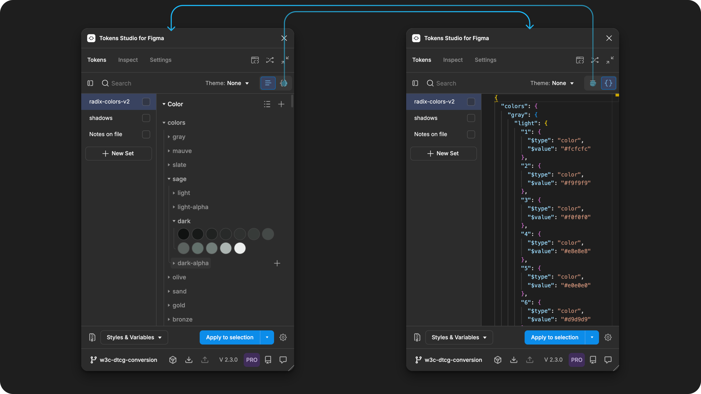
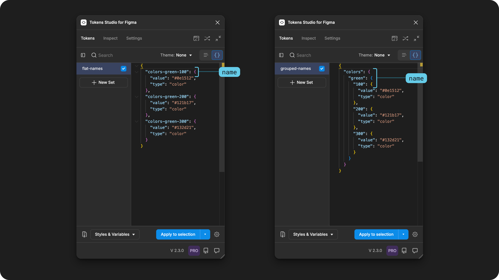
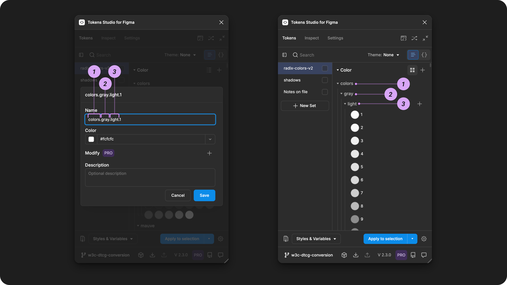
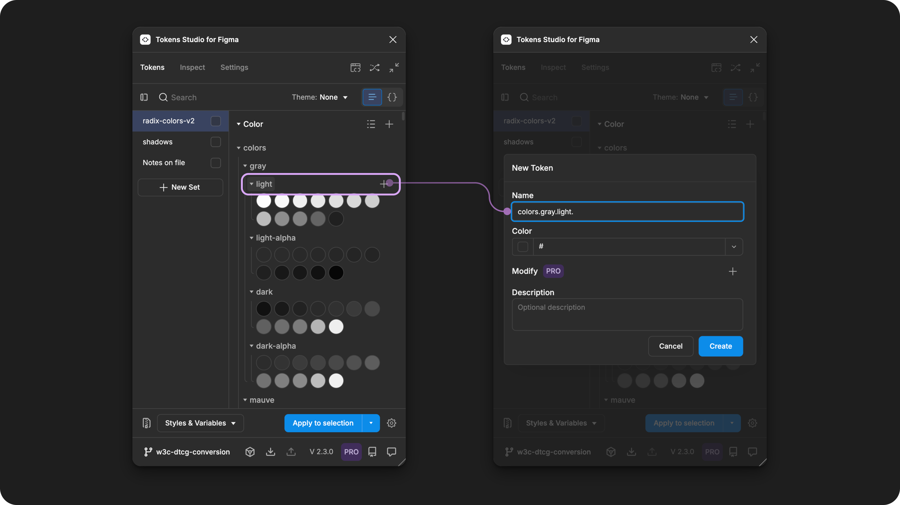
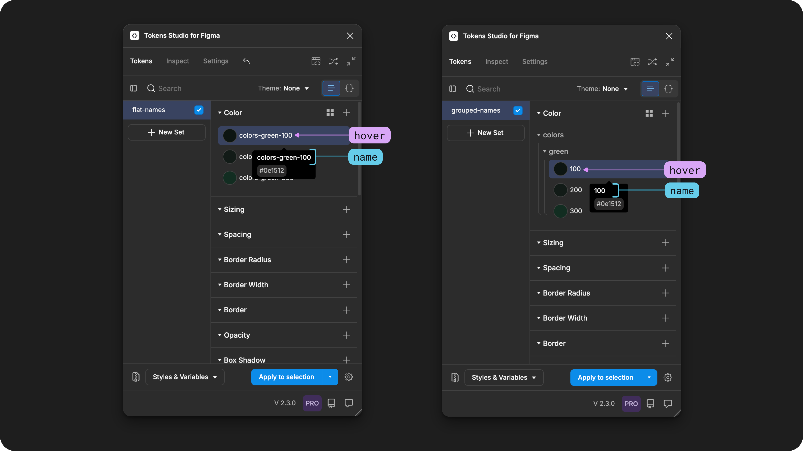
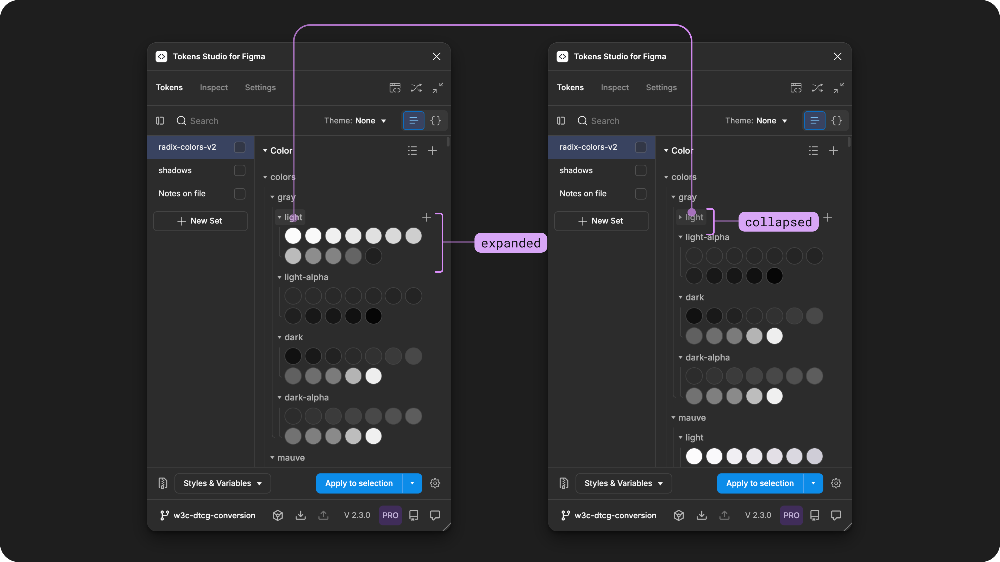
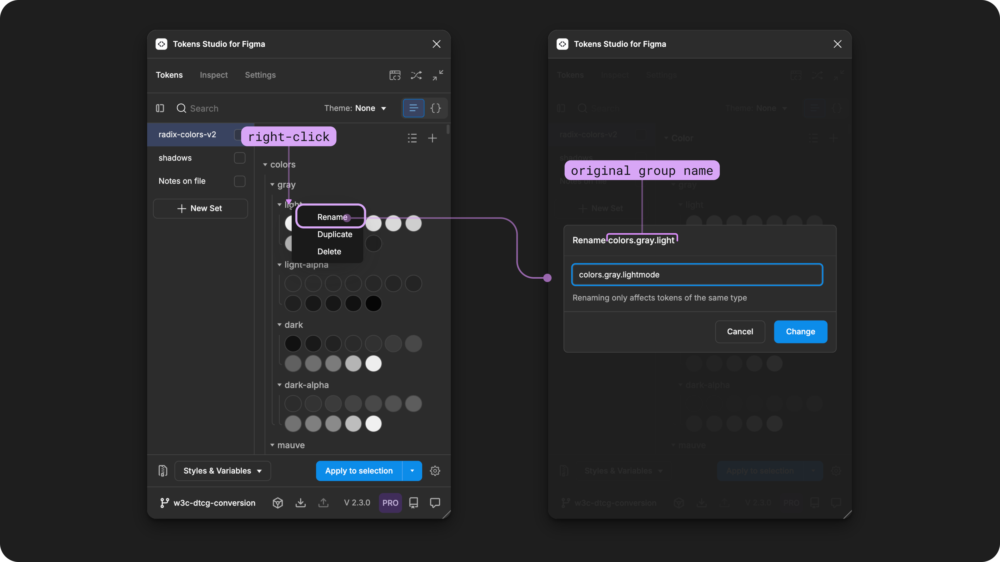
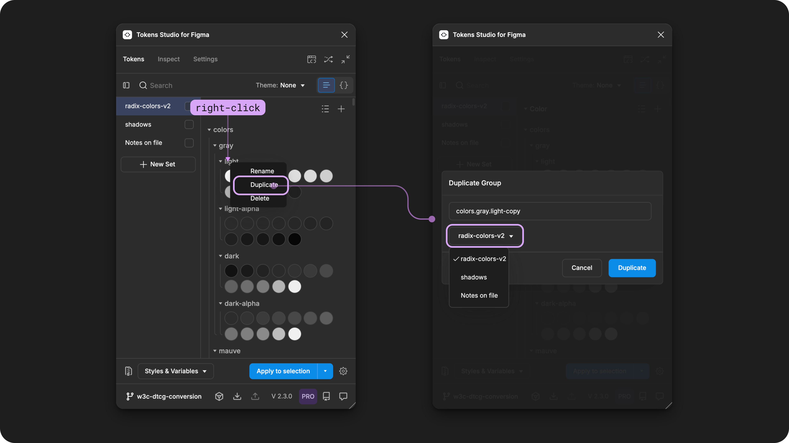
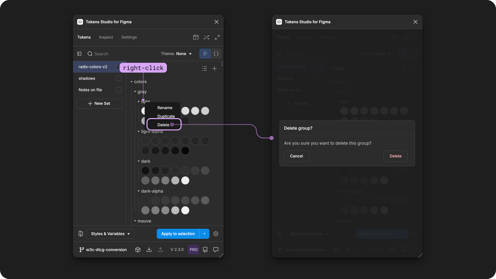

# Token Groups

## Token Groups

The period (.) character is used in a Token Name to create relationships between Tokens that should be grouped together.

Token Groups helps to organize your Tokens into a tree structure in the Tokens Studio plugin and their code files.

<figure><figcaption><p>The Tokens Page of the Plugin shows a series of Color Tokens created with Groups in their Names. The left image shows the list view, the right image shows the JSON view of the same Tokens. </p></figcaption></figure>


You might recall from the [Token Set guide](../token-sets/) that you can think of the relationship between Tokens and Token Sets similar to files and folders you save on a computer.&#x20;

> It might help to imagine each Design Token as a 'file' containing data about every individual design decision you make and the Token Set as the 'folder' where these 'files' are located, which helps you to keep things organized.\
> \
> However, like any folder and file system you might be familiar with, the Design Tokens in the Token Set must all have unique names.\
> \
> Have you ever tried to add a file to a folder on your computer that already has a file with the same name? Your computer will ask you if you want to keep both files and rename the new one or replace the old file.

In this mental model, Token Names with Groups create the individual "file" of a Token into a series of "sub-folders" or sections that enable you to quickly navigate through your design decisions and perform bulk actions. &#x20;


For example, these **Color Tokens** do not have any grouping, also known as **Flat** names:

```json
colors-green-100
colors-green-200
colors-green-300
```

Compared to grouped names, which replaces the dash (`-`) with a period (`.`):

```json
colors.green.100
colors.green.200
colors.green.300
```

These 3 Tokens would end up being grouped in JSON file:

````json
{
  "colors": {
    "green": {
      "100": {
        "value": "#0e1512",
        "type": "color"
      },
      "200": {
        "value": "#121b17",
        "type": "color"
      },
      "300": {
        "value": "#132d21",
        "type": "color"
      }
    }
  }
}
```
````


<figure><figcaption><p>Two examples of Token Sets being viewed as their JSON file from within the Plugin. The left example shows flat Token Names, the right shows Token Names with groups. </p></figcaption></figure>


You might recall from the [Technical Specs for Naming Tokens guide](technical-specs.md) that In code, engineers often combine all Token Sets into a single file of Tokens, which are organized by Token Name in alphabetical order.&#x20;

When you use groups in your Token Names, this helps to create logical grouping of similar design decisions which makes them easier find and faster to work with in code.&#x20;

This is especially helpful when you start working with Component Specific Tokens! Your engineers will see all the Tokens related to a component grouped together which helps them work faster!

***


### Working with Token Groups

In Tokens Studio, once a Token Group is created you can take advantage of powerful workflows which allow you take bulk actions on all Tokens with the Group:

1. Quickly add a new Token to a Group with it's name pre-filled.
2. Modify your Token Views by collapsing and expanding Token Groups.&#x20;
3. Rename all Tokens within the Group.
4. Duplicate all Tokens in Group.&#x20;
   1. In the same Token Set (with a name change)&#x20;
   2. In a different Token Set
5. Delete all Tokens in a Group at the same time.&#x20;
6. Tokens exported to Figma as Styles can be shortened


#### Create Token Groups

To create a Token Group, write the Name of the Token to include a period between each group. There is no limit to the number of groups within your Token Names.&#x20;

→ [Jump to the Token Name Technical Specs guide for more details](technical-specs.md)&#x20;


<figure><figcaption><p>A Color Token form in the Plugin appears in the left image with 3 parts of its name annotated to represent groups. 1 - colors. 2 - gray. 3 - light. In the right image, those same groups are displayed on the Tokens page.</p></figcaption></figure>


Tokens Studio will automatically convert your Group Names to `/`when [Exporting to Figma as Styles or Variables. ](../../figma/export/)



### 1. Create a Token with a Group

Once a Token Group is created, hover on the Group Name to see a quick add action (icon button with a + symbol) to the right of the group name.&#x20;

Selecting the quick add action allows you to create a new Token (same Token Type) within the same Group by pre-filling in the Token's name.&#x20;

<figure><figcaption><p>In the left screenshot of the Tokens Page of the plugin, the Token name group <code>colors.gray.light</code>is hovered on, revealing the plus-symbol quick action. Once the action is selected, a new Token Form is opened, pictured on the right. The Token form has the name input pre-filled with the group name <code>colors.gray.light</code>. </p></figcaption></figure>


Once a Token is created with a grouped name, hovering on the Token Name displays only the final part of the name.&#x20;

<figure><figcaption><p>Two examples of Token Sets being viewed from the Tokens page of the Plugin. The left example shows flat Token Names, the right shows Token Names with groups. When the Token Name is hovered on, it appears differently if the Name is flat or grouped. </p></figcaption></figure>


### 2. Collapse and expands Tokens by Group&#x20;

Once a Token Group has been created, from the Tokens Page of the Plugin, select the name of any Token Group to collapse or expand all Tokens within the group.&#x20;

<figure><figcaption><p>Selecting a Token Group Name on the Tokens Page of the Plugin to expand or collapse all Tokens within the Group. In these images, the <code>colors.gray.light</code>group is expanded on the left and collapsed on the right. </p></figcaption></figure>


The plugin is organized by Token Type, so to improve the workflow, when you collapse or expand a Token Group that behaviour is applied across all Token Types with the same group name in the current Token Set.&#x20;

For example, collapsing the `button.danger` group in the Color Token part of the Plugin, also collapses that group in the Typography Token part of the plugin.


### 3. Rename all Tokens in a Group

Making the name change to the group will rename all children below it at the same time.&#x20;

Right click on a Token Group name to open its action menu.&#x20;

* Select Rename
* Enter the new name in the input
* Select the Change button to save your new name.&#x20;
  * Or, select Cancel to close the confirmation modal without changing the name of any Tokens within the selected Group.&#x20;
* Follow the prompts from [the Plugin to remap any Tokens as needed.](edit.md)&#x20;

<figure><figcaption><p>On the Tokens page in the Plugin, right-click on a Group Name to see additional actions. In this example, Rename was selected, which opens a confirmation modal where you define the new Group Name. </p></figcaption></figure>


When choosing a new name for the Token Group, it's important to follow the best practices for naming based on your project requirements and the technical specs.&#x20;


[technical-specs.md](technical-specs.md)



If you want to add or remove a group within a Token Name, select any group following where you want the name change to take place. \
\
This shows the full Token path before the group you selected so you can choose where you want to change the group name. \
\
This also works for renaming more than one group at a time!



#### Renaming only affects Tokens of the same type

You may have spotted the helper text on the rename group form as a reminder that `renaming only affects Tokens of the same type` . \
\
This means if you have many Token Types with the same group structure in the name, you have to remember to manually change the name of each Token Type.&#x20;

For example, lets say you have a Token Set with all Tokens starting the word `semantic`and your team decides its not necessary anymore, you'll need to change the Group name for each Token Type in the set as a series of steps.&#x20;


### 4. Duplicate all Tokens in a Group

Duplicating a group will duplicate all Tokens within the Group it at the same time in a Token Set of your choice. This is handy when ideating on new ideas, setting up new themes or components with similar Tokens.&#x20;

Right click on a Token Group name to open its action menu.&#x20;

* Select Duplicate
* Select the destination Token Set where the Tokens should be added
  * If duplicating in the current Token Set, you must rename the group to ensure all Tokens maintain a unique name.&#x20;
* If you want to duplicate the Group to multiple destinations, you can re-open the Token Set select menu to add another destination.&#x20;
* Save and confirm your action.&#x20;
* Or, select Cancel to close the confirmation modal without duplicating the Tokens within the selected Group.&#x20;


Known Issue

You must deselect the current Token Set from the menu as a manual step, the menu will close and any error messages should clear, then you can select a new Token Set as your destination for the duplication.&#x20;


<figure><figcaption><p>On the Tokens page in the Plugin, right-click on a Group Name to see additional actions. In this example, Duplicate was selected, which opens a confirmation modal where you choose the destination Token Set where the duplicated Token Group will live. </p></figcaption></figure>


### 5. Delete all Tokens in a Group

Deleting a Token Group will permanently remove all children Tokens within the Group it at the same time.&#x20;


This is a destructive task so be sure you are intending to delete all Tokens within the group and subgroups before confirming the action.&#x20;


Right click on a Token Group name to open its action menu.&#x20;

* Select Delete
* Save and confirm your action
* Or, select Cancel to close the confirmation modal and keep your Token Group.&#x20;

You may have to go through your Tokens to check for broken references due to Tokens being deleted as the plugin does not Surface this information to you.&#x20;

<figure><figcaption><p>On the Tokens page in the Plugin, right-click on a Group Name to see additional actions. In this example, Delete was selected, which opens a confirmation modal. </p></figcaption></figure>


### 6. Export to Figma as Styles

As your Token Names get more sophisticated, its common to add a prefix which helps to keep things organized for those on your team working with the Tokens.&#x20;

But for those on your team not working with the Tokens directly, these prefixes may not be as helpful and often eat up the limited realestate they have to work with in the Figma UI.&#x20;

So when you Export your Tokens to Figma as Styles, you can choose an [option to Ignore the first part of the Token Name.](../../figma/export/options.md#id-1.-ignore-first-part-of-token-name-for-styles) \
\
With this option enabled, the `colors.green.100` Token will be exported as a Color Style in Figma called `green/100` as the Plugin automatically converts the periods to forward slashes to work with Figma's grouping format.&#x20;

→ [Jump to the Export to Figma guide for more details. ](../../figma/export/)


***


### W3C DTCG Token Format

`group` is an official property of a Design Token in the W3C Design Token Community Group specifications. [W3C Draft, 3.7 Group](https://tr.designtokens.org/format/#group)

> A group is a set of tokens belonging to a specific category.
>
> For example:
>
> * Brand
> * Alert
> * Layout
>
> Groups are arbitrary and tools _SHOULD NOT_ use them to infer the type or purpose of design tokens.


Figma uses the forward slash `/`to create their groups in variables and styles. The Plugin will automatically convert between period and forward slash when importing and exporting Tokens in Figma.&#x20;



Tokens Studio is will be iterating on how we approach Groups in the near future to more closely align with the W3C DTCG specifications.

* Support a Description of a Group&#x20;
* Support assigning a Type to a Group
* Support additional data via Extension data in the JSON
* Support deprecated data in the JSON

As this work is defined it will be added to the resources section of this guide, and visible on our public roadmap, [which you can subscribe to here. ](https://feedback.tokens.studio/roadmap?b=65971b8c143e3c7207d29602)

***


### Resources

Mentioned in this guide

* Design Tokens Community Group -[ W3C Draft, 3.7 Group](https://tr.designtokens.org/format/#group)
* Design Tokens Community Group - [W3C Draft, 6 Groups](https://tr.designtokens.org/format/#groups)


#### Community resources:

* None yet!




#### Known issues and bugs

Tokens Studio Plugin GitHub - [Open issues for Token Groups](https://github.com/tokens-studio/figma-plugin/labels/token%20group)

Tokens Studio Plugin GitHub - [Open issues for Group Names](https://github.com/tokens-studio/figma-plugin/labels/token%20group%20name)




#### Requests, roadmap and changelog

* DTCG W3C Token Group Metadata - [Description and Type ](https://feedback.tokens.studio/p/token-group-metadata-description-and-type)


