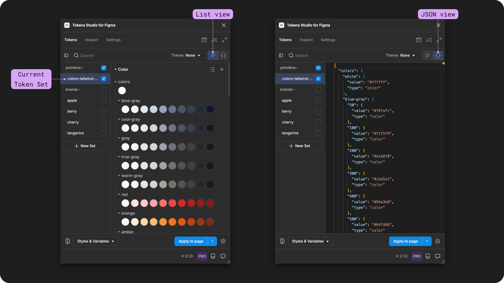
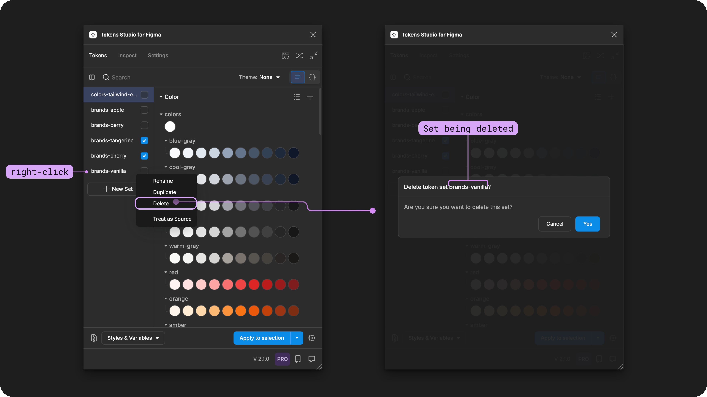

# Token Sets

## Token Sets in Tokens Studio

Token Sets are where our Design Tokens _live_ in the Tokens Studio Plugin.

In code, [Tokens live in JSON files](https://tr.designtokens.org/format/#file-format), so you can think of a Token Set as the no-code version of a JSON file.


There is no limit to the number of Tokens that live in a Token Set.


<figure><figcaption>
In Tokens Studio, a Token Set is the no-code version of a JSON file.
</figcaption></figure>

It might help to imagine each Design Token as a 'file' containing data about every individual design decision you make and the Token Set as the 'folder' where these 'files' are located, which helps you to keep things organized.

However, like any folder and file system you might be familiar with, the Design Tokens in the Token Set must all have unique names.

Have you ever tried to add a file to a folder on your computer that already has a file with the same name? Your computer will ask you if you want to keep both files and rename the new one or replace the old file.

In the Plugin, the Tokens page is where you will manage the Token Sets for this project:

* Create new Token Sets.
* Select a Token Set to see its Tokens.
* Change the order of existing Token Sets.
* Update or delete a Token Set.

Once you select a Token Set from the left-side menu, the Design Tokens living in that JSON file are displayed on the right.

The current Token Set selected will have the container previewing its name highlighted in blue.&#x20;

<figure><figcaption>
Select the Toggle on the top right side of the Tokens Page in the Plugin to access the JSON view.
</figcaption></figure>


You can change size of the Token Set list by dragging on the separator between the Token Set list and the Tokens list.&#x20;


***

### Anatomy of a Token Set

On the Tokens page of the Plugin, Token Sets are listed in the left-side navigation panel.&#x20;

A Token Set in the plugin has:

1. A unique name.
2. A status.
   * Indicated by a checkbox next to its name.
3. A position.
   * Arranged in a list.

If you do not have have edit access to your Token Project, you won't be able to take action on the Token Sets.&#x20;


To resize the left side panel, hover on the right right of the panel until the arrow icon appears.

Select and drag the side of the panel to the size you desire.


<figure><figcaption>
The anatomy of a Token Set is annotated with numbers that match the properties below. 
</figcaption></figure>

***

### 1. Name&#x20;

The name of each Token Set must be unique. Ideally, Token Set names follow the same best practices as Design Tokens, like avoiding spaces, special characters, emoji's.

[_→ Read the Token Naming technical specification guide for more details._](../token-names/technical-specs.md)

#### **Flat or folder names**

There are 2 different ways you can write your Token Set Names:

1. Flat names appear in a list.
2. Folder names appear in a tree structure which can be expanded and collapsed.
   * Each `/` that appears in the Set name will create a "folder" in the tree.
   * Folders create visual groups of Token Sets, indicated by a triangle icon on the left of the folder name.
   * Selecting the folder name will expand or collapse all Token Sets within it.


You can also create nested folders within your folder names, which might be helpful as the number of Token Sets increases.


In the Token Set name examples below, the left has a flat name `brands-berry` and the right has a folder name `brands/berry`.

<figure><figcaption>
Two projects side by side. On the left, the Token Set names are flat
</figcaption></figure>

#### **Rename Token Set**

To change the name of a Token Set, right click on the current name of the Set, located in the left side panel of the Tokens page in the plugin.

* Select **Rename**.
* Enter the new name in the input.
  * The current name will appear in the modal heading for reference.
* Select **Change** to save your new name.
* Select **Cancel** to close the modal without changing the current name.

<figure><figcaption>
Right-click on any Token Set name to open it's action menu. Selecting Rename will open a form to make changes. 
</figcaption></figure>

***

### 2. Status&#x20;

The **Status** of the **Token Set** is indicated by the checkbox next to its name:

1. **Enabled** - Checkmark is visible.
2. **Disabled** - Checkbox is empty.
3. **Set as Source** aka **Reference Only** - Circle is visible.

Change the Status by:

* Selecting the checkbox.
  * Toggle between the **Enabled** and **Disabled** status.
* Right-click on the Token Set name to open the menu.
  * Select The **Set as Source** option.

<figure><figcaption>
The Token Set status' are annotated with numbers that match its description below.
</figcaption></figure>

#### 1. Enabled status - Checkmark visible

When the Status of a Token Set is **Enabled**, you have told the plugin that all Tokens within the Set are "available" to take action on. This includes:

* Passing the Value of the Token to design elements where the Tokens have been applied.
* Being referenced in the Value of another Token.
* Populating attached Styles and Variables in Exports to Figma.
* Pre-filling new Themes (pro)

For example, when creating a new Token with a Value that references another Token, the plugin will only show the Tokens in sets where the status is Enabled.

[_→ Jump to the guide on Token Values with References for more details._ ](../token-values/references.md)

#### 2. Disabled - checkbox is empty&#x20;

When the Status of a Token Set is **Disabled**, you have told the plugin to ignore all Tokens within the Set when performing actions.

For complex Token Structures where you have lots of Token Sets, you can disable the Token Sets that don't apply to the task you are working on temporarily.

For example, when working on a new component in dark mode, you can disable the Token Sets for your light theme to focus on your specific area of work. When you apply Token Data from the plugin to your Figma designs, only the dark-mode values will be applied.&#x20;

#### 3. Set as Source - circle is visible

When the Status of a Token Set is **Set as Source**, you have told the plugin that these Token Sets serve as a source of information to pass along your Token structure but you might not actually work with them in Figma. They act as a foundation or source of truth for Token values, but other actions should be ignored.

* When Tokens in **enabled** Token Sets reference Tokens from a **source** Token Set, the plugin resolves the references so they can inherit their value.
* Source Token Sets are ignored when creating new styles/variables, but reminds the plugin to include the resolved values to enabled Token Sets that are references them.&#x20;
* Tokens in Sets with a Source status are not intended to be directly applied to design elements.

For example, you are creating a new Token Set for a `brand` called `vanilla`. You'll want to have the Token Set for `primitive-colors` with a status of **Set as Source** so you have all the colors in your primitives available to reference in your new brand Color Tokens.&#x20;

***

### 3. Postion

The **Position** of your Token Sets in the plugin can configured to organize them in any way that suits you. However, the position also has some functional implications for the way the plugin passes information through your Token Structure.

Recall that Token Names within each Token Set must be unique. Token Names in different Token Sets can be identical, which provides the basis of Theming.&#x20;

If you have more than one enabled Token Set with the same Token Names, how does the plugin know which Value it should pay attention to?&#x20;

The position of the Token Set!&#x20;

The lowest Enabled Token Set in your list will override the values from the sets higher on the list.


The lowest Token Set always 'wins'.&#x20;


This allows for a cascading system of defaults and overrides, similar to CSS specificity.

<figure><figcaption>
Component-specific Tokens with values that reference Tokens from the Theme Token Sets are shown. The resolved values change based on the position of the Theme Token Sets. 
</figcaption></figure>

#### Reorder Token Sets

You can change the order by dragging and dropping the Token Set to a new location.

* Hover or select the Token Set to reveal the re-order icon to the left of the name.
* With the Token Set selected, drag it to the desired position.
  * You might have to do this slower than expected due to known issues with this functionality.

If you are using folder names, you can follow the same steps to reorder folders of Token Sets. It helps to close the folders when dragging.


Known Issue with reordering sets

Occasionally while using the drag-and-drop feature to change the order of Token Sets (or Themes) the UI will not behave as expected.&#x20;


***

### Token Set visibility

The actions at the top of the Tokens Page control how the Plugin displays the Tokens Sets and Design Tokens below.

The first action on the left will toggle the left sidebar section below it to hide or show the Token Sets within it.

It's super handy for when you need more space to work with your Design Tokens!

<figure><figcaption>
A side-by-side view of the Tokens Page with the left sidebar of Token Sets collapsed on the right side and expanded on the left side. The control to toggle this view is highlighted. 
</figcaption></figure>

However, to navigate to a new Token Set to see its Design Tokens, you'll need to expand the sidebar to see the list of Token Sets.  The plugin is also does not show the name of the current Token Set anywhere else, so be mindful of where you are while you are working.&#x20;

***

### Create a new Token Set

From the Tokens Page of the Plugin, the **New Set action** is at the bottom of the Token Set list (left-side navigation panel).&#x20;

Select the **New Set** button.

* Give the Set a unique name.
* Select **Create** to save your new Token Set.
  * Or, choose **Cancel** to close the modal without creating a new Set.
* The new Token Set will appear at the bottom of your list or folder, depending on if you used flat or folder names ([see above for more details ↑](./#flat-or-folder-names)).

<figure><figcaption>
The New (Token) Set button in the plugin is highlighted on the left with the form that opens once the button is pressed on the right. 
</figcaption></figure>

### Duplicate an existing Token Set

You can duplicate a Tokens Set, which will also duplicate all of its Tokens.

* Navigate to the Token Set you wish to duplicate.
* Right click on the name of the Token Set.
* Select **Duplicate**.
* Give the Set a unique name.
* Select **Save** to finish duplicating your Token Set.
  * Or, choose **Cancel** to close the modal without duplicating.
* The new Token Set will appear directly below the Token Set you duplicated.
* The plugin should automatically navigate you the new Token Set you just duplicated, however, you should always double-check before editing.
  * The current Token Set showing in the plugin has an accent color highlighting the name in the left-hand list.

<figure><figcaption>
Right-click on any Token Set name to open it's action menu. Selecting Duplicate will open a form to make changes, similar to the example on the right side. 
</figcaption></figure>

### Delete a Token Set

To delete a Token Set, right click on the current name of the Set, located in the left side panel of the Tokens page in the plugin.

* Select **Delete**.
* Enter the new name in the input.
  * The current name will appear in the modal heading for reference.
* Select **Change** to save your new name.
* Select **Cancel** to close the modal without changing the current name.

<figure><figcaption>
Right-click on any Token Set name to open it's action menu. Selecting Duplicate will open a form to make changes, similar to the example on the right side. 
</figcaption></figure>


You can delete, duplicate, or rename any Token Set regardless of its status or which Token Set you are currently viewing in the plugin.&#x20;


***

### Syncing Token Sets to a remote storage provider

Anytime you make changes to the Token Sets in your project, the Plugin is updating the code files under the hood. If you are syncing your Tokens to a remote storage provider, the plugin will remind you to push your changes.

When you open the Commit Changes modal, you can navigate to the Diff View which will show you the Token Set changes that were made:

* New Token Set names appear first with all Tokens within it listed below.
* Removed Token Set names appear next with all Tokens within it listed below.&#x20;
* The `$metadata` file may show a configuration change as adding, removing, and reordering Token Sets changes the position of all other Token Sets, which impacts the functional way the Token Data behaves.&#x20;


[remote-push-pull-changes.md](../../token-storage/remote-push-pull-changes.md)


***

### Frequently asked questions

Select a question below to view the answer.&#x20;

Should I have more Token Sets or keep everything in the as few Token Sets as possible?

How you organize your Token Sets is a personal preference that design systems maintainers and engineers often make together. Some things to consider:

* The number of Tokens can add up for large component libraries, so breaking them up into multiple Token Sets can make it easier to find what you are looking for.
* Using folder names helps keep a large number of Token Sets organized.
* Engineers will combine all Token Sets into one large list of Tokens during the **Transformation** part of the Token Process, so if it helps you as the person working in the Plugin to have more Token Sets, go for it.
* You need multiple Token Sets to take advantage of Theming, like the examples above for multiple brands

Do my Token Set names have to match my Theme names?

Technically no. Naming is a personal choice. However, you may find it easier to navigate through your Token project as it scales if you are thoughtful with the naming structure of your Themes, Sets, and Tokens.&#x20;

***

### Resources

Mentioned in this doc:

* Design Tokens Community Group -[ 4.0 File Format](https://tr.designtokens.org/format/#file-format)

#### Community resources:

* None yet!



#### Known issues and bugs

* Tokens Studio Plugin GitHub - [Open issues for Token Sets](https://github.com/tokens-studio/figma-plugin/labels/token%20set)&#x20;
* Tokens Studio Plugin GitHub - [Open issues for Duplicating Token Sets](https://github.com/tokens-studio/figma-plugin/labels/token%20set%20duplicate)&#x20;
* Tokens Studio Plugin GitHub - [Open issues for Reorder Token Sets](https://github.com/tokens-studio/figma-plugin/labels/token%20set%20reorder)&#x20;
* Tokens Studio Plugin GitHub - [Open issues for Naming Token Sets](https://github.com/tokens-studio/figma-plugin/labels/token%20set%20name)



#### Requests, roadmap and changelog

* Enhance Token and Token Set Organization - [Feature Request](https://feedback.tokens.studio/p/token-organization-enhancements)
* Import Read Only Token Sets - [Feature Request](https://feedback.tokens.studio/p/import-read-only-token-set)


