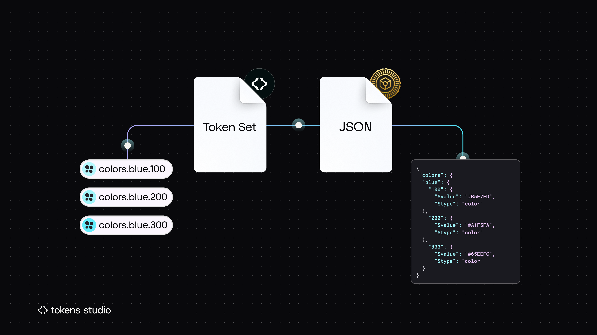
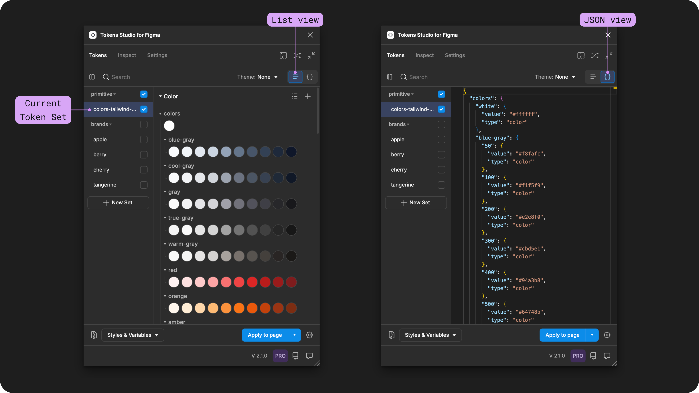
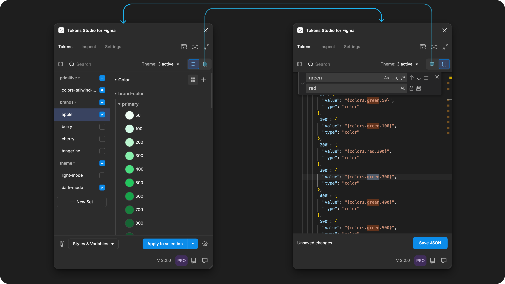

# JSON View

## JSON View - Tokens Page

Token Sets are where our Design Tokens _live_ in the Tokens Studio Plugin.

In code, [Tokens live in JSON files](https://tr.designtokens.org/format/#file-format), so you can think of a Token Set as the no-code version of a JSON file.

<figure><figcaption>
In Tokens Studio, a Token Set is the no-code version of a JSON file.
</figcaption></figure>

However if you are comfortable working in a code editor, the Plugin has a JSON view!


If you are familiar with [VS Code](https://code.visualstudio.com/), you'll feel right at home in the JSON view, as the keyboard shortcuts and actions are the same.


### Access the JSON view

The actions at the top of the Tokens Page control how the Plugin displays the Tokens Sets and Design Tokens below.

Once you select a Token Set from the left-side menu, the Design Tokens living in that JSON file are displayed on the right.

* The current Token Set selected will have the container previewing its name highlighted in blue.
* Select the Token View toggle above the Tokens list on the right side to switch between the JSON and List view

<figure><figcaption>
Select the Toggle on the top right side of the Tokens Page in the Plugin to access the JSON view.
</figcaption></figure>

Once the JSON view is open, you can apply Token data to your Figma design assets in the same way you can from the Token List View. However, you can not apply a new individual Token from the JSON view.&#x20;

→ [Learn more about the Apply Tokens Actions and Settings.](../apply-token-data/)

You can use the collapse Token Set toggle on the left side of the search input to hide the Token Set list in the left panel temporarily so you have more space to view your code files.&#x20;


Any changes you make to Tokens in JSON view need to be saved using the action at the bottom of the plugin before toggling back to List view.&#x20;


<figure><figcaption>
The find and replace feature in the JSON view can be used to make bulk changes.
</figcaption></figure>

### Pro Tips for JSON View&#x20;

Coming Soon!

***

### Resources

Mentioned in this doc:

* Design Tokens Community Group -[ 4.0 File Format](https://tr.designtokens.org/format/#file-format)

#### Community resources:

* None yet!



#### Known issues and bugs

* Tokens Studio Plugin GitHub - [Open issues for JSON View](https://github.com/tokens-studio/figma-plugin/labels/json%20editor)



#### Requests, roadmap and changelog

* None Yet



