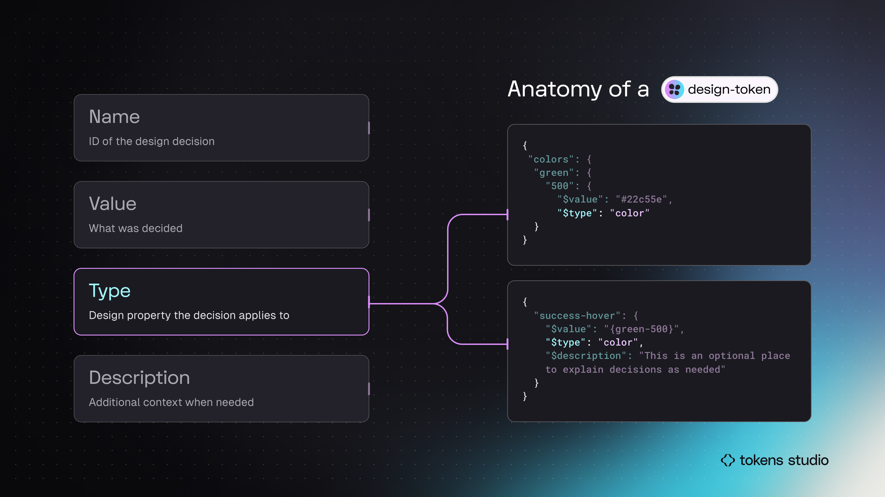

# Token Types

## Token Types in Tokens Studio

The `type` is the anatomic part of a Design Token that defines the category of design property the decision belongs to, or _**when**_ it can be applied. &#x20;

You might recall from our [Intro to Design Tokens Guide](../../fundamentals/design-tokens/) that the `type` determines what Values are acceptable.&#x20;

<figure><figcaption>
In this infographic, the Token examples on the right side highlight the Type. Both code blocks have <code>color</code>as the Token Type.
</figcaption></figure>

Tokens Studio (TS) supports 24 unique **Token Types.**&#x20;

Before you jump into the technical docs for each Token Type, you may want to review the [common terms and concepts below](./#common-language) that will help strengthen your knowledge.&#x20;



<table data-view="cards"><thead><tr><th></th><th></th><th data-hidden data-card-cover data-type="files"></th><th data-hidden data-card-target data-type="content-ref"></th></tr></thead><tbody><tr><td>Color</td><td>Layer fill and stroke.</td><td><a href="../../.gitbook/assets/card-header-token-type-color.png">card-header-token-type-color.png</a></td><td><a href="color/">color</a></td></tr><tr><td>Opacity</td><td>Defines layer transparency.</td><td><a href="../../.gitbook/assets/card-header-token-type-opacity.png">card-header-token-type-opacity.png</a></td><td><a href="opacity.md">opacity.md</a></td></tr><tr><td>Box Shadow - Composite</td><td>X, Y, Blur, Spread, and Color.</td><td><a href="../../.gitbook/assets/card-header-token-type-box-shadow.png">card-header-token-type-box-shadow.png</a></td><td><a href="box-shadow.md">box-shadow.md</a></td></tr><tr><td>Border - Composite</td><td>Stroke color, width and style.</td><td><a href="../../.gitbook/assets/card-header-token-type-border.png">card-header-token-type-border.png</a></td><td><a href="border.md">border.md</a></td></tr><tr><td>Asset</td><td>URL hosted images and assets.</td><td><a href="../../.gitbook/assets/card-header-token-type-asset.png">card-header-token-type-asset.png</a></td><td><a href="asset.md">asset.md</a></td></tr><tr><td>Boolean</td><td>Controls layer visibility.</td><td><a href="../../.gitbook/assets/card-header-token-type-boolean.png">card-header-token-type-boolean.png</a></td><td><a href="boolean.md">boolean.md</a></td></tr></tbody></table>

<table data-view="cards"><thead><tr><th></th><th></th><th data-hidden data-card-target data-type="content-ref"></th><th data-hidden data-card-cover data-type="files"></th></tr></thead><tbody><tr><td>Number</td><td>Unitless numeric value.</td><td><a href="number.md">number.md</a></td><td><a href="../../.gitbook/assets/card-header-token-type-number.png">card-header-token-type-number.png</a></td></tr><tr><td>Dimension</td><td>Numeric value with pixel or rem units.</td><td><a href="dimension/">dimension</a></td><td><a href="../../.gitbook/assets/card-header-token-type-dimension.png">card-header-token-type-dimension.png</a></td></tr><tr><td>Border Radius</td><td>Unofficial Token converted to a Dimension Token. </td><td><a href="dimension/border-radius.md">border-radius.md</a></td><td><a href="../../.gitbook/assets/card-header-token-type-border-radius.png">card-header-token-type-border-radius.png</a></td></tr><tr><td>Border Width</td><td>Unofficial Token converted to a Dimension Token. </td><td></td><td><a href="../../.gitbook/assets/card-header-token-type-borderwidth.png">card-header-token-type-borderwidth.png</a></td></tr><tr><td>Sizing</td><td>Unofficial Token converted to a Dimension Token. </td><td></td><td><a href="../../.gitbook/assets/card-header-token-type-sizing.png">card-header-token-type-sizing.png</a></td></tr><tr><td>Spacing</td><td>Unofficial Token converted to a Dimension Token. </td><td></td><td><a href="../../.gitbook/assets/card-header-token-type-spacing.png">card-header-token-type-spacing.png</a></td></tr></tbody></table>

<table data-view="cards"><thead><tr><th></th><th></th><th data-hidden data-card-cover data-type="files"></th><th data-hidden data-card-target data-type="content-ref"></th></tr></thead><tbody><tr><td>Text (string)</td><td>Strings of text for copy and content.</td><td><a href="../../.gitbook/assets/card-header-token-type-text.png">card-header-token-type-text.png</a></td><td><a href="text.md">text.md</a></td></tr><tr><td>Typography (composite)</td><td>All text and font styling properties combined.</td><td><a href="../../.gitbook/assets/card-header-token-type-typography.png">card-header-token-type-typography.png</a></td><td><a href="typography/">typography</a></td></tr><tr><td>Font Size</td><td>Define in pixel or rem values for responsive design.</td><td><a href="../../.gitbook/assets/card-header-token-type-font-size.png">card-header-token-type-font-size.png</a></td><td><a href="typography/font-size.md">font-size.md</a></td></tr><tr><td>Font Family</td><td>Works with Font Weight as a pair in Figma. </td><td><a href="../../.gitbook/assets/card-header-token-type-font-family (1).png">card-header-token-type-font-family (1).png</a></td><td><a href="typography/font-family.md">font-family.md</a></td></tr><tr><td>Font Weight</td><td>Works with Font Family as a pair in Figma. </td><td><a href="../../.gitbook/assets/card-header-token-type-font-weight.png">card-header-token-type-font-weight.png</a></td><td><a href="typography/font-weight.md">font-weight.md</a></td></tr><tr><td>Line Height</td><td>Define in percentage for responsive design in Figma. </td><td><a href="../../.gitbook/assets/card-header-token-type-line-height.png">card-header-token-type-line-height.png</a></td><td><a href="typography/line-height.md">line-height.md</a></td></tr><tr><td>Letter Spacing</td><td>Define in percentage for responsive design in Figma. </td><td><a href="../../.gitbook/assets/card-header-token-type-letter-spacing.png">card-header-token-type-letter-spacing.png</a></td><td><a href="typography/letter-spacing.md">letter-spacing.md</a></td></tr><tr><td>Paragraph Spacing</td><td>Matches Figma's text property.</td><td><a href="../../.gitbook/assets/card-header-token-type-paragraph-spacing.png">card-header-token-type-paragraph-spacing.png</a></td><td><a href="typography/paragraph-spacing.md">paragraph-spacing.md</a></td></tr><tr><td>Paragraph Indent</td><td>Defined as a Dimension Token.</td><td><a href="../../.gitbook/assets/card-header-token-type-paragraph-indent.png">card-header-token-type-paragraph-indent.png</a></td><td><a href="typography/paragraph-indent.md">paragraph-indent.md</a></td></tr><tr><td>Text Decoration</td><td>Define underline or strike for additional emphasis.</td><td><a href="../../.gitbook/assets/card-header-token-type-text-decoration.png">card-header-token-type-text-decoration.png</a></td><td><a href="typography/text-decoration.md">text-decoration.md</a></td></tr><tr><td>Text Case</td><td>Define caps or title case to change text.</td><td><a href="../../.gitbook/assets/card-header-token-type-text-case.png">card-header-token-type-text-case.png</a></td><td><a href="typography/text-case.md">text-case.md</a></td></tr></tbody></table>

***

### Common Terms

These terms are not the only way to describe Token Types; they are the labels the Tokens Studio team uses for simplicity across our documentation.&#x20;

If your team uses different descriptive terms, that's totally okay!

**Official**

_**Official**_ Token Types are listed in the [W3C Design Tokens Community Group (DTCG) Specifications for Design Tokens](https://tr.designtokens.org/format/#types)

For example, **Dimension Token** is an official type.

**Unofficial**

_**Unofficial**_ Token Types were created by Tokens Studio before the W3C DTCG Specs defined an alternate Token Type.

For example, **Border Width Token** is an unofficial type defined by the spec as a **Dimension Token**.

Tokens Studio will continue to support unofficial Token Types for now. We've already built a conversion into our SD-transforms script; [more details are below ↓](./#transforming-tokens).


Any Token Types we are planning to deprecate will be listed as `legacy`.


**Composite**

When elements are styled by composing many related design decisions together, they are combined into a _**Composite**_ Token Type.

For example, a **Typography Token** is composed of 9 independent text-related properties.

**Property**

Each design decision that is a part of the **Composite Token** is referred to as a _**property**_ of their respective Composite Token in our guides.

For example, `fontFamily` and `fontWeight`are _unofficial_ Tokens we created to independently define the _**properties**_ that Compose a `typography` Token.&#x20;

They may be included in the DTCG Specifications in the future, in which case they would be **official property** Tokens.

**Compatible**

A Token Type with properties that is _**compatible**_ with another Token Type.&#x20;

For example, the `dimension` Token Type is compatible with `fontSize` when referenced within a `typography` Composite Token.

Compatible Token Types are visible by default when defining Token Values which reference another Token in the plugin. This becomes important when creating and maintaining Tokens in the plugin.



***

### Working with Token Types

In the Plugin, you select which Type of Token you'd like to create using a no-code interface. Under the hood, Tokens Studio will write the Token as properly formatted JSON files so they can be used in code. &#x20;

<figure><figcaption>
The Tokens page of the Tokens Studio Plugin shows all Token Types supported. The list is quite long, so the page is scrolled and shown side-by-side to capture them all. 
</figcaption></figure>

You might recall that Design Tokens are platform agnostic, written in a common language so they can shared across different tools and technologies.&#x20;

This means that engineers working with Design Tokens have to _**transform**_ them from JSON files into whatever specific programming needs they have before they can work with them.&#x20;

<figure><figcaption>
The Geko in this infographic represents Style Dictionary.
</figcaption></figure>

### Transforming Tokens&#x20;



Some Tokens we create in Tokens Studio (TS) have subtle differences in how the Token `type` is written compared to the DTCG specifications. In the case of **unofficial** Token Types, which don't exist in the DTCG spec, we have to transform the **TS Type** into something Style Dictionary is prepared to work with.

The SD-Transforms package's preprocessor will transform the **TS Token Type** to the **Style Dictionary Type**, as described in the table below.

→ [SD-Transforms Read-Me Doc, Using the preprocessor](https://github.com/Tokens-studio/sd-transforms/?tab=readme-ov-file#using-the-preprocessor)

***

### Available Token Types

Each Token Type has unique properties and specifications, which are documented in detail. Select the common name of the Token Type in the table below to access its docs.

<table data-full-width="true"><thead><tr><th width="141">Common Name</th><th width="130">W3C DTCG Official</th><th>Composite</th><th>TS JSON Type</th><th>SD Type</th><th>DTCG Type</th></tr></thead><tbody><tr><td><a href="color/">Color Token</a></td><td>✓</td><td>Can be a Property of <code>border</code>, <code>shadow</code></td><td><code>color</code></td><td><code>color</code></td><td><code>color</code></td></tr><tr><td><a href="typography/">Typography Token</a></td><td>✓</td><td>Composite</td><td><code>typography</code></td><td><code>typography</code></td><td><code>typography</code></td></tr><tr><td><a href="typography/font-family.md">Font Family Token</a></td><td>✓</td><td>Property of <code>typography</code></td><td><code>fontFamilies</code> and <code>fontFamily</code></td><td><code>fontFamily</code></td><td><code>fontFamily</code></td></tr><tr><td><a href="typography/font-weight.md">Font Weight Token</a></td><td>✓</td><td>Property of <code>typography</code></td><td><code>fontWeights</code> and <code>fontWeight</code></td><td><code>fontWeight</code></td><td><code>fontWeight</code></td></tr><tr><td><a href="typography/font-size.md">Font Size Token</a></td><td>✓</td><td>Property of <code>typography</code></td><td><code>fontSizes</code> and <code>fontSize</code></td><td><code>fontSize</code></td><td><code>fontSize</code></td></tr><tr><td><a href="typography/line-height.md">Line Height Token</a></td><td>✓</td><td>Property of <code>typography</code></td><td><code>lineHeights</code> and <code>lineHeight</code></td><td><code>lineHeight</code></td><td>NA</td></tr><tr><td><a href="typography/letter-spacing.md">Letter Spacing Token</a></td><td>✓</td><td>Property of <code>typography</code></td><td><code>letterSpacing</code></td><td><code>dimension</code></td><td><code>dimension</code></td></tr><tr><td><a href="typography/paragraph-spacing.md">Paragraph Spacing Token</a></td><td>X</td><td>Property of <code>typography</code> (in TS, not DTCG)</td><td><code>paragraphSpacing</code></td><td><code>dimension</code></td><td><code>dimension</code></td></tr><tr><td><a href="typography/text-case.md">Text Case Token</a></td><td>X</td><td>Property of <code>typography</code> (in TS, not DTCG)</td><td><code>textCase</code></td><td><code>textCase</code></td><td>NA</td></tr><tr><td><a href="typography/text-decoration.md">Text Decoration Token</a></td><td>X</td><td>Property of <code>typography</code> (in TS, not DTCG)</td><td><code>textDecoration</code></td><td><code>textDecoration</code></td><td>NA</td></tr><tr><td><a href="dimension/">Dimension Token</a></td><td>✓</td><td>Can be a Property of <code>border</code>, <code>shadow</code>, <code>typography</code></td><td><code>dimension</code></td><td><code>dimension</code></td><td><code>dimension</code></td></tr><tr><td><a href="number.md">Number Token</a></td><td>✓</td><td></td><td><code>number</code></td><td><code>number</code></td><td><code>number</code></td></tr><tr><td><a href="border.md">Border Token</a></td><td>✓</td><td>Composite</td><td><code>border</code></td><td><code>border</code></td><td><code>border</code></td></tr><tr><td><a href="box-shadow.md">Box Shadow Token</a></td><td>✓</td><td>Composite</td><td><code>boxShadow</code></td><td><code>shadow</code></td><td><code>shadow</code></td></tr><tr><td><a href="dimension/border-radius.md">Border Radius Token</a></td><td>X</td><td></td><td><code>borderRadius</code></td><td><code>dimension</code></td><td><code>dimension</code></td></tr><tr><td><a href="dimension/border-width.md">Border Width Token</a></td><td>X</td><td></td><td><code>borderWidth</code></td><td><code>dimension</code></td><td><code>dimension</code></td></tr><tr><td><a href="dimension/spacing.md">Spacing Token</a></td><td>X</td><td></td><td><code>spacing</code></td><td><code>dimension</code></td><td><code>dimension</code></td></tr><tr><td><a href="dimension/sizing.md">Sizing Token</a></td><td>X</td><td></td><td><code>sizing</code></td><td><code>dimension</code></td><td><code>dimension</code></td></tr><tr><td><a href="asset.md">Asset Token</a></td><td>X</td><td></td><td><code>asset</code></td><td><code>asset</code></td><td>NA</td></tr><tr><td><a href="boolean.md">Boolean Token</a></td><td>X</td><td></td><td><code>boolean</code></td><td><code>boolean</code></td><td>NA</td></tr><tr><td><a href="text.md">Text Token</a></td><td>X</td><td></td><td><code>text</code></td><td><code>content</code></td><td>NA</td></tr><tr><td><a href="other.md">Other Token</a></td><td>X</td><td></td><td><code>other</code></td><td><code>other</code></td><td>NA</td></tr><tr><td><a href="opacity.md">Opacity Token</a></td><td>X</td><td></td><td><code>opacity</code></td><td><code>opacity</code></td><td>NA</td></tr><tr><td><a href="composition.md">Composition Token</a></td><td>X</td><td></td><td><code>composition</code></td><td>each type in the composition is added individually</td><td>NA</td></tr></tbody></table>

***

### Resources

Mentioned in this doc:

* SD-Transforms - [Read Me](https://github.com/tokens-studio/sd-transforms#readme)
* Style Dictionary - [https://styledictionary.com/](https://styledictionary.com/)
* Design Tokens Community Group - [W3C Draft](https://tr.designtokens.org/format/)
* Design Tokens Community Group - [8.0 Token Types](https://tr.designtokens.org/format/#types)

#### Community resources:

* None yet!



#### Known issues and bugs

Tokens Studio Plugin GitHub - [Open issues for Transforming Token Types](https://github.com/tokens-studio/figma-plugin/labels/transform%20tokens)

Tokens Studio Plugin GitHub - [Open issues for Token Type Support](https://github.com/tokens-studio/figma-plugin/labels/token%20types)

* Remove composition tokens [#2800](https://github.com/tokens-studio/figma-plugin/issues/2800)



#### Requests, roadmap and changelog

* Expand Token Types - [Feature request](https://feedback.tokens.studio/p/expand-token-types)


