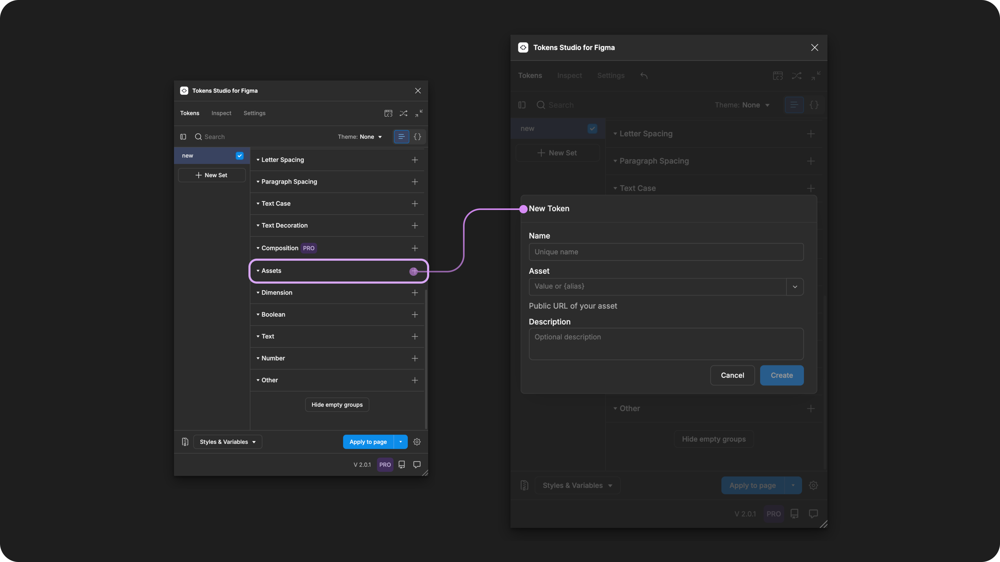

# Asset

## Asset - Token Type

Asset Tokens define the location of assets to style the fill or stroke of a design element as a URL.&#x20;

<figure><figcaption>
Creating a new Asset Token in the Tokens Studio Plugin for Figma.
</figcaption></figure>

***

### Design decisions

Asset Tokens define the location of assets that are stored outside of your Design Tool, and when applied to a design element, the asset will fill the layer.

For example, a product photo across several pages on a marketing website.

When it comes time to change your assets, you can update the Asset Token in the Tokens Studio Plugin and the changes will be applied across your entire design system with just a couple of clicks.

***

### Possible values

An Asset Token can reference any URL or path to an asset file, such as:

* URLs pointing to images or icons hosted online.
* Local file paths if working within a local environment.

The image source needs to have its own CORS (Cross-Origin Resource Sharing) validation.

* Some websites already have that implemented (e.g. Unsplash).
* You can put your images behind a CORS proxy if needed.

→ More information on CORS can be found [here](https://medium.com/nodejsmadeeasy/a-simple-cors-proxy-for-javascript-applications-9b36a8d39c51).

### Values that reference another Token

When trying to reference another Token as the Value for an Asset Token, you will see Tokens in the dropdown list that are:

* Living in Token Sets that are currently active.
  * In the left menu on the plugin's Tokens page, **a checkmark is visible next to the Token Set name.**
* Token Type is compatible:
  * The same = `asset`



***

### Apply Asset Tokens

&#x20;You can apply an Asset Token to fill the background of text, polygonal shape, and frame layers in Figma when the Token is applied.&#x20;

With one or more elements selected in Figma, click on the name of your chosen Asset Token in the Plugin to instantly apply its value.&#x20;



***

### W3C DTCG Token Format

`Asset` is not yet an official Token Type in the W3C DTCG specifications, but there is mention of a 'File' Token Type under consideration ([8.8 Additional Types](https://tr.designtokens.org/format/#additional-types)).

***

### Transforming Tokens



When transforming **Asset Tokens**, there are **no specific configurations** to be aware of.&#x20;

Running the SD-Transforms pre-processor as part of the generic package will prep your Asset Tokens for Style Dictionary.

→ [SD-Transforms Read-Me Doc, Using the preprocessor](https://github.com/Tokens-studio/sd-transforms/?tab=readme-ov-file#using-the-preprocessor)

***

### Resources

Mentioned in this doc:

* CORS information - [Medium Article, Sandeep - NodejsMadeEasy](https://medium.com/nodejsmadeeasy/a-simple-cors-proxy-for-javascript-applications-9b36a8d39c51)
* SD-Transforms - [Read Me](https://github.com/tokens-studio/sd-transforms#readme)
* Style Dictionary - [https://styledictionary.com/](https://styledictionary.com/)
* Design Tokens Community Group - [W3C Draft](https://tr.designtokens.org/format/)
* Design Tokens Community Group - [8.8 Additional Token Types](https://tr.designtokens.org/format/#additional-types)

#### Figma resources:

* Design in Figma - [Working with images in Figma](https://www.figma.com/best-practices/working-with-images-in-figma/)
* Design in Figma - [Adjust the properties of an asset](https://help.figma.com/hc/en-us/articles/360041098433-Adjust-the-properties-of-an-image)

#### CSS resources:

* MDN Web Docs - [Images](https://developer.mozilla.org/en-US/docs/Web/CSS/CSS_images)

#### Community resources:

* Katie Cooper demo's Asset Tokens during the How to Leverage Tokens Studio to level up your Design System presentation - [YouTube](https://developer.mozilla.org/en-US/docs/Web/CSS/CSS_images)



#### Known issues and bugs

Tokens Studio Plugin GitHub - [Open issues for Token Type Asset](https://github.com/tokens-studio/figma-plugin/labels/token%20type%20asset%20token)



#### Requests, roadmap and changelog

* Asset token enhancements (to include icons) - \[Feature Request]\(# Asset token enhancements)


