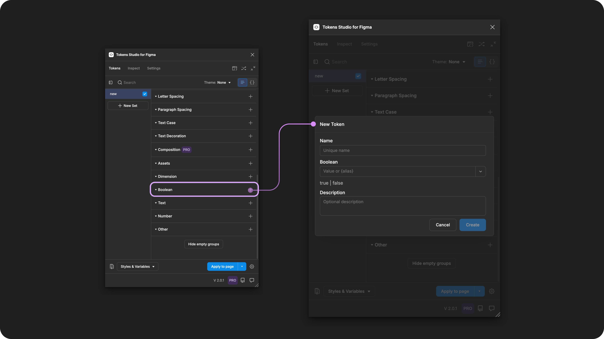

# Boolean

## Boolean - Token Type

Boolean Tokens define layer visibility of an element as true or false.&#x20;

It does not control component properties, as Figma doesn't allow it.

<figure><figcaption>
Creating a new Boolean Token in the Tokens Studio Plugin for Figma.
</figcaption></figure>

***

### Design decisions

Boolean Tokens are great for hiding or showing layers that may be visible within a component under certain conditions.

For example, a card with some actions that are only visible once the card has been interacted with.

You could create two Boolean Tokens:

* `card.show-actions.default` with a value as `false`.
* `card.show-actions.interaction` with values as `true`.

Then, apply the Boolean Tokens to the Actions layer of each variation of the card design.

<table data-card-size="large" data-view="cards" data-full-width="true"><thead><tr><th></th><th data-hidden data-card-cover data-type="files"></th><th data-hidden data-card-target data-type="content-ref"></th></tr></thead><tbody><tr><td>

Boolean Tokens can be attached to Boolean Variables in Figma. 
</td><td><a href="broken-reference">Broken link</a></td><td><a href="../../figma/export/">export</a></td></tr></tbody></table>

***

### Possible values

The syntax used to write string values for Design Tokens is important, so be sure to write your Boolean Token value with **all lowercase letters and ensure there are no spaces**.&#x20;

#### Hardcoded string values

There are only two possible values for the Boolean Token:

* `true`
  * The layer is visible.
* `false`
  * The layer is not visible.

### Values that reference another Token

When trying to reference another Token as the Value for a Boolean Token, you will see Tokens in the dropdown list that are:

* Living in Token Sets that are currently active.
  * In the left menu on the plugin's Tokens page, **a checkmark is visible next to the Token Set name.**
* Token Type is compatible:
  * The same = `boolean`



***

### Apply Boolean Tokens&#x20;

&#x20;You can apply a Boolean Token to show or hide any design element and all of its children layers.&#x20;

With one or more elements selected in Figma, click on the name of your chosen Boolean Token in the Plugin to instantly apply its value.&#x20;



***

### W3C DTCG Token Format

`boolean` is not yet an official Token Type in the W3C DTCG specifications. Tokens Studio has added Boolean as a Token Type to support Figma's Boolean Variable.

***

### Transforming Tokens



When transforming Boolean Tokens, there are no specific configurations to be aware of.&#x20;

Running the SD-Transforms pre-processor as part of the generic package will prep your Boolean Tokens for Style Dictionary.

→ [SD-Transforms Read-Me Doc, Using the preprocessor](https://github.com/Tokens-studio/sd-transforms/?tab=readme-ov-file#using-the-preprocessor)

***

### Resources

Mentioned in this doc:

* SD-Transforms - [Read Me](https://github.com/tokens-studio/sd-transforms#readme)
* Style Dictionary - [https://styledictionary.com/](https://styledictionary.com/)
* Design Tokens Community Group - [W3C Draft](https://tr.designtokens.org/format/)

#### Figma resources:

* Design in Figma - [Apply variables to designs, boolean](https://help.figma.com/hc/en-us/articles/15343107263511-Apply-variables-to-designs#h_01HGTTAWSSJ68PBT6CAGJ272PF)

#### CSS resources:

* MDN Web Docs - [Visibility](https://developer.mozilla.org/en-US/docs/Web/CSS/visibility)

#### Community resources:

* None yet!



#### Known issues and bugs

Tokens Studio Plugin GitHub - [Open issues for Token Type Boolean](https://github.com/tokens-studio/figma-plugin/labels/token%20type%20boolean)



#### Requests, roadmap and changelog

* None yet


