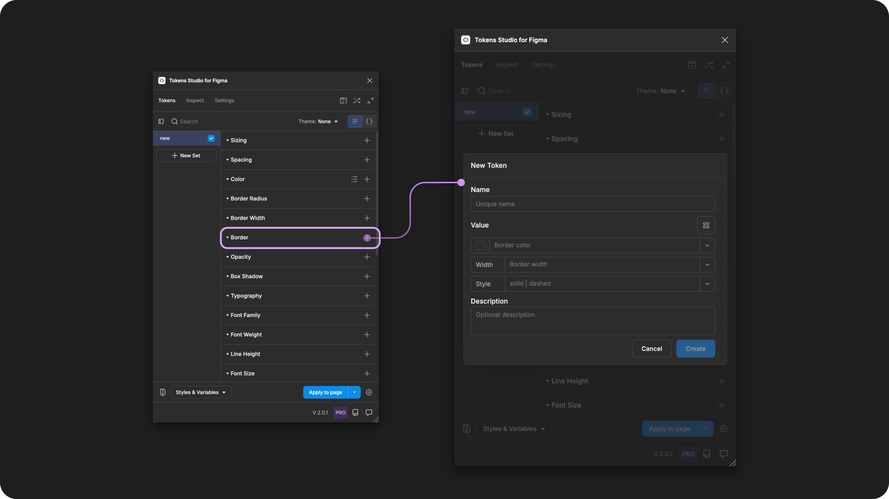
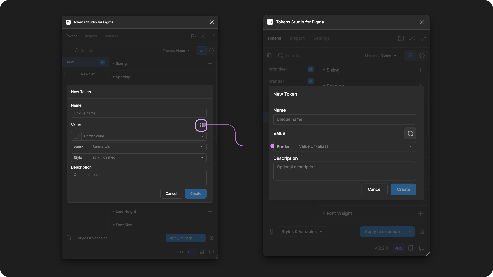

# Border - Composite

## Border - Composite Token Type

Add visual separation to design elements by composing several stroke-related design decisions as a single Border Token.

Each design decision (color, border width, and stroke style) that is a part of the Composite Token is referred to as a **property** of the Border Token in our guides.


It's important to note that **radius** properties are not a part of the Border Token and need to be applied independently.


<figure><figcaption>
Creating a new Border Token in the Tokens Studio Plugin for Figma.
</figcaption></figure>

***

### Design decisions

The Border Token defines the stroke styling properties for containers, text elements, and polygonal shapes.

The properties within the Border Token closely align with the `border` property in [CSS](https://developer.mozilla.org/en-US/docs/Web/CSS/border).

Each property composed to create the Border can be defined as it's own Token and referenced within the Border Composite Toke&#x6E;**:**

* Color
* Border Width
* Stroke Style

***

### Possible values

Like all Composite Tokens, you define the value of each **property** individually.&#x20;

When you create the Border Token in the plugin, you can reference each Token you've already created as a property or enter a hard-coded value.


The best practice is to define all parts of a Composite Token, even with a `null/none` value, rather than to leave it empty.


#### Hard coded values

The dedicated Token Type of each **property** within the Border Composite Token has unique specifications, described in detail in their own technical docs.&#x20;



### Border color

Border Color defines a solid, reduced opacity, or modified color value written in any color space supported by a Color Token.&#x20;

You can also use the color picker to create the value by selecting the swatch to the left of the input.&#x20;

[_→ Jump to the Color Token guide_](color/)



### Border Width

Border width defines the thickness of a stroke around a design element and accepts numeric values, ideally with a unit of measure.&#x20;

For example `1px`

[_→ Jump to the Dimension Token guide_](dimension/)



### Stroke Style

Stroke Style defines the line shape. It's value is written as a string depending on your desired style.&#x20;

`solid` creates a continuous line.&#x20;

`dashed` creates a line of many small sections.&#x20;

* You can adjust the fine-grained settings for the dash using the Figma UI as there currently isn't a Token Specification for it.&#x20;
* Tokens Studio does not have a dedicated Token Type for Stroke Style at this time.&#x20;




The syntax used to write string values for Design Tokens is important!

Be sure to write the value of the stroke style property **all lowercase letters and ensure there are no spaces**.&#x20;


### Values that reference another Token

Like all Composite Tokens, you may reference an existing Token as the value for each individual property, as [described above ↑](border.md#hard-coded-values).

If you'd prefer to reference an existing Border Composite Token as the value instead of defining each Property, select the Token's Reference mode button (2x2 circle icon).

<figure><figcaption>
With the Border Token form open in the Plugin, select the reference mode icon button to change its Value input. This allows you to reference another Border Composite Token as the value. 
</figcaption></figure>

When trying to reference another Token as the Value for a Border Token, you will see:

* Tokens living in **Token Sets that are currently active**.
  * In the left menu on the plugin's Tokens page, a checkmark is visible next to the Token Set name.
* Token Type is compatible:
  * `border`



***

### Apply Border Tokens

A Border Token defines the stroke styling of text, polygonal shape, frames, groups or graphic elements in Figma when the Token is applied. &#x20;

You can apply a Border Token to all sides of the design element at once, or each side independently.&#x20;

With one or more elements selected in Figma, right-click on the Border Token Name in the Plugin to its options.&#x20;

Select your desired design property by clicking on it to apply the Tokens value instantly.&#x20;


If you click the name of Token to apply it to an element without accessing the right-click Token menu, the Border styling will be applied to **all** sides.


<figure><figcaption>
The right-click menu of a Border Token is open to reveal the design properties it can be applied to in Figma.
</figcaption></figure>



### All

Apply the Token value to the stroke on all sides of the selected design element.



### Top

Apply the Token value to the stroke on the element on the X-axis only.



### Right

Apply the Token value to the stroke on the right side of the element on the Y-axis only.



### Bottom

Apply the Token value to the stroke on the lowest side of the element on the X-axis only.



### Left

Apply the Token value to the stroke on left side of the element on the Y-axis only.&#x20;



For independent border styling, you can repeat the steps above and apply different Border Tokens to each side of the same design element.&#x20;


If you apply more than one **Border Token** to the same layer with independent colors defined, the **last Token applied** will change the color value on all sides.

Figma does not yet support independent stroke colors on the same design element.&#x20;

[→ See Figma's docs on Apply and Adjust Stroke Properties ](https://help.figma.com/hc/en-us/articles/360049283914-Apply-and-adjust-stroke-properties#h_01HNBDJBDZNETDYVBJ18VTDXCB)




***

### W3C DTCG Token Format

`border` is an official token type in the in the W3C Design Token Community Group specifications. [9.3 Border](https://second-editors-draft.tr.designtokens.org/format/#border)

Tokens Studio has approached our Border Token differently than how it is defined in the current W3C spec:

* We allow the `borderWidth` property to be a `number` or `dimension` Token Type where the spec defines only `dimension`.
  * We allow unitless numbers where the spec defines a `dimension property` which must include a unit.
* The spec allows for a dedicated `borderStyle` Token Type, which we do not yet support.

As we move towards more closely aligning with the W3C DTCG specifications, we may adjust the Border Composite Token in the future.

***

### Transforming Tokens



When transforming **Border Tokens**, which are Composite Tokens, there are specific configurations to be aware of.

**Composite Tokens** require the SD-Transforms option to `expand composite Tokens into multiple Tokens`.

Make sure you look at the generic SD-Transforms package to include this option, which allows you to further customize this transformation further using Style Dictionary.

→ [SD-Transforms Read-Me Doc, Using the preprocessor](https://github.com/Tokens-studio/sd-transforms/?tab=readme-ov-file#using-the-preprocessor) → [SD-Transforms Read-Me Doc, Using Expand](https://github.com/Tokens-studio/sd-transforms/?tab=readme-ov-file#using-expand)


"object, object"&#x20;

When you transform your Border Tokens and they show `"object, object"`, it means your SD-Transforms configuration needs to be adjusted to include `"expand"`.


If the `borderWidth` property is entered as a number without a unit, the **ts/size/pxx** transform will convert the value to a number with pixels as a unit.

→ [SD-Transforms Read-Me Doc, ts/size/px](https://github.com/Tokens-studio/sd-transforms/?tab=readme-ov-file#tssizepx)

***

### Resources

Mentioned in this doc:

* SD-Transforms - [Read Me](https://github.com/tokens-studio/sd-transforms#readme)
* Style Dictionary - [https://styledictionary.com/](https://styledictionary.com/)
* Design Tokens Community Group - [W3C Draft](https://tr.designtokens.org/format/)
* Design Tokens Community Group - [9.3 Border](https://second-editors-draft.tr.designtokens.org/format/#border)

#### Figma resources:

* Design in Figma - [Apply and adjust stroke properties](https://help.figma.com/hc/en-us/articles/360049283914-Apply-and-adjust-stroke-properties)

#### CSS resources:

* MDN Web Docs - [border](https://developer.mozilla.org/en-US/docs/Web/CSS/border)

#### Community resources:

* None yet!



#### Known issues and bugs

Tokens Studio Plugin GitHub - [Open Issues for Token Type Border](https://github.com/tokens-studio/figma-plugin/labels/token%20type%20border)

* Caps For Dashed Value in Border Composite Token Does Not Work [#2975](https://github.com/tokens-studio/figma-plugin/issues/2975)
  * The string value `Dashed` or `DASHED` does not work as expected, only `dashed` is accepted.
* Separated borders override colors [#2236](https://github.com/tokens-studio/figma-plugin/issues/2236)
  * Applying independent borders with different colors does not work as expected.



#### Requests, roadmap and changelog

* V2 release - [Variables in Stroke Weight and Opacity](https://feedback.tokens.studio/p/variables-in-stroke-weight-and-opacity)


