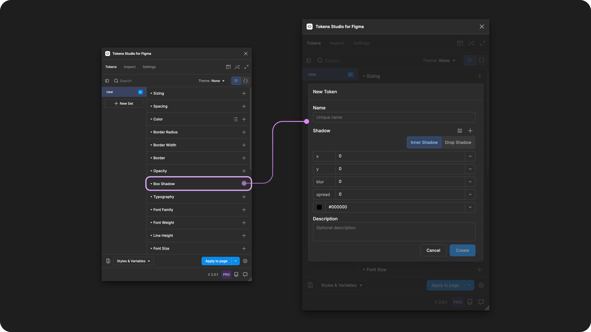
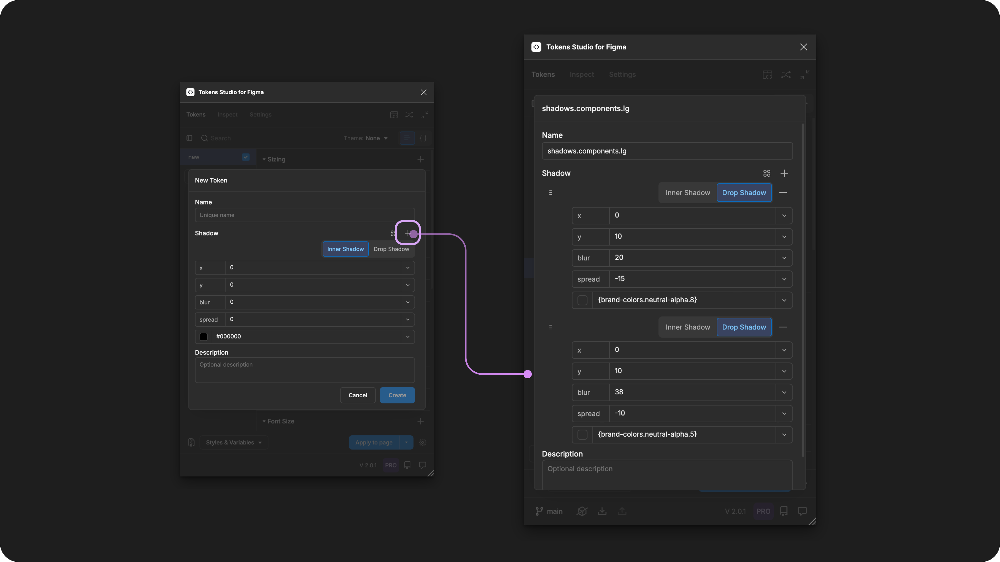
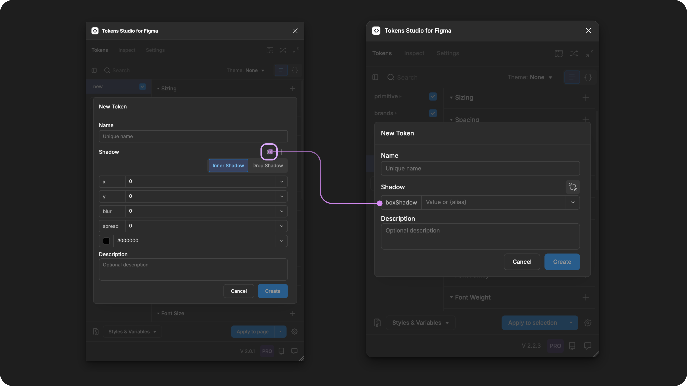

# Box Shadow - Composite

## Box Shadow - Token Type

Add elevation and depth to design elements by composing several shadow-related design decisions into a single Box Shadow Token.

Each design decision (color, spread, blur, offeset) that is a part of a Composite Token is referred to as a **property** of the Box Shadow Token in our guides.

<figure><figcaption>
Creating a new Box Shadow Token in the Tokens Studio Plugin for Figma.
</figcaption></figure>

***

### Design decisions

While the Token Type label is specific to Box Shadow, this Token supports **Inner Shadow** and **Drop Shadow** design decisions.

Each property composed to create the shadow can be defined as it's own Token and referenced within the Box Shadow Composite Toke&#x6E;**:**

* X
* Y
* Blur
* Spread
* Shadow color

Similar to how shadows are defined in [CSS](https://developer.mozilla.org/en-US/docs/Web/CSS/box-shadow), you can combine multiple shadows in a single Box Shadow Token. Box shadow Tokens applied to text layers would translate to `text-shadow` in [CSS](https://developer.mozilla.org/en-US/docs/Web/CSS/text-shadow).&#x20;

Looking for the **Blur Effect** in Figma? That's currently a property within our [**Dimension Token**](dimension/).

<table data-card-size="large" data-view="cards" data-full-width="true"><thead><tr><th></th><th data-hidden data-card-cover data-type="files"></th><th data-hidden data-card-target data-type="content-ref"></th></tr></thead><tbody><tr><td>

Box Shadow Tokens can be attached to Effect Styles in Figma. 
</td><td><a href="../../.gitbook/assets/card-header-figma-styles.png">card-header-figma-styles.png</a></td><td><a href="../../figma/export/">export</a></td></tr></tbody></table>

***

### Possible values

Like all **Composite Tokens**, you define the value of each **property** individually.&#x20;

When you create the Box Shadow Token in the plugin, you can reference each Token you've already created as a property or enter a hard-coded value.


The best practice is to define all parts of a Composite Token, even with a `null/none` value, rather than to leave it empty.


#### Hard coded values

In the plugin, use the UI button to select between `drop shadow` or `inner shadow`.

The dedicated Token Type of each **property** within the Box Shadow Token has unique specifications, described in detail in their own technical docs.&#x20;



### X-offset

X defines the horizontal position of the shadow and are written as a numeric value and unit of measurement.

* Positive values move the position to the right. For example `15px`
* Negative values move the position to the left. For example `-0.255px`

[_→ Jump to the Dimension Token guide_](dimension/)




### Y-offset

Y defines the vertical position of the shadow and are written as a numeric value and unit of measurement.

* Positive values move the position higher up. For example `1.5px`
* Negative values move the position lower down. For example `-10px`

[_→ Jump to the Dimension Token guide_](dimension/)




### Blur radius

Blur defines the the softness of the shadow edges and is written as a numeric value and unit of measurement.

* Higher values create a more diffused shadow, making the edges softer and less defined. For example `15px`
* A value of `0` creates a sharp shadow edge.

[_→ Jump to the Dimension Token guide_](dimension/)




### Spread radius

Spread defines the size of the shadow and is written as a numeric value and unit of measurement.

* Positive values expand the shadow, making it larger. For example `5px`
* Negative values shrink it, making it smaller. For example `-2.25px`

[_→ Jump to the Dimension Token guide_](dimension/)




### Color

Color defines the color of the shadow as a solid, reduced opacity, or modified color value written in any color space supported by a Color Token.&#x20;

You can also use the color picker to create the value by selecting the swatch to the left of the input.&#x20;

[_→ Jump to the Color Token guide_](color/)



#### Multiple layers

You can add another shadow layer to the current token by **selecting the plus icon button** in the Box Shadow Token form.

<figure><figcaption>
Once the Box Shadow Token form is open in the Plugin, select the + icon to add an additional shadow to your composition. 
</figcaption></figure>

When you apply the Box Shadow Token to your design element in the Figma UI, you will see multiple shadow effects applied, one for each shadow layer you created within your token.

When you export a multiple-layer Box Shadow Token to Figma as a Style, you will see a single Effect Style applied, with multiple shadow effects within its value.&#x20;

[More details on Exporting Box Shadow Tokens to Effect styles below ↓.](box-shadow.md#effect-styles-in-figma)

### Values that reference another Token

Like all Composite Tokens, you may reference an existing Token as the value for each individual property, [as described above ↑](box-shadow.md#hard-coded-values).

If you'd prefer to reference an existing Box Shadow Composite Token as the value instead of defining each Property, select the Token's Reference mode button (2x2 circle icon).

<figure><figcaption>
 With the Box Shadow Token form open in the Plugin, select the reference mode icon button to change its Value input. This allows you to reference another Box Shadow Composite Token as the value. 
</figcaption></figure>

When trying to reference another Token as the Value for a Box Shadow Token, you will see Tokens in the dropdown list that are:

* Lving in Token Sets that are currently active.
  * In the left menu on the plugin's Tokens page, a **checkmark is visible next to the Token Set name**.
* Token Type is compatible:
  * `boxShadow`



***

### Apply Box Shadow Tokens

Box Shadow Token**s** defines the inner or outer shadow styling of text, polygonal shape, and frame layers in Figma when the Token is applied.&#x20;

With one or more elements selected in Figma, click on the name of your chosen Box Shadow Token in the Plugin to instantly apply its value.&#x20;



***

### Effect Styles in Figma

Box Shadow Tokens can be attached to Effect Styles in Figma. Tokens Studio also supports Styles with Variable References.

Here are some tips for creating Effect Styles with Variable References using the Plugin.&#x20;


Before you export your Box Shadow Tokens to Figma as styles, ensure each property within the Box Shadow Tokens has a value referencing another Token.


When you **Export to Figma**, select these **Options** from the menu to create Effect Styles with Variable References:

* `Effect Styles` is selected.
* `Number` and `Color Variables` are selected.&#x20;
* `Create styles with variable references` is selected.

<figure><figcaption>
Select the Export Styles and Variables from the Tokens page to configure the Options. 
</figcaption></figure>

Ensure your Export to Figma as Themes or Sets configuration includes all necessary Tokens.

* Themes and token sets where the referenced Tokens are located are `active`.
* Themes and token sets where the variables are attached may need to be configured as `reference only`.

You'll notice the Effect Style will be created on Export, with all possible values mapped to the appropriate Variables, based on the Token Type for each property:

* `color` (will create as color variable)
* `dimension` (number variable)
* `number` (number variable)



***

### W3C DTCG Token Format

Shadow is an official token type in the in the W3C Design Token Community Group specifications ([9.5 Shadow](https://second-editors-draft.tr.designtokens.org/format/#shadow)).

The plugin had Box Shadow support long before the spec defined the `shadow` token, and as a result, we have some legacy decisions which do not completely align with the DTCG spec.

* We write the `type` as `BoxShadow` where the spec writes it as `shadow`.
  * When you run the SD-Transforms npm package we will adjust this automatically to match the specification, details below.
* The Plugin currently supports `number` Tokens in numeric value properties.
  * The spec requires `dimension` values only.

***

### Transforming Tokens



When transforming Box Shadow Tokens, which are a Composite Token there are specific configurations to be aware of.

Composite Tokens require the SD-Transforms option to `expand composite Tokens into multiple Tokens`.

Make sure you look at the generic SD-Transforms package to include this option, which allows you to further customize this transformation further using Style Dictionary.

→ [SD-Transforms Read-Me Doc, Using Expand](https://github.com/Tokens-studio/sd-transforms/?tab=readme-ov-file#using-expand)


"object, object"&#x20;

When you transform your Box Shadow Tokens and they show `"object, object"`, it means your SD-Transforms configuration needs to be adjusted to include `"expand"`.


The preprocessor in the SD-Transforms package will automatically convert the Tokens Studio specific Token Type of `boxShadow` to align with the DTCG Format Token Type of `shadow`.

→ [SD-Transforms Read-Me Doc, Using the preprocessor](https://github.com/Tokens-studio/sd-transforms/?tab=readme-ov-file#using-the-preprocessor)\

The `innerShadow` properties need to be transformed to `inset` to be CSS compatible.

[→ SD-Transforms ts/shadow/innerShadow](https://github.com/Tokens-studio/sd-transforms/?tab=readme-ov-file#tsshadowinnershadow)

***

### Resources

Mentioned in this doc:

* SD-Transforms - [Read Me](https://github.com/tokens-studio/sd-transforms#readme)
* Style Dictionary - [https://styledictionary.com/](https://styledictionary.com/)
* Design Tokens Community Group - [W3C Draft](https://tr.designtokens.org/format/)
* Design Tokens Community Group - [9.5 Shadow](https://second-editors-draft.tr.designtokens.org/format/#shadow)

#### Figma resources:

* Design in Figma - [Shadow or Blur Effects](https://help.figma.com/hc/en-us/articles/360041488473-Apply-shadow-or-blur-effects)

#### CSS resources:

* MDN Web Docs - [Box Shadow](https://developer.mozilla.org/en-US/docs/Web/CSS/box-shadow)
* MDN Web Docs - [Text Shadow](https://developer.mozilla.org/en-US/docs/Web/CSS/text-shadow)

#### Community resources:

* None yet!



#### Known issues and bugs

Tokens Studio Plugin GitHub - [Open issues for Token Type Box Shadow](https://github.com/tokens-studio/figma-plugin/labels/token%20type%20box%20shadow)

* Importing shadow styles causes the order of shadows to be reversed [#2979](https://github.com/tokens-studio/figma-plugin/issues/2979)
* TokenDropdown collides in Color input of box shadows [#2796](https://github.com/tokens-studio/figma-plugin/issues/2796)
  * UI issue where the dropdown menu needs repositioning.
* Multiple shadows in Box Shadow tokens - [array bug #2280](https://github.com/tokens-studio/figma-plugin/issues/2280)
  * Removing one shadow from a Token with many shadows combined does not remove the deleted shadow from the array in the JSON file.



#### Requests, roadmap and changelog

* Change boxShadow values from x and y to offsetX and offsetY[ #2052](https://github.com/tokens-studio/figma-plugin/issues/2052)
  * Alignment with the W3C DTCG format for `shadow` token type


