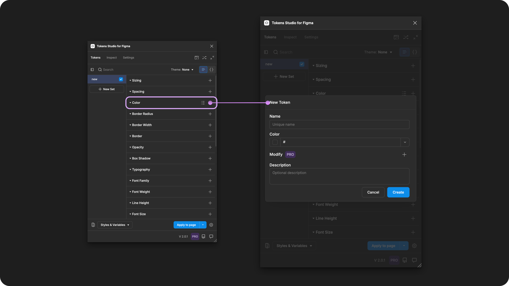
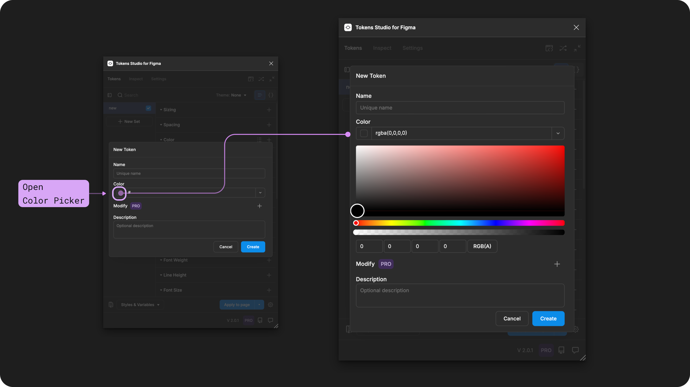
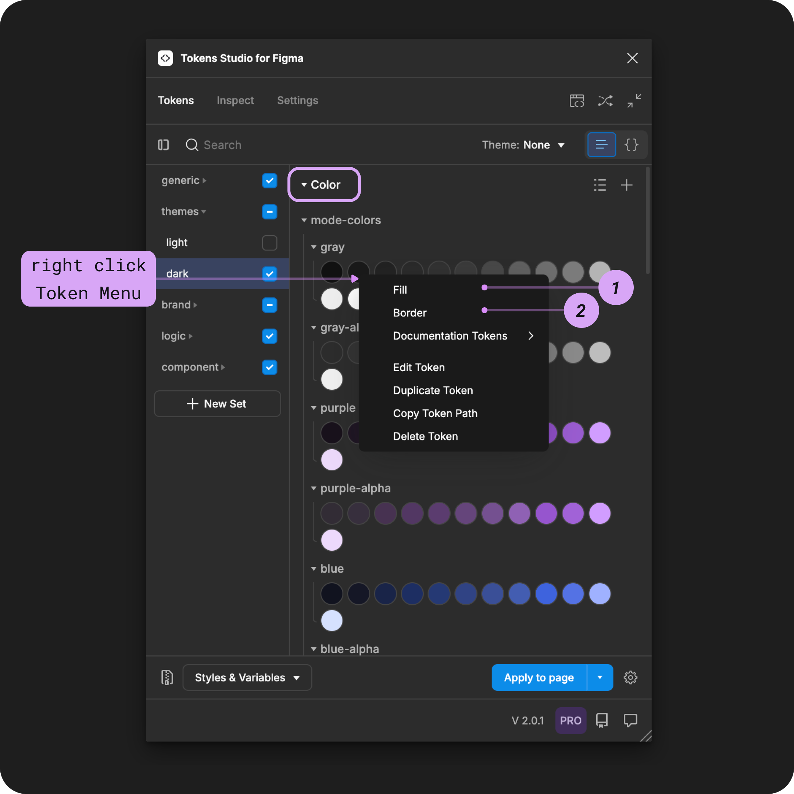
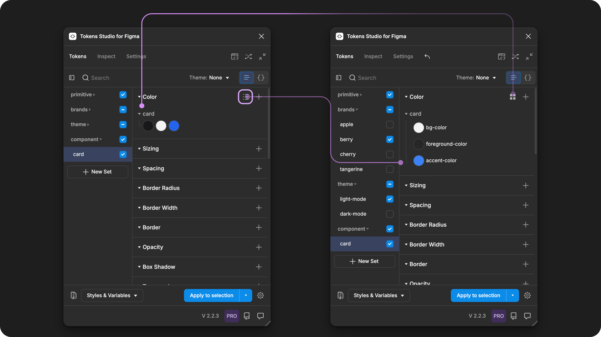
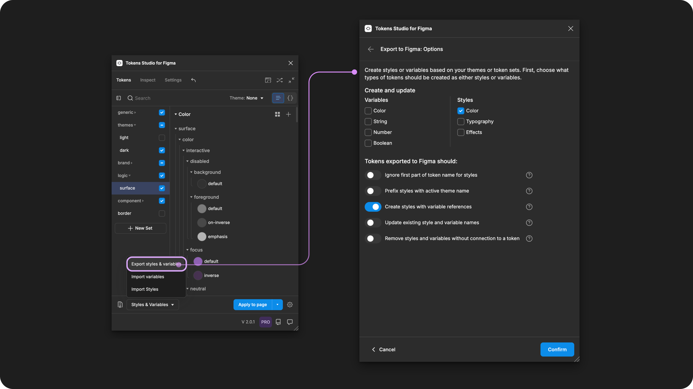

# Color

## Color - Token Type

Color Tokens define solid, reduced transparency, or gradient colors in a color space of your choice.&#x20;

<figure><figcaption><p>Creating a new Color Token in the Tokens Studio Plugin for Figma.</p></figcaption></figure>

***


### Design decisions

Color Tokens define the visibility and emphasis of design elements, ensuring we can read text easily, see the difference between objects in the background and foreground, and help us identify what we should pay attention to.

This doesn't quite match the [CSS definition for color](https://developer.mozilla.org/en-US/docs/Web/CSS/color), which focuses on the foreground color of text elements specifically.

* Many of the properties supported by this token are individually defined in CSS.


Color Tokens can be used to define these design properties:

* Fill color
* Border color
* Shadow color


<table data-card-size="large" data-view="cards" data-full-width="true"><thead><tr><th></th><th data-hidden data-card-cover data-type="files"></th><th data-hidden data-card-target data-type="content-ref"></th></tr></thead><tbody><tr><td><p></p><p>Color Tokens can be attached to Color Styles or Variables in Figma. </p></td><td><a href="../../../.gitbook/assets/card-header-figma-export-options.png">card-header-figma-export-options.png</a></td><td><a href="../../../figma/export/">export</a></td></tr></tbody></table>

***


### Possible values

Depending on how you define the Value of your Color Tokens you can achieve:

* **Solid color**
  * Values written with full opacity
  * For example, a Hex color that is black `#000000`
* **Reduced opacity**
  * Values written with reduced opacity
  * For example, an RGBA color that is black at 10% opacity `rgba(0,0,0,0.1)`
* **Gradients**
  * Multiple color values with their position, direction, and angle defined
  * [↓ More details on Gradients below. ](./#gradients)
* **Modified colors** (pro feature)
  * Adjusting the value of a **base color** using a specific operation, like lighten or darken.
  * [↓More details on Modified Colors below. ](./#modified-colors-pro-feature)

#### Color spaces

Using the plugin for Figma, you can define your Color Tokens in the following color spaces:

* **Solid colors**
  * Hex: `#ff0000`
  * RGB: `rgb(255, 0, 0)`
* **Reduced opacity with alpha values**
  * RGBA: `rgba(255, 0, 0, 1)`
  * ARGB: `#80FFFF00` (also known as Hex8)
  * HSLA: \`hsla(120, 50%, 50%, 1)
* **Modified colors** - Pro feature
  * LCH
  * SRGB
  * P3
  * HSL


When you create a **Color Token** using a color space that is `not Hex`, the plugin will resolve the color to the equivalent Hex value.&#x20;

This is based on restrictions of the [current W3C DTCG specification](https://tr.designtokens.org/format/#color) for Color Tokens.



### Values that reference another Token

When trying to reference another Token as the Value for a Color Token, you will see Tokens in the dropdown list that are:

* Living in Token Sets that are currently active.
  * In the left menu on the plugin's Tokens page, **a checkmark is visible next to the Token Set name.**
* Token Type is compatible:
  * The same = `color`



#### Compatible Token types

After you've created Color Tokens, they can be referenced in another Color Token and composite Tokens with a color property defined:


[box-shadow.md](../box-shadow.md)



[border.md](../border.md)


***


### Color picker

Like all tokens in the plugin, you can **Create a Color Token** by opening its **Create New Token form** and defining the Token Name and Value.

However, Color Tokens can also be created using a **Color Picker**, accessible by selecting the **color swatch** to the left of the Token Value Input.


You can also use the **Color Modifier** (pro feature) with the **Color Picker**.


<figure><figcaption><p>With a Color Token form open, selecting the swatch to the left of the Value input opens the color picker in the Plugin.</p></figcaption></figure>

***


### Reduced opacity (transparency)

Defining the **Value** of your **Color Token** as `RGBA`, `HSLA` or `ARGB` allows you to use the **alpha value** built into these color spaces.

The alpha modifier adjusts the opacity of the color.

In `RGBA` and `HSLA` the **alpha value** is defined as a numeric value that represents a percentage of adjustment for fine-grained control of transparency.

* `0` = fully transparent (0%), making the color invisible
* `0.5` = 50% opacity, making the color semi-transparent
* `1` = fully opaque (100%)

For example, if you want a **Color Token** that is black with a 25% opacity you would write the value of the token to be:

```
rgba(0,0,0,0.25)
```

or

```
hsla(0, 0%, 0%, 0.25)
```

The `ARGB` format is sometimes called "Hex 8" by developers because it uses 8 hexadecimal digits: the first two digits represent the alpha (opacity) channel, and the next six digits represent the RGB color channels.

If we were to write the same **Color Token** that is black with a 25% opacity in ARGB it's value would be:

```
#40000000
```


#### Opacity with referenced Tokens

You can reference an existing Token as a part of an RGBA or HSLA Token Value to create a reduced opacity version of that Token.

For example:

```
rgba({colors.grey.900}, 0.06)
```

Creates a new token which references the `grey.900` Color Token with only 6% opacity.


Known issue&#x20;

When the value of a Color Token with reduced opacity includes a reference to another Color Token which has reduced opacity, the resolved value is incorrect.



It's also possible to write your RGBA or HSLA Token Value by referencing a Color Token and a unitless **Number Token** in the value.

For example, a **Number Token** called `brand.opacity.border.default` with a value of `0.06` would be added to the example above:

```
rgba({colors.grey.900}, {brand.opacity.border.default})
```


Ensure you are using a unitless **Number Token!**


Known issue&#x20;

When the value of a Color Token with reduced opacity includes a reference to an `opacity` Token instead of a `number` Token.&#x20;

The plugin may resolve the value correctly but when exporting to Figma or Code, there could be issues.


The Opacity Token Type in the plugin is intended for layer visibility in Figma only, not for use in Color Tokens as a modifier.




[opacity.md](../opacity.md)



[number.md](../number.md)



#### Opacity in the color picker

If you prefer a visual way to create reduced opacity Color Tokens you can open the color picker tool in the plugin [(follow the steps above ↑)](./#color-picker).

The **opacity** can be defined in the color picker by:

* **Typing the alpha value** between 0 and 1 in the last input.
* **Adjusting the second slider** which controls the alpha value.

***


### Advanced color values

_Select a card below to jump to its guide._

<table data-card-size="large" data-view="cards"><thead><tr><th></th><th></th><th data-hidden data-card-cover data-type="files"></th><th data-hidden data-card-target data-type="content-ref"></th></tr></thead><tbody><tr><td>Modified Colors (pro)</td><td>The plugin supports creating dynamic colors by <strong>modifying a base color</strong> through the use of lighten, darken, alpha, or mix parameters.</td><td><a href="../../../.gitbook/assets/card-header-token-type-color-modified.png">card-header-token-type-color-modified.png</a></td><td><a href="modified.md">modified.md</a></td></tr><tr><td>Gradient Colors</td><td>The plugin currently supports <strong>Linear Gradient Colors</strong> within a Color Token by writing the value to <a href="https://developer.mozilla.org/en-US/docs/Web/CSS/CSS_images/Using_CSS_gradients">match CSS gradients</a>.</td><td><a href="../../../.gitbook/assets/card-header-token-type-color-gradient.png">card-header-token-type-color-gradient.png</a></td><td><a href="gradient.md">gradient.md</a></td></tr></tbody></table>

***


### Apply Color Tokens

A Color Token defines the color styling of text, polygonal shape, frames, groups or graphic elements in Figma when the Token is applied. &#x20;

You can apply the Token to fill the element with its value, or change its stroke color.

With one or more elements selected in Figma, right-click on the name of your chosen Color Token in the Plugin to see the it's options. Select your desired design property by clicking on it to apply the Token. &#x20;


If you click the name of Token to apply it to an element without accessing the right-click Token menu, the Color styling will be applied to fill the container.&#x20;


<figure><figcaption><p>The right-click menu of a Color Token is open to reveal the design properties it can be applied to in Figma.</p></figcaption></figure>



### Fill

The value of the Color Token is applied to the entire layer selected.



### Border

The value of the Color Token is applied to the stroke of the layer selected.






#### View Color Tokens as list

The Color Token has a special feature on the Tokens Page of the plugin, which allows you to toggle between a list or grid view.&#x20;

This can be especially helpful if you need to see your Token Names while working in the plugin.&#x20;

<figure><figcaption><p>On the Tokens Page of the Plugin the Color Token has an icon-button to toggle between list and grid view.</p></figcaption></figure>

***


### Color Styles in Figma&#x20;

**Color Tokens** can be **Exported to Figma** as **Color Styles.** Tokens Studio also supports **Styles with Variable References**.

Here are some tips for creating Color Styles with Variable References using the Plugin.&#x20;


Before you export your **Color** **Tokens** to Figma as styles, ensure the value is referencing another Token which has been Exported to Figma as a Variable.


When you **Export to Figma** as **Color Styles**, select these **Options** from the menu to create Color Styles with Variable References:

* The option for `Color styles` is selected.
* The option for `Create styles with variable references` is selected.
* Themes and token sets where the referenced Tokens are located are `active`.
* Themes and token sets where the variables are attached may need to be configured as `reference only`.

<figure><figcaption><p>Select the Export Styles and Variables from the Tokens page to configure the Options. </p></figcaption></figure>



***


### W3C DTCG Token Format

Color is an official token type in the W3C DTCG specifications ([8.1 Color](https://tr.designtokens.org/format/#color)) which is currently being updated to define expanded support for additional color spaces.

[→ We'd love to hear your thoughts on this! Join the conversation. ](https://feedback.tokens.studio/p/dtcg-format-update-on-color-tokens-and-support-for-color)

***


### Transforming Tokens



When transforming Color Tokens with gradient values, there are specific configurations to be aware of.

The SD-Transforms generic package will convert color token values with Figma's "hex code RGBA" into actual `rgba()` format for CSS.

→ [SD-Transforms Read-Me Doc, ts/color/css/hexrgba](https://github.com/Tokens-studio/sd-transforms/?tab=readme-ov-file#tscolorcsshexrgba)

***


### Resources

Mentioned in this doc:

* SD-Transforms - [Read Me](https://github.com/tokens-studio/sd-transforms#readme)
* Style Dictionary - [https://styledictionary.com/](https://styledictionary.com/)
* Design Tokens Community Group - [W3C Draft](https://tr.designtokens.org/format/)
* Design Tokens Community Group - [8.1 Color](https://tr.designtokens.org/format/#color)


#### Figma resources:

* Design in Figma - [Paints in Figma](https://help.figma.com/hc/en-us/articles/360041003694-Paints-in-Figma)
* Design in Figma - [The difference between variables and styles](https://help.figma.com/hc/en-us/articles/15871097384471-The-difference-between-variables-and-styles)


#### CSS resources:

* MDN Web Docs - [color](https://developer.mozilla.org/en-US/docs/Web/CSS/color)


#### Community resources:

* Nate Baldwin's + Adobe - [Leonardo color tool with design token export](https://leonardocolor.io)




#### Known issues and bugs

Tokens Studio Plugin GitHub - [Open issues for Token Type Color](https://github.com/tokens-studio/figma-plugin/labels/token%20type%20color)

* Referencing a (base+opacity) and adding another opacity to that, doesn't give the correct result [#1822](https://github.com/tokens-studio/figma-plugin/issues/1822)
  * When the value of a Color Token with reduced opacity includes a reference to another Color Token which has reduced opacity, the resolved value is incorrect.




#### Requests, roadmap and changelog

* Expanded support for color spaces - [Feature Request](https://feedback.tokens.studio/p/expanded-support-for-color-spaces)
* JSON Enhancements for color tokens and theming - [Feature Request](https://feedback.tokens.studio/p/json-enhancements-for-color-tokens)


