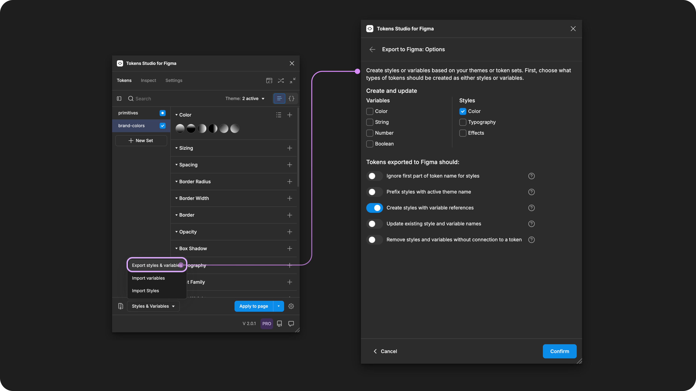

# Gradient Colors

## Gradient Colors

You can define **Color Token** values as gradients by writing a [css-like syntax](https://developer.mozilla.org/en-US/docs/Web/CSS/CSS_images/Using_CSS_gradients). This includes:

* Angle of the gradient in degrees (deg for short).
* Two or more colors.
* The position of each color in percentage.
  * `0%` is the start
  * `100%` is the end


Limited gradient support&#x20;

Today, the plugin only supports **linear gradients** when exporting to Figma.



#### Template files

If you'd like a template to explore Gradients with, click the file below to to download the zip folder. Then you can unzip and [upload to Tokens Studio in a new Figma file](../../project-tools/).&#x20;



***


### How to create Gradient Color Tokens&#x20;

Here's an example of how to write the value of a linear gradient with two stops that appear to change colors diagonally (on a 45 degree angle).&#x20;

```
linear-gradient(45deg, #87CEEB 0%, #008000 100%)
```


To add additional color stops, add them between the round brackets, being sure to define the color value and the position as a percentage.

Here is the same example with a third color stop added exactly at half way between (50%).&#x20;

```
linear-gradient(45deg, #0000FF 0%, #87CEEB 50%, #008000 100%)
```


You can also **Import Color Styles** of gradients you've created in Figma to see how they are written in the plugin.



***


### Gradients can reference another Color Token

Like **Color Tokens** with a single value, you can reference another Token in your gradients by adding curly brackets { } around the Token name you want to reference.

Here's an example of a linear gradient with two stops, with colors that appear to change horizontally from light to dark gray:

```
linear-gradient(180deg, {colors.gray.50} 0%, {colors.gray.900} 100%)
```


### Reduced opacity (alpha values)

Like **Color Tokens** with a single value, you can write the value of your gradients to have colors with reduced opacity by defining each color stop in RGBA.

RGBA colors use a unitless number to define the alpha value, converted into a percentage in Figma. For example:

* `1` = 100% opacity
* `0.4` = 40% opacity
* `0.06` = 6% opacity

Here's an example of a linear gradient with two stops, with colors that appear to change vertically from light with 40% opacity `0.40` to dark gray with 100% opacity `1`:

```
linear-gradient(270deg, rgba({colors.gray.50}, 0.4) 0%, rgba({colors.gray.900}, 1) 100%)
```

This also works when your colors are defined as hard-coded values instead of referencing another Token.

***


### Color Styles with Variable references

Gradients are **Color Tokens** with multiple values, and can be **Exported to Figma** as **Color Styles**. Tokens Studio also supports **Styles with Variable References**.

Here are some tips for creating Color Styles with Variable References using the Plugin.&#x20;


Before you export your **Gradient** **Color** **Tokens** to Figma as styles, ensure the value is referencing another Color Token which has been Exported to Figma as a Variable.



When you **Export to Figma** as **Color Styles**, select these **Options** from the menu to create Color Styles with Variable References:

* The option for `Color styles` is selected.
* The option for `Create styles with variable references` is selected.
* Themes and Token sets where the gradients are located are `active`.
* Themes and Token sets where the variables are attached are `reference only`.

<figure><figcaption><p>Select the Export Styles and Variables from the Tokens page to configure the Options. </p></figcaption></figure>


Note that if the Tokens referenced include modified colors that haven't been resolved, the connection to the Variable will not work as expected.

* For example, a Token included in the gradient written as `rgba({colors.gray.900, 0.5)` will not be connected to the `colors.gray.900` variable because the Plugin has not yet resolved the value, written as a 50% opacity in RGBA.
* You could create a new Token, for example, `gradient-stop` with a value of `rgba({colors.gray.900, 0.5)`, then reference the `{gradient-stop}` Token in the gradient value instead.



***


### Limitations of gradient Color Tokens

The plugin will support creating Tokens of any [CSS Gradients](https://developer.mozilla.org/en-US/docs/Web/CSS/CSS_images/Using_CSS_gradients). However, we are not yet able to create all types of gradients in Figma. Unsupported gradient types will be skipped during the import and export with Figma processes.&#x20;

* Linear - Supported
* Radial - Requested
* Conic - Requested


**Positioning a gradient on a layer**

In code, gradients are["a special type of image"](https://developer.mozilla.org/en-US/docs/Web/CSS/CSS_images/Using_CSS_gradients), but Figma doesn't treat them that way.

As design Tokens are intended to be used in code, we are not able to control the position of a gradient on a layer within the plugin in the same way you can in Figma.

* The plugin is only able to store the degree of the gradient.
* Without any translation information, the positioning of the gradient on a layer cannot be accurately determined.
* By default, the plugin applies the gradient to the "edges" of the design element you select when applying the Token.

#### Importing Styles with Variable References&#x20;

Today the Plugin isn't able to capture your Variable References when importing your Gradient Color Styles from Figma. It will create the Token with with resolved values as Hex codes.&#x20;

You can manually replace those values with References to another Token following[ the steps above↑](gradient.md#gradients-can-reference-another-color-token).&#x20;

***


### W3C DTCG Token Format

`gradient` is an official Token type in the in the W3C Design Token Community Group specifications.([9.6 Gradient](https://tr.designtokens.org/format/#gradient))&#x20;

However, Tokens Studio has yet to support Gradients as an independent Token Type. It is on our radar as we work towards more closely aligning with the DTCG spec.

***


### Transforming Tokens



When transforming **Color Tokens** with gradient values, there are specific configurations to be aware of.


The SD-Transforms generic package will convert color Token values with Figma's "hex code RGBA" into actual `rgba()` format for CSS.

→ [SD-Transforms Read-Me Doc, ts/color/css/hexrgba](https://github.com/Tokens-studio/sd-transforms/?tab=readme-ov-file#tscolorcsshexrgba)


**Color Tokens** with gradient values are technically a composite Token as it contains multiple values. Composite Tokens require the SD-Transforms option to `expand composite Tokens into multiple Tokens`.

* Make sure you look at the generic SD-Transforms package to include this option, which allows you to further customize this transformation further using Style Dictionary.

→ [SD-Transforms Read-Me Doc, Using the preprocessor](https://github.com/Tokens-studio/sd-transforms/?tab=readme-ov-file#using-the-preprocessor) → [SD-Transforms Read-Me Doc, Using Expand](https://github.com/Tokens-studio/sd-transforms/?tab=readme-ov-file#using-expand)


&#x20;"object, object"&#x20;

When you transform your Color Tokens, and they show `"object, object"` it means your SD-Transforms configuration needs to be adjusted to include `"expand"`.


***

### Resources

Mentioned in this doc:

* SD-Transforms - [Read Me](https://github.com/tokens-studio/sd-transforms#readme)
* Style Dictionary - https://styledictionary.com/
* Design Tokens Community Group - [W3C Draft](https://tr.designtokens.org/format/)
* Design Tokens Community Group - [9.6 Gradient](https://tr.designtokens.org/format/#gradient)

#### Figma resources:

* Design in Figma - [Paints in Figma, Use Variables in Gradients](https://help.figma.com/hc/en-us/articles/360041003694-Paints-in-Figma)

#### Gradient resources

* 9elements.com - [Gradient angles CSS Figma and Sketch](https://9elements.com/blog/gradient-angles-in-css-figma-and-sketch/)
* Larsenwork - [Easing gradients tool](https://larsenwork.com/easing-gradients/)
* joshwcomeau.com - [CSS Gradient Generator](https://www.joshwcomeau.com/gradient-generator/)

#### CSS resources:

* MDN Web Docs - [Using CSS Gradients](https://developer.mozilla.org/en-US/docs/Web/CSS/CSS_images/Using_CSS_gradients)


#### Community resources:

* None yet!




#### Known issues and bugs

Tokens Studio Plugin GitHub - [Open issues for Token Type Gradients](https://github.com/Tokens-studio/figma-plugin/labels/Token%20type%20gradient)

* Linear-Gradient Token Does Not Work With Other Color-spaces (Also When Creating Styles/Variables) [#2718](https://github.com/Tokens-studio/figma-plugin/issues/2718)
  * Gradients with values in the HSL and P3 color spaces aren't working as expected.




#### Requests, roadmap and changelog

* Expand gradient color support - [Feature Request](https://feedback.tokens.studio/p/add-gradient-Token-type-and-expand-functionality-past-linear)


