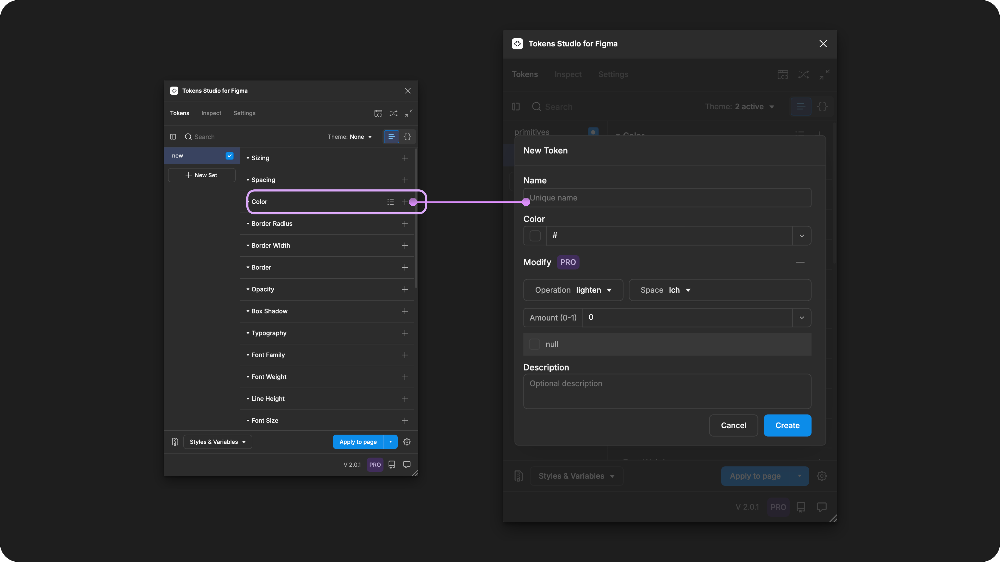

# Modified Colors (pro)

## Modified Colors

**Color Modifiers** allow you to easily create consistent, scalable color systems by adjusting and blending colors with fine-grained control within Tokens Studio.&#x20;

Modifying your Color Tokens is a powerful way to create dynamic color schemes.&#x20;

For example:

* Generate a color ramp from a single 'base color'.
* Introduce subtle variations between interactive states.

<figure><figcaption>
Creating a new Modified Color Token in the Tokens Studio Plugin for Figma.
</figcaption></figure>

***

### How to use color modifiers

In the **Color Token** form, define your **Token Name** and assign the **Token Value** by **referencing another Color Token**.


The Token you've referenced is known as the _**base color**_ in the rest of this guide.&#x20;


Select the **Add new modifier button** on the right side of the **Modify label**.

* Choose your desired **color space**:
  * LCH
  * SRGB
  * P3
  * HSL
* Choose your desired **modifier**&#x20;
  * [↓ More details below](modified.md#available-modifiers)
* Define the **modification amount** by entering in a number between `0` and `1` based on your desired effect.
* Be sure to **Save** your new modified **Color Token**

#### Modify via Color Picker

You can also use the **Color Modifier** (pro feature) with the **Color Picker** tool in the plugin by **Selecting the color swatch** to the left of the **Token Value Input**.

<figure><figcaption>
With a Color Token form open, selecting the swatch to the left of the Value input opens the color picker in the Plugin. Select the + icon next to the Modify label to use the Color Modifier feature.
</figcaption></figure>

***

### Available modifiers

The plugin currently supports four popular types of modifications to Color Tokens.&#x20;

<table><thead><tr><th width="244">Modifier</th><th>Description</th></tr></thead><tbody><tr><td><a href="modified.md#lighten">Lighten</a></td><td>Increases the lightness (luminosity) of the base color by your chosen value.</td></tr><tr><td><a href="modified.md#darken">Darken</a></td><td>Reduces the lightness (luminosity) of the base color by your chosen value.</td></tr><tr><td><a href="modified.md#alpha">Alpha</a></td><td>Adjusts the opacity of the base color by your chosen value, often reducing it to make the color more transparent.</td></tr><tr><td><a href="modified.md#mix">Mix</a></td><td>Combines your base color with another color, allowing you to control the proportion of each color in the mix.</td></tr></tbody></table>

#### Lighten

The **lighten** modifier increased the lightness (luminosity) of the base color by defining a numeric value that represents a percentage of adjustment.

* `0` = no change in lightness (0%)
* `0.5` = 50% increased lightness
*   `1` = 100% increased lightness,

    * which significantly increases the lightness but does not necessarily make the color white.
    * The maximum lightness is usually capped to maintain the integrity of the color's hue and saturation.

#### Darken

The **darken** modifier reduces the lightness (luminosity) of the base color by defining a numeric value that represents a percentage of adjustments.

* `0` = no change in lightness (0%)
* `0.5` = 50% reduced lightness
*   `1` = 100% reduced lightness,

    * which significantly darkens the color, but does not necessarily make the color black.
    * The maximum darkness is usually capped to maintain the integrity of the color's hue and saturation.

#### Alpha

The **alpha** modifier adjusts the opacity of the base color by defining a numeric value that represents a percentage of adjustment for fine-grained control of transparency.

* `0` = fully transparent (0%), making the color invisible
* `0.5` = 50% opacity, making the color semi-transparent
* `1` = full opacity (100%), the color appears 'solid'

#### Mix

The **mix** modifier combines the base color with another color token by defining a numeric value that represents the proportion of the mix for fine-grained control over the balance between the two colors.

* `0` = only the base color (0% of the mixed color)
* `0.5` = an equal mix of both colors (50% base color, 50% mixed color)
* `1` = only the mixed color (100% of the mixed color)

***

### Limitations of modified colors

There are some known limitations with Modified Color Tokens.

#### Exporting to Figma as Variables looses references

Figma Variables does not support Modified Colors, as they aren't able to resolve the value of these sorts of 'dynamic references'.

The plugin will Export your Modified Color Tokens as Color Variables which will show their Resolved Values in hex codes, which Figma can support. Changes you make to these Tokens in the plugin will also update to the connected Variable when you Export your changes.



***

### W3C DTCG Token Format

Color is an official token type in the W3C DTCG specifications ([8.1 Color](https://tr.designtokens.org/format/#color)) which is currently being updated to define expanded support for additional color spaces.

[→ We'd love to hear your thoughts on this! Join the conversation on Featurebase. ](https://feedback.tokens.studio/p/dtcg-format-update-on-color-tokens-and-support-for-color)

Today, we have to resolve your Modified Colors into Hex when Exporting to Figma, and to align with the current definition of Color Tokens in the W3C DTCG specification.

***

### Transforming Tokens



When transforming **Color Tokens** that have been modified, there are specific configurations to be aware of.

SD-Transforms generic package includes a specific transform to convert Tokens Studio modified colors to their resolved color values.

→ [SD-Transforms Read-Me doc, ts/color/modifiers](https://github.com/Tokens-studio/sd-transforms/?tab=readme-ov-file#tscolormodifiers)

You can add an optional transform to convert Tokens Studio modified colors to a specific `format`, for example e.g. `hsl` which will ensure that the resolved color value will be formatted as the resolved value in HSL.

There's also a global option which allows you to set the color format once for all colors that have a modifier, so you don't have to set this for every token individually.

[→ SD-Transforms Read-Me doc, options](https://github.com/Tokens-studio/sd-transforms/?tab=readme-ov-file#options)

***

### Resources

Tokens Studio uses the ColorJS.io library for the implementation of modified colors.

* [https://colorjs.io/docs/](https://colorjs.io/docs/)

Mentioned in this doc:

* SD-Transforms - [Read Me](https://github.com/tokens-studio/sd-transforms#readme)
* Style Dictionary - [https://styledictionary.com/](https://styledictionary.com/)
* Design Tokens Community Group - [W3C Draft](https://tr.designtokens.org/format/)
* Design Tokens Community Group - [8.1 Color](https://tr.designtokens.org/format/#color)

#### Figma resources:

* Design in Figma - [Manage color profiles in Figma](https://help.figma.com/hc/en-us/articles/360039825114-Manage-color-profiles-in-design-files)

#### CSS resources:

* MDN Web Docs - [Color Space Glossary](https://developer.mozilla.org/en-US/docs/Glossary/Color_space)
* MDN Web Docs - [Color Gamut](https://developer.mozilla.org/en-US/docs/Web/CSS/@media/color-gamut)

#### Community resources:

* A written guide by Katie Cooper, Lead Product Designer - [Creating a color ramp using color modifiers in Tokens Studio](https://uxdesign.cc/create-a-color-ramp-using-color-modifiers-in-tokens-studio-8222cf735242)



#### Known issues and bugs

Tokens Studio Plugin GitHub - [Open issues for Token Type Color Modifiers](https://github.com/tokens-studio/figma-plugin/labels/token%20type%20color%20modifier)

* Color Transforms [#2946](https://github.com/tokens-studio/figma-plugin/issues/2946)
  * HSLA calculated color values are incorrect
* HSLA [#2945](https://github.com/tokens-studio/figma-plugin/issues/2945)
  * Choosing HSLA in the color picker converts the Token to RGBA
* Color modifiers break when borderRadius Token is renamed [#2668](https://github.com/tokens-studio/figma-plugin/issues/2668)
  * Unexpected results when renaming borderRadius Tokens



#### Requests, roadmap and changelog

* Modified colors aren't showing up in the second screen feature as expected - [Community Post](https://feedback.tokens.studio/p/second-screen-enhancements)


