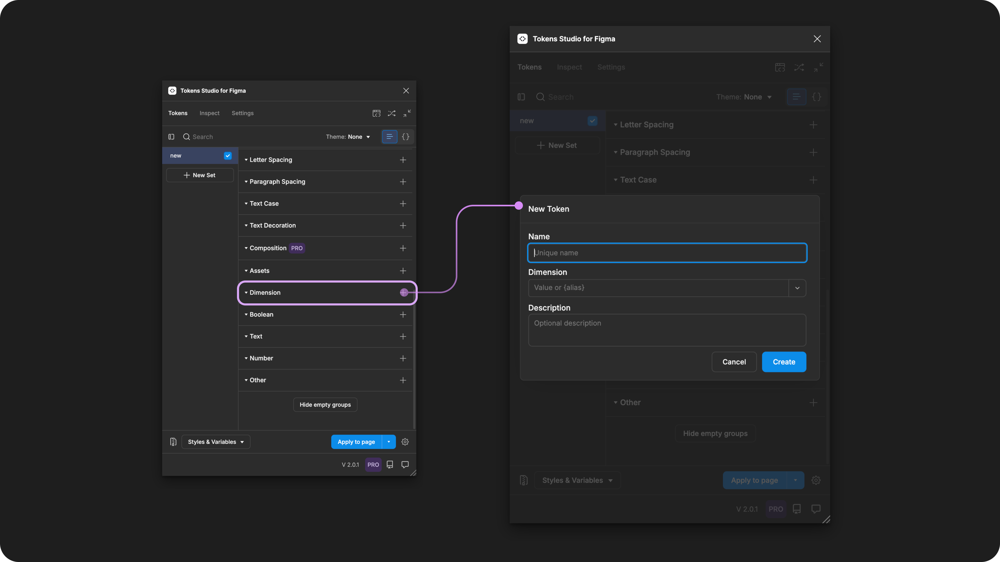
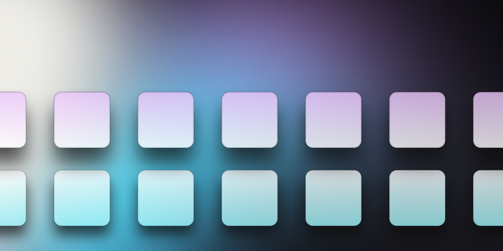
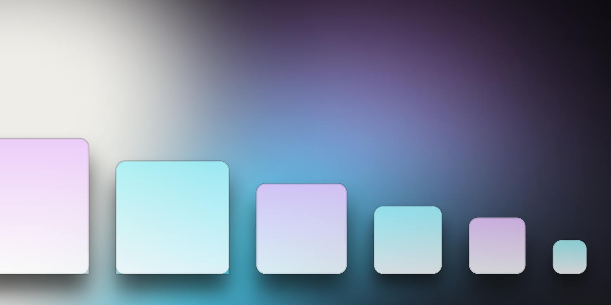
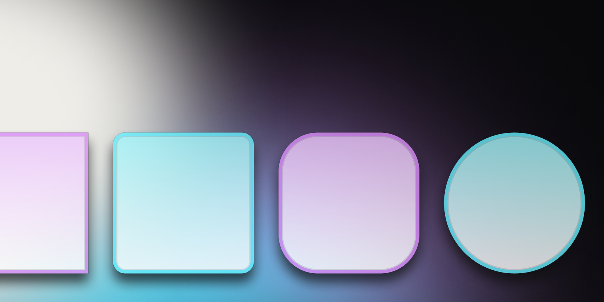
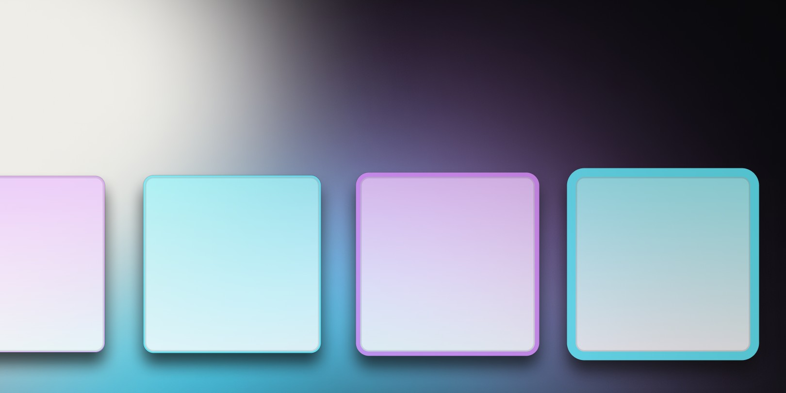

# Dimension

## Dimension - Token Type

Dimension Tokens define the size, space, radius, or position of a design element as a numeric value with a unit of measurement.&#x20;

The primary difference between a Number Token and a Dimension Token is a unit of measurement.&#x20;

* Number tokens are intended to be unitless.
  * For example: `4`
* Dimension Tokens are required to have a unit of `pixels` or `rem`.
  * For example: `4px`

<figure><figcaption><p>Creating a new Dimension Token in the Tokens Studio Plugin for Figma.</p></figcaption></figure>

### Design decisions&#x20;

The Dimension Token is used for design decisions requiring a distance and unit of measurement for a specific property of a design element.

This doesn't match the [CSS definition for Dimension](https://developer.mozilla.org/en-US/docs/Web/CSS/dimension), which focuses on distance, durations, frequencies, and resolutions.

* Many of the properties supported by this token are individually defined in CSS.


Dimension Tokens can be used to define these design properties in Figma:

* size
* space
* border-radius and width
* absolute position location
* background blur effects

This is a great way to define tokens that might be used in various use cases, such as a sizing scale applied to text elements, icons, and containers.


Dimension Tokens support responsive and static design properties:

* Responsive - **value in rem units**
  * Example: `2rem` applied as a min-height property on an auto-layout frame applies a 32px min-height value to the frame
*   Static - **value in pixels**

    * Example `32px` applied as border-radius rounds the corner of a frame to 32px


<table data-card-size="large" data-view="cards" data-full-width="true"><thead><tr><th></th><th data-hidden data-card-cover data-type="files"></th><th data-hidden data-card-target data-type="content-ref"></th></tr></thead><tbody><tr><td><p></p><p>Dimension Tokens can be attached to Number Variables in Figma. <br><br>The Plugin will automatically convert these to the pixel equivalent on export. </p></td><td><a href="../../../.gitbook/assets/card-header-figma-variables.png">card-header-figma-variables.png</a></td><td><a href="../../../figma/export/">export</a></td></tr></tbody></table>

***


### Possible values

According to the W3C DTCG specification, the value of a Dimension Token must **include a numeric value and a unit of measure, either Pixels (px) or Rems (rem).**




Referencing Dimension Tokens in math equations may lead to unexpected results if there is a combination of pixel and rem units in the same equation.


#### Hard-coded values

The syntax used to write numeric values for Dimension Tokens is important.

* Be sure to avoid any spaces between numbers and units of measurement.&#x20;
* Units are always written in lowercase.


Dimension Tokens require a number and a unit of measurement without any spaces as the value. For example:

`16px`

`1rem`



Avoid between the number and the unit. For example:&#x20;

`16 px`

`1 rem`



Unitless numbers are not allowed. For example:

`16`



Negative numbers are supported but may not apply to all design properties.&#x20;

For example, `-4px` would work for a `spacing` property but not as a `border radius` property.


#### Rem units (rem)

To support responsive design, you can define your Dimension Token in **rem units**, and the plugin automatically converts the value to the pixel equivalent when applying the Token in Figma.&#x20;

For example, a Dimension Token with a value of `1rem`, when applied as a will appear as `16px` in Figma.




#### Pixel units (px)

When you have design elements that should remain static even when users change their preferences, the Dimension Token value can be defined in pixel units.&#x20;

```
4px
```


#### Units not supported

The plugin only supports Dimension Tokens in **pixels** or **rem units**, to align with the W3C DTCG specification.

We do not support:

* percentage (%)
* em units


### Values that reference another Token

When trying to reference another Token as the Value for a Dimension Token, you will see Tokens in the dropdown list that are:

* Living in Token Sets that are currently active.
  * In the left menu on the plugin's Tokens page, **a checkmark is visible next to the Token Set name.**
* Token Type is compatible:
  * The same = `dimension`

However, like all Token Types, you can "force" a reference by manually entering the Token Name between curly brackets.&#x20;

For example, if you want to reference a **Number Token** without a unit, you can force the reference by adding the token name, followed by the required unit for a **Dimension Token**.

```
{unitless.number}px
```


The value will show a broken reference until the originating Token Set is marked as enabled.


_Select the card below to jump to the technical docs for more information._


[references.md](../../token-values/references.md)



#### **Compatible Token Types**

After you've created Number Tokens, they can be referenced in another Number Token and several compatible Token Types.&#x20;

<details>

<summary>See all Token Types compatible with Dimension Tokens</summary>

[typography](../typography/ "mention")

[font-size.md](../typography/font-size.md "mention")

[paragraph-spacing.md](../typography/paragraph-spacing.md "mention")

[border.md](../border.md "mention")

\
You can also reference a Dimension Token in these additional Token Types; however, they are not recognized in the W3C DTCG specifications as _official Token Types,_ [more details below _↓_](./#w3c-dtcg-token-format)_._

[spacing.md](spacing.md "mention")

[sizing.md](sizing.md "mention")

[border-radius.md](border-radius.md "mention")

[border-width.md](border-width.md "mention")

</details>


***


### Apply Dimension Tokens

A Dimension Token can define the numeric value and unit of measurement of several design properties when applied to frames, groups or graphic elements in Figma.

With one or more elements selected in Figma, right-click on the Dimension Token Name in the Plugin to see the design property options.&#x20;

Select your desired design property by clicking on it to apply the Tokens value instantly.


If you click to apply this Token to an element without accessing the right-click Token menu, the value will be applied as a **spacing-gap** property.


<figure><figcaption><p>The right-click menu and sub-menus of a Dimension Token are opened to reveal the design properties it can be applied to in Figma.</p></figcaption></figure>


#### 1. Spacing

<figure><figcaption><p>Use the spacing property to define the distance between elements.</p></figcaption></figure>


The spacing property defines the distance between layers of an auto-layout frame in Figma when the Dimension Token is applied. &#x20;



For independent styling per side, you can repeat the steps above and apply different Dimension Tokens to each position of the same design element.


If you apply the Token to a frame _**before**_ auto-layout is applied in Figma, you may have to remove and re-apply the Token after auto-layout has been enabled for the Token Value to apply as expected.

→ [Read Figma's doc on Autolayout here](https://help.figma.com/hc/en-us/articles/360040451373-Explore-auto-layout-properties)



#### 2. Sizing

<figure><figcaption><p>Use the sizing property to define a fixed height or width.</p></figcaption></figure>


The Sizing property defines the width or height of polygonal shape, frames, groups or graphic elements in Figma when the Dimension Token is applied. &#x20;



For independent styling per side, you can repeat the steps above and apply different Dimension Tokens to each position of the same design element.


If you apply the Token as Min/Max Width or Height to a frame _**before**_ auto-layout is applied in Figma, you may have to remove and re-apply the Token after auto-layout has been enabled for the Token Value to apply as expected.

→ [Read Figma's doc on Autolayout here](https://help.figma.com/hc/en-us/articles/360040451373-Explore-auto-layout-properties)



#### 3. Border radius

<figure><figcaption><p>Use the border radius property to define the roundness of an element.</p></figcaption></figure>


The Border Radius property defines the corner roundness of polygonal shape, frames, groups or graphic elements in Figma when the Token is applied. &#x20;



For independent corner styling, you can repeat the steps above and apply different Dimension Tokens to each corner position of the same design element.


#### 4. Border width

<figure><figcaption><p>Use the border width property to define the stroke thickness.</p></figcaption></figure>


A Border Width property defines the thickness of the stroke applied to text layers, polygonal shapes, frames, groups or graphic elements in Figma when the Dimension Token is applied. &#x20;



For independent border styling, you can repeat the steps above and apply different Dimension Tokens to each side of the same design element.&#x20;


If you apply the Border Width property to an element **before a stroke is applied in Figma,** you may have to remove and re-apply the Dimension Token after the stroke has been enabled for the value to apply as expected.

The plugin supports a [Border Composite Token](../border.md) that allows you to reference a Border Width Token to avoid this issue.



#### 5. Background blur

The Background Blur property of the Dimension Token defines the intensity of the Layer Blur Effect in Figma when the Token is applied in Figma.&#x20;

→ [Read Figma's doc on Layer blur here](https://help.figma.com/hc/en-us/articles/360041488473-Apply-shadow-or-blur-effects#blur)


The Background Blur property must be applied to container design elements, like frames, groups, and polygonal shapes with a **reduced opacity color fill** applied.

[_→ Jump to the guide on Color Tokens_ ](../color/)_to learn about reduced opacity colors using color spaces that support alpha._


This property can't yet be Exported to Figma as a reusable **Effect Style** from the plugin in the same way that [Box Shadow Tokens](../box-shadow.md) can.



#### 6. X and Y Position

The x position and y position properties of the Dimension Token define the absolute position of the design element when the Token is applied in Figma.&#x20;

X Position

* The element is absolutely positioned on the horizontal axis in relationship to the parent container.
* If no parent container is present, it positions the element on the Figma canvas.

Y Postion

* The element is absolutely positioned on the vertical axis in relationship to the parent container.
* If no parent container is present, it positions the element on the Figma canvas.


If you apply the **x/y** property to an element before enabling Absolute Position and Auto-layout in Figma, you may have to remove and re-apply the Dimension Token after they are enabled before the value will be applied as expected.&#x20;

[→ Read Figma's docs on Absolute Position ](https://help.figma.com/hc/en-us/articles/360039956914-Adjust-alignment-rotation-and-position#h_01HNBH55654RRGKMTFTB9MT1KX)






***


### W3C DTCG Token Format

Dimension is an official token type in the W3C Design Token Community Group specifications ([8.2 Dimensions](https://second-editors-draft.tr.designtokens.org/format/#dimension)).

Dimension Tokens are a relatively new addition to the W3C DTCG specification, which defines this token as being applied to many different design properties.

If we want to fully align with the spec, it requires Tokens Studio to phase out the following unofficial Token Types, which we introduced long before the **Dimension Token** was added to the spec:


[spacing.md](spacing.md)



[sizing.md](sizing.md)



[border-radius.md](border-radius.md)



[border-width.md](border-width.md)




***


### Transforming Tokens



When transforming Dimension Tokens, there are specific configurations to be aware of.

Token Values entered as a number without a unit converted to a number with pixels as a unit.

→ [SD-Transforms Read-Me Doc, ts/size/px](https://github.com/Tokens-studio/sd-transforms/?tab=readme-ov-file#tssizepx)


Token Values entered with math equations need to be checked and resolved.

→ [SD-Transforms Read-Me Doc, ts/resolveMath](https://github.com/tokens-studio/sd-transforms/?tab=readme-ov-file#tssizepx)


Running the SD-Transforms pre-processor as part of the generic package will prep your Dimension Tokens for Style Dictionary.

→ [SD-Transforms Read-Me Doc, Using the preprocessor](https://github.com/Tokens-studio/sd-transforms/?tab=readme-ov-file#using-the-preprocessor)

***


### Resources

Mentioned in this doc:

* SD-Transforms - [Read Me](https://github.com/tokens-studio/sd-transforms#readme)
* Style Dictionary - [https://styledictionary.com/](https://styledictionary.com/)
* Design Tokens Community Group - [W3C Draft](https://tr.designtokens.org/format/)
* Design Tokens Community Group - [8.2 Dimension](https://tr.designtokens.org/format/#dimension)

Figma resources:

* Design in Figma - [Explore autolayout properties](https://help.figma.com/hc/en-us/articles/360040451373-Explore-auto-layout-properties)
* Design in Figma - [Apply and adjust stroke properties](https://help.figma.com/hc/en-us/articles/360049283914-Apply-and-adjust-stroke-properties)
* Design in Figma - [Adjust corner radius and smoothing](https://help.figma.com/hc/en-us/articles/360050986854-Adjust-corner-radius-and-smoothing)
* Design in Figma - [Adjust alignment, rotation, and position](https://help.figma.com/hc/en-us/articles/360039956914-Adjust-alignment-rotation-and-position)
* Design in Figma - [Apply blur effect](https://help.figma.com/hc/en-us/articles/360041488473-Apply-shadow-or-blur-effects)

#### CSS resources:

* MDN Web Docs - [Dimension](https://developer.mozilla.org/en-US/docs/Web/CSS/dimension)


#### Community resources:

* None yet!




#### Known issues and bugs

Tokens Studio Plugin GitHub - [Open issues for Token Type Dimension](https://github.com/tokens-studio/figma-plugin/labels/token%20type%20dimensions)

* Background blur > Figma values changed - [Community Post on Featurebase](https://feedback.tokens.studio/p/background-blur-token-issue)
  * Figma is natively halving/doubling their background blur effect values, creating a disconnect between tokens managed by Token Studio and any parsed output.
  * Known CSS quirk which can be solved with a custom Style Dictionary transform




#### Requests, roadmap and changelog

* None yet!


