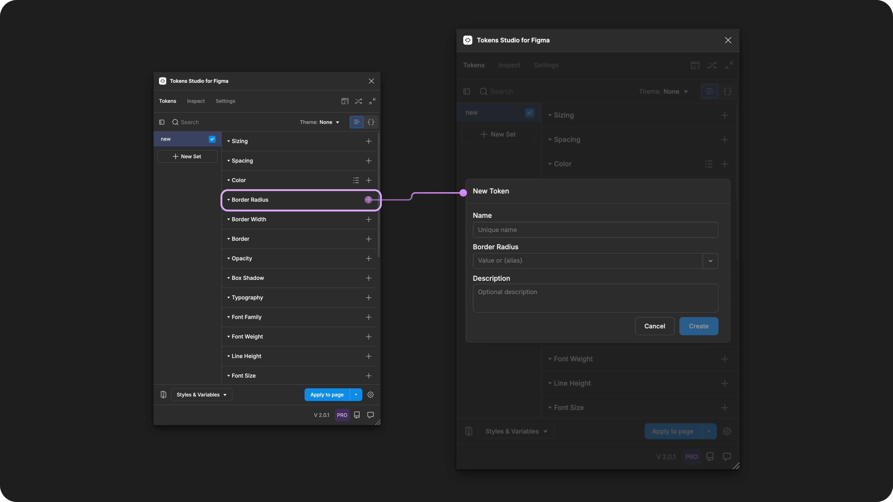
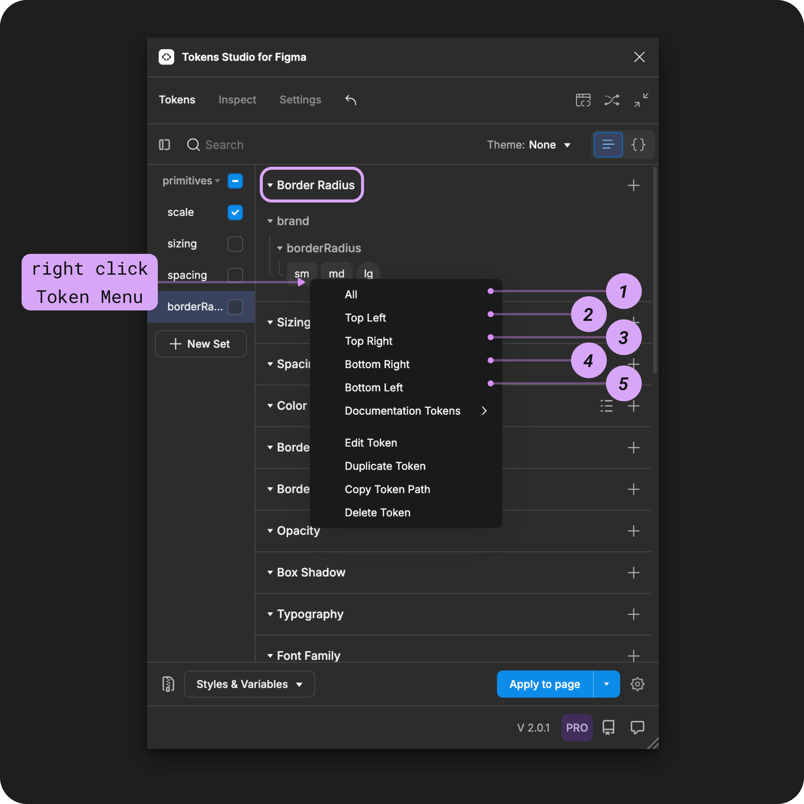

# Border Radius

## Border Radius - Token Type

Border Radius was one of the first Token Types we supported in the plugin.

Since then, a lot has changed.

The Design Tokens Community Group (DTCG) hosts a Token specification on the W3C community group pages for web standards. Although it's in draft form, the tools and technologies working with Design Tokens are trying to align with the W3C DTCG specification.


The W3C DTCG specification does not recognize Border Radius as an ['official token type'](https://tr.designtokens.org/format/#types) and instead has defined Dimension as the preferred Type for radius-related design decisions.


If we want to fully align with the spec, it requires Tokens Studio to phase out the Border Radius Token. However, we believe the choice should be yours!

If aligning with the W3C DTCG spec is important to your project, we suggest using Dimension Tokens instead.&#x20;


[.](./)



There is no immediate plan to discontinue support of the Border Radius Token Type.

Until we have a thoughtful solution to migrate between Token Types,  we've included a custom transformation for this Token Type in the sd-transforms npm package [detailed below↓](border-radius.md#transforming-tokens).&#x20;


If you love Border Radius Tokens and want to make your voice heard, we've set up a forum in our feedback tool where you can leave your comments! Hopefully with enough support the DTCG may reconsider having Border Radius as its own Token Type.&#x20;

→ [Conversation forum on Unofficial Token Types is here.](https://feedback.tokens.studio/p/dtcg-unofficial-token-type)


<figure><figcaption><p>Creating a new Border Radius Token in the Tokens Studio Plugin for Figma.</p></figcaption></figure>

***


### Design decisions

Border Radius defines the corner roundness of a design element, such as frames, groups, or polygonal shapes.


<table data-card-size="large" data-view="cards" data-full-width="true"><thead><tr><th></th><th data-hidden data-card-cover data-type="files"></th><th data-hidden data-card-target data-type="content-ref"></th></tr></thead><tbody><tr><td><p></p><p>Border Radius Tokens can be attached to Number Variables in Figma. </p></td><td><a href="../../../.gitbook/assets/card-header-figma-variables.png">card-header-figma-variables.png</a></td><td><a href="../../../figma/export/">export</a></td></tr></tbody></table>

***


### Possible values

The Border Radius Token supports numeric values with or without a unit.&#x20;



#### Hard-coded values

The syntax used to write values for Spacing Tokens is important.&#x20;

* Be sure to avoid any spaces between numbers and units of measurement.&#x20;
* Units are always written in lowercase.

For example:

```
6px
```


**Rem units (rem)**

To support responsive design, you can define your Border Radius Token in `rem units`, and the plugin automatically converts the value to the pixel equivalent when applying the Token in Figma.&#x20;

For example, a Border Radius Token with a value of `1rem` will appear as a `16px` corner radius in Figma.



#### Pixel units (px)

When you have design elements that should remain static even when users change their preferences, Border Radius Tokens can be defined in pixel units.&#x20;

For example, `4px`.


### Values that reference another Token

When trying to reference another Token as the Value for a Border Radius Token, you will see Tokens in the dropdown list that are:

* Living in Token Sets that are currently active.
  * In the left menu on the plugin's Tokens page, **a checkmark is visible next to the Token Set name.**
* Token Type is compatible:
  * The same = `borderRadius`
  * `number`
  * `dimension`




### Multiple values

You can define the value of a **Border Radius Token** to mimic how multi-value Border Radius properties are written in CSS.

When you **click to apply the token value** (without right-clicking), the plugin will apply the border radius based on the number of values in your token.

Single value - For example, `10px`

* Applies the value to **all corners**.

Two values - For example, `8px 64px`

* The first value is applied to the radii on the top and bottom.
* The second value is applied to the radii on the right and left.

Three values - For example, `16px 8px 32px`

* The first value is applied to the radius on the top.
* The second value is applied to the radii on the right and left.
* The third value is applied to the radius on the bottom.

Four values - For example, `2px 4px 8px 16px`

* The first value is applied to the radius on the top.
* The second value is applied to the radius on the right.
* The third value is applied to the radius on the bottom.
* The fourth value is applied to the radius on the left.

You can also write multiple value **Border Radius Tokens** with references. For example, `{radius.sm} {radius.md}`.


Figma does not support Variables with multiple values!

If you export your Tokens to Variables in Figma, multiple value Tokens will be skipped, as Figma only supports single values.

[→ Read the guide on Skipped Variables for more details.](../../../figma/export/variables-skipped.md)


***


### Apply Border Radius Tokens

A Border Radius Token defines the corner roundness of polygonal shape, frames, groups or graphic elements in Figma when the Token is applied. &#x20;

You can apply a Border Radius Token to all sides of the design element at once, or each side independently.&#x20;

With one or more elements selected in Figma, right-click on the Border Radius Token Name in the plugin to see the its options.&#x20;

Select your desired design property by clicking on it to apply the Tokens value instantly.


If you click to apply a Border Radius Token to an element without accessing the right-click Token menu, the value will be applied to **all** sides if the Token has a single value.&#x20;

If it has multiple values, it will apply the values to the independent properties defined in the Tokens Value. [More details above ↑](border-radius.md#multiple-values)


<figure><figcaption><p>The right-click menu of a Border Radius Token is open to reveal the design properties it can be applied to in Figma.</p></figcaption></figure>




For independent corner styling, you can repeat the steps above and apply different Border Radius Tokens to each corner position of the same design element. Or, you can modify your Border Radius Tokens to have [multiple values](border-radius.md#multiple-values).&#x20;



***


### Transforming Tokens



When transforming Border Radius Tokens, there are some specific configurations to be aware of.

The preprocessor in the SD-Transforms package will automatically convert the Tokens Studio specific Token Type of `borderRadius` to align with the DTCG Format Token Type of `dimension`.

→ [SD-Transforms Read-Me Doc, Using the preprocessor](https://github.com/Tokens-studio/sd-transforms/?tab=readme-ov-file#using-the-preprocessor)


**Token Values** entered as a number without a unit will be converted to a number with pixels as a unit.

→ [SD-Transforms Read-Me Doc, ts/size/px](https://github.com/Tokens-studio/sd-transforms/?tab=readme-ov-file#tssizepx)

***


### Resources

Mentioned in this doc:

* SD-Transforms - [Read Me](https://github.com/tokens-studio/sd-transforms#readme)
* Style Dictionary - https://styledictionary.com/
* Design Tokens Community Group - [W3C Draft](https://tr.designtokens.org/format/)
* Design Tokens Community Group - [8.0 Types](https://tr.designtokens.org/format/#types)

#### Figma resources:

* Design in Figma - [Adjust corner radius and smoothing](https://help.figma.com/hc/en-us/articles/360050986854-Adjust-corner-radius-and-smoothing)


#### Community resources:

* None yet!




#### Known issues and bugs

Tokens Studio Plugin GitHub - [Open issues for Token Type Border Radius](https://github.com/tokens-studio/figma-plugin/labels/token%20type%20border%20radius)

* Color modifiers break when borderRadius token is renamed [#2668](https://github.com/tokens-studio/figma-plugin/issues/2668)




#### Requests, roadmap and changelog

* W3C DTCG Spec - Unofficial Token Types - [Conversation Forum](https://feedback.tokens.studio/p/dtcg-unofficial-token-type)


