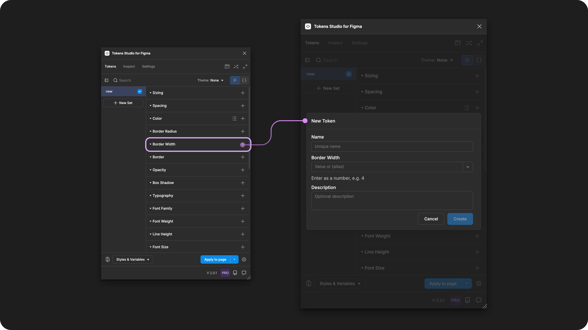
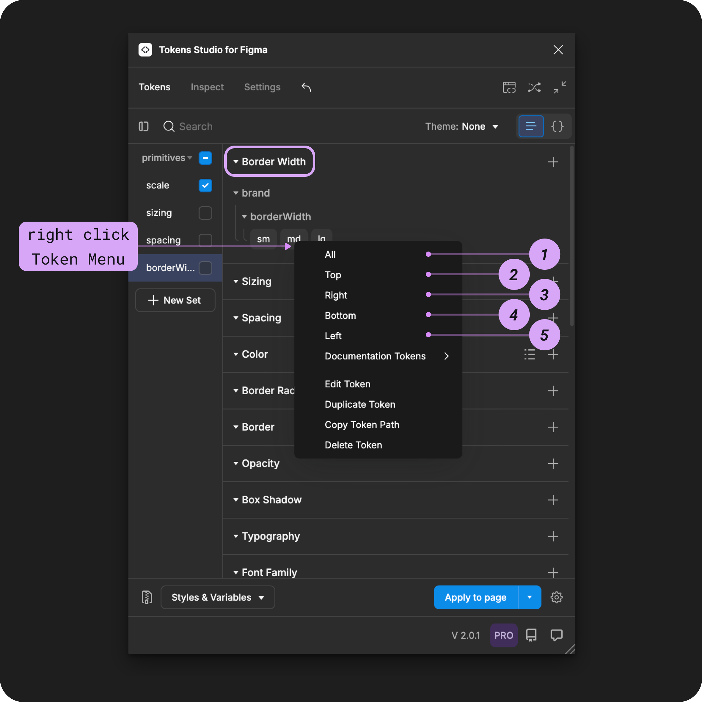

# Border Width

## Border Width - Token Type

The Border Width Token was one of the first token types we supported in the plugin.

Since then, a lot has changed.

The Design Tokens Community Group (DTCG) hosts a Token specification on the W3C community group pages for web standards. Although it's in draft form, the tools and technologies working with Design Tokens are trying to align with the W3C DTCG specification.


The W3C DTCG specification does not recognize Border Width as an ['official token type'](https://tr.designtokens.org/format/#types) and instead has defined Dimension Token as the preferred token for size-related design decisions.


If we want to fully align with the spec, it requires Tokens Studio to phase out the Border Width Token. However, we believe the choice should be yours!

If aligning with the W3C DTCG spec is important to your project, we suggest using Dimension Tokens instead.&#x20;


[.](./)



There is no immediate plan to discontinue support of the Border Width Token Type.

Until we have a thoughtful solution to migrate between Token Types,  we've included a custom transformation for this Token Type in the sd-transforms npm package [detailed below↓](border-width.md#transforming-tokens).&#x20;



If you love Border Width Tokens and want to make your voice heard, we've set up a forum in our feedback tool where you can leave your comments! Hopefully with enough support the DTCG may reconsider having Border Width as its own Token Type.&#x20;

→ [Conversation forum on Unofficial Token Types is here.](https://feedback.tokens.studio/p/dtcg-unofficial-token-type)

<figure><figcaption><p>Creating a new Border Width Token in the Tokens Studio Plugin for Figma.</p></figcaption></figure>

***


### Design decisions

The **Border Width Token** defines the thickness of a stroke around a design element, such as:

* Container design elements, like frames, groups, and polygonal shapes.
* Text elements.


<table data-card-size="large" data-view="cards" data-full-width="true"><thead><tr><th></th><th data-hidden data-card-cover data-type="files"></th><th data-hidden data-card-target data-type="content-ref"></th></tr></thead><tbody><tr><td><p></p><p>Border Width Tokens can be attached to Number Variables in Figma. </p></td><td><a href="../../../.gitbook/assets/card-header-figma-variables.png">card-header-figma-variables.png</a></td><td><a href="../../../figma/export/">export</a></td></tr></tbody></table>

***


### Possible values

The **Border Width Token** supports numeric values:

* With or without a unit.
* Single and multi-value.



#### Hard-coded values

The syntax used to write values for Border Width Tokens is important.&#x20;

* Be sure to avoid any spaces between numbers and units of measurement.&#x20;
* Units are always written in lowercase.

For example:

```
1px
```


**Rem units (rem)**

To support responsive design, you can define your Border Width Token in `rem units`, and the plugin automatically converts the value to the pixel equivalent when applying the Token in Figma.&#x20;

For example, a Border Width Token with a value of `0.25rem` will appear as a `4px` thick stroke in Figma.



#### Pixel units (px)

When you have design elements that should remain static even when users change their preferences, Border Width Tokens can be defined in pixel units.&#x20;

For example `4px`.


### Values that reference another Token

When trying to reference another Token as the Value for a Border Width Token, you will see Tokens in the dropdown list that are:

* Living in Token Sets that are currently active.
  * In the left menu on the plugin's Tokens page, **a checkmark is visible next to the Token Set name.**
* Token Type is compatible:
  * The same = `borderWidth`
  * `number`
  * `dimension`



***


### Apply Border Width Tokens

A Border Width Token defines the thickness of the stroke applied to text layers, polygonal shapes, frames, groups or graphic elements in Figma when the Token is applied. &#x20;

You can apply a Border Width Token to all sides of the design element at once, or each side independently.&#x20;

Select one or more **elements with a stroke already applied** in Figma, then right-click on the Border Width Token Name in the Plugin to see the it's options.&#x20;

Select your desired design property by clicking on it to apply the Token's value instantly.


If you click to apply this Token to an element without accessing the right-click Token menu, the value will be applied to **all** sides.&#x20;



<figure><figcaption><p>The right-click menu of a Border Radius Token is open to reveal the design properties it can be applied to in Figma.</p></figcaption></figure>



For independent border styling, you can repeat the steps above and apply different Border Tokens to each side of the same design element.&#x20;


If you apply the **Border Width Token** to an element **before** a stroke is applied in Figma, you may have to remove and re-apply the Token after the stroke has been enabled for the Token Value to apply as expected.

The plugin supports a [Border Composite Token](../border.md) that allows you to reference a Border Width Token to avoid this issue.





***


### Transforming Tokens



When transforming Border Width Tokens, there are some specific configurations to be aware of.

The preprocessor in the SD-Transforms package will automatically convert the Tokens Studio specific Token Type of `borderWidth` to align with the DTCG Format Token Type of `dimension`.

→ [SD-Transforms Read-Me Doc, Using the preprocessor](https://github.com/Tokens-studio/sd-transforms/?tab=readme-ov-file#using-the-preprocessor)


**Token Values** entered as a number without a unit will be converted to a number with pixels as a unit.

→ [SD-Transforms Read-Me Doc, ts/size/px](https://github.com/Tokens-studio/sd-transforms/?tab=readme-ov-file#tssizepx)

***


### Resources

Mentioned in this doc:

* SD-Transforms - [Read Me](https://github.com/tokens-studio/sd-transforms#readme)
* Style Dictionary - https://styledictionary.com/
* Design Tokens Community Group - [W3C Draft](https://tr.designtokens.org/format/)
* Design Tokens Community Group - [8.0 Types](https://tr.designtokens.org/format/#types)

#### Community resources:

* None yet!




#### Known issues and bugs

Tokens Studio Plugin GitHub - [Open issues for Token Type Border Width](https://github.com/tokens-studio/figma-plugin/labels/token%20type%20border%20width)




#### Requests, roadmap and changelog

* W3C DTCG Spec - Unofficial Token Types - [Conversation Forum](https://feedback.tokens.studio/p/dtcg-unofficial-token-type)


