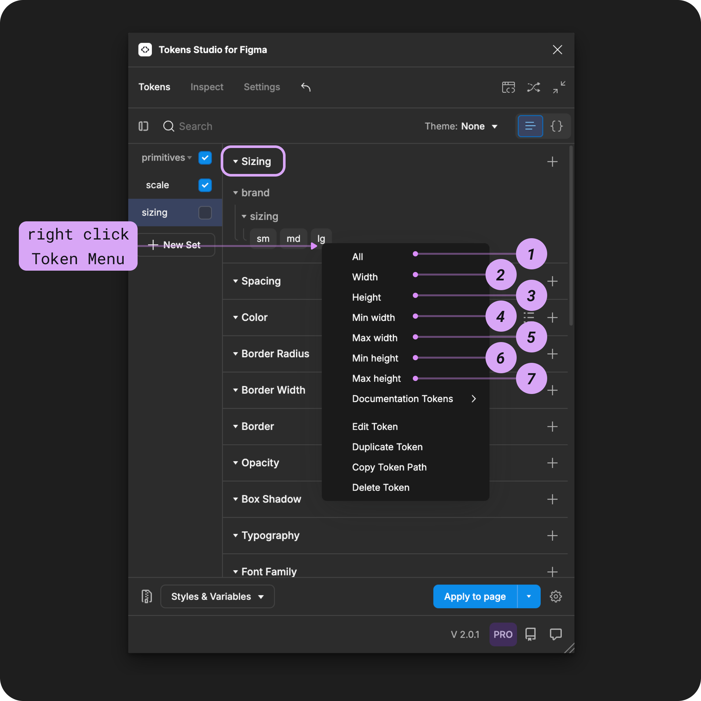

# Sizing

## Sizing - Token Type

Sizing was one of the first Token Types we supported in the plugin.

Since then, a lot has changed.

The Design Tokens Community Group (DTCG) hosts a Token specification on the W3C community group pages for web standards. Although it's in draft form, the tools and technologies working with Design Tokens are trying to align with the W3C DTCG specification.


The W3C DTCG specification does not recognize Sizing as an ['official token type'](https://tr.designtokens.org/format/#types) and instead has defined Dimension Token as the preferred token for size-related design decisions.&#x20;



If we want to fully align with the spec, it requires Tokens Studio to phase out the Sizing Token. However, we believe the choice should be yours!

If aligning with the W3C DTCG spec is important to your project, we suggest using Dimension Tokens instead.&#x20;


[.](./)



There is no immediate plan to discontinue support of the Sizing Token Type.

Until we have a thoughtful solution to migrate between Token Types,  we've included a custom transformation for this Token Type in the sd-transforms npm package[ detailed below↓](sizing.md#transforming-tokens).&#x20;



If you love Sizing Tokens and want to make your voice heard, we've set up a forum in our feedback tool where you can leave your comments! Hopefully with enough support the DTCG may reconsider having Border Width as its own Token Type.&#x20;

→ [Conversation forum on Unofficial Token Types is here.](https://feedback.tokens.studio/p/dtcg-unofficial-token-type)


<figure><figcaption><p>Creating a new Sizing Token in the Tokens Studio Plugin for Figma.</p></figcaption></figure>

***


### Design decisions

Sizing defines the height or width of a design element.


<table data-card-size="large" data-view="cards" data-full-width="true"><thead><tr><th></th><th data-hidden data-card-cover data-type="files"></th><th data-hidden data-card-target data-type="content-ref"></th></tr></thead><tbody><tr><td><p></p><p>Sizing Tokens can be attached to Number Variables in Figma. </p></td><td><a href="../../../.gitbook/assets/card-header-figma-variables.png">card-header-figma-variables.png</a></td><td><a href="../../../figma/export/">export</a></td></tr></tbody></table>

***


### Possible values

The Sizing Token supports numeric values, with or without a unit.&#x20;




#### Hard-coded values

The syntax used to write values for Spacing Tokens is important.&#x20;

* Be sure to avoid any spaces between numbers and units of measurement.&#x20;
* Units are always written in lowercase.

For example:

```
1rem
```


**Rem units (rem)**

To support responsive design, you can define your Sizing Token in `rem units`, and the plugin automatically converts the value to the pixel equivalent when applying the Token in Figma.&#x20;

For example, a Sizing Token with a value of `2rem` will appear as a `32px` in Figma.




#### Pixel units (px)

When you have design elements that should remain static even when users change their preferences, Sizing Tokens can be defined in pixel units.&#x20;

For example `4px`.


### Values that reference another Token

When trying to reference another Token as the Value for a Sizing Token, you will see Tokens in the dropdown list that are:

* Living in Token Sets that are currently active.
  * In the left menu on the plugin's Tokens page, **a checkmark is visible next to the Token Set name.**
* Token Type is compatible:
  * The same = `sizing`
  * `number`
  * `dimension`



***


### Apply Sizing Tokens

A Sizing Token defines the width or height of polygonal shape, frames, groups or graphic elements in Figma when the Token is applied. &#x20;

You can apply a Sizing Token to all sides of the design element at once, or each side independently.&#x20;

With one or more elements selected in Figma, right-click on the Sizing Token Name in the Plugin to its options.&#x20;

Select your desired design property by clicking on it to apply the Tokens value instantly.&#x20;


If you click to apply this Token to an element without accessing the right-click Token menu, the value will be applied as **all.**&#x20;


<figure><figcaption><p>The right-click menu of a Sizing Token is open to reveal the design properties it can be applied to in Figma.</p></figcaption></figure>









***


### Transforming Tokens



When transforming Sizing Tokens, there are some specific configurations to be aware of.

The preprocessor in the SD-Transforms package will automatically convert the Tokens Studio specific Token Type of `sizing` to align with the DTCG Format Token Type of `dimension`.

→ [SD-Transforms Read-Me Doc, Using the preprocessor](https://github.com/Tokens-studio/sd-transforms/?tab=readme-ov-file#using-the-preprocessor)


**Token Values** entered as a number without a unit will be converted to a number with pixels as a unit.

→ [SD-Transforms Read-Me Doc, ts/size/px](https://github.com/Tokens-studio/sd-transforms/?tab=readme-ov-file#tssizepx)

***


### Resources

Mentioned in this doc:

* SD-Transforms - [Read Me](https://github.com/tokens-studio/sd-transforms)
* Style Dictionary - [Read Me](https://amzn.github.io/style-dictionary/#/)
* Design Tokens Community Group - [W3C Draft](https://tr.designtokens.org/format/)
* Design Tokens Community Group - [8.0 Types](https://tr.designtokens.org/format/#types)

#### Community resources:

* None yet!




#### Known issues and bugs

Tokens Studio Plugin GitHub - [Open issues for Token Type Sizing](https://github.com/tokens-studio/figma-plugin/labels/token%20type%20sizing)

* Deselecting The "All" Property In Spacing Tokens Removes Other Spacing Tokens [#2377](https://github.com/tokens-studio/figma-plugin/issues/2377)




#### Requests, roadmap and changelog

* W3C DTCG Spec - Unofficial Token Types - [Conversation Forum](https://feedback.tokens.studio/p/dtcg-unofficial-token-type)


